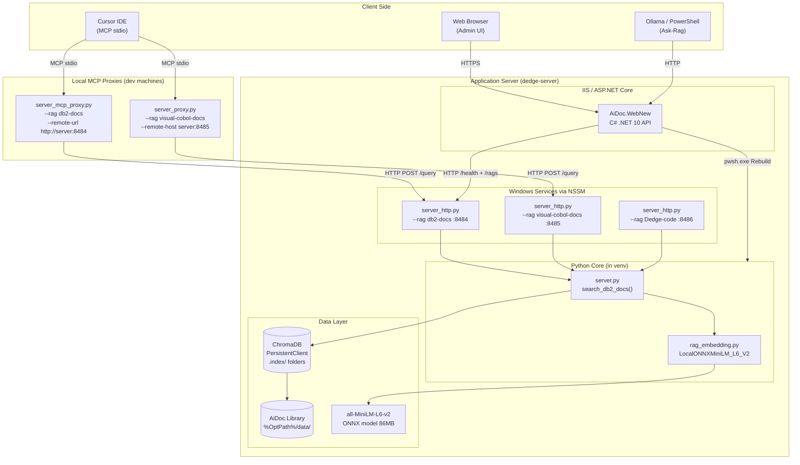
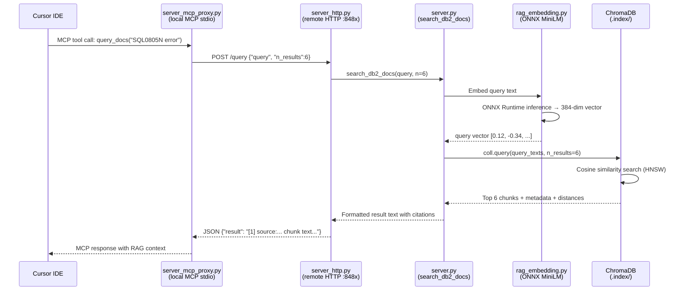
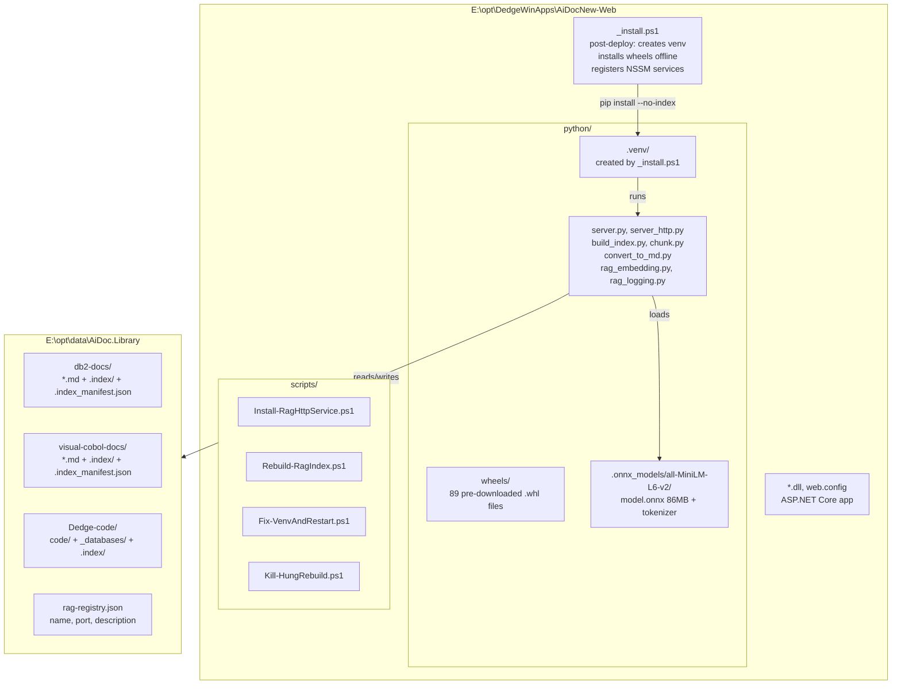
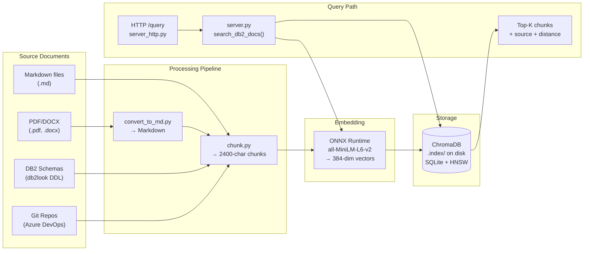

# AiDoc.WebNew — Python & Non-C# Architecture

## 1. System Overview

How all components connect — from client-side Cursor/Ollama through local MCP proxies, to the server-side HTTP services, Python core, and ChromaDB storage.

---

## 2. Index Build Pipeline

How RAG indexes are created — from trigger (Admin UI or API) through PowerShell orchestration, Python chunking/embedding, to ChromaDB vector storage.

```mermaid
flowchart LR
    subgraph TRIGGER["Trigger"]
        UI["Admin UI\nRebuild Button"]
        API["C# API\nPOST /api/rags/name/rebuild"]
    end

    subgraph ORCH["PowerShell Orchestrator"]
        REBUILD["Rebuild-RagIndex.ps1\nWrites .running status\nTracks PID + progress %"]
    end

    subgraph Dedge["Dedge-code Special Steps"]
        GIT["Git Clone/Pull\nAzure DevOps repos"]
        DB2EXP["Export-Db2ForRag\ndb2look DDL + queries"]
        RAGMD["Write-RagMarkdown\nConvert to .md"]
    end

    subgraph PYBUILD["Python Build"]
        BUILD["build_index.py\n--rag name"]
        CHUNK["chunk.py\n2400-char chunks\n300-char overlap"]
        CONVERT["convert_to_md.py\n.pdf/.docx to .md"]
    end

    subgraph VECTORIZE["Vectorization"]
        ONNX2["ONNX Runtime\nall-MiniLM-L6-v2"]
        CHROMA2[("ChromaDB\nPersistentClient")]
    end

    subgraph OUTPUT["Output"]
        INDEX[".index/ folder\nvector database on disk"]
        MANIFEST[".index_manifest.json\nbuiltAt + sourceHash"]
    end

    UI --> API
    API -->|pwsh.exe -File| REBUILD
    REBUILD -->|Dedge-code only| GIT
    GIT --> DB2EXP --> RAGMD --> BUILD
    REBUILD -->|other RAGs| BUILD
    BUILD --> CHUNK
    BUILD --> CONVERT
    CHUNK -->|text + metadata| ONNX2
    ONNX2 -->|384-dim vectors| CHROMA2
    CHROMA2 --> INDEX
    BUILD --> MANIFEST
```

---

## 3. Query Flow

The full path of a semantic search query — from Cursor IDE through the local MCP proxy, over HTTP to the server, through ONNX embedding and ChromaDB similarity search, back to the client.

---

## 4. Server File Layout

---

## 5. Component Reference

### Python Scripts

| Component | Role | Description |
|-----------|------|-------------|
| `server_http.py` | HTTP RAG Service | Runs as a Windows Service via NSSM. Exposes `/query`, `/health`, and `/rags` endpoints. One instance per RAG on its own port (8484, 8485, 8486). Network-accessible entry point for all RAG queries. |
| `server.py` | Search Engine Core | Contains `search_db2_docs()` — opens ChromaDB persistent index, runs vector similarity queries, formats results with source citations and distance scores. Also serves as standalone MCP stdio server for direct local use. |
| `server_mcp_proxy.py` | Client MCP Bridge (URL) | Thin local proxy on dev machines. Cursor connects via MCP stdio; forwards queries as HTTP POST to remote `server_http.py` using `--remote-url`. No ChromaDB or ONNX needed locally. |
| `server_proxy.py` | Client MCP Bridge (host+port) | Same as above but takes `--remote-host` and `--remote-port` separately. |
| `build_index.py` | Index Builder | Builds ChromaDB vector indexes from markdown. Supports `--rag NAME` (single) or `--all`. Chunks docs, generates ONNX embeddings, stores in ChromaDB, writes `.index_manifest.json` with build timestamp and source hash. |
| `chunk.py` | Document Chunker | Splits markdown into ~2400-char chunks with 300-char overlap, breaking at paragraph boundaries. Generates stable SHA-256 chunk IDs for deduplication. |
| `rag_embedding.py` | Embedding Function | Wraps ChromaDB's `ONNXMiniLM_L6_V2` to use a bundled local model from `python/.onnx_models/` instead of downloading from HuggingFace. Makes the system fully portable and offline. |
| `convert_to_md.py` | File Converter | Converts `.pdf` (pypdf), `.docx` (python-docx), `.txt` to Markdown during index building. |
| `rag_logging.py` | Logging | Daily log files to `C:\opt\data\AllPwshLog` as `RAG-Python_HOSTNAME_yyyyMMdd.log`. Shared log directory with PowerShell logs. |

### Key Libraries & Models

| Component | Description |
|-----------|-------------|
| **ChromaDB 1.5.5** | Embedded vector database using `PersistentClient` (SQLite + HNSW on disk). Each RAG has its own `.index/` folder inside `AiDoc.Library/<rag-name>/`. Stores document chunks as vectors alongside metadata (source file, chunk ID). Cosine similarity search at query time. |
| **all-MiniLM-L6-v2 (ONNX)** | Sentence-transformer model producing 384-dimensional vectors. Runs locally via ONNX Runtime — no GPU, no internet. `model.onnx` (86MB) + tokenizer files bundled in `python/.onnx_models/`. Same model used for both indexing and querying to ensure consistent embeddings. |
| **Python venv + 89 Wheels** | Fully offline installation via `pip install --no-index --find-links wheels/`. `_install.ps1` creates the venv, installs all wheels, and registers NSSM services. Zero internet access needed on the server. |
| **NSSM** | Non-Sucking Service Manager. Wraps `server_http.py` processes as proper Windows Services with auto-restart, delayed-auto start, and log rotation. |
| **MCP (Model Context Protocol)** | Stdio-based protocol for Cursor IDE to communicate with tool servers. The proxy scripts implement MCP servers that forward to HTTP. |

### PowerShell Scripts

| Script | Role | Description |
|--------|------|-------------|
| `_install.ps1` | Post-Deploy Setup | Creates Python venv from system Python, installs 89 wheels offline, registers NSSM services for each RAG. Runs automatically after IIS deployment. |
| `Install-RagHttpService.ps1` | Service Installer | Registers a single RAG HTTP server as a Windows Service via NSSM. Configures auto-restart, logging, firewall rules. Supports `-Interactive` mode for dev. |
| `Rebuild-RagIndex.ps1` | Build Orchestrator | Full rebuild pipeline. For `Dedge-code`: clones Azure DevOps repos, exports DB2 schemas via `db2look`, converts to markdown, then calls `build_index.py`. Writes `.running` status file with PID and progress % for the C# API to poll. |
| `Fix-VenvAndRestart.ps1` | Recovery Tool | Stops all NSSM services, deletes venv, runs `_install.ps1` to recreate from wheels, restarts services. Nuclear option for corrupted venvs. |
| `Kill-HungRebuild.ps1` | Process Cleanup | Finds and kills hung `build_index.py` processes by inspecting command lines via WMI. Won't touch running service processes (`server_http.py`). |

---

## 6. Data Flow Summary

---

## 7. Port Assignments

| Port | RAG | Service Name |
|------|-----|-------------|
| 8484 | db2-docs | AiDocRag |
| 8485 | visual-cobol-docs | AiDocRagCobol |
| 8486 | Dedge-code | AiDocRagDedge |

## 8. Key Paths

| Path | Purpose |
|------|---------|
| `E:\opt\DedgeWinApps\AiDocNew-Web\` | Deployed application root |
| `E:\opt\DedgeWinApps\AiDocNew-Web\python\` | Python scripts, venv, wheels, ONNX model |
| `E:\opt\data\AiDoc.Library\` | RAG document libraries and ChromaDB indexes |
| `E:\opt\data\AiDoc.Library\rag-registry.json` | Central registry of all RAGs and their ports |
| `C:\opt\data\AllPwshLog\` | Shared log directory (PowerShell + Python) |
