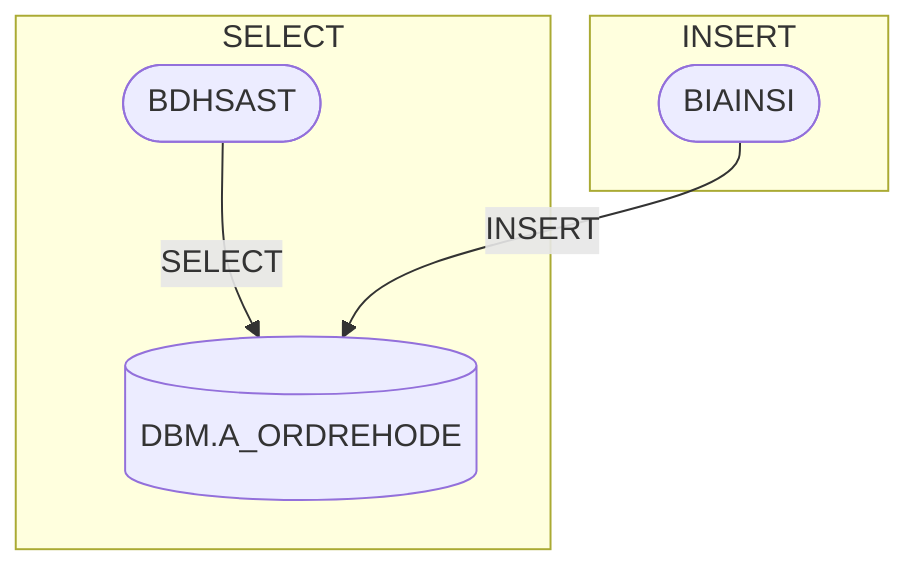

# SQL Interactions Tab — Design & Implementation

## Purpose

The **Interactions tab** on SQL table documentation pages shows a **Mermaid flowchart diagram** visualizing which programs (COBOL, PowerShell, Batch, Rexx, C#) interact with a given SQL table, grouped by the type of SQL operation they perform.

## Original PowerShell Design (AutoDocFunctions.psm1, lines 8666-8932)

### Data Collection: `Search-HtmlFilesForSqlInteractions`

After all file types (CBL, PS1, BAT, REX, C#) are parsed and their HTML documentation is generated, this function performs a **post-processing scan** of all generated HTML files:

1. **Scans** every non-SQL HTML file (`*.ps1.html`, `*.cbl.html`, `*.bat.html`, `*.rex.html`, `*.csharp.html`)
2. **Extracts Mermaid diagram content** from `<pre class="mermaid">` blocks
3. **Parses Mermaid edges** for SQL table references using the pattern:
   ```
   programNode --"operation"--> sql_schema_table[(tableName)]
   ```
4. **Extracts the SQL operation** (SELECT, INSERT, UPDATE, DELETE, FETCH, CALL) from the edge label
5. **Groups results** into a nested structure: `Table → Operation → Program[]`
6. **Caches** the result to `_sql_interactions.json`

### Data Structure (Original)

The original PowerShell version stored a **three-level** hierarchy:

```json
{
  "dbm.a_ordrehode": {
    "SELECT": [
      { "Name": "BDHSAST", "Node": "node_id", "FileType": "COBOL", "FilePath": "BDHSAST.CBL.html" }
    ],
    "INSERT": [
      { "Name": "BIAINSI", "Node": "node_id", "FileType": "COBOL", "FilePath": "BIAINSI.CBL.html" }
    ],
    "UPDATE": [
      { "Name": "BIBINRH", "Node": "node_id", "FileType": "COBOL", "FilePath": "BIBINRH.CBL.html" }
    ]
  }
}
```

### Diagram Generation: `New-SqlInteractionDiagram`

Generates a **Mermaid flowchart** with:

- A **central table node** in stadium shape: `sql_dbm_a_ordrehode[(DBM.A_ORDREHODE)]`
- **Subgraphs** for each SQL operation type (SELECT, INSERT, UPDATE, DELETE, FETCH, CALL)
- **Program nodes** inside each subgraph, with shape varying by file type:
  - COBOL/C#: stadium shape `(["name"])`
  - Others: rectangle shape `["name"]`
- **Directed edges** from each program to the table node, labeled with the operation
- **Click handlers** linking each program node to its documentation page



## Current C# Implementation

### Key Difference: Simplified Data Structure

The C# port (`SqlInteractionsScanner.cs`) uses a **flattened** two-level structure:

```json
{
  "dbm.a_ordrehode": ["BDHSAST.CBL.html", "BIAINSI.CBL.html", "BIBINRH.CBL.html"]
}
```

The **operation type is lost** — all programs are grouped under a generic `"REFERENCES"` operation. This is because `SqlInteractionsScanner.Scan()` does a simple regex match for `DBM.TABLENAME` patterns in HTML content, rather than parsing Mermaid edge labels for specific SQL operations.

### Where the Data Flows

```
SqlInteractionsScanner.Scan()          Scans HTML files for table references
        ↓
  _json/_sql_interactions.json         Cached flat lookup: table → program[]
        ↓
SqlParser.GetInteractionDiagramForJson()  Reads cache, builds Mermaid diagram
        ↓
SqlParser.GetUsedByList()              Reads cache, builds UsedBy list
        ↓
SqlResult.InteractionDiagramMmd        Stored in JSON output
SqlResult.UsedBy                       Stored in JSON output
        ↓
_SqlView.cshtml                        Renders Interactions tab + Used By tab
```

### Rendering

| Component | File | Purpose |
|---|---|---|
| Interactions tab | `_SqlView.cshtml` line 265-275 | Renders `InteractionDiagramMmd` as a Mermaid diagram |
| Used By tab | `_SqlView.cshtml` line 278-306 | Renders `UsedBy` as a table with clickable links |
| Diagram toolbar | `_DiagramToolbar.cshtml` | Zoom, pan, fullscreen controls |

### Fallback in Doc.cshtml.cs

When viewing a SQL table, if `InteractionDiagramMmd` is empty but `UsedBy` has entries, `Doc.cshtml.cs` generates a simple fallback diagram on-the-fly with all programs linked as `"REFERENCES"`.

## What's Missing vs. the PowerShell Version

| Feature | PowerShell | C# |
|---|---|---|
| Operation-level grouping (SELECT/INSERT/UPDATE/DELETE) | Yes | No — all grouped as REFERENCES |
| Mermaid edge parsing for operation extraction | Yes | No — uses regex for table name only |
| Subgraphs per operation in diagram | Yes | No — flat diagram |
| Click handlers in diagram nodes | Yes | Yes |
| JSON cache | Three-level (table→op→program[]) | Two-level (table→program[]) |

## Future Enhancement

To restore the original operation-level grouping, `SqlInteractionsScanner` would need to:

1. Parse JSON output files (not HTML) for each program
2. Extract SQL operations from the Mermaid diagram source (`flowMmd`, `sequenceMmd`)
3. Match operations against specific table references
4. Store the three-level structure in `_sql_interactions.json`
5. Update `SqlParser.GetSqlTableInteractions()` to deserialize the richer structure

This would restore the operation-grouped subgraph layout in the Interactions diagram.
