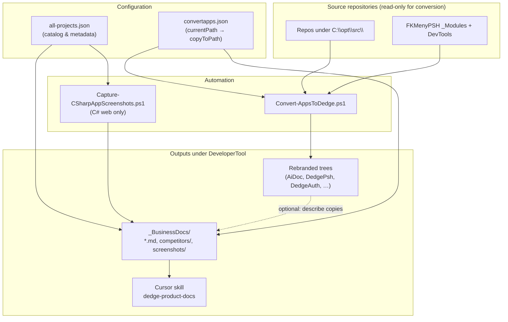
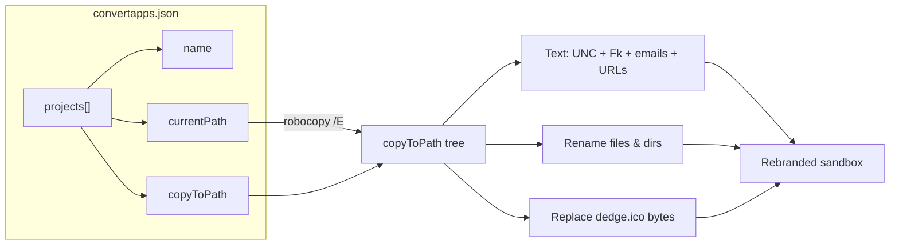
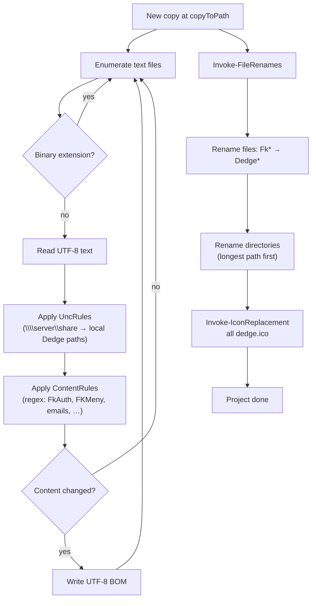
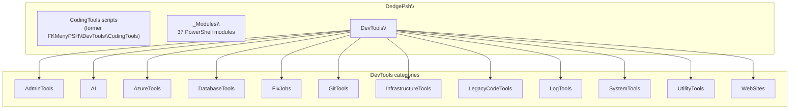
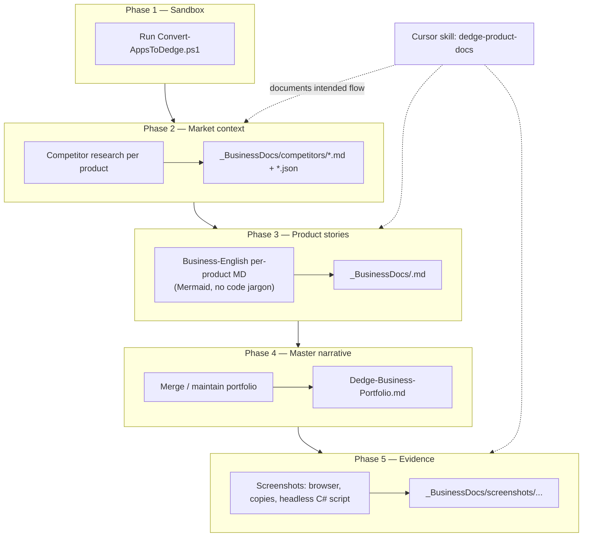
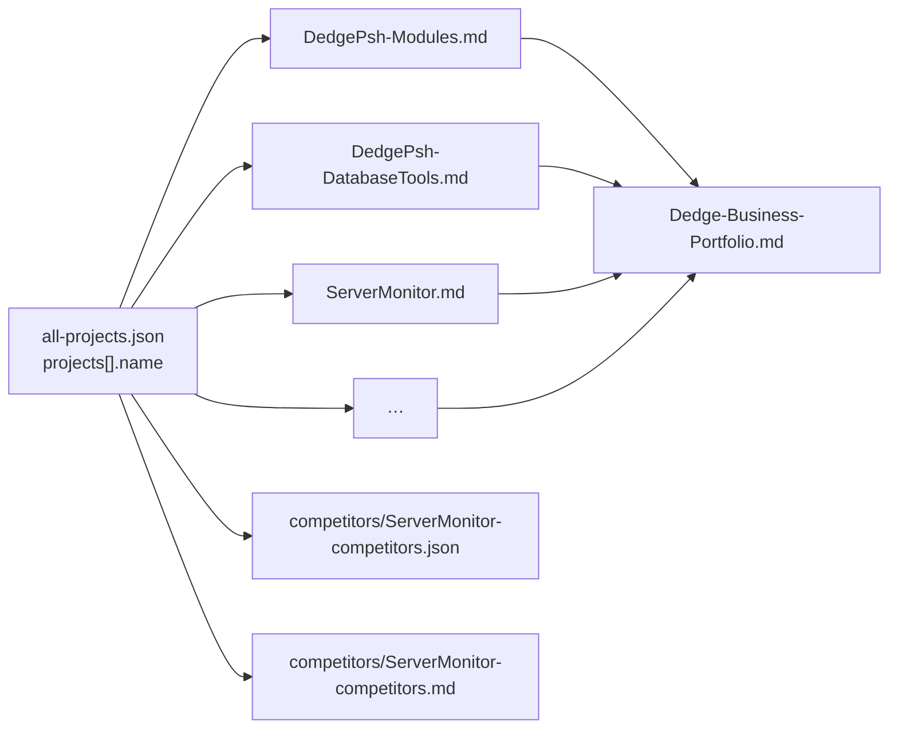
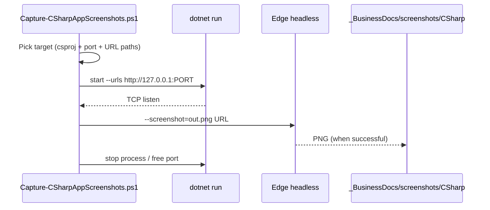
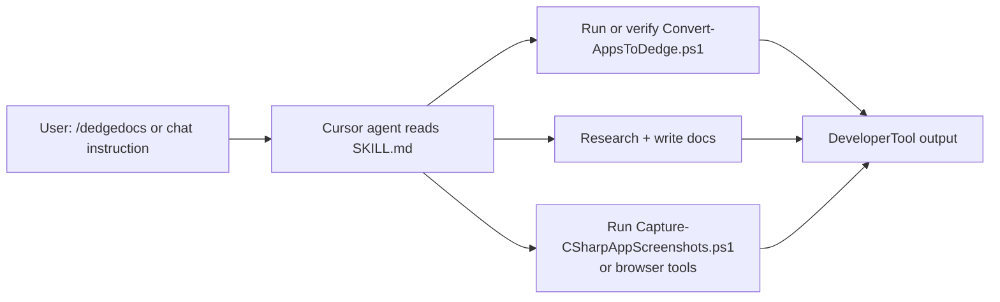
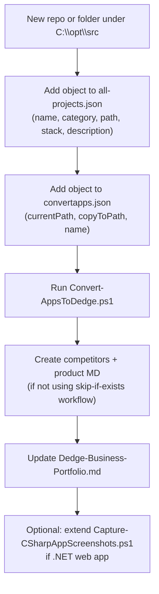
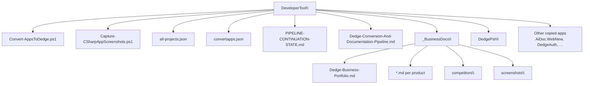

# Dedge conversion, rebranding & documentation pipeline

This document explains **how the current system works**, using **Mermaid** as the primary notation.  
**Single source of truth for paths:** `C:\opt\src\DedgeSrc\DeveloperTool\`

---

## 1. Big picture: three layers

- **`all-projects.json`** — *what* products exist (name, category, stack, description). Used for documentation scope and narrative.
- **`convertapps.json`** — *where* each product is copied and transformed. Drives **only** `Convert-AppsToDedge.ps1`.
- **`Convert-AppsToDedge.ps1`** — physical **copy + rebrand**; never writes back to source paths.

---

## 2. Data flow: from JSON to folders

Each `projects[]` entry is processed **in order**. For every entry the script:

1. Deletes the previous `copyToPath` (if present).
2. Copies from `currentPath` with **robocopy**, excluding `.git`, `bin`, `obj`, `node_modules`, etc.
3. Walks **all non-binary text files** (size ≤ 10 MB) and applies transforms.
4. Renames **files** then **directories** (deepest first) using literal find/replace rules.
5. Overwrites every `dedge.ico` with the binary from `DbExplorer\Resources\dEdge.ico`.

---

## 3. Inside one conversion: text and renames

**Rule categories** (conceptually):

| Bucket | Role |
|--------|------|
| **UncRules** | Map UNC shares (e.g. test server) to `DedgeSystemTools\Folders\...` |
| **ContentRules** | Regex replacements: branding, namespaces, emails → `geir.helge.starholm@dedge.no`, URLs → `www.dedge.no`, asset names (`fk.ico` → `dedge.ico`) |
| **RenameRules** | Literal substring renames on **file and folder names** |

---

## 4. DedgePsh layout (after conversion)

`convertapps.json` uses **separate entries** (e.g. `DedgePsh-Modules`, `DedgePsh-DatabaseTools`) that all land under `DedgePsh\` without duplicating the root CodingTools copy.

---

## 5. Documentation pipeline (logical phases)

**Idempotence (typical convention):** competitor files and per-product MD are often **skipped if the file already exists** so you do not overwrite hand-edited docs. The **conversion script** always refreshes the sandbox copy when you run it.

---

## 6. How documentation files relate to products

Naming is **aligned to product keys** where possible; DedgePsh sub-suites use prefixes like `DedgePsh-DatabaseTools.md`.

---

## 7. C# screenshot sub-pipeline (only .NET web hosts)

PowerShell-only entries from `all-projects.json` are **out of scope** for this script.

**Included:** e.g. AiDoc.WebNew, AutoDocJson.Web, SystemAnalyzer.Web, GenericLogHandler API, SqlMermaid web/REST, CursorDb2McpServer, FkAuth API.  
**Excluded:** libraries without Kestrel (`DedgeCommon`), GitHist, CursorRulesLibrary, all `DedgePsh-*` PowerShell suites, Python/PHP/static-only entries.

See `PIPELINE-CONTINUATION-STATE.md` for **known screenshot reliability issues** and next fixes.

---

## 8. Cursor skill vs scripts

The skill is **orchestration documentation** for the agent; the **executable** conversion is always `Convert-AppsToDedge.ps1` + `convertapps.json`.

---

## 9. Adding a new product (checklist)

---

## 10. File map (quick reference)

---

*End of pipeline overview. For live troubleshooting and resume checkpoints, use `PIPELINE-CONTINUATION-STATE.md`.*

---

## Cursor integration (same folder)

- **Rule:** `.cursor/rules/dedge-developer-tool-pipeline.mdc` — applies when matching pipeline paths.
- **Command:** `.cursor/commands/dedge-pipeline.md` — use **`/dedge-pipeline`** in chat (subcommands: `help`, `state`, `diagram`, `convert`, `screenshots`, `docs`).
