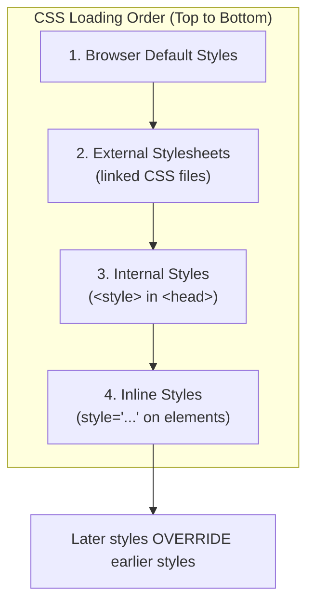
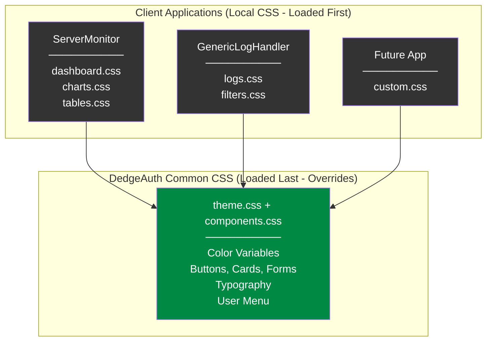
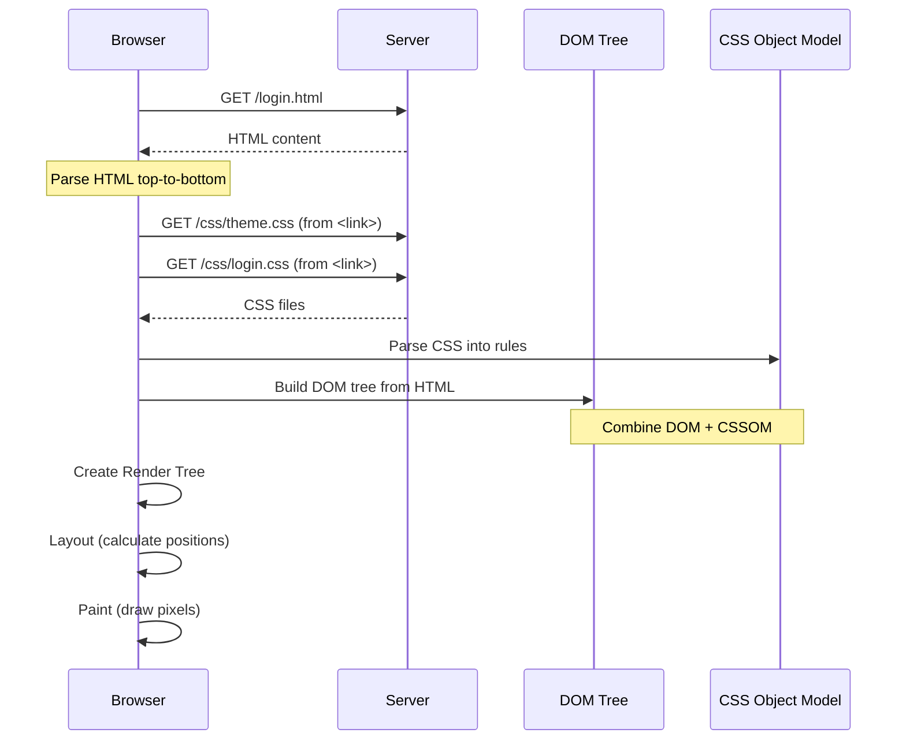
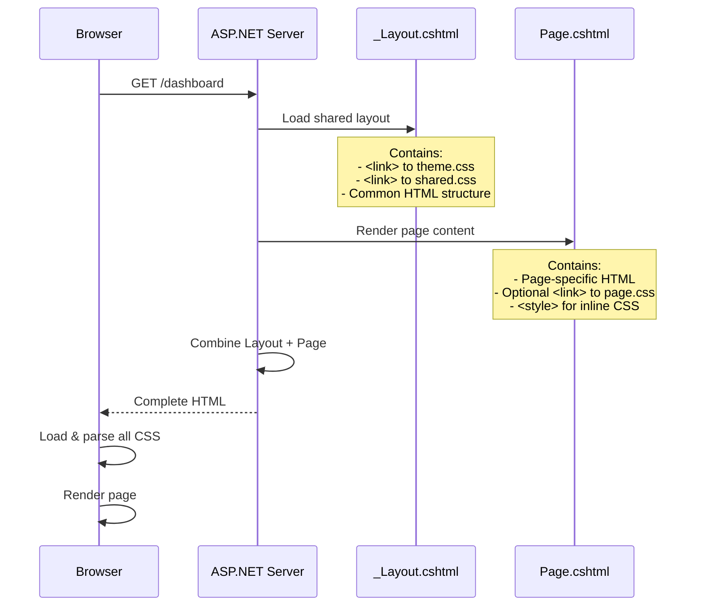
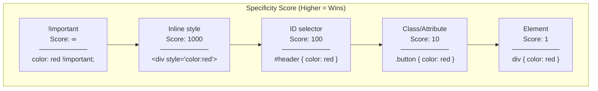
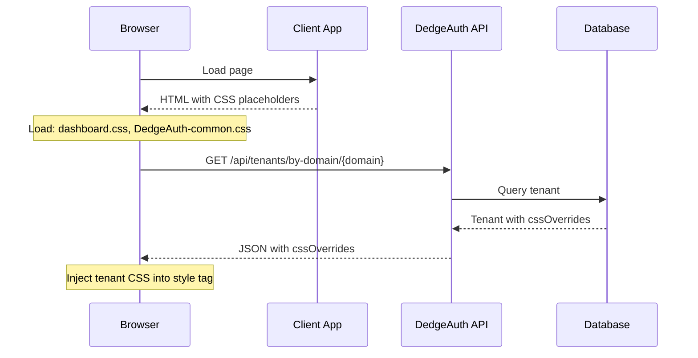
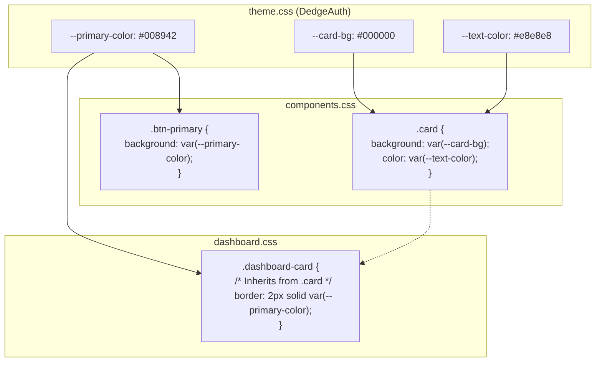
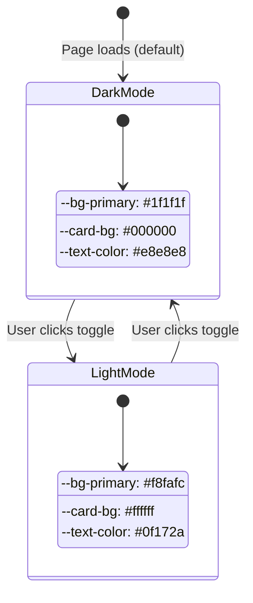
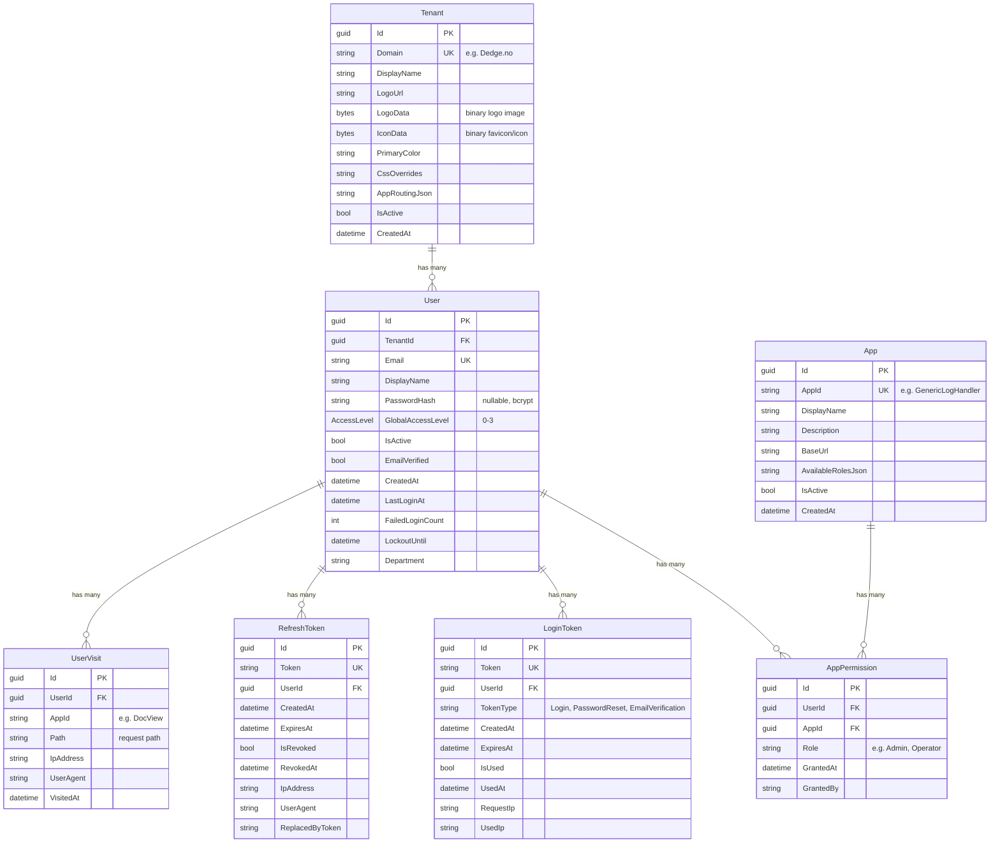
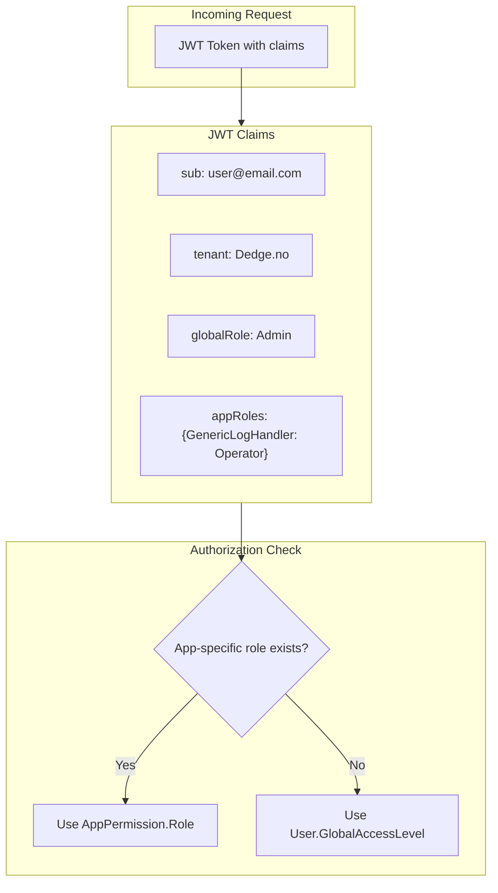

# CSS Architecture: Shared Themes & Page-Specific Styles

## Overview

Yes, each page can have its own CSS while DedgeAuth defines the shared color scheme and common elements. This is achieved through CSS's **cascading** nature and **CSS variables**.

## How CSS Cascading Works

When a browser loads a page, CSS rules are applied in a specific order. Later rules can override earlier ones, and more specific selectors win over less specific ones.



## CSS Variables (Custom Properties)

CSS variables allow you to define values once and reuse them everywhere. DedgeAuth uses this to define the color scheme:

```css
/* DedgeAuth Theme - defines the color scheme */
:root {
    --bg-primary: #1f1f1f;      /* Page background */
    --card-bg: #000000;          /* Panel/card background */
    --text-color: #e8e8e8;       /* Main text color */
    --primary-color: #008942;    /* FK Green */
    --accent: #0369a1;           /* Links, buttons */
    --error-color: #ef4444;      /* Errors, logout */
}

/* Any page can USE these variables */
.my-custom-element {
    background: var(--card-bg);      /* Uses black from theme */
    color: var(--text-color);        /* Uses light gray from theme */
    border: 1px solid var(--primary-color);  /* Uses FK green */
}
```

## Architecture for DedgeAuth Apps



### What Gets Overridden vs Preserved

```
┌────────────────────────────────────────────────────────────────────┐
│  App loads its CSS first:                                          │
│    .btn { background: blue; }     ← Will be overridden            │
│    .my-chart { width: 100%; }     ← Preserved (not in common)     │
│    --primary-color: purple;       ← Will be overridden            │
│    .dashboard-grid { ... }        ← Preserved (not in common)     │
├────────────────────────────────────────────────────────────────────┤
│  DedgeAuth loads last:                                            │
│    .btn { background: #008942; }  ← WINS - all apps get this      │
│    --primary-color: #008942;      ← WINS - all apps get this      │
│    .card { ... }                  ← WINS - consistent cards       │
└────────────────────────────────────────────────────────────────────┘
```

## How a Page Loads CSS

### Static HTML File (e.g., login.html)



### Web Application (e.g., ASP.NET with Razor/Blazor)



## CSS Specificity (Which Rule Wins?)

When multiple CSS rules target the same element, the browser uses **specificity** to decide which wins:



### Example: How Specificity Works

```css
/* Score: 1 (element) */
button {
    background: gray;
}

/* Score: 10 (class) - WINS over element */
.btn-primary {
    background: blue;
}

/* Score: 100 (ID) - WINS over class */
#submit-button {
    background: green;
}

/* Score: 11 (element + class) */
button.btn-primary {
    background: purple;
}
```

## Recommended File Structure

```
wwwroot/
├── css/
│   ├── theme.css           # DedgeAuth theme (colors, variables)
│   ├── components.css      # Shared components (buttons, cards, forms)
│   ├── DedgeAuth-user.css # User menu component
│   └── pages/
│       ├── dashboard.css   # Dashboard-specific styles
│       ├── settings.css    # Settings page styles
│       └── reports.css     # Reports page styles
```

## HTML Structure for Layered CSS

The recommended approach is to load **DedgeAuth's common CSS last** to enforce consistent theming across all applications.

```html
<!DOCTYPE html>
<html>
<head>
    <!-- 1. App-Specific Styles (loaded FIRST) -->
    <link rel="stylesheet" href="css/pages/dashboard.css">
    <link rel="stylesheet" href="css/app-components.css">
    
    <!-- 2. DedgeAuth Common CSS via proxy (loaded LAST - enforces consistency) -->
    <link rel="stylesheet" href="api/DedgeAuth/ui/common.css">
    
    <!-- 3. Tenant CSS injection point (populated by DedgeAuth-user.js) -->
    <style id="DedgeAuth-tenant-css"></style>
    
    <!-- 4. DedgeAuth User Menu CSS via proxy -->
    <link rel="stylesheet" href="api/DedgeAuth/ui/user.css">
</head>
<body>
    <!-- DedgeAuth user menu container -->
    <div id="DedgeAuthUserMenu"></div>
    
    <!-- DedgeAuth user menu script via proxy -->
    <script src="api/DedgeAuth/ui/user.js"></script>
</body>
</html>
```

> **Note:** Consumer apps use **relative paths** (no leading `/`) to the DedgeAuth UI proxy at `api/DedgeAuth/ui/{path}`. The proxy is registered by `MapDedgeAuthProxy()` and forwards requests to the DedgeAuth server's `UIController`.

### Why Load Common CSS Last?

```
┌─────────────────────────────────────────────────────────────────────┐
│  LOCAL CSS (loaded first)                                           │
│  ─────────────────────────                                          │
│  • Page layouts (grids, flexbox arrangements)                       │
│  • App-specific components (charts, custom widgets)                 │
│  • Colors/buttons → WILL BE OVERRIDDEN                              │
├─────────────────────────────────────────────────────────────────────┤
│  DedgeAuth COMMON CSS (loaded last)                                │
│  ────────────────────────────────────                               │
│  • Color variables (--primary-color, --error-color, etc.)           │
│  • Button styles (.btn, .btn-primary, .btn-danger)                  │
│  • Card/panel styles (.card, .panel)                                │
│  • Form elements (inputs, selects, toggles)                         │
│  • Typography (headings, body text)                                 │
│  • User menu component                                              │
│  → ALL APPS GET IDENTICAL STYLING FOR THESE                        │
├─────────────────────────────────────────────────────────────────────┤
│  RESULT                                                             │
│  ──────                                                             │
│  ✓ Consistent branding across all applications                     │
│  ✓ Green = OK, Red = Error, everywhere                             │
│  ✓ Same button look, same card look, same form look                │
│  ✓ Apps retain their unique layouts and custom components          │
└─────────────────────────────────────────────────────────────────────┘
```

## Tenant-Specific CSS via API

In addition to the common CSS, each tenant can have custom CSS overrides stored in the database and injected via API.

### How It Works



### CSS Loading Order (Complete)

```
1. Local App CSS           → css/dashboard.css (loaded first)
2. DedgeAuth Common CSS       → api/DedgeAuth/ui/common.css (via proxy, colors, buttons, etc.)
3. Tenant-specific CSS     → Injected into #DedgeAuth-tenant-css by DedgeAuth-user.js
4. User Menu CSS           → api/DedgeAuth/ui/user.css (via proxy, loaded last)
```

### HTML Structure with Tenant CSS

```html
<head>
    <!-- 1. Local App CSS (loaded first) -->
    <link rel="stylesheet" href="css/dashboard.css">
    
    <!-- 2. DedgeAuth Common CSS via proxy (enforces consistency) -->
    <link rel="stylesheet" href="api/DedgeAuth/ui/common.css">
    
    <!-- 3. Tenant-specific CSS (injected by DedgeAuth-user.js) -->
    <style id="DedgeAuth-tenant-css"></style>
    
    <!-- 4. User menu component via proxy (loaded last) -->
    <link rel="stylesheet" href="api/DedgeAuth/ui/user.css">
</head>
```

### JavaScript to Load Tenant CSS

```javascript
async function loadTenantCss() {
    const tenantDomain = getUserTenant() || 'Dedge.no';
    const DedgeAuthUrl = getDedgeAuthUrl();
    
    try {
        const response = await fetch(`${DedgeAuthUrl}/api/tenants/by-domain/${tenantDomain}`);
        if (response.ok) {
            const tenant = await response.json();
            
            // Inject tenant CSS
            const cssElement = document.getElementById('DedgeAuth-tenant-css');
            if (cssElement && tenant.cssOverrides) {
                cssElement.textContent = tenant.cssOverrides;
            }
        }
    } catch (error) {
        console.warn('Failed to load tenant CSS:', error);
    }
}
```

### System Default CSS

If a tenant has no custom CSS configured (`cssOverrides` is null/empty), the API returns the **system default CSS** from `appsettings.json`:

```json
{
  "Theming": {
    "SystemDefaultCss": ":root { --primary-color: #008942; } [data-theme=\"dark\"] { --bg-primary: #1f1f1f; }"
  }
}
```

This ensures all apps have consistent styling even for new tenants.

### Admin Configuration

Tenant CSS can be configured in the DedgeAuth Admin Dashboard:

1. Navigate to **Admin Dashboard** → **Tenants**
2. Click **Edit** on a tenant
3. Enter custom CSS in the **CSS Overrides** field
4. Click **Save**

Leave the field empty to use the system default.

---

## How Variables Flow Through the System



## Dark/Light Theme Switching

The theme toggle works by changing a `data-theme` attribute on the root element:



### CSS for Theme Switching

```css
/* Dark theme (default) */
:root {
    --bg-primary: #1f1f1f;
    --card-bg: #000000;
    --text-color: #e8e8e8;
}

/* Light theme (when data-theme="light" is set) */
[data-theme="light"] {
    --bg-primary: #f8fafc;
    --card-bg: #ffffff;
    --text-color: #0f172a;
}

/* Components just use the variables - they auto-switch! */
body {
    background: var(--bg-primary);
    color: var(--text-color);
}

.card {
    background: var(--card-bg);
}
```

## Summary

### Recommended Load Order

| Order | Layer | Purpose | Example |
|-------|-------|---------|---------|
| 1st | **App CSS** | Page layouts, custom components | `css/dashboard.css` |
| 2nd | **DedgeAuth Common** | Color scheme, buttons, cards, forms | `api/DedgeAuth/ui/common.css` (via proxy) |
| 3rd | **Tenant CSS** | Tenant-specific overrides | Injected into `#DedgeAuth-tenant-css` by `DedgeAuth-user.js` |
| 4th | **User Menu** | DedgeAuth user menu component | `api/DedgeAuth/ui/user.css` (via proxy) |

### What Each Layer Controls

| Controlled By | Examples |
|---------------|----------|
| **DedgeAuth Common (enforced)** | Colors, buttons, cards, forms, typography |
| **Tenant CSS (customizable)** | Tenant-specific colors, branding, logo |
| **Local App (preserved)** | Page layouts, grids, app-specific widgets, custom charts |

### Configuration Hierarchy

```
System Default CSS (appsettings.json)
        ↓
    Tenant has custom CSS?
        ├── YES → Use tenant's CSS
        └── NO  → Use system default
```

**Key Takeaway**: 
- Load DedgeAuth CSS **after** local app CSS to enforce consistent branding
- Tenant-specific CSS is injected via API to allow customization without code changes
- System default ensures consistent styling for new/unconfigured tenants

---

## Data Model

DedgeAuth uses a multi-tenant, permission-based data model. All entities are defined in `DedgeAuth.Core/Models/`.

### Entity Relationship Diagram



### Core Entities

#### Tenant
Multi-tenant configuration for branding and app routing.

| Column | Type | Description |
|--------|------|-------------|
| `Id` | GUID | Primary key |
| `Domain` | string | Email domain for tenant lookup (e.g., `Dedge.no`) |
| `DisplayName` | string | Display name (e.g., `Dedge`) |
| `LogoUrl` | string? | Path to tenant logo (legacy) |
| `LogoData` | byte[]? | Binary logo image stored in database |
| `IconData` | byte[]? | Binary favicon/icon stored in database |
| `PrimaryColor` | string? | Primary theme color (e.g., `#008942`) |
| `CssOverrides` | string? | Custom CSS overrides |
| `AppRoutingJson` | string? | JSON map of app → URL routing |
| `IsActive` | bool | Whether tenant is active |

#### User
User account for authentication.

| Column | Type | Description |
|--------|------|-------------|
| `Id` | GUID | Primary key |
| `TenantId` | GUID? | Foreign key to Tenant (resolved from email domain) |
| `Email` | string | Unique email address |
| `DisplayName` | string | User's display name |
| `PasswordHash` | string? | BCrypt hash (null if magic-link only) |
| `GlobalAccessLevel` | AccessLevel | Default access level (0-3) |
| `IsActive` | bool | Account active flag |
| `EmailVerified` | bool | Email verification status |
| `FailedLoginCount` | int | Failed attempts for lockout |
| `LockoutUntil` | DateTime? | Lockout expiration |

#### App
Registered application that uses DedgeAuth.

| Column | Type | Description |
|--------|------|-------------|
| `Id` | GUID | Primary key |
| `AppId` | string | Unique app identifier (e.g., `GenericLogHandler`) |
| `DisplayName` | string | Human-readable name |
| `Description` | string? | App description |
| `BaseUrl` | string? | Default base URL |
| `AvailableRolesJson` | string? | JSON array of available roles |
| `IsActive` | bool | Whether app is active |

#### AppPermission
User permission for a specific app (many-to-many relationship).

| Column | Type | Description |
|--------|------|-------------|
| `Id` | GUID | Primary key |
| `UserId` | GUID | Foreign key to User |
| `AppId` | GUID | Foreign key to App |
| `Role` | string | Role assigned (e.g., `Admin`, `Operator`, `Viewer`) |
| `GrantedAt` | DateTime | When permission was granted |
| `GrantedBy` | string? | Who granted the permission |

#### LoginToken
Magic link / password reset / email verification tokens.

| Column | Type | Description |
|--------|------|-------------|
| `Id` | GUID | Primary key |
| `Token` | string | Unique token value |
| `UserId` | GUID | Foreign key to User |
| `TokenType` | string | `Login`, `PasswordReset`, or `EmailVerification` |
| `ExpiresAt` | DateTime | Token expiration |
| `IsUsed` | bool | Whether token has been consumed |
| `RequestIp` / `UsedIp` | string? | IP tracking |

#### RefreshToken
JWT refresh tokens for session management.

| Column | Type | Description |
|--------|------|-------------|
| `Id` | GUID | Primary key |
| `Token` | string | Unique token value |
| `UserId` | GUID | Foreign key to User |
| `ExpiresAt` | DateTime | Token expiration |
| `IsRevoked` | bool | Revocation flag |
| `IpAddress` | string? | Client IP |
| `UserAgent` | string? | Browser/device info |
| `ReplacedByToken` | string? | Rotation tracking |

### AccessLevel Enum

Global access levels used for authorization:

```
┌────────────────────────────────────────────┐
│  AccessLevel (int 0-3)                     │
├────────────────────────────────────────────┤
│  0 = ReadOnly   → Minimal read-only access │
│  1 = User       → Standard user access     │
│  2 = PowerUser  → Configuration access     │
│  3 = Admin      → Full admin access        │
└────────────────────────────────────────────┘
```

### Authorization Flow



### Database Tables (PostgreSQL)

| Entity | Table Name |
|--------|------------|
| Tenant | `tenants` |
| User | `users` |
| App | `apps` |
| AppPermission | `app_permissions` |
| LoginToken | `login_tokens` |
| RefreshToken | `refresh_tokens` |
| UserVisit | `user_visits` |

All tables use snake_case column names (EF Core convention).
