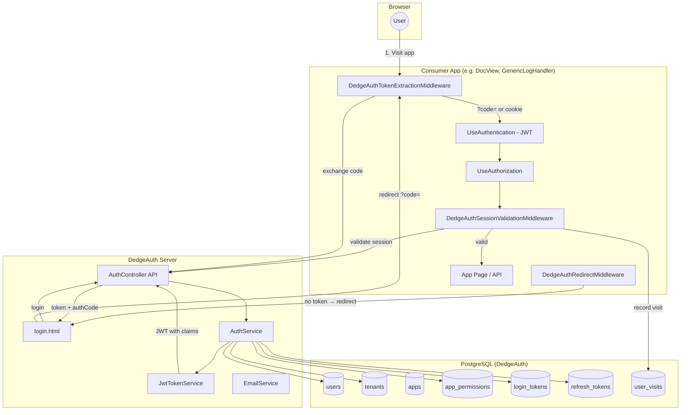
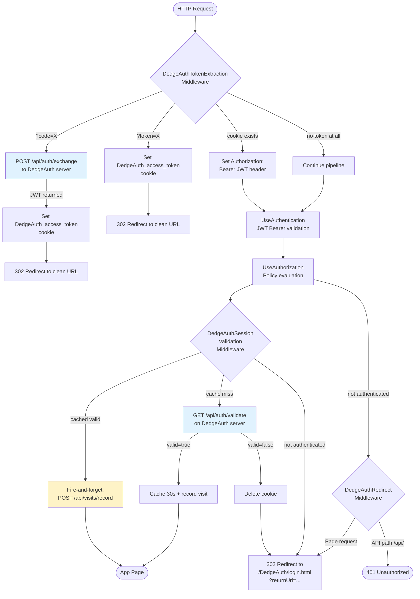
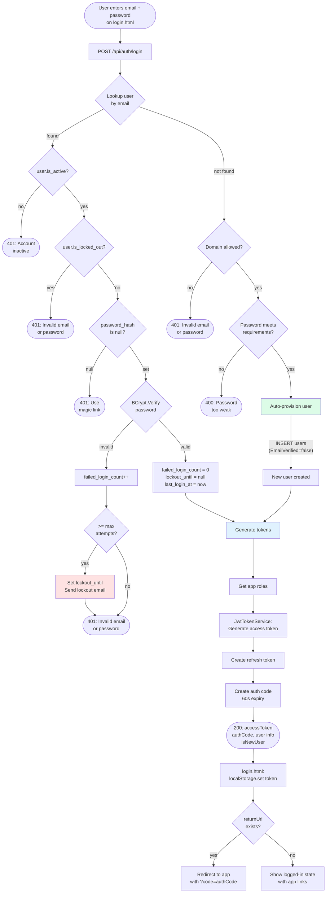
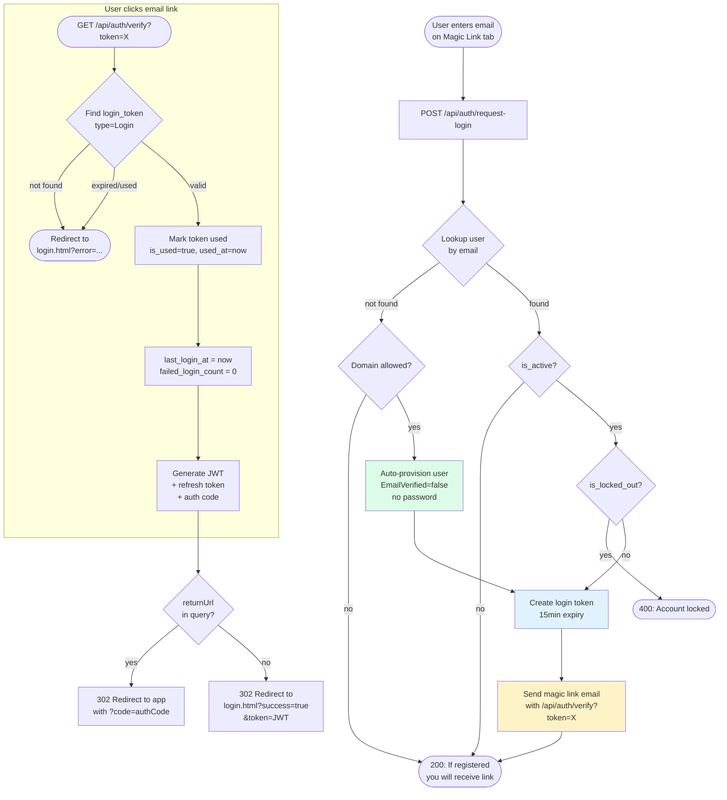
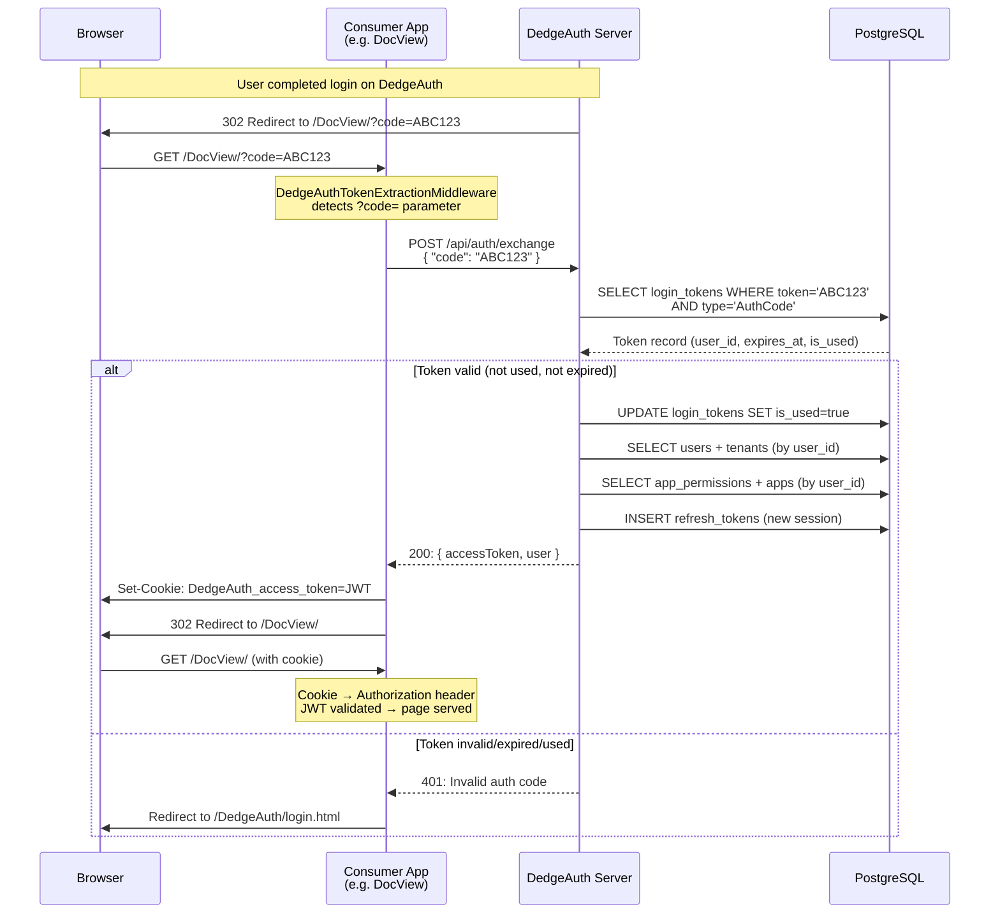
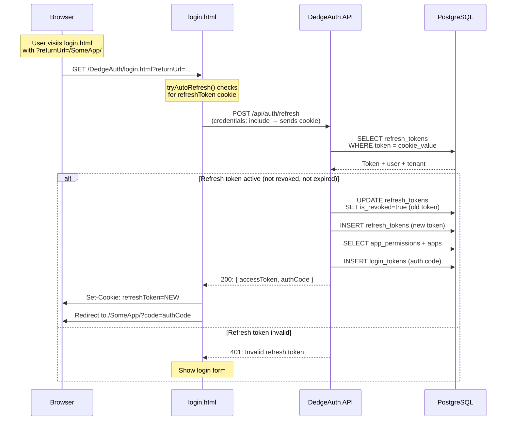
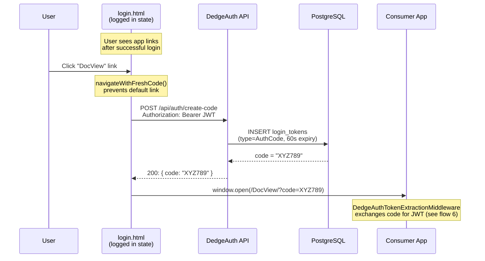
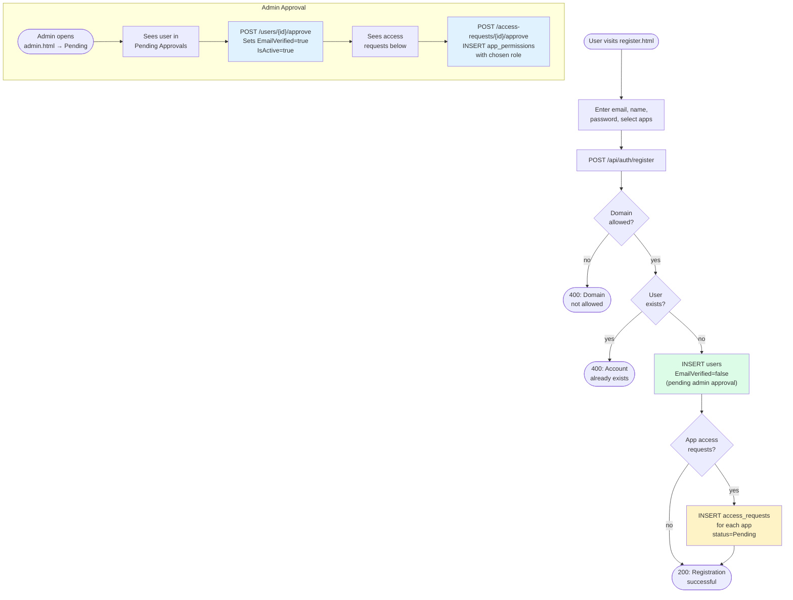
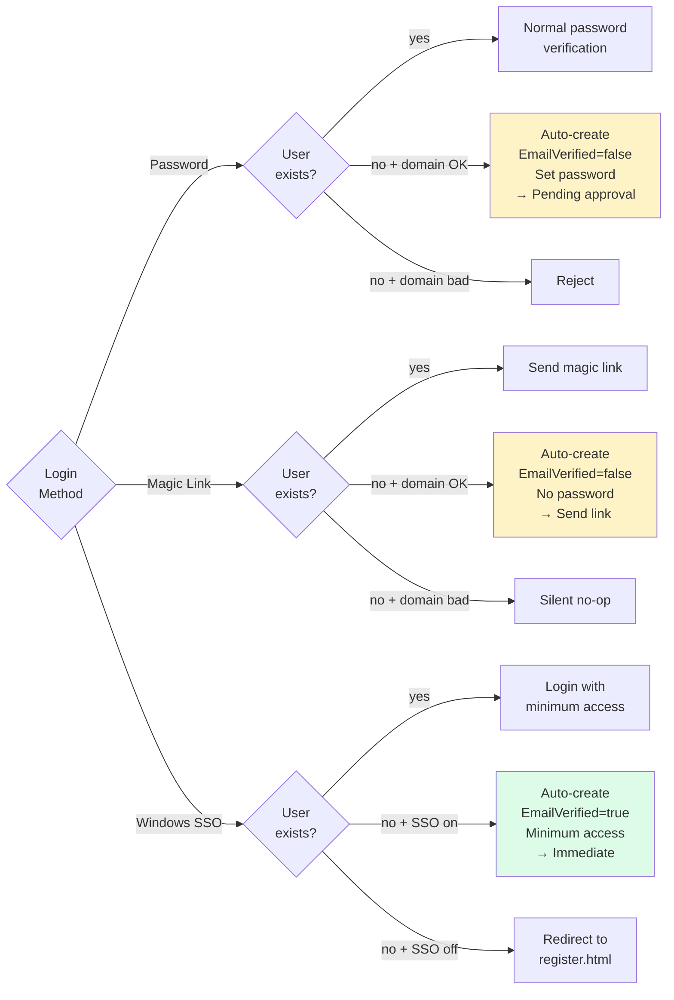

# DedgeAuth Authentication Flow

**Generated**: 2026-03-22

Complete flowchart of all authentication methods, middleware pipeline, and database table interactions.

---

## 1. High-Level Overview



---

## 2. Consumer App Middleware Pipeline

Order registered by `app.UseDedgeAuth()`:



**Database interactions:**

| Step | Table | Operation |
|---|---|---|
| Exchange auth code | `login_tokens` | READ + UPDATE (mark used) |
| Exchange auth code | `users`, `tenants` | READ (load user + tenant) |
| Exchange auth code | `app_permissions` | READ (get roles) |
| Exchange auth code | `refresh_tokens` | INSERT (new refresh token) |
| Validate session | `refresh_tokens` | READ (check active sessions) |
| Record visit | `user_visits` | INSERT |

---

## 3. Password Login Flow



**Database interactions:**

| Step | Table | Operation |
|---|---|---|
| Lookup user | `users` + `tenants` | SELECT (join) |
| Auto-provision | `users` | INSERT |
| Auto-provision | `tenants` | SELECT (resolve from domain) |
| Failed login | `users` | UPDATE (increment counter) |
| Lockout | `users` | UPDATE (set lockout_until) |
| Successful login | `users` | UPDATE (reset counters, last_login) |
| Get app roles | `app_permissions` + `apps` | SELECT (join) |
| Generate JWT | - | In-memory (claims from user/tenant/roles) |
| Create refresh token | `refresh_tokens` | INSERT |
| Create auth code | `login_tokens` | INSERT (type=AuthCode, 60s expiry) |

---

## 4. Magic Link Login Flow



**Database interactions:**

| Step | Table | Operation |
|---|---|---|
| Lookup user | `users` + `tenants` | SELECT |
| Auto-provision | `users` | INSERT |
| Create login token | `login_tokens` | INSERT (type=Login, 15min) |
| Verify token | `login_tokens` + `users` + `tenants` | SELECT (join) |
| Mark used | `login_tokens` | UPDATE (is_used, used_at, used_ip) |
| Update user | `users` | UPDATE (last_login_at) |
| Get app roles | `app_permissions` + `apps` | SELECT |
| Create refresh token | `refresh_tokens` | INSERT |
| Create auth code | `login_tokens` | INSERT (type=AuthCode) |

---

## 5. Windows/Kerberos SSO Flow

```mermaid
flowchart TD
    Start([Page loads login.html])
    Start --> AutoProbe[Silent GET /api/auth/windows-probe\nAllowAnonymous + credentials:include]

    AutoProbe --> CheckIdentity{IIS passed\nKerberos ticket?}
    CheckIdentity -->|no| ShowForm([Show login form\ndim Windows button])

    CheckIdentity -->|yes| HandleCore[HandleWindowsLoginCoreAsync]

    HandleCore --> ExtractName[Extract sAMAccountName\nfrom DOMAIN\\user]
    ExtractName --> LdapLookup[LDAP DirectorySearcher\non DEDGE.fk.no]
    LdapLookup --> GetAdInfo["Get: mail, displayName,\nuserPrincipalName, memberOf"]
    GetAdInfo --> CollectGroups[Collect AD group\nmemberships from\nKerberos claims + LDAP memberOf]

    CollectGroups --> CallService[AuthService.LoginWithWindowsAsync]

    CallService --> ResolveTenant{Resolve tenant\nfrom email domain}
    ResolveTenant -->|"not found or\nSSO disabled"| SsoDisabled([Return ssoDisabled\n→ redirect to register.html])

    ResolveTenant -->|"SSO enabled"| FindUser{Find user\nby email}

    FindUser -->|"not found"| CreateUser["Auto-create user\nIsActive=true\nEmailVerified=true\nAuthMethod=windows"]
    CreateUser --> WelcomeEmail[Fire-and-forget:\nSend welcome email]

    FindUser -->|"found"| CheckInactive{is_active?}
    CheckInactive -->|no| FailInactive([401: Account\ninactive])
    CheckInactive -->|yes| UpdateUser[Update display name\nAuthMethod=windows\nlast_login_at=now]

    CreateUser --> GetRoles
    UpdateUser --> GetRoles

    GetRoles[Get app roles\n+ implicit minimum access]
    GetRoles --> GenJWT["Generate JWT with:\n- user claims\n- appPermissions\n- adGroups\n- tenant info"]
    GenJWT --> CreateRefresh[Create refresh token]
    CreateRefresh --> CreateCode[Create auth code]
    CreateCode --> Response([200: accessToken\nauthCode, isNewUser])

    Response --> ClientStore[login.html:\nlocalStorage.set token]
    ClientStore --> CheckReturn{returnUrl?}
    CheckReturn -->|yes| RedirectApp[Redirect to app\nwith ?code=authCode]
    CheckReturn -->|no| ShowApps[Show logged-in state\nwith app links]

    subgraph "Manual Windows Login (button click)"
        WinBtn([Click 'Sign in with Windows'])
        WinBtn --> GetWinLogin[GET /api/auth/windows-login\nAuthorize Policy=WindowsAuth]
        GetWinLogin --> Challenge401[IIS returns 401\nNegotiate challenge]
        Challenge401 --> BrowserNego[Browser sends\nKerberos ticket]
        BrowserNego --> HandleCore
    end

    style CreateUser fill:#dcfce7
    style WelcomeEmail fill:#fef3c7
    style GetRoles fill:#e0f2fe
```



**Database interactions:**

| Step | Table | Operation |
|---|---|---|
| Resolve tenant | `tenants` | SELECT (by domain, check WindowsSsoEnabled) |
| Find user | `users` + `tenants` | SELECT |
| Orphan cleanup | `users`, `app_permissions`, `user_visits`, `login_tokens`, `refresh_tokens`, `access_requests` | DELETE |
| Auto-create user | `users` | INSERT (EmailVerified=true) |
| Update user | `users` | UPDATE (display name, auth_method, last_login) |
| Get app roles | `app_permissions` + `apps` | SELECT |
| Implicit min access | `apps` | SELECT (all active apps, assign lowest role) |
| Create refresh token | `refresh_tokens` | INSERT |
| Create auth code | `login_tokens` | INSERT (type=AuthCode) |

---

## 6. Auth Code Exchange Flow (Consumer App ↔ DedgeAuth)



---

## 7. Token Refresh Flow



**Database interactions:**

| Step | Table | Operation |
|---|---|---|
| Find refresh token | `refresh_tokens` + `users` + `tenants` | SELECT (join) |
| Revoke old token | `refresh_tokens` | UPDATE (is_revoked, revoked_at, replaced_by_token) |
| Create new refresh token | `refresh_tokens` | INSERT |
| Get app roles | `app_permissions` + `apps` | SELECT |
| Create auth code | `login_tokens` | INSERT |

---

## 8. Per-App-Click Fresh Auth Code Flow



---

## 9. Registration + Access Request Flow



**Database interactions:**

| Step | Table | Operation |
|---|---|---|
| Check domain | config | In-memory (AllowedDomain) |
| Check existing | `users` | SELECT |
| Create user | `users` | INSERT |
| Resolve tenant | `tenants` | SELECT (by email domain) |
| Create access requests | `access_requests` + `apps` | SELECT app + INSERT request |
| Approve user | `users` | UPDATE (email_verified, is_active) |
| Approve access request | `access_requests` | UPDATE (status=Approved) |
| Grant permission | `app_permissions` | INSERT or UPDATE |

---

## 10. Complete Database Interaction Map

Summary of which tables are touched by each authentication operation:

| Operation | users | tenants | apps | app_permissions | login_tokens | refresh_tokens | user_visits | access_requests |
|---|---|---|---|---|---|---|---|---|
| **Register** | INSERT | READ | READ | - | - | - | - | INSERT |
| **Password Login** | READ/UPDATE | READ | READ | READ | INSERT | INSERT | - | - |
| **Password Login (new)** | INSERT | READ | READ | READ | INSERT | INSERT | - | - |
| **Magic Link Request** | READ | READ | - | - | INSERT | - | - | - |
| **Magic Link Request (new)** | INSERT | READ | - | - | INSERT | - | - | - |
| **Magic Link Verify** | UPDATE | READ | READ | READ | UPDATE | INSERT | - | - |
| **Windows SSO** | READ/INSERT | READ | READ | READ | INSERT | INSERT | - | - |
| **Auth Code Exchange** | READ | READ | READ | READ | UPDATE | INSERT | - | - |
| **Token Refresh** | READ | READ | READ | READ | INSERT | INSERT/UPDATE | - | - |
| **Create Code** | - | - | - | - | INSERT | - | - | - |
| **Session Validate** | - | - | - | - | - | READ | INSERT | - |
| **Logout** | - | - | - | - | - | UPDATE | - | - |
| **Approve User** | UPDATE | - | - | - | - | - | - | - |
| **Approve Request** | - | - | - | INSERT | - | - | - | UPDATE |

---

## 11. JWT Token Claims Structure

Every JWT issued by DedgeAuth contains these claims:

```json
{
  "sub": "user-guid",
  "email": "user@Dedge.no",
  "name": "Display Name",
  "globalAccessLevel": "3",
  "globalAccessLevelName": "Admin",
  "language": "nb",
  "department": "IT",
  "appPermissions": "{\"DocView\":\"Admin\",\"GenericLogHandler\":\"Admin\"}",
  "adGroups": "[\"DEDGE\\\\ACL_AppHub_RW\",\"DEDGE\\\\Domain Users\"]",
  "tenant": "{\"id\":\"...\",\"domain\":\"Dedge.no\",\"displayName\":\"Dedge\",\"primaryColor\":\"#008942\",\"appRouting\":{...},\"supportedLanguages\":[\"nb\",\"en\"]}",
  "iss": "DedgeAuth",
  "aud": "FKApps",
  "exp": 1742650800
}
```

| Claim | Source | Used By |
|---|---|---|
| `sub` | `users.id` | All authorization checks |
| `email` | `users.email` | Display, audit |
| `name` | `users.display_name` | User menu |
| `globalAccessLevel` | `users.global_access_level` | Admin access policies |
| `language` | `users.preferred_language` | i18n loader |
| `department` | `users.department` | Display |
| `appPermissions` | `app_permissions` JOIN `apps` | Consumer app `[RequireAppPermission]` |
| `adGroups` | Kerberos claims + LDAP memberOf | `app_groups.acl_groups_json` visibility |
| `tenant` | `tenants` (id, domain, colors, routing) | Theme CSS, app switcher, logo |

---

## 12. Auto-Provisioning Decision Matrix



| Method | Auto-provision | EmailVerified | Needs Admin Confirmation | Immediate Access |
|---|---|---|---|---|
| Password (new user) | Yes, if domain allowed | `false` | Yes (appears in pending) | Yes (limited) |
| Magic Link (new user) | Yes, if domain allowed | `false` | Yes (appears in pending) | Yes (after clicking link) |
| Windows/Kerberos (new user) | Yes, if tenant SSO enabled | `true` | No | Yes (minimum access to all apps) |
| Registration page | Yes, if domain allowed | `false` | Yes (appears in pending) | After admin approval |
