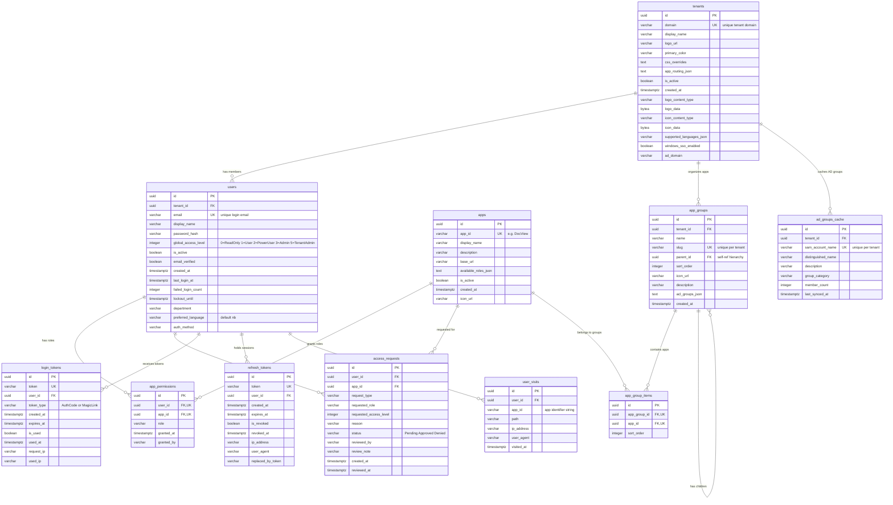

# DedgeAuth Database Schema

**Database**: `DedgeAuth` (PostgreSQL)
**Server**: `t-no1fkxtst-db:8432`
**Schema**: `public`
**Generated**: 2026-03-22

## Overview

| Table | Description | Rows |
|---|---|---:|
| `users` | User accounts with credentials and preferences | 8 |
| `tenants` | Multi-tenant configuration, branding, and SSO settings | 1 |
| `apps` | Registered consumer applications | 7 |
| `app_permissions` | Per-user, per-app role assignments | 36 |
| `app_groups` | Hierarchical application grouping per tenant | 6 |
| `app_group_items` | Junction table linking apps to groups | 5 |
| `ad_groups_cache` | Cached Active Directory groups synced from LDAP | 631 |
| `access_requests` | Self-service access request workflow | 0 |
| `login_tokens` | Short-lived auth codes and magic link tokens | 2 |
| `refresh_tokens` | JWT refresh tokens for session management | 106 |
| `user_visits` | Visit tracking for audit and analytics | 371 |
| `__EFMigrationsHistory` | EF Core migration version tracking | 10 |

---

## Table Definitions

### `users`

User accounts with authentication credentials, tenant membership, and preferences.

| Column | Type | Nullable | Default | Description |
|---|---|---|---|---|
| `id` | `uuid` | **PK** | | Unique user identifier |
| `tenant_id` | `uuid` | YES | | FK to `tenants.id` |
| `email` | `varchar(255)` | NO | | Unique login email |
| `display_name` | `varchar(200)` | NO | | User's display name |
| `password_hash` | `varchar(500)` | YES | | BCrypt password hash (null for SSO-only users) |
| `global_access_level` | `integer` | NO | | 0=ReadOnly, 1=User, 2=PowerUser, 3=Admin, 5=TenantAdmin |
| `is_active` | `boolean` | NO | | Account enabled/disabled |
| `email_verified` | `boolean` | NO | | Email verification status |
| `created_at` | `timestamptz` | NO | | Account creation timestamp |
| `last_login_at` | `timestamptz` | YES | | Most recent successful login |
| `failed_login_count` | `integer` | NO | | Consecutive failed login attempts |
| `lockout_until` | `timestamptz` | YES | | Account locked until this time |
| `department` | `varchar(100)` | YES | | Organizational department |
| `preferred_language` | `varchar(10)` | NO | `'nb'` | UI language preference (nb/en) |
| `auth_method` | `varchar(50)` | YES | | Last authentication method used |

**Indexes:**

| Index | Columns | Type |
|---|---|---|
| `PK_users` | `id` | Unique |
| `IX_users_email` | `email` | Unique |
| `IX_users_tenant_id` | `tenant_id` | Non-unique |

**Foreign Keys:**

| Constraint | Column | References |
|---|---|---|
| `FK_users_tenants_tenant_id` | `tenant_id` | `tenants.id` |

---

### `tenants`

Multi-tenant configuration including branding, CSS overrides, app routing, and SSO settings.

| Column | Type | Nullable | Default | Description |
|---|---|---|---|---|
| `id` | `uuid` | **PK** | | Unique tenant identifier |
| `domain` | `varchar(255)` | NO | | Unique tenant domain (e.g. `Dedge.no`) |
| `display_name` | `varchar(200)` | NO | | Human-readable tenant name |
| `logo_url` | `varchar(500)` | YES | | URL to tenant logo (legacy) |
| `primary_color` | `varchar(20)` | YES | | Brand primary color hex code |
| `css_overrides` | `text` | YES | | Custom CSS injected into all apps |
| `app_routing_json` | `text` | YES | | JSON mapping AppId to URL for app switcher |
| `is_active` | `boolean` | NO | | Tenant enabled/disabled |
| `created_at` | `timestamptz` | NO | | Tenant creation timestamp |
| `logo_content_type` | `varchar(100)` | YES | | MIME type of stored logo |
| `logo_data` | `bytea` | YES | | Binary logo image data |
| `icon_content_type` | `varchar(100)` | YES | | MIME type of stored favicon |
| `icon_data` | `bytea` | YES | | Binary favicon image data |
| `supported_languages_json` | `varchar(500)` | YES | | JSON array of enabled language codes |
| `windows_sso_enabled` | `boolean` | NO | `false` | Enable Windows SSO via Negotiate/Kerberos |
| `ad_domain` | `varchar(100)` | YES | | Active Directory domain name (e.g. `DEDGE`) |

**Indexes:**

| Index | Columns | Type |
|---|---|---|
| `PK_tenants` | `id` | Unique |
| `IX_tenants_domain` | `domain` | Unique |

---

### `apps`

Registered consumer applications that authenticate through DedgeAuth.

| Column | Type | Nullable | Default | Description |
|---|---|---|---|---|
| `id` | `uuid` | **PK** | | Internal unique identifier |
| `app_id` | `varchar(100)` | NO | | Application identifier (e.g. `DocView`) |
| `display_name` | `varchar(200)` | NO | | Human-readable app name |
| `description` | `varchar(1000)` | YES | | App description |
| `base_url` | `varchar(500)` | YES | | App base URL for redirects |
| `available_roles_json` | `text` | YES | | JSON array of available roles |
| `is_active` | `boolean` | NO | | App enabled/disabled |
| `created_at` | `timestamptz` | NO | | Registration timestamp |
| `icon_url` | `varchar(500)` | YES | | App icon URL for menus |

**Indexes:**

| Index | Columns | Type |
|---|---|---|
| `PK_apps` | `id` | Unique |
| `IX_apps_app_id` | `app_id` | Unique |

---

### `app_permissions`

Per-user role assignments for each application.

| Column | Type | Nullable | Default | Description |
|---|---|---|---|---|
| `id` | `uuid` | **PK** | | Unique permission record |
| `user_id` | `uuid` | NO | | FK to `users.id` |
| `app_id` | `uuid` | NO | | FK to `apps.id` |
| `role` | `varchar(100)` | NO | | Assigned role (e.g. `Admin`, `User`) |
| `granted_at` | `timestamptz` | NO | | When permission was granted |
| `granted_by` | `varchar(255)` | YES | | Who granted the permission |

**Indexes:**

| Index | Columns | Type |
|---|---|---|
| `PK_app_permissions` | `id` | Unique |
| `IX_app_permissions_user_id_app_id` | `user_id, app_id` | Unique |
| `IX_app_permissions_app_id` | `app_id` | Non-unique |

**Foreign Keys:**

| Constraint | Column | References |
|---|---|---|
| `FK_app_permissions_users_user_id` | `user_id` | `users.id` |
| `FK_app_permissions_apps_app_id` | `app_id` | `apps.id` |

---

### `app_groups`

Hierarchical application grouping per tenant. Supports nesting via self-referencing `parent_id`.

| Column | Type | Nullable | Default | Description |
|---|---|---|---|---|
| `id` | `uuid` | **PK** | | Unique group identifier |
| `tenant_id` | `uuid` | NO | | FK to `tenants.id` |
| `name` | `varchar(200)` | NO | | Group display name |
| `slug` | `varchar(100)` | NO | | URL-safe identifier |
| `parent_id` | `uuid` | YES | | FK to `app_groups.id` (self-ref for hierarchy) |
| `sort_order` | `integer` | NO | | Display ordering within parent |
| `icon_url` | `varchar(500)` | YES | | Group icon URL |
| `description` | `varchar(1000)` | YES | | Group description |
| `acl_groups_json` | `text` | YES | | JSON array of AD group names for access control |
| `created_at` | `timestamptz` | NO | | Creation timestamp |

**Indexes:**

| Index | Columns | Type |
|---|---|---|
| `PK_app_groups` | `id` | Unique |
| `IX_app_groups_tenant_id_slug` | `tenant_id, slug` | Unique |
| `IX_app_groups_parent_id` | `parent_id` | Non-unique |

**Foreign Keys:**

| Constraint | Column | References |
|---|---|---|
| `FK_app_groups_tenants_tenant_id` | `tenant_id` | `tenants.id` |
| `FK_app_groups_app_groups_parent_id` | `parent_id` | `app_groups.id` |

---

### `app_group_items`

Junction table linking applications to groups with ordering.

| Column | Type | Nullable | Default | Description |
|---|---|---|---|---|
| `id` | `uuid` | **PK** | | Unique record identifier |
| `app_group_id` | `uuid` | NO | | FK to `app_groups.id` |
| `app_id` | `uuid` | NO | | FK to `apps.id` |
| `sort_order` | `integer` | NO | | Display ordering within group |

**Indexes:**

| Index | Columns | Type |
|---|---|---|
| `PK_app_group_items` | `id` | Unique |
| `IX_app_group_items_group_app` | `app_group_id, app_id` | Unique |
| `IX_app_group_items_app_id` | `app_id` | Non-unique |

**Foreign Keys:**

| Constraint | Column | References |
|---|---|---|
| `FK_app_group_items_app_groups_app_group_id` | `app_group_id` | `app_groups.id` |
| `FK_app_group_items_apps_app_id` | `app_id` | `apps.id` |

---

### `ad_groups_cache`

Cached Active Directory groups, periodically synced from LDAP per tenant.

| Column | Type | Nullable | Default | Description |
|---|---|---|---|---|
| `id` | `uuid` | **PK** | | Unique cache record |
| `tenant_id` | `uuid` | NO | | FK to `tenants.id` |
| `sam_account_name` | `varchar(256)` | NO | | AD sAMAccountName |
| `distinguished_name` | `varchar(1000)` | YES | | Full AD distinguished name |
| `description` | `varchar(500)` | YES | | AD group description |
| `group_category` | `varchar(50)` | YES | | Security or Distribution |
| `member_count` | `integer` | NO | | Number of members in the group |
| `last_synced_at` | `timestamptz` | NO | | Last LDAP sync timestamp |

**Indexes:**

| Index | Columns | Type |
|---|---|---|
| `PK_ad_groups_cache` | `id` | Unique |
| `IX_ad_groups_cache_tenant_sam` | `tenant_id, sam_account_name` | Unique |

**Foreign Keys:**

| Constraint | Column | References |
|---|---|---|
| `FK_ad_groups_cache_tenants_tenant_id` | `tenant_id` | `tenants.id` |

---

### `access_requests`

Self-service access request workflow for users requesting app access or role changes.

| Column | Type | Nullable | Default | Description |
|---|---|---|---|---|
| `id` | `uuid` | **PK** | | Unique request identifier |
| `user_id` | `uuid` | NO | | FK to `users.id` |
| `app_id` | `uuid` | YES | | FK to `apps.id` (null for global requests) |
| `request_type` | `varchar(50)` | NO | | Type of request |
| `requested_role` | `varchar(100)` | YES | | Desired role |
| `requested_access_level` | `integer` | YES | | Desired global access level |
| `reason` | `varchar(1000)` | YES | | User's justification |
| `status` | `varchar(20)` | NO | | Pending / Approved / Denied |
| `reviewed_by` | `varchar(255)` | YES | | Reviewer identity |
| `review_note` | `varchar(1000)` | YES | | Reviewer's note |
| `created_at` | `timestamptz` | NO | | Request submission time |
| `reviewed_at` | `timestamptz` | YES | | Review completion time |

**Indexes:**

| Index | Columns | Type |
|---|---|---|
| `PK_access_requests` | `id` | Unique |
| `IX_access_requests_user_id_status` | `user_id, status` | Non-unique |
| `IX_access_requests_app_id` | `app_id` | Non-unique |
| `IX_access_requests_status` | `status` | Non-unique |

**Foreign Keys:**

| Constraint | Column | References |
|---|---|---|
| `FK_access_requests_users_user_id` | `user_id` | `users.id` |
| `FK_access_requests_apps_app_id` | `app_id` | `apps.id` |

---

### `login_tokens`

Short-lived tokens used for auth code exchange and magic link login.

| Column | Type | Nullable | Default | Description |
|---|---|---|---|---|
| `id` | `uuid` | **PK** | | Unique token record |
| `token` | `varchar(100)` | NO | | The token/code value |
| `user_id` | `uuid` | NO | | FK to `users.id` |
| `token_type` | `varchar(50)` | NO | | `AuthCode` or `MagicLink` |
| `created_at` | `timestamptz` | NO | | Token creation time |
| `expires_at` | `timestamptz` | NO | | Token expiry time |
| `is_used` | `boolean` | NO | | Whether the token has been consumed |
| `used_at` | `timestamptz` | YES | | When the token was consumed |
| `request_ip` | `varchar(50)` | YES | | IP that requested the token |
| `used_ip` | `varchar(50)` | YES | | IP that consumed the token |

**Indexes:**

| Index | Columns | Type |
|---|---|---|
| `PK_login_tokens` | `id` | Unique |
| `IX_login_tokens_token` | `token` | Unique |
| `IX_login_tokens_user_id` | `user_id` | Non-unique |
| `IX_login_tokens_expires_at` | `expires_at` | Non-unique |

**Foreign Keys:**

| Constraint | Column | References |
|---|---|---|
| `FK_login_tokens_users_user_id` | `user_id` | `users.id` |

---

### `refresh_tokens`

JWT refresh tokens for maintaining user sessions across token expiry.

| Column | Type | Nullable | Default | Description |
|---|---|---|---|---|
| `id` | `uuid` | **PK** | | Unique token record |
| `token` | `varchar(500)` | NO | | The refresh token value |
| `user_id` | `uuid` | NO | | FK to `users.id` |
| `created_at` | `timestamptz` | NO | | Token creation time |
| `expires_at` | `timestamptz` | NO | | Token expiry time |
| `is_revoked` | `boolean` | NO | | Whether token has been revoked |
| `revoked_at` | `timestamptz` | YES | | Revocation timestamp |
| `ip_address` | `varchar(50)` | YES | | IP that requested the token |
| `user_agent` | `varchar(500)` | YES | | Browser user agent string |
| `replaced_by_token` | `varchar(500)` | YES | | Token that replaced this one (rotation) |

**Indexes:**

| Index | Columns | Type |
|---|---|---|
| `PK_refresh_tokens` | `id` | Unique |
| `IX_refresh_tokens_token` | `token` | Unique |
| `IX_refresh_tokens_user_id` | `user_id` | Non-unique |
| `IX_refresh_tokens_expires_at` | `expires_at` | Non-unique |

**Foreign Keys:**

| Constraint | Column | References |
|---|---|---|
| `FK_refresh_tokens_users_user_id` | `user_id` | `users.id` |

---

### `user_visits`

Tracks user visits to consumer applications for audit and analytics.

| Column | Type | Nullable | Default | Description |
|---|---|---|---|---|
| `id` | `uuid` | **PK** | | Unique visit record |
| `user_id` | `uuid` | NO | | FK to `users.id` |
| `app_id` | `varchar(100)` | NO | | Application identifier string |
| `path` | `varchar(500)` | YES | | Visited URL path |
| `ip_address` | `varchar(50)` | YES | | Visitor IP address |
| `user_agent` | `varchar(500)` | YES | | Browser user agent string |
| `visited_at` | `timestamptz` | NO | | Visit timestamp |

**Indexes:**

| Index | Columns | Type |
|---|---|---|
| `PK_user_visits` | `id` | Unique |
| `IX_user_visits_user_id_visited_at` | `user_id, visited_at DESC` | Non-unique |
| `IX_user_visits_visited_at` | `visited_at DESC` | Non-unique |

**Foreign Keys:**

| Constraint | Column | References |
|---|---|---|
| `FK_user_visits_users_user_id` | `user_id` | `users.id` |

---

### `__EFMigrationsHistory`

EF Core migration tracking table (managed automatically).

| Column | Type | Nullable | Default | Description |
|---|---|---|---|---|
| `MigrationId` | `varchar(150)` | **PK** | | Migration identifier |
| `ProductVersion` | `varchar(32)` | NO | | EF Core version |

---

## Data Model (Mermaid ER Diagram)



---

## Relationship Summary

| Parent | Child | Relationship | On Delete |
|---|---|---|---|
| `tenants` | `users` | One tenant has many users | — |
| `tenants` | `app_groups` | One tenant has many app groups | — |
| `tenants` | `ad_groups_cache` | One tenant has many cached AD groups | — |
| `users` | `app_permissions` | One user has many app role assignments | — |
| `users` | `access_requests` | One user submits many access requests | — |
| `users` | `login_tokens` | One user has many login tokens | — |
| `users` | `refresh_tokens` | One user has many refresh tokens | — |
| `users` | `user_visits` | One user has many visit records | — |
| `apps` | `app_permissions` | One app has many role assignments | — |
| `apps` | `access_requests` | One app receives many access requests | — |
| `apps` | `app_group_items` | One app can be in many groups | — |
| `app_groups` | `app_group_items` | One group contains many apps | — |
| `app_groups` | `app_groups` | Self-referencing hierarchy (parent/child) | — |

---

## Current Data (snapshot 2026-03-22)

### `users` (8 rows)

| email | display_name | pw | access_level | active | verified | last_login | lang | auth_method |
|---|---|---|---:|---|---|---|---|---|
| celine.andreassen.erikstad@Dedge.no | Celine Andreassen Erikstad | - | 3 (Admin) | yes | yes | - | nb | - |
| cursor.test@Dedge.no | Cursor Test User | set | 3 (Admin) | yes | no | 2026-03-20 22:33 | nb | - |
| geir.helge.starholm@Dedge.no | Geir Helge Starholm | set | 3 (Admin) | yes | yes | 2026-03-18 14:03 | en | windows |
| mina.marie.starholm@Dedge.no | Mina Marie Starholm | set | 3 (Admin) | yes | yes | 2026-03-16 15:02 | en | - |
| sune.karlsen@Dedge.no | Sune | set | 1 (User) | yes | yes | 2026-03-20 11:58 | nb | - |
| svein.morten.erikstad@Dedge.no | svein morten erikstad | set | 3 (Admin) | yes | yes | 2026-02-25 10:20 | en | - |
| test.service@Dedge.no | Test Service User | set | 3 (Admin) | yes | yes | 2026-03-20 22:59 | nb | - |
| viewer.scheduler.1773060475@Dedge.no | Viewer Scheduler | set | 1 (User) | no | yes | 2026-03-09 13:47 | nb | - |

All users belong to tenant `Dedge.no` (`021fc1db-af72-4653-a695-ef541bd5ec1b`).
Access levels: 0=ReadOnly, 1=User, 2=PowerUser, 3=Admin, 5=TenantAdmin.

---

### `tenants` (1 row)

| Field | Value |
|---|---|
| **id** | `021fc1db-af72-4653-a695-ef541bd5ec1b` |
| **domain** | `Dedge.no` |
| **display_name** | Dedge |
| **primary_color** | `#008942` |
| **is_active** | true |
| **windows_sso_enabled** | true |
| **ad_domain** | `DEDGE` |
| **logo** | SVG (stored in `logo_data`) |
| **favicon** | ICO (stored in `icon_data`) |
| **supported_languages** | - |
| **created_at** | 2026-02-08 18:37 |

**App Routing JSON:**

```json
{
  "AiDoc": "http://dedge-server/AiDoc",
  "DocView": "http://dedge-server/DocView",
  "AiDocNew": "http://dedge-server/AiDocNew",
  "AutoDocJson": "http://dedge-server/AutoDocJson",
  "SystemAnalyzer": "http://dedge-server/SystemAnalyzer",
  "GenericLogHandler": "http://dedge-server/GenericLogHandler",
  "ServerMonitorDashboard": "http://dedge-server/ServerMonitorDashboard",
  "AgriNxt.GrainDryingDeduction": "http://dedge-server/AgriNxt.GrainDryingDeduction"
}
```

---

### `apps` (7 rows)

| app_id | display_name | description | base_url | roles | active |
|---|---|---|---|---|---|
| AgriNxt.GrainDryingDeduction | AgriNxt - Grain Drying Deduction | Producer deduction for grain drying | http://dedge-server/AgriNxt.GrainDryingDeduction | ReadOnly, User, PowerUser, Admin | yes |
| AiDocNew | AiDocNew RAG Manager | RAG index management and AI integration portal (New) | http://dedge-server/AiDocNew | ReadOnly, User, PowerUser, Admin | yes |
| AutoDocJson | AutoDoc JSON | Automated code documentation generator | http://dedge-server/AutoDocJson | ReadOnly, User, PowerUser, Admin | yes |
| DocView | Doc View | Document viewer application | http://dedge-server/DocView | ReadOnly, User, PowerUser, Admin | yes |
| GenericLogHandler | Generic Log Handler | Centralized log aggregation and monitoring | http://dedge-server/GenericLogHandler | ReadOnly, User, PowerUser, Admin | yes |
| ServerMonitorDashboard | Server Monitor Dashboard | Real-time server monitoring and alerting | http://dedge-server/ServerMonitorDashboard | ReadOnly, User, PowerUser, Admin | yes |
| SystemAnalyzer | System Analyzer | COBOL dependency analysis and visualization | http://dedge-server/SystemAnalyzer | ReadOnly, User, PowerUser, Admin | yes |

---

### `app_permissions` (36 rows)

| user | AgriNxt | AiDocNew | AutoDocJson | DocView | GenericLogHandler | ServerMonitor | SystemAnalyzer | granted_by |
|---|---|---|---|---|---|---|---|---|
| celine.andreassen.erikstad | Admin | Admin | Admin | Admin | Admin | Admin | Admin | System |
| geir.helge.starholm | Admin | Admin | Admin | Admin | Admin | Admin | Admin | System |
| mina.marie.starholm | Admin | Admin | Admin | Admin | Admin | Admin | Admin | System |
| sune.karlsen | - | - | - | - | - | Admin | - | geir.helge.starholm |
| svein.morten.erikstad | Admin | Admin | Admin | Admin | Admin | Admin | Admin | System |
| test.service | Admin | Admin | User | User | Admin | Admin | Admin | mixed |

---

### `app_groups` (6 rows)

| name | slug | parent | sort_order | description |
|---|---|---|---:|---|
| Infrastructure | infrastructure | - | 0 | Server infrastructure and monitoring tools |
| Monitoring | monitoring | Infrastructure | 0 | Server and service monitoring |
| Logging | logging | Infrastructure | 1 | Log aggregation and analysis |
| Documents | documents | - | 1 | Document management and viewing |
| Development | development | - | 2 | Developer tools and documentation |
| Agriculture | agriculture | - | 3 | Agricultural business applications |

---

### `app_group_items` (5 rows)

| group | app_id | sort_order |
|---|---|---:|
| Agriculture | AgriNxt.GrainDryingDeduction | 0 |
| Development | AutoDocJson | 0 |
| Documents | DocView | 0 |
| Logging | GenericLogHandler | 0 |
| Monitoring | ServerMonitorDashboard | 0 |

---

### `ad_groups_cache` (631 rows, showing first 15)

| tenant | sam_account_name | category | members | last_synced |
|---|---|---|---:|---|
| Dedge.no | ACL_AppHub_R | Security | 1 | 2026-03-22 14:11 |
| Dedge.no | ACL_AppHub_RW | Security | 3 | 2026-03-22 14:11 |
| Dedge.no | ACL_Backup-Factory-AgrikornDB_RW | Security | 6 | 2026-03-22 14:11 |
| Dedge.no | ACL_Brukere_RW | Security | 1 | 2026-03-22 14:11 |
| Dedge.no | ACL_Brukere_Skanning_T | Security | 1 | 2026-03-22 14:11 |
| Dedge.no | ACL_Brukere_Skanning_W | Security | 1 | 2026-03-22 14:11 |
| Dedge.no | ACL_Citrix_Portal | Security | 25 | 2026-03-22 14:11 |
| Dedge.no | ACL_Computers_Windows10_LocalAdmins | Security | 8 | 2026-03-22 14:11 |
| Dedge.no | ACL_D365FO_RW | Security | 3 | 2026-03-22 14:11 |
| Dedge.no | ACL_DDBACKUP_REPLIKERING_HOVEDSYSTEM | Security | 5 | 2026-03-22 14:11 |
| Dedge.no | ACL_DDBACKUP_REPLIKERING_SQL_DW_RW | Security | 2 | 2026-03-22 14:11 |
| Dedge.no | ACL_EHANDEL_RW | Security | 10 | 2026-03-22 14:11 |
| Dedge.no | ACL_EPIServer_RW | Security | 2 | 2026-03-22 14:11 |
| Dedge.no | ACL_ERPDATA_BANKTERM_RW | Security | 1 | 2026-03-22 14:11 |
| Dedge.no | ACL_ERPDATA_Butikkeffektivisering_RW | Security | 2 | 2026-03-22 14:11 |

*...616 more rows omitted*

---

### `access_requests` (0 rows)

No access requests have been submitted.

---

### `login_tokens` (2 rows)

| user | type | created | expires | used | used_at | request_ip | used_ip |
|---|---|---|---|---|---|---|---|
| svein.morten.erikstad@Dedge.no | AuthCode | 2026-03-22 09:12 | 2026-03-22 09:13 | yes | 2026-03-22 09:12 | 10.21.3.24 | ::1 |
| svein.morten.erikstad@Dedge.no | AuthCode | 2026-03-22 08:20 | 2026-03-22 08:21 | yes | 2026-03-22 08:20 | 10.21.3.24 | ::1 |

---

### `refresh_tokens` (106 rows, showing 10 most recent)

| user | created | expires | revoked | ip |
|---|---|---|---|---|
| svein.morten.erikstad@Dedge.no | 2026-03-22 09:12 | 2026-03-29 | no | ::1 |
| svein.morten.erikstad@Dedge.no | 2026-03-22 09:12 | 2026-03-29 | no | 10.21.3.24 |
| svein.morten.erikstad@Dedge.no | 2026-03-22 08:20 | 2026-03-29 | no | ::1 |
| svein.morten.erikstad@Dedge.no | 2026-03-22 08:20 | 2026-03-29 | yes | 10.21.3.24 |
| test.service@Dedge.no | 2026-03-20 23:00 | 2026-03-27 | no | ::1 |
| test.service@Dedge.no | 2026-03-20 23:00 | 2026-03-27 | no | 10.21.3.44 |
| test.service@Dedge.no | 2026-03-20 23:00 | 2026-03-27 | no | ::1 |
| test.service@Dedge.no | 2026-03-20 23:00 | 2026-03-27 | no | ::1 |
| test.service@Dedge.no | 2026-03-20 23:00 | 2026-03-27 | no | ::1 |
| test.service@Dedge.no | 2026-03-20 23:00 | 2026-03-27 | no | ::1 |

*...96 more rows omitted*

---

### `user_visits` (371 rows, showing 15 most recent)

| user | app_id | path | ip | visited_at |
|---|---|---|---|---|
| svein.morten.erikstad@Dedge.no | ServerMonitorDashboard | / | 10.21.3.24 | 2026-03-22 09:12 |
| svein.morten.erikstad@Dedge.no | ServerMonitorDashboard | / | 10.21.3.24 | 2026-03-22 08:35 |
| svein.morten.erikstad@Dedge.no | ServerMonitorDashboard | / | 10.21.3.24 | 2026-03-22 08:20 |
| test.service@Dedge.no | AiDocNew | / | 10.21.3.44 | 2026-03-20 23:00 |
| test.service@Dedge.no | AutoDocJson | / | 10.21.3.44 | 2026-03-20 23:00 |
| test.service@Dedge.no | ServerMonitorDashboard | / | 10.21.3.44 | 2026-03-20 23:00 |
| test.service@Dedge.no | GenericLogHandler | / | 10.21.3.44 | 2026-03-20 23:00 |
| test.service@Dedge.no | DocView | / | 10.21.3.44 | 2026-03-20 23:00 |
| test.service@Dedge.no | AutoDocJson | / | 10.21.3.44 | 2026-03-20 22:59 |
| test.service@Dedge.no | ServerMonitorDashboard | / | 10.21.3.44 | 2026-03-20 22:59 |
| test.service@Dedge.no | GenericLogHandler | / | 10.21.3.44 | 2026-03-20 22:58 |
| test.service@Dedge.no | DocView | / | 10.21.3.44 | 2026-03-20 22:58 |
| sune.karlsen@Dedge.no | ServerMonitorDashboard | / | 10.21.64.35 | 2026-03-20 12:44 |
| sune.karlsen@Dedge.no | ServerMonitorDashboard | /tools.html | 10.21.64.35 | 2026-03-20 12:01 |
| sune.karlsen@Dedge.no | ServerMonitorDashboard | / | 10.21.64.35 | 2026-03-20 12:00 |

*...356 more rows omitted*

---

### `__EFMigrationsHistory` (10 rows)

| MigrationId | ProductVersion |
|---|---|
| 20260202110622_InitialCreate | 10.0.0 |
| 20260203110042_AddAppIconUrl | 10.0.0 |
| 20260216120631_AddTenantLogoData | 10.0.0 |
| 20260218082453_AddTenantIconData | 10.0.0 |
| 20260218104510_AddUserVisits | 10.0.0 |
| 20260303173449_AddI18nSupport | 10.0.0 |
| 20260309161820_AddAccessRequests | 10.0.0 |
| 20260317220125_AddWindowsSsoAndAuthMethod | 10.0.0 |
| 20260320130233_AddAppGroups | 10.0.0 |
| 20260320151955_AddAdDomainAndAdGroupsCache | 10.0.0 |
