# DedgeAuth Ecosystem Architecture

How DedgeAuth connects to consumer apps, how the auth flow works end-to-end, how to build and deploy each app, and how IIS deployment is managed through the IIS-DeployApp system.

---

## Table of Contents

- [System Overview](#system-overview)
- [Solution Structure](#solution-structure)
- [Authentication Flow](#authentication-flow)
  - [Full Auth Flow (first visit)](#full-auth-flow-first-visit)
  - [Subsequent visits (cached session)](#subsequent-visits-cached-session)
- [Consumer App Integration](#consumer-app-integration)
  - [How consumer apps reference DedgeAuth.Client](#how-consumer-apps-reference-DedgeAuthclient)
  - [Registration in Program.cs](#registration-in-programcs)
  - [Consumer appsettings.json](#consumer-appsettingsjson-DedgeAuth-section)
  - [Middleware Pipeline Order](#middleware-pipeline-order)
  - [DedgeAuthOptions (all properties)](#DedgeAuthoptions-all-properties)
- [UI Asset Proxy](#ui-asset-proxy)
  - [Proxy endpoints](#proxy-endpoints-registered-by-mapDedgeAuthproxy)
  - [Whitelisted UI assets](#whitelisted-ui-assets)
- [DedgeAuth User Menu (DedgeAuth-user.js)](#DedgeAuth-user-menu-DedgeAuth-userjs)
  - [Tenant CSS injection flow](#tenant-css-injection-flow)
- [User Visit Tracking](#user-visit-tracking)
- [Build & Publish](#build--publish)
  - [Source locations and repos](#source-locations-and-repos)
  - [Build all apps at once](#build-all-apps-at-once)
  - [Build each app individually](#build-each-app-individually)
  - [Staging vs IIS install paths](#staging-vs-iis-install-paths)
- [IIS Deployment (IIS-DeployApp System)](#iis-deployment-iis-deployapp-system)
  - [Deploy profile templates](#deploy-profile-templates)
  - [IIS architecture](#iis-architecture)
  - [Deploy steps](#deploy-steps-iis-deployappps1)
- [Deploy Commands](#deploy-commands)
  - [Deploy all apps to local IIS](#deploy-all-apps-to-local-iis-full-rebuild)
  - [Deploy a single app](#deploy-a-single-app-to-local-iis)
  - [Uninstall a single app](#uninstall-a-single-app-from-iis)
  - [Uninstall and redeploy all](#uninstall-and-redeploy-all-apps-nuclear-option)
  - [Diagnose a broken app](#diagnose-a-broken-app)
- [How Everything Connects (end-to-end)](#how-everything-connects-end-to-end)
- [Database](#database)
  - [Key tables](#key-tables)
  - [Database setup scripts](#database-setup-scripts)
- [Log Files](#log-files)
- [DedgeAuth API Endpoints (key routes)](#DedgeAuth-api-endpoints-key-routes)
- [Critical Evaluation](#critical-evaluation)
  - [Architecture Assessment](#architecture-assessment)
  - [Security Assessment](#security-assessment)
  - [Tenant Isolation Assessment](#tenant-isolation-assessment)
  - [Operational Concerns](#operational-concerns)
  - [Remediation Priority](#remediation-priority)

---

## System Overview

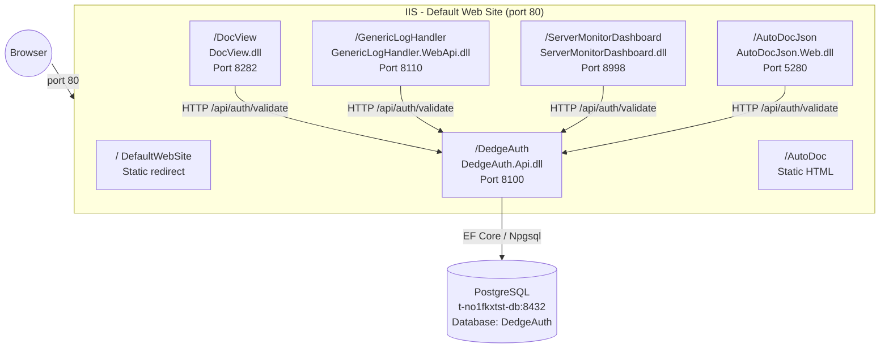

---

## Solution Structure

| Project | Type | Purpose |
|---|---|---|
| `DedgeAuth.Core` | Class library | Models (`User`, `App`, `Tenant`, `UserVisit`, etc.), enums, no dependencies |
| `DedgeAuth.Data` | Class library | `AuthDbContext`, EF Core migrations, depends on Core |
| `DedgeAuth.Services` | Class library | `AuthService`, `JwtTokenService`, `DatabaseSeeder`, depends on Core + Data |
| `DedgeAuth.Api` | ASP.NET Core API | Controllers, wwwroot (login/admin UI, JS/CSS), depends on all above |
| `DedgeAuth.Client` | Class library | Middleware, proxy endpoints, `AddDedgeAuth()` extension. **Referenced by all consumer apps** |

```
DedgeAuth.sln
├── src/DedgeAuth.Core/         → Models, enums
├── src/DedgeAuth.Data/         → AuthDbContext, Migrations/
├── src/DedgeAuth.Services/     → AuthService, JwtTokenService, DatabaseSeeder
├── src/DedgeAuth.Api/          → Controllers/, wwwroot/, Program.cs
└── src/DedgeAuth.Client/       → Middleware/, Endpoints/, Extensions/, Options/
```

---

## Authentication Flow

### Full Auth Flow (first visit)

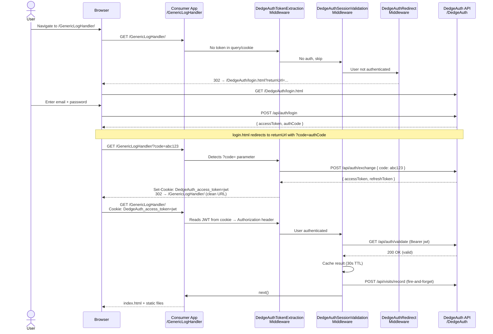

### Subsequent visits (cached session)

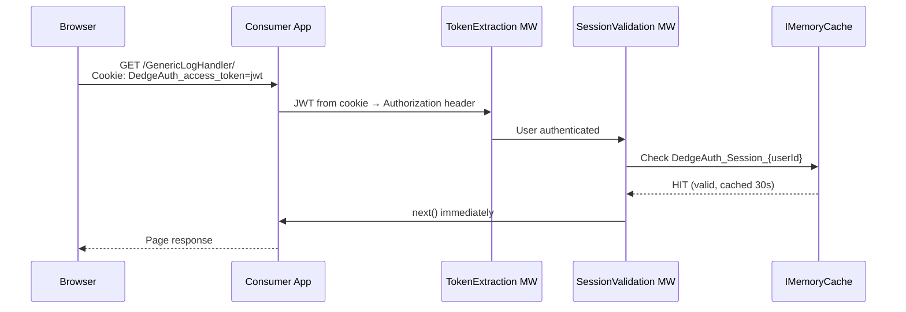

---

## Consumer App Integration

### How consumer apps reference DedgeAuth.Client

Each consumer app adds a **project reference** to `DedgeAuth.Client`:

```xml
<!-- In consumer app .csproj -->
<ProjectReference Include="..\..\DedgeAuth\src\DedgeAuth.Client\DedgeAuth.Client.csproj" />
```

### Registration in Program.cs

All consumer apps follow this pattern:

```csharp
// 1. Register DedgeAuth services (reads from appsettings.json "DedgeAuth" section)
builder.Services.AddDedgeAuth(builder.Configuration);

// ... other services ...

var app = builder.Build();

// 2. Add DedgeAuth middleware pipeline
app.UseDedgeAuth();          // TokenExtraction → SessionValidation → Redirect

// 3. Map proxy endpoints
app.MapDedgeAuthProxy();     // /api/DedgeAuth/me, /api/DedgeAuth/ui/{path}, /api/DedgeAuth/logout
```

### Consumer appsettings.json (DedgeAuth section)

```json
{
  "DedgeAuth": {
    "Enabled": true,
    "AuthServerUrl": "http://dedge-server/DedgeAuth",
    "AppId": "GenericLogHandler",
    "JwtSecret": "<shared-secret>",
    "JwtIssuer": "DedgeAuth",
    "JwtAudience": "FKApps",
    "SessionValidationCacheTtlSeconds": 30
  }
}
```

### Middleware Pipeline Order

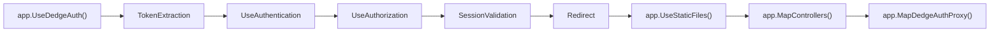

| Order | Middleware | Purpose |
|---|---|---|
| 1 | `DedgeAuthTokenExtractionMiddleware` | Extracts JWT from `?code=`, `?token=`, or cookie → sets `Authorization` header |
| 2 | `UseAuthentication` / `UseAuthorization` | Standard ASP.NET Core JWT validation |
| 3 | `DedgeAuthSessionValidationMiddleware` | Server-side session check with DedgeAuth `/api/auth/validate`, caches result |
| 4 | `DedgeAuthRedirectMiddleware` | Redirects unauthenticated users to `/DedgeAuth/login.html?returnUrl=...` |

### DedgeAuthOptions (all properties)

| Property | Type | Default | Purpose |
|---|---|---|---|
| `Enabled` | `bool` | `true` | Master switch — when `false`, allows all requests |
| `AuthServerUrl` | `string` | `http://localhost:8100` | DedgeAuth API base URL |
| `JwtSecret` | `string` | `""` | Shared JWT signing key |
| `JwtIssuer` | `string` | `"DedgeAuth"` | JWT issuer claim |
| `JwtAudience` | `string` | `"FKApps"` | JWT audience claim |
| `AppId` | `string` | `""` | Consumer app's registered ID (e.g. `"DocView"`) |
| `SessionValidationCacheTtlSeconds` | `int` | `30` | Cache duration for session validation |
| `ProxyRoutePrefix` | `string` | `"/api/DedgeAuth"` | Route prefix for proxy endpoints |
| `SkipPathPrefixes` | `string[]` | `["/api/", "/scalar", "/health"]` | Paths that bypass auth |
| `LoginPath` | `string` | `"/login"` | Fallback login path |
| `AccessTokenCookieName` | `string?` | `null` | Cookie name for storing access token |

---

## UI Asset Proxy

Consumer apps load DedgeAuth CSS/JS through a **local proxy** — no hardcoded server URLs in HTML:

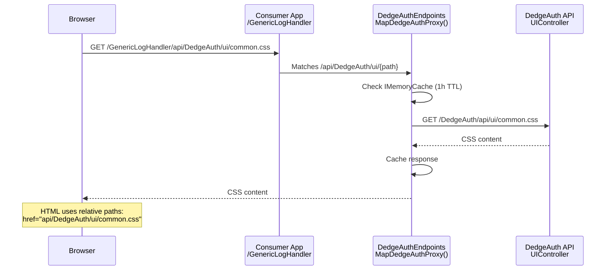

### Proxy endpoints registered by `MapDedgeAuthProxy()`

| Endpoint | Method | Purpose |
|---|---|---|
| `{prefix}/me` | GET | Returns user info, permissions, tenant, app routing |
| `{prefix}/logout` | POST | Revokes tokens, returns login redirect URL |
| `{prefix}/ui/{path}` | GET | Proxies CSS/JS assets from DedgeAuth server (cached 1h) |

### Whitelisted UI assets

| Asset | Path | Content |
|---|---|---|
| `common.css` | `api/DedgeAuth/ui/common.css` | Shared FK theme styles |
| `user.css` | `api/DedgeAuth/ui/user.css` | User menu dropdown styles |
| `user.js` | `api/DedgeAuth/ui/user.js` | User menu + app switcher component |
| `theme.js` | `api/DedgeAuth/ui/theme.js` | Dark/light theme toggle |

---

## DedgeAuth User Menu (DedgeAuth-user.js)

Served from DedgeAuth API, loaded by all consumer apps via proxy. Changes propagate to all apps without rebuilding them.

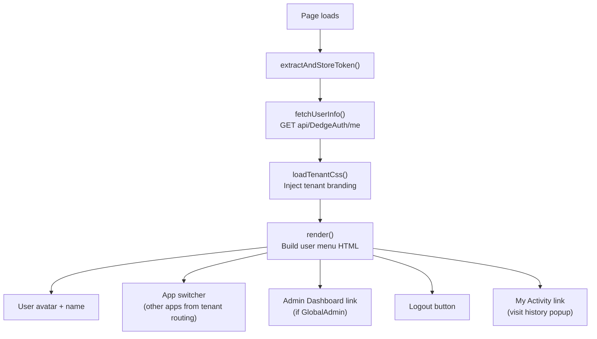

### Tenant CSS injection flow

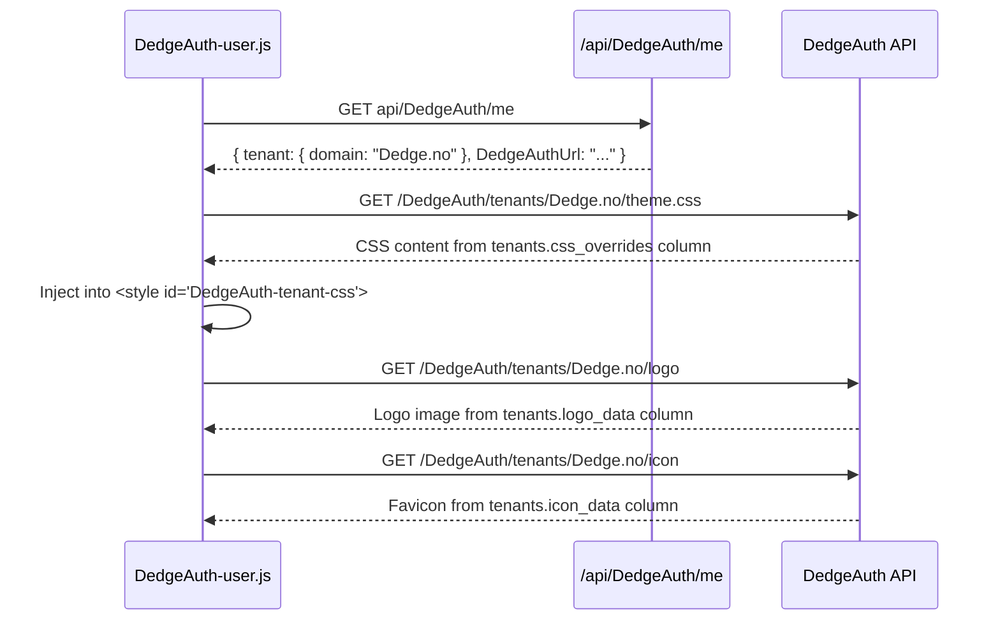

---

## User Visit Tracking

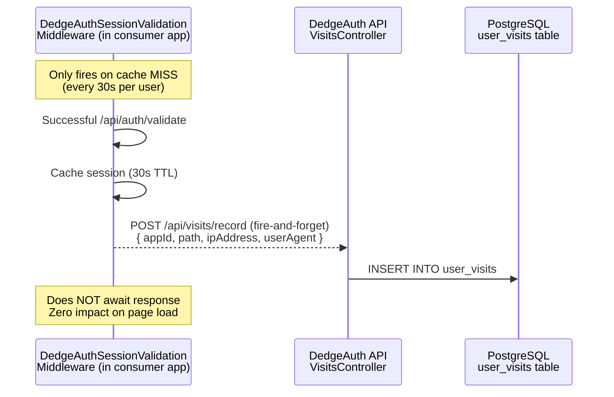

---

## Build & Publish

### Source locations and repos

| App | Source Path | Solution / Project | Branch |
|---|---|---|---|
| DedgeAuth | `C:\opt\src\DedgeAuth` | `DedgeAuth.sln` | `main` |
| DocView | `C:\opt\src\DocView` | `DocView.sln` | `main` |
| GenericLogHandler | `C:\opt\src\GenericLogHandler` | `GenericLogHandler.sln` | `feature/auth-extraction` |
| ServerMonitorDashboard | `C:\opt\src\ServerMonitor` | `ServerMonitor.sln` | `feature/auth-extraction` |
| AutoDocJson | `C:\opt\src\AutoDocJson` | `AutoDocJson.sln` | `main` |

### Build all apps at once

```powershell
# Build DedgeAuth first, then all consumer apps that reference DedgeAuth.Client
pwsh.exe -NoProfile -File "C:\opt\src\DedgeAuth\Build-And-Publish-ALL.ps1"

# Dry run — show what would be built
pwsh.exe -NoProfile -File "C:\opt\src\DedgeAuth\Build-And-Publish-ALL.ps1" -DryRun

# Skip DedgeAuth, only rebuild consumer apps
pwsh.exe -NoProfile -File "C:\opt\src\DedgeAuth\Build-And-Publish-ALL.ps1" -SkipDedgeAuth
```

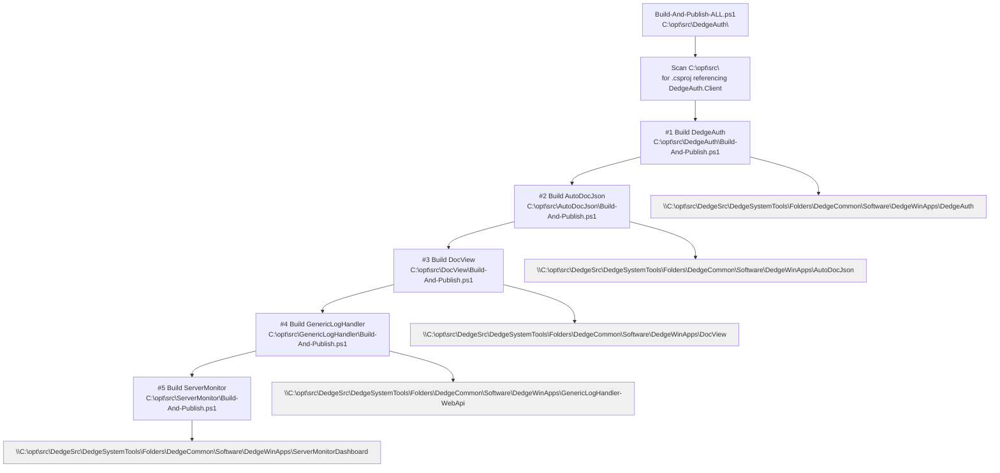

### Build each app individually

```powershell
# DedgeAuth (auth server) — version bump + publish + deploy scripts
pwsh.exe -NoProfile -File "C:\opt\src\DedgeAuth\Build-And-Publish.ps1"
pwsh.exe -NoProfile -File "C:\opt\src\DedgeAuth\Build-And-Publish.ps1" -VersionPart Minor

# DocView
pwsh.exe -NoProfile -File "C:\opt\src\DocView\Build-And-Publish.ps1"

# GenericLogHandler (publishes WebApi + AlertAgent + ImportService)
pwsh.exe -NoProfile -File "C:\opt\src\GenericLogHandler\Build-And-Publish.ps1"

# ServerMonitorDashboard (publishes Agent + TrayIcon + Dashboard)
pwsh.exe -NoProfile -File "C:\opt\src\ServerMonitor\Build-And-Publish.ps1"

# AutoDocJson
pwsh.exe -NoProfile -File "C:\opt\src\AutoDocJson\Build-And-Publish.ps1"
```

### What each Build-And-Publish.ps1 does

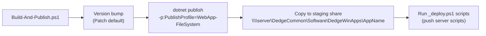

### Publish profile (all apps use FileSystem)

All apps use `WebApp-FileSystem.pubxml`:

```xml
<PublishProvider>FileSystem</PublishProvider>
<PublishUrl>C:\opt\src\DedgeSrc\DedgeSystemTools\Folders\DedgeCommon\Software\DedgeWinApps\DedgeAuth</PublishUrl>
<TargetFramework>net10.0</TargetFramework>
<RuntimeIdentifier>win-x64</RuntimeIdentifier>
<SelfContained>false</SelfContained>
```

### Staging vs IIS install paths

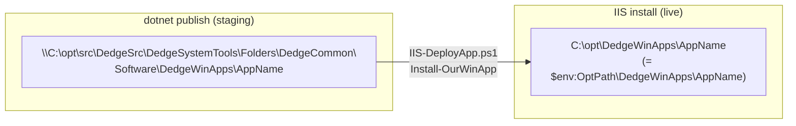

| App | Staging (Publish) Folder | IIS Install Path |
|---|---|---|
| DedgeAuth | `DedgeWinApps\DedgeAuth` | `$env:OptPath\DedgeWinApps\DedgeAuth` |
| DocView | `DedgeWinApps\DocView` | `$env:OptPath\DedgeWinApps\DocView` |
| GenericLogHandler | `DedgeWinApps\GenericLogHandler-WebApi` | `$env:OptPath\DedgeWinApps\GenericLogHandler-WebApi` |
| ServerMonitorDashboard | `DedgeWinApps\ServerMonitorDashboard` | `$env:OptPath\DedgeWinApps\ServerMonitorDashboard` |
| AutoDocJson | `DedgeWinApps\AutoDocJson` | `$env:OptPath\DedgeWinApps\AutoDocJson` |
| AutoDoc | (pre-existing content) | `$env:OptPath\Webs\AutoDoc` |

---

## IIS Deployment (IIS-DeployApp System)

All IIS deployment is managed by the generic **IIS-DeployApp** system in:

```
C:\opt\src\DedgePsh\DevTools\WebSites\IIS-DeployApp\
├── IIS-DeployApp.ps1          → Deploy one app from template
├── IIS-UninstallApp.ps1       → Remove one app
├── IIS-RedeployAll.ps1        → Full teardown + iisreset + rebuild all
├── Test-IISSite.ps1           → Diagnostics and health checks
├── _deploy.ps1                → Push scripts/templates to servers
└── templates/
    ├── DefaultWebSite_None.deploy.json
    ├── DedgeAuth_WinApp.deploy.json
    ├── DocView_WinApp.deploy.json
    ├── GenericLogHandler_WinApp.deploy.json
    ├── ServerMonitorDashboard_WinApp.deploy.json
    ├── AutoDocJson_WinApp.deploy.json
    └── AutoDoc_None.deploy.json
```

### Deploy profile templates

Profile naming convention: `<SiteName>_<InstallSource>.deploy.json`

| Template | SiteName | AppType | InstallSource | DotNetDll | ApiPort | Health |
|---|---|---|---|---|---|---|
| `DefaultWebSite_None` | DefaultWebSite | Static | None | — | — | — |
| `DedgeAuth_WinApp` | DedgeAuth | AspNetCore | WinApp | `DedgeAuth.Api.dll` | 8100 | `/health` |
| `DocView_WinApp` | DocView | AspNetCore | WinApp | `DocView.dll` | 8282 | — |
| `GenericLogHandler_WinApp` | GenericLogHandler | AspNetCore | WinApp | `GenericLogHandler.WebApi.dll` | 8110 | `/health` |
| `ServerMonitorDashboard_WinApp` | ServerMonitorDashboard | AspNetCore | WinApp | `ServerMonitorDashboard.dll` | 8998 | `/api/IsAlive` |
| `AutoDocJson_WinApp` | AutoDocJson | AspNetCore | WinApp | `AutoDocJson.Web.dll` | 5280 | `/health` |
| `AutoDoc_None` | AutoDoc | Static | None | — | — | — |

### IIS architecture

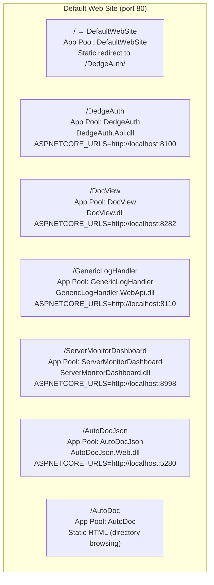

### Deploy steps (IIS-DeployApp.ps1)

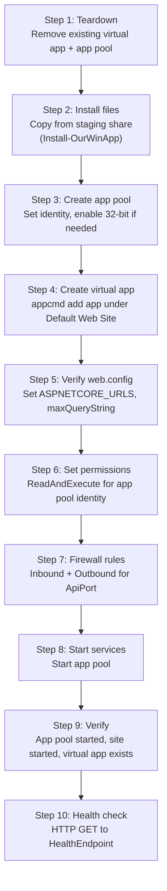

---

## Deploy Commands

### Deploy all apps to local IIS (full rebuild)

```powershell
# 1. Build and publish all apps to staging share
pwsh.exe -NoProfile -File "C:\opt\src\DedgeAuth\Build-And-Publish-ALL.ps1"

# 2. Redeploy all apps from staging to local IIS
pwsh.exe -NoProfile -File "C:\opt\src\DedgePsh\DevTools\WebSites\IIS-DeployApp\IIS-RedeployAll.ps1"

# 3. Verify with screenshots + email + SMS
pwsh.exe -NoProfile -File "C:\opt\src\GrabScreenShot\Invoke-GrabScreenShot.ps1"
```

### Deploy a single app to local IIS

```powershell
# Deploy DedgeAuth only
pwsh.exe -NoProfile -File "C:\opt\src\DedgePsh\DevTools\WebSites\IIS-DeployApp\IIS-DeployApp.ps1" -SiteName DedgeAuth

# Deploy DocView only
pwsh.exe -NoProfile -File "C:\opt\src\DedgePsh\DevTools\WebSites\IIS-DeployApp\IIS-DeployApp.ps1" -SiteName DocView

# Deploy GenericLogHandler only
pwsh.exe -NoProfile -File "C:\opt\src\DedgePsh\DevTools\WebSites\IIS-DeployApp\IIS-DeployApp.ps1" -SiteName GenericLogHandler

# Deploy ServerMonitorDashboard only
pwsh.exe -NoProfile -File "C:\opt\src\DedgePsh\DevTools\WebSites\IIS-DeployApp\IIS-DeployApp.ps1" -SiteName ServerMonitorDashboard

# Deploy AutoDocJson only
pwsh.exe -NoProfile -File "C:\opt\src\DedgePsh\DevTools\WebSites\IIS-DeployApp\IIS-DeployApp.ps1" -SiteName AutoDocJson

# Deploy AutoDoc (static site)
pwsh.exe -NoProfile -File "C:\opt\src\DedgePsh\DevTools\WebSites\IIS-DeployApp\IIS-DeployApp.ps1" -SiteName AutoDoc
```

Each command auto-loads the matching `.deploy.json` template from the `templates/` folder.

### Uninstall a single app from IIS

```powershell
# Uninstall DedgeAuth (removes virtual app + app pool + firewall rules)
pwsh.exe -NoProfile -File "C:\opt\src\DedgePsh\DevTools\WebSites\IIS-DeployApp\IIS-UninstallApp.ps1" -SiteName DedgeAuth

# Uninstall DocView
pwsh.exe -NoProfile -File "C:\opt\src\DedgePsh\DevTools\WebSites\IIS-DeployApp\IIS-UninstallApp.ps1" -SiteName DocView

# Uninstall GenericLogHandler
pwsh.exe -NoProfile -File "C:\opt\src\DedgePsh\DevTools\WebSites\IIS-DeployApp\IIS-UninstallApp.ps1" -SiteName GenericLogHandler

# Uninstall ServerMonitorDashboard
pwsh.exe -NoProfile -File "C:\opt\src\DedgePsh\DevTools\WebSites\IIS-DeployApp\IIS-UninstallApp.ps1" -SiteName ServerMonitorDashboard

# Uninstall AutoDocJson
pwsh.exe -NoProfile -File "C:\opt\src\DedgePsh\DevTools\WebSites\IIS-DeployApp\IIS-UninstallApp.ps1" -SiteName AutoDocJson

# Uninstall AutoDoc
pwsh.exe -NoProfile -File "C:\opt\src\DedgePsh\DevTools\WebSites\IIS-DeployApp\IIS-UninstallApp.ps1" -SiteName AutoDoc
```

### Uninstall and redeploy all apps (nuclear option)

```powershell
# Full teardown → iisreset → redeploy all from templates
pwsh.exe -NoProfile -File "C:\opt\src\DedgePsh\DevTools\WebSites\IIS-DeployApp\IIS-RedeployAll.ps1"
```

**`IIS-RedeployAll.ps1` performs these phases:**

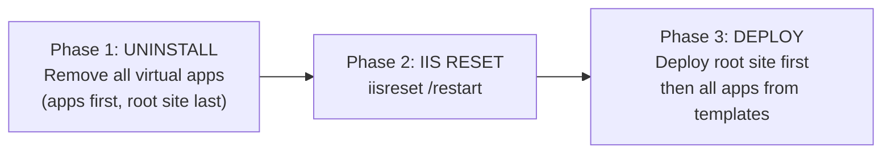

### Diagnose a broken app

```powershell
# Run diagnostics on a specific app
pwsh.exe -NoProfile -File "C:\opt\src\DedgePsh\DevTools\WebSites\IIS-DeployApp\Test-IISSite.ps1" -SiteName DedgeAuth
pwsh.exe -NoProfile -File "C:\opt\src\DedgePsh\DevTools\WebSites\IIS-DeployApp\Test-IISSite.ps1" -SiteName GenericLogHandler
```

`Test-IISSite.ps1` checks: IIS configuration, web.config, app pool state, event log errors, HTTP health endpoint.

---

## How Everything Connects (end-to-end)

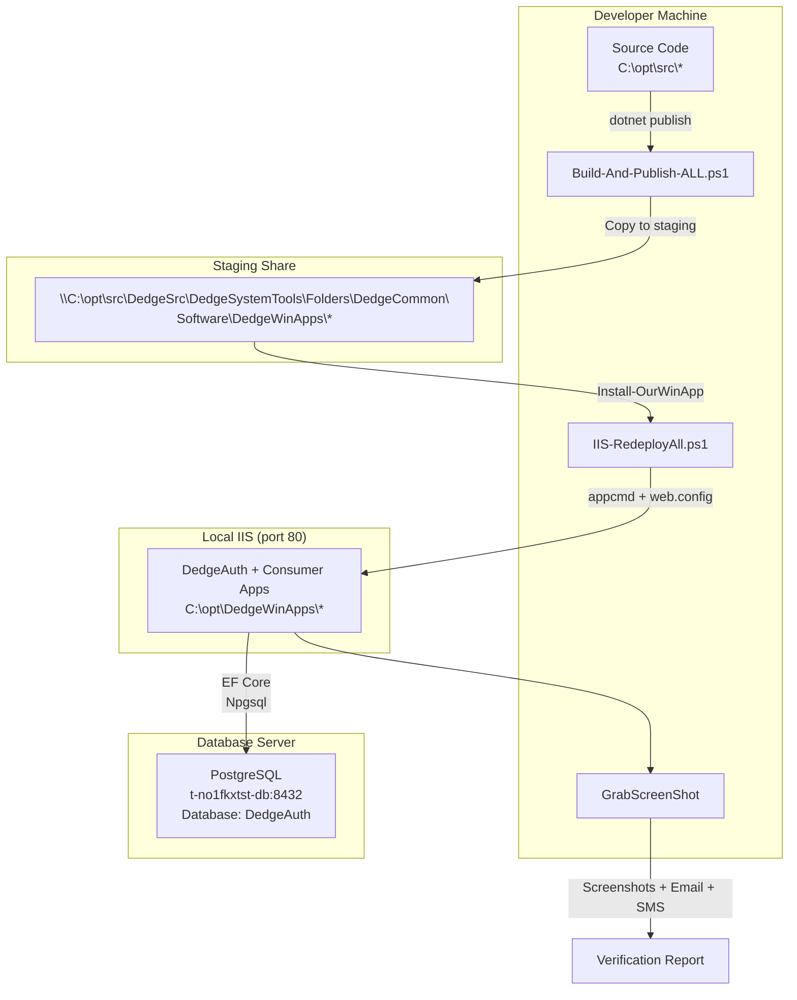

### Full deploy sequence

```powershell
# Step 1: Build and publish all apps to staging
pwsh.exe -NoProfile -File "C:\opt\src\DedgeAuth\Build-And-Publish-ALL.ps1"

# Step 2: Deploy from staging to local IIS (teardown + iisreset + rebuild)
pwsh.exe -NoProfile -File "C:\opt\src\DedgePsh\DevTools\WebSites\IIS-DeployApp\IIS-RedeployAll.ps1"

# Step 3: Visual verification with screenshots, email, and SMS
pwsh.exe -NoProfile -File "C:\opt\src\GrabScreenShot\Invoke-GrabScreenShot.ps1"
```

---

## Database

| Detail | Value |
|---|---|
| Server | `t-no1fkxtst-db` |
| Port | `8432` |
| Database | `DedgeAuth` |
| Credentials | `postgres` / `postgres` |

### Key tables

| Table | Purpose | Used by |
|---|---|---|
| `users` | User accounts (email, password hash, access level) | DedgeAuth.Api |
| `apps` | Registered consumer apps (AppId, base_url, available_roles) | DedgeAuth.Api, admin UI |
| `app_permissions` | Per-user per-app role assignments | DedgeAuth.Api, consumer apps |
| `tenants` | Tenant config (domain, CSS, logo, icon, app_routing) | DedgeAuth.Api, all apps via proxy |
| `login_tokens` | Magic link tokens, password reset | DedgeAuth.Api |
| `refresh_tokens` | JWT refresh tokens | DedgeAuth.Api |
| `user_visits` | User visit history (appId, path, IP, timestamp) | DedgeAuth.Api, admin UI |

### Database setup scripts

```powershell
# Create/update PostgreSQL database and roles
pwsh.exe -NoProfile -File "C:\opt\src\DedgePsh\DevTools\WebSites\DedgeAuth\DedgeAuth-DatabaseSetup\DedgeAuth-DatabaseSetup.ps1"

# Register apps: For consumer apps, IIS-DeployApp registers from deploy template DedgeAuth block when you deploy.
# Legacy: DedgeAuth-AddAppSupport.ps1 wizard (interactive) — rarely needed; prefer adding DedgeAuth block to template
```

---

## Log Files

### Application logs (Serilog)

| Access method | Path |
|---|---|
| UNC | `C:\opt\src\DedgeSrc\DedgeSystemTools\Folders\Opt\data\DedgeAuth\Logs\DedgeAuth-YYYYMMDD.log` |
| Local | `$env:OptPath\data\DedgeAuth\Logs\DedgeAuth-YYYYMMDD.log` |
| API | `GET /api/debug/logfile` (GlobalAdmin JWT required) |

### IIS-DeployApp logs

| Access method | Path |
|---|---|
| UNC | `C:\opt\src\DedgeSrc\DedgeSystemTools\Folders\Opt\data\IIS-DeployApp\FkLog_YYYYMMDD.log` |
| Local | `$env:OptPath\data\IIS-DeployApp\FkLog_YYYYMMDD.log` |

---

## DedgeAuth API Endpoints (key routes)

| Route | Method | Purpose |
|---|---|---|
| `/api/auth/login` | POST | Password authentication → JWT + auth code |
| `/api/auth/exchange` | POST | Exchange auth code for JWT (server-to-server) |
| `/api/auth/validate` | GET | Validate current session |
| `/api/auth/refresh` | POST | Refresh access token |
| `/api/auth/logout` | POST | Revoke all user tokens |
| `/api/auth/me` | GET | Get authenticated user info |
| `/api/ui/common.css` | GET | FK theme CSS (cached 1h) |
| `/api/ui/user.js` | GET | User menu JS component (cached 1h) |
| `/api/ui/user.css` | GET | User menu CSS (cached 1h) |
| `/api/ui/theme.js` | GET | Theme toggle JS (cached 1h) |
| `/api/visits/record` | POST | Record a user visit (from middleware) |
| `/api/visits/latest` | GET | Latest visits across all users (GlobalAdmin) |
| `/api/visits/user/{id}` | GET | Visit history for one user (GlobalAdmin) |
| `/api/visits/my` | GET | Current user's own visit history |
| `/tenants/{domain}/theme.css` | GET | Tenant CSS overrides |
| `/tenants/{domain}/logo` | GET | Tenant logo image |
| `/tenants/{domain}/icon` | GET | Tenant favicon/icon |
| `/health` | GET | Health check endpoint |
| `/scalar/v1` | GET | API documentation (Scalar) |

---

## Critical Evaluation

An honest assessment of the current implementation covering architecture, functionality, security, and tenant isolation. Findings are based on source code analysis of `DedgeAuth.Api/Program.cs`, `AuthService.cs`, `JwtTokenService.cs`, middleware, and the reports in `docs/Local-Setup-Execution-Report.md`, `docs/CSS-Architecture.md`, and `docs/teams-app-integration.md`.

### Architecture Assessment

**Strengths:**

| Area | Assessment |
|---|---|
| Separation of concerns | Clean 5-project split (Core, Data, Services, Api, Client) with correct dependency direction |
| Client library pattern | Consumer apps integrate with 3 lines of code; middleware pipeline is encapsulated and order-safe |
| Server portability | `AuthServerUrl` uses `http://localhost/DedgeAuth` with dynamic URL derivation — no hardcoded hostnames in runtime code |
| UI asset proxy | CSS/JS served through local proxy with 1-hour cache — consumer apps never reference server URLs directly |
| Auth code exchange | Server-to-server code exchange prevents JWT exposure in browser URL bar and history |
| Visit tracking | Fire-and-forget pattern with cache-gated deduplication — zero impact on page load latency |
| IIS deployment | Fully automated 10-step process with JSON templates, health checks, and rollback via teardown/rebuild |
| Build pipeline | `Build-And-Publish-ALL.ps1` auto-discovers consumer apps via `.csproj` scanning — no hardcoded app list |

**Weaknesses:**

| Area | Issue | Impact |
|---|---|---|
| Single database | All apps share one PostgreSQL database with one connection pool | Single point of failure; no per-app isolation |
| Shared JWT secret | All consumer apps and DedgeAuth share the same signing key in `appsettings.json` | Compromise of any app's config exposes the entire ecosystem |
| No API versioning | Endpoints are unversioned (`/api/auth/login`, not `/api/v1/auth/login`) | Breaking changes require simultaneous deployment of all apps |
| Project references | Consumer apps use `<ProjectReference>` to DedgeAuth.Client, not NuGet | All apps must be on the same machine; version coupling is implicit |
| In-process hosting | All apps run in-process via `AspNetCoreModuleV2` in shared IIS | One app crash can affect the IIS worker process |
| No async message bus | Visit recording uses synchronous HTTP POST (fire-and-forget) | If DedgeAuth API is down, visits are silently lost |

### Security Assessment

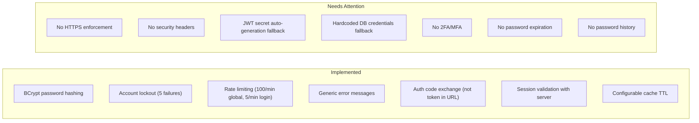

**What is done well:**

- **Password hashing**: BCrypt with proper work factor via `BCrypt.Net-Next`
- **Account lockout**: After 5 failed login attempts, accounts are locked for a configurable duration. Lockout is checked before password verification (timing-safe)
- **Rate limiting**: Global rate limit (100 requests/min per user/IP) and a stricter login endpoint limit (5/min per IP) via `System.Threading.RateLimiting`
- **Generic error messages**: Login failures return "Invalid email or password" regardless of whether the email exists — no user enumeration
- **Magic link privacy**: Requesting a magic link for a non-existent email returns success (doesn't reveal if the email is registered)
- **Session validation**: Consumer apps validate sessions with the DedgeAuth server on every cache miss, ensuring revoked tokens are caught within `SessionValidationCacheTtlSeconds` (default 30s)
- **Standalone mode**: `Enabled: false` provides a clean fallback that doesn't leave broken auth state

**What needs attention:**

| Issue | Severity | Detail |
|---|---|---|
| **No HTTPS enforcement** | HIGH | DedgeAuth listens on `http://*:8100`. No `UseHttpsRedirection()` or HSTS middleware. Credentials and JWT tokens transmitted in plaintext over HTTP. IIS can terminate TLS, but the API itself doesn't enforce it. |
| **No security headers** | HIGH | Missing `Content-Security-Policy`, `X-Frame-Options`, `X-Content-Type-Options`, `Strict-Transport-Security`, `Referrer-Policy`. Login page is vulnerable to clickjacking and MIME sniffing. |
| **JWT secret auto-generation** | HIGH | If `JwtSecret` is missing from config, `Program.cs` generates a GUID-based secret at runtime. This means tokens are invalid after app restart and won't validate across multiple server instances. Should fail fast instead of silently generating a weak secret. |
| **Hardcoded DB credentials** | MEDIUM | Fallback connection string contains `Username=postgres;Password=postgres`. If config file is missing, the app connects with superuser credentials. |
| **No 2FA/MFA** | MEDIUM | Only password and magic link authentication. No TOTP, WebAuthn, or SMS verification. |
| **No password expiration** | LOW | No forced password rotation policy. Acceptable for internal tools but worth noting. |
| **No password history** | LOW | `SetPasswordAsync` doesn't check if the new password was previously used. |
| **No lockout notification** | LOW | Account lockout occurs silently — no email/SMS alert sent to the user or admin. |
| **Cookie security flags** | MEDIUM | The `DedgeAuth_access_token` cookie should explicitly set `Secure`, `HttpOnly`, and `SameSite=Strict` flags. Current implementation should be verified. |

### Tenant Isolation Assessment

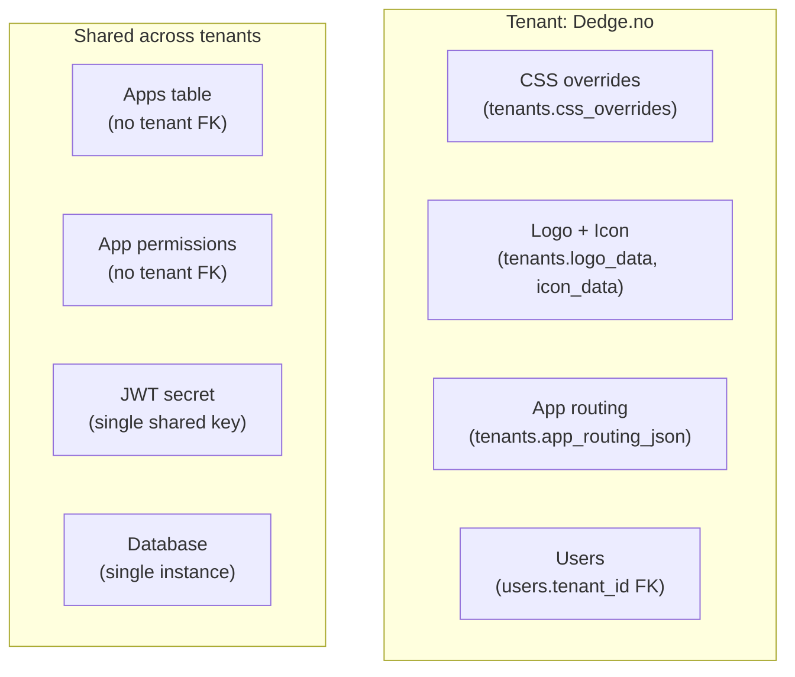

**Current tenant isolation model:**

| Layer | Isolation Level | Detail |
|---|---|---|
| **User accounts** | Tenant-scoped | Users are linked to tenants via `tenant_id` FK. Tenant is auto-resolved from email domain at registration. |
| **CSS/branding** | Tenant-scoped | Each tenant has its own `css_overrides`, `logo_data`, `icon_data`. Served via `/tenants/{domain}/` endpoints. |
| **App routing** | Tenant-scoped | Each tenant has its own `app_routing_json` controlling which apps appear in the user menu. |
| **App registration** | Global | The `apps` table has no `tenant_id` — all apps are visible to all tenants. |
| **App permissions** | Global | `app_permissions` links users to apps regardless of tenant. A user from tenant A can have permissions in the same apps as tenant B. |
| **API queries** | Partially scoped | Some queries filter by tenant (user listing in admin), but most API endpoints don't enforce tenant boundaries (e.g., a GlobalAdmin sees all users across all tenants). |
| **JWT claims** | Tenant-included | The JWT includes the user's tenant domain as a claim, but consumer apps don't enforce tenant-based data filtering — they rely on app-level permissions. |

**Gaps in tenant isolation:**

1. **No tenant-scoped app registration**: All registered apps are shared across tenants. If a tenant should only see certain apps, this must be controlled entirely through `app_routing_json` — there's no enforcement at the API level.

2. **No tenant-scoped admin**: The `GlobalAdmin` access level grants access to all tenants' data. There is no "TenantAdmin" role that restricts admin access to a single tenant's users.

3. **Cross-tenant user visibility**: The admin UI user list shows all users. A multi-tenant deployment would need tenant-scoped admin queries.

4. **CSS injection trust**: Tenant CSS is stored as raw CSS text in the database and injected into all consumer app pages via `<style>`. There is no sanitization — a malicious tenant admin could inject CSS that exfiltrates data via `background-image: url(...)` or visually spoofs other tenants.

5. **Single JWT signing key**: All tenants share the same JWT signing key. A per-tenant key would allow tenant-scoped token revocation.

**Assessment**: The current tenant model is appropriate for a **single-organization multi-department** deployment (e.g., Dedge with different departments). It is **not suitable** for a true multi-tenant SaaS where tenants are separate organizations with strict data isolation requirements.

### Operational Concerns

| Area | Current State | Risk |
|---|---|---|
| **Database backups** | Not configured in application layer | Data loss if PostgreSQL server fails without external backup |
| **Token cleanup** | No scheduled cleanup of expired `login_tokens`, `refresh_tokens` | Table growth over time; query performance degradation |
| **Visit history retention** | No retention policy for `user_visits` | Unbounded table growth (one row per user per app per 30s) |
| **Log rotation** | Serilog 31-day retention configured | Adequate for current scale |
| **Monitoring** | Health endpoints exist, `GrabScreenShot` for visual verification | No APM, no alerting on error rates or response times |
| **Disaster recovery** | No documented DR procedure | Full rebuild possible via `IIS-RedeployAll.ps1` + database restore, but not tested |
| **Secret rotation** | JWT secret is static in `appsettings.json` | Rotating the secret invalidates all active sessions across all apps simultaneously |

### Remediation Priority

**Immediate (before production):**

1. Remove JWT secret auto-generation fallback — fail fast if `JwtSecret` is not configured
2. Remove hardcoded database credentials fallback
3. Add security headers middleware (CSP, X-Frame-Options, X-Content-Type-Options, HSTS)
4. Verify cookie security flags (`Secure`, `HttpOnly`, `SameSite`)
5. Add HTTPS enforcement or document that IIS handles TLS termination

**Short-term:**

6. Add scheduled cleanup for expired `login_tokens` and `refresh_tokens`
7. Add retention policy for `user_visits` (e.g., 90-day rolling window)
8. Add tenant CSS sanitization (strip `url()`, `@import`, `expression()`)
9. Add account lockout notifications (email or SMS)
10. Add tenant-scoped admin role (`TenantAdmin`)

**Long-term:**

11. Implement 2FA/MFA (TOTP or WebAuthn)
12. Move secrets to a secure vault (Azure Key Vault, HashiCorp Vault)
13. Add API versioning for breaking change management
14. Consider NuGet packaging for `DedgeAuth.Client` instead of project references
15. Add per-tenant JWT signing keys for isolated token revocation
16. Add APM/monitoring integration (Application Insights, Prometheus)
