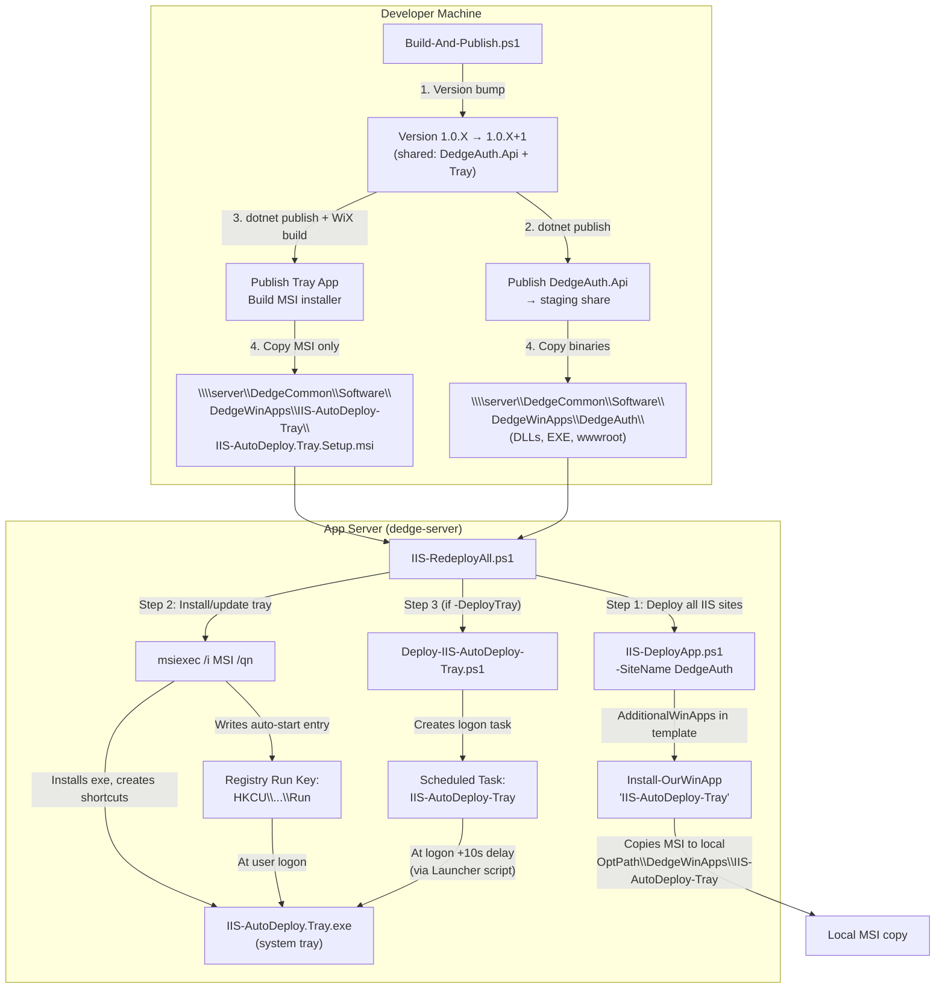
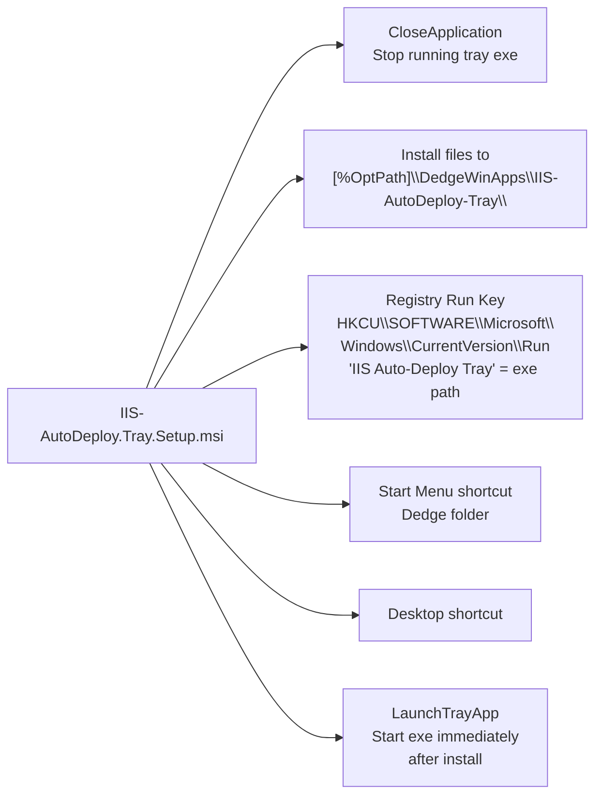
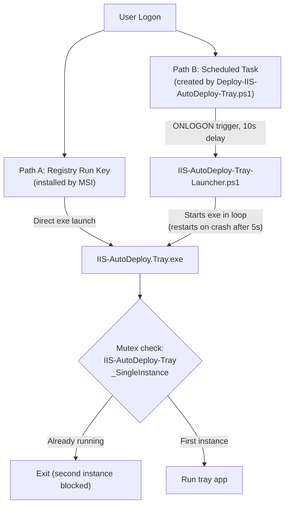
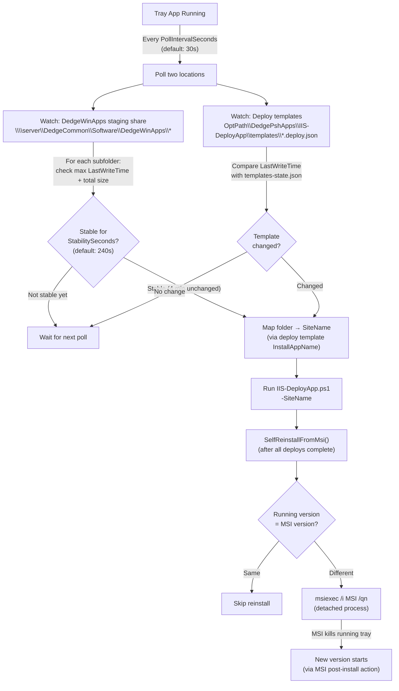
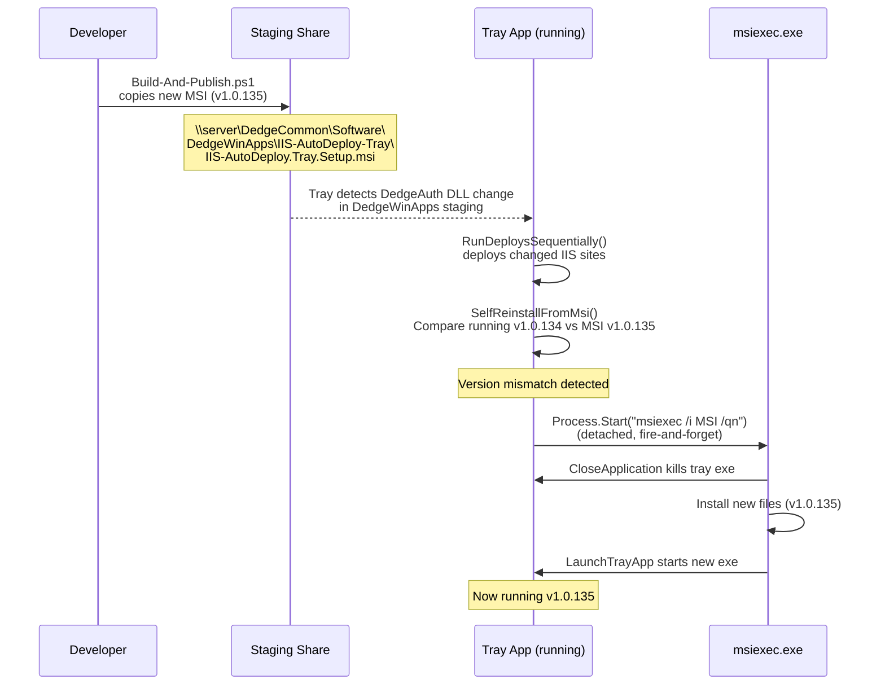
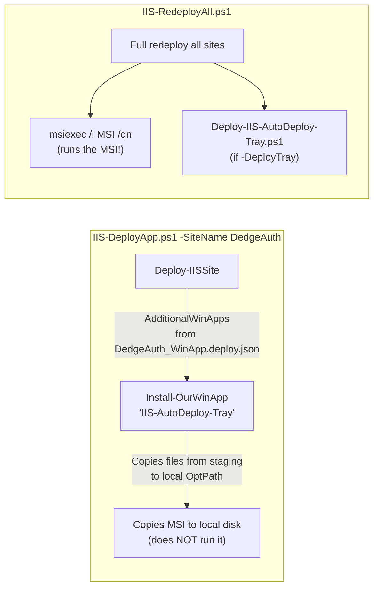
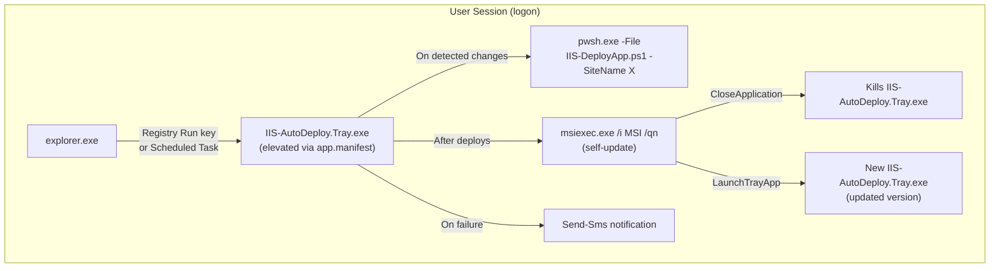

# IIS-AutoDeploy.Tray — Lifecycle & Architecture

## Overview

The IIS-AutoDeploy.Tray is a Windows Forms system tray application that monitors published app binaries and deploy templates for changes, then automatically triggers `IIS-DeployApp.ps1` to redeploy affected IIS sites. It also self-updates when a newer MSI is available.

---

## End-to-End Flow

---

## Installation: What the MSI Does

| Component | Details |
|---|---|
| **Install location** | `%OptPath%\DedgeWinApps\IIS-AutoDeploy-Tray\` |
| **Files** | `IIS-AutoDeploy.Tray.exe`, `appsettings.json`, `dedge.ico`, launcher/deploy scripts, DLLs |
| **Auto-start** | `HKCU\...\Run` registry key (starts at every user logon) |
| **Shortcuts** | Start Menu (Dedge folder) + Desktop |
| **Pre-install** | Kills running `IIS-AutoDeploy.Tray.exe` via WiX `CloseApplication` |
| **Post-install** | Launches the exe immediately |

---

## Two Startup Paths

| Path | Created by | Behavior |
|---|---|---|
| **Registry Run key** | MSI installer | Direct exe launch at logon |
| **Scheduled Task** | `Deploy-IIS-AutoDeploy-Tray.ps1` | 10s delay, uses launcher script that auto-restarts on crash |
| **Mutex** | Tray app itself | Only one instance runs regardless of how many startup paths trigger |

---

## Surveillance & Auto-Deploy

### Key details

| Setting | Default | Purpose |
|---|---|---|
| `PollIntervalSeconds` | 30 | How often to scan for changes |
| `StabilitySeconds` | 240 (4 min) | How long files must be unchanged before triggering deploy |
| `FilePattern` | `DedgeAuth*.dll` | Which files to monitor for changes |

---

## Self-Update Mechanism

### Three triggers for self-update

| Trigger | Method | When |
|---|---|---|
| **After deploys** | `SelfReinstallFromMsi()` | Automatically at end of every deploy batch |
| **Manual menu click** | `LaunchSelfUpdate()` | User clicks "Update Available" in tray menu |
| **Menu refresh** | `RefreshUpdateMenuState()` | Every ~5 minutes, updates the menu label to show version diff |

---

## Does IIS-DeployApp Update the Tray?

| Script | Updates tray? | How |
|---|---|---|
| `IIS-DeployApp.ps1 -SiteName DedgeAuth` | **Partially** — copies MSI to local disk only | Via `AdditionalWinApps` in the DedgeAuth deploy template; runs `Install-OurWinApp` which copies files but does NOT run the MSI |
| `IIS-RedeployAll.ps1` | **Yes** — runs the MSI silently | Explicitly calls `msiexec /i <msi> /qn` after deploying all sites |
| Tray app itself | **Yes** — self-updates | `SelfReinstallFromMsi()` runs after every deploy batch if MSI version is newer |

**Bottom line**: `IIS-DeployApp.ps1` only stages the MSI locally. The tray app updates itself via its own `SelfReinstallFromMsi()` or when `IIS-RedeployAll.ps1` explicitly runs the MSI.

---

## Process Hierarchy

---

## File Locations

| Item | Path |
|---|---|
| **Source code** | `C:\opt\src\DedgeAuth\src\IIS-AutoDeploy.Tray\` |
| **WiX installer project** | `C:\opt\src\DedgeAuth\src\IIS-AutoDeploy.Tray.Installer\` |
| **Staging (MSI published here)** | `C:\opt\src\DedgeSrc\DedgeSystemTools\Folders\DedgeCommon\Software\DedgeWinApps\IIS-AutoDeploy-Tray\` |
| **Local install (from MSI)** | `%OptPath%\DedgeWinApps\IIS-AutoDeploy-Tray\` |
| **Settings** | `%OptPath%\DedgeWinApps\IIS-AutoDeploy-Tray\appsettings.json` |
| **Deploy script** | `%OptPath%\DedgePshApps\IIS-DeployApp\IIS-DeployApp.ps1` |
| **Deploy templates** | `%OptPath%\DedgePshApps\IIS-DeployApp\templates\*.deploy.json` |
