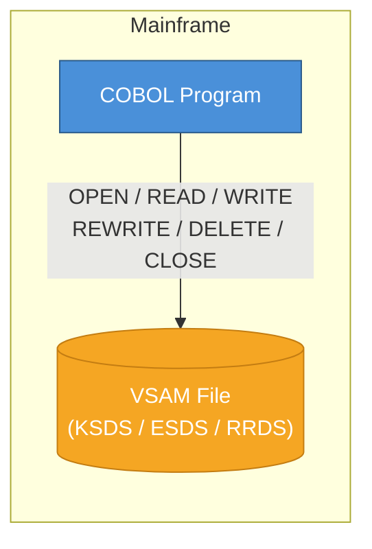
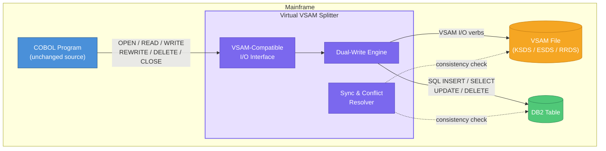
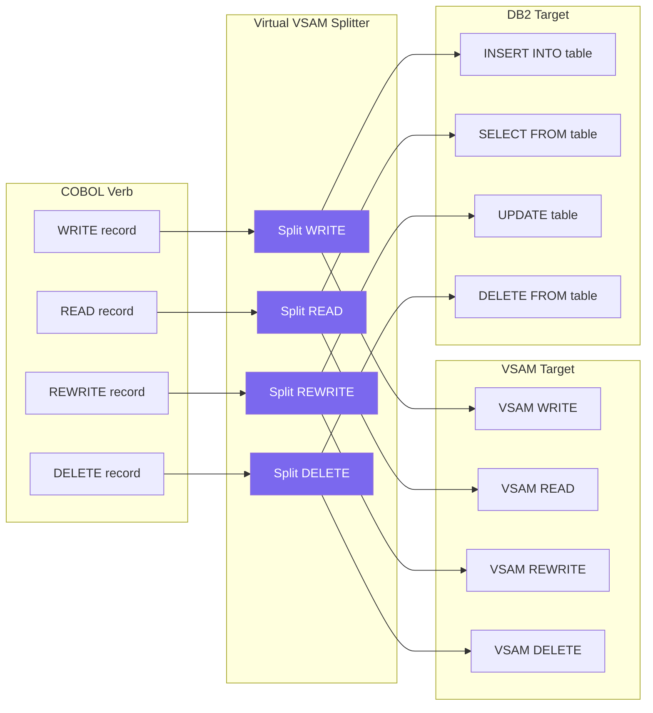
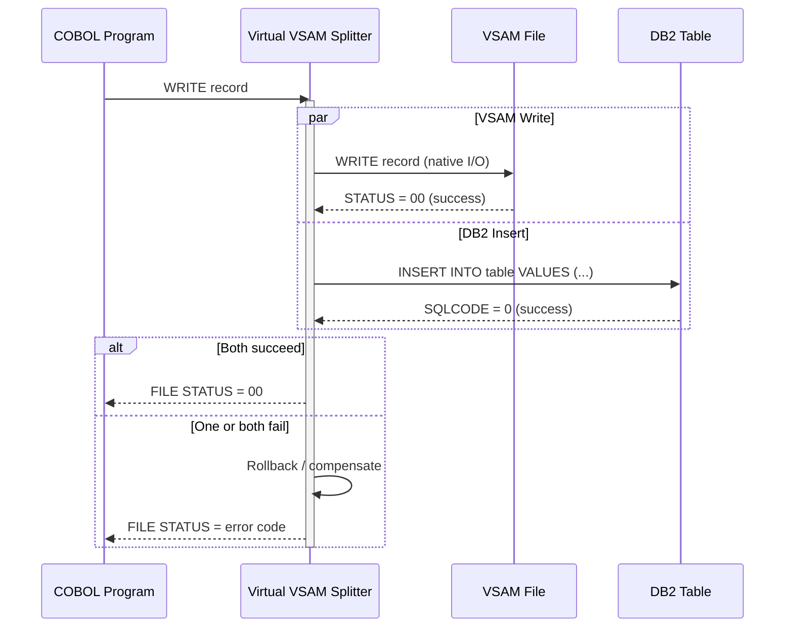
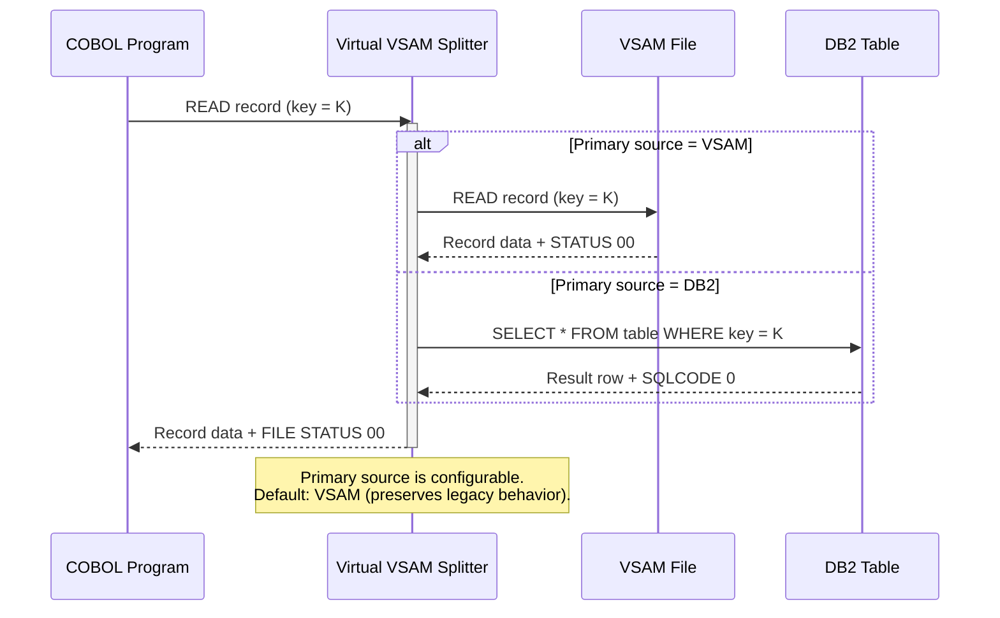
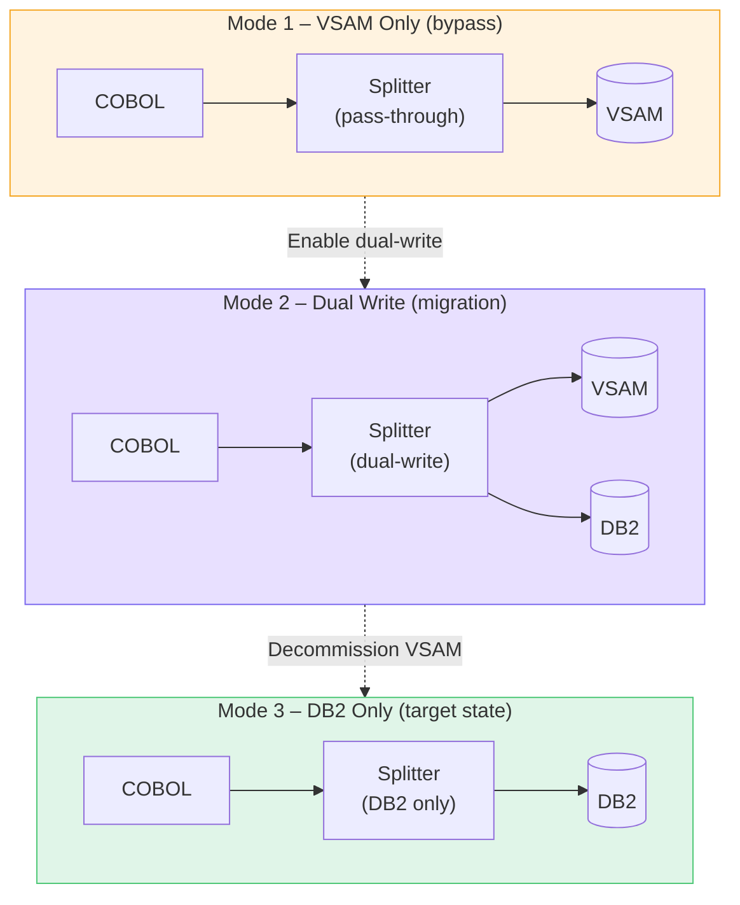

# Virtual VSAM Splitter – Dual-Target CRUD Architecture

## Overview

This document describes two architectural approaches for COBOL programs accessing data:

1. **Traditional** – COBOL program reads/writes a VSAM file directly.
2. **Virtual VSAM Splitter** – A transparent middleware layer that presents a standard VSAM interface to the COBOL program while simultaneously performing identical CRUD operations on both a VSAM file **and** a DB2 table.

The splitter allows development teams to migrate from VSAM to DB2 incrementally – or run both in parallel – without changing existing COBOL application code.

---

## 1. Traditional COBOL → VSAM



### CRUD Operations (Traditional)

| Operation | COBOL Verb       | VSAM Action            |
|-----------|------------------|------------------------|
| **C**reate | `WRITE`         | Insert record into VSAM dataset |
| **R**ead   | `READ` / `START` | Sequential or keyed read |
| **U**pdate | `REWRITE`       | Update record in place  |
| **D**elete | `DELETE`         | Logically remove record |

In this model the COBOL program owns the full I/O lifecycle. Any downstream system that needs the same data must read the VSAM file separately or receive a batch extract.

---

## 2. Virtual VSAM Splitter Architecture



### How It Works

1. **COBOL program** issues standard VSAM I/O verbs (`OPEN`, `READ`, `WRITE`, `REWRITE`, `DELETE`, `CLOSE`).
2. The **Virtual VSAM Splitter** intercepts these calls via the VSAM-Compatible I/O Interface. From the COBOL program's perspective, it is talking to a normal VSAM file.
3. The **Dual-Write Engine** translates each COBOL verb into two parallel operations:
   - Native VSAM I/O against the original dataset.
   - Equivalent SQL statement against the DB2 table.
4. The **Sync & Conflict Resolver** periodically validates that both targets remain consistent.

---

## 3. CRUD Mapping – Splitter Detail



| COBOL Verb | VSAM Operation | DB2 Equivalent | Notes |
|------------|---------------|----------------|-------|
| `WRITE`    | Insert record into dataset | `INSERT INTO table (cols) VALUES (...)` | Key mapped from VSAM record key |
| `READ`     | Keyed or sequential read   | `SELECT ... FROM table WHERE key = ?`   | Splitter can choose primary source |
| `REWRITE`  | Update record in place     | `UPDATE table SET ... WHERE key = ?`    | Must hold current record position |
| `DELETE`   | Logically remove record    | `DELETE FROM table WHERE key = ?`       | Cascading rules configurable |
| `START`    | Position cursor            | `SELECT ... WHERE key >= ? ORDER BY key`| Browse / range scan |
| `CLOSE`    | Close dataset              | `COMMIT` (if auto-commit off)           | Ensures DB2 transaction finality |

---

## 4. Sequence – Write Operation Through the Splitter



---

## 5. Sequence – Read Operation Through the Splitter



---

## 6. Deployment Modes

The splitter supports three runtime modes, allowing teams to migrate at their own pace:



| Mode | VSAM Active | DB2 Active | Use Case |
|------|:-----------:|:----------:|----------|
| **1 – VSAM Only** | Yes | No | Legacy baseline; splitter is transparent pass-through |
| **2 – Dual Write** | Yes | Yes | Migration period; both targets receive all CRUD ops |
| **3 – DB2 Only** | No | Yes | Target state; VSAM decommissioned, COBOL code unchanged |

---

## 7. Key Benefits

- **Zero COBOL code changes** – The program continues issuing standard VSAM I/O verbs.
- **Incremental migration** – Teams switch from Mode 1 → 2 → 3 at their own pace.
- **Parallel validation** – In Mode 2, data in VSAM and DB2 can be compared to verify correctness before cutting over.
- **Programmer choice** – Individual applications can independently choose VSAM, dual-write, or DB2-only via configuration, not code changes.
- **Rollback safety** – If DB2 issues arise, switch back to Mode 1 instantly.

---

## 8. Configuration Example (JCL / Splitter Config)

```text
* Virtual VSAM Splitter configuration
SPLITTER.MODE        = DUAL          * VSAM | DUAL | DB2
SPLITTER.PRIMARY.SRC = VSAM          * Primary read source: VSAM | DB2
SPLITTER.VSAM.DSN    = PROD.CUST.MASTER
SPLITTER.DB2.SUBSYS  = DB2P
SPLITTER.DB2.TABLE   = SCHEMA1.CUSTOMER
SPLITTER.DB2.COMMIT  = AUTO          * AUTO | MANUAL
SPLITTER.SYNC.CHECK  = ENABLED       * ENABLED | DISABLED
SPLITTER.SYNC.FREQ   = 1000          * Check consistency every N operations
```

The COBOL program's JCL `DD` statement points to the splitter rather than the raw VSAM dataset. The splitter reads its own configuration and routes I/O accordingly.
