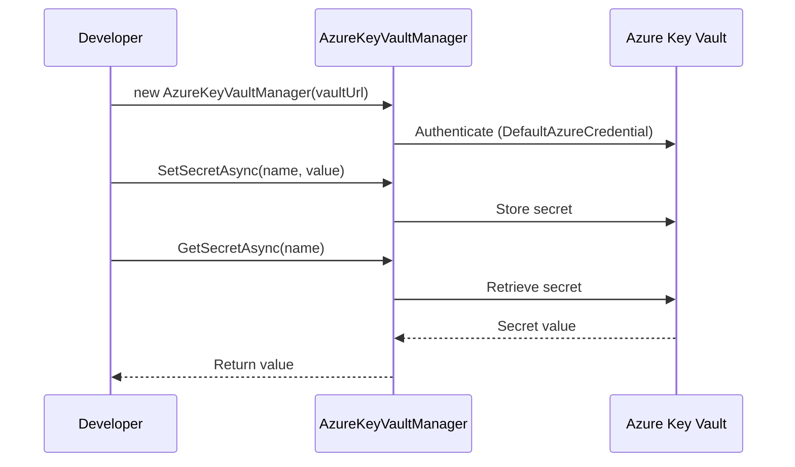
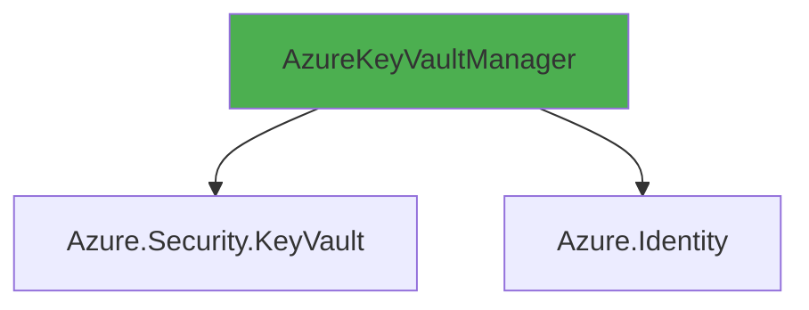

# AzureKeyVaultManager User Guide

**Class:** `DedgeCommon.AzureKeyVaultManager`  
**Version:** 1.5.22  
**Purpose:** Manage credentials in Azure Key Vault with CRUD operations

---

## 🎯 Quick Start

```csharp
using DedgeCommon;

var vault = new AzureKeyVaultManager("https://your-vault.vault.azure.net/");
await vault.SetSecretAsync("db-password", "MySecurePassword");
string password = await vault.GetSecretAsync("db-password");
```

---

## 📋 Common Usage Patterns

### Pattern 1: Store Credential
```csharp
var vault = new AzureKeyVaultManager();
await vault.SetSecretAsync("prod-db-password", "SecurePass123", 
    tags: new Dictionary<string, string> { ["Environment"] = "PRD" });
```

### Pattern 2: Retrieve Credential
```csharp
string password = await vault.GetSecretAsync("prod-db-password");
```

### Pattern 3: Search by Username
```csharp
var secrets = await vault.SearchSecretsByUsernameAsync("dbadmin");
foreach (var secret in secrets)
{
    Console.WriteLine($"Found: {secret.Name}");
}
```

---

## 🔄 Class Interactions

### Usage Flow


### Dependencies


---

## 📚 Key Members

### Methods
- **SetSecretAsync(name, value, tags)** - Store secret
- **GetSecretAsync(name)** - Retrieve secret
- **SearchSecretsByUsernameAsync(username)** - Search secrets
- **DeleteSecretAsync(name)** - Delete secret

---

**Last Updated:** 2025-12-16  
**Included in Package:** Yes
