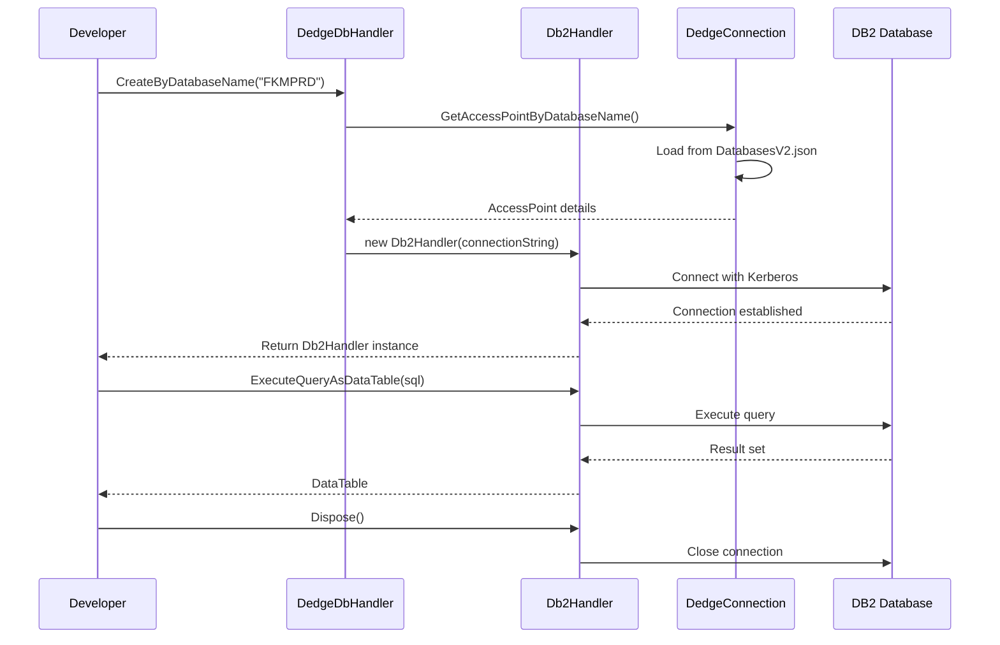
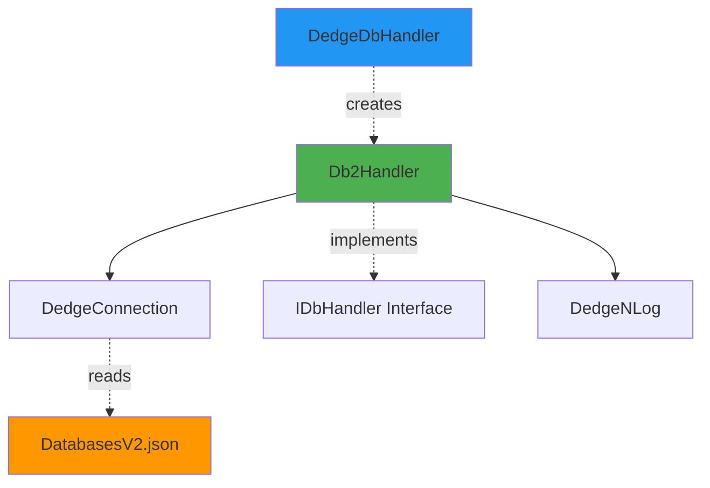

# Db2Handler User Guide

**Class:** `DedgeCommon.Db2Handler`  
**Version:** 1.5.21  
**Purpose:** IBM DB2 database operations with Kerberos/SSO authentication support

---

## 🎯 Quick Start

```csharp
using DedgeCommon;

var db = DedgeDbHandler.CreateByDatabaseName("FKMPRD");
var data = db.ExecuteQueryAsDataTable("SELECT * FROM SYSCAT.TABLES FETCH FIRST 5 ROWS ONLY");
Console.WriteLine($"Found {data.Rows.Count} tables");
```

---

## 📋 Common Usage Patterns

### Pattern 1: Query with Connection Key
```csharp
var connectionKey = new DedgeConnection.ConnectionKey("FKM", "PRD");
using var db = DedgeDbHandler.Create(connectionKey);

var query = "SELECT TABNAME, TYPE FROM SYSCAT.TABLES WHERE TABSCHEMA = 'SYSCAT'";
var data = db.ExecuteQueryAsDataTable(query);

foreach (DataRow row in data.Rows)
{
    Console.WriteLine($"{row["TABNAME"]}: {row["TYPE"]}");
}
```

### Pattern 2: Query by Database Name
```csharp
using var db = DedgeDbHandler.CreateByDatabaseName("BASISPRO");
var result = db.ExecuteQueryAsDataTable("SELECT COUNT(*) AS TableCount FROM SYSCAT.TABLES");
int count = Convert.ToInt32(result.Rows[0]["TableCount"]);
```

### Pattern 3: Execute Non-Query (INSERT/UPDATE/DELETE)
```csharp
using var db = DedgeDbHandler.CreateByDatabaseName("FKMPRD");
string sql = "UPDATE MY_TABLE SET STATUS = 'PROCESSED' WHERE ID = 12345";
int rowsAffected = db.ExecuteNonQuery(sql);
Console.WriteLine($"Updated {rowsAffected} rows");
```

### Pattern 4: Transactions
```csharp
using var db = DedgeDbHandler.CreateByDatabaseName("FKMPRD");
db.BeginTransaction();
try
{
    db.ExecuteNonQuery("INSERT INTO TABLE1 VALUES (1, 'Test')");
    db.ExecuteNonQuery("UPDATE TABLE2 SET FLAG = 1 WHERE ID = 1");
    db.CommitTransaction();
}
catch
{
    db.RollbackTransaction();
    throw;
}
```

---

## 🔄 Class Interactions

### Usage Flow


### Dependencies


---

## 💡 Complete Example - Backup Verification

```csharp
using DedgeCommon;
using System.Data;

// Connect to production database
using var db = DedgeDbHandler.CreateByDatabaseName("BASISPRO");

// Verify connection
Console.WriteLine($"Connected to: {db.GetDatabaseName()}");

// Check table count
var tableQuery = "SELECT COUNT(*) AS CNT FROM SYSCAT.TABLES WHERE TABSCHEMA NOT LIKE 'SYS%'";
var tableCount = db.ExecuteQueryAsDataTable(tableQuery);
Console.WriteLine($"User tables: {tableCount.Rows[0]["CNT"]}");

// Get table statistics
var statsQuery = @"
    SELECT TABSCHEMA, COUNT(*) AS TableCount, SUM(CARD) AS TotalRows
    FROM SYSCAT.TABLES 
    WHERE TABSCHEMA NOT LIKE 'SYS%'
    GROUP BY TABSCHEMA
    ORDER BY TableCount DESC
    FETCH FIRST 10 ROWS ONLY";

var stats = db.ExecuteQueryAsDataTable(statsQuery);

Console.WriteLine("\nTop Schemas by Table Count:");
foreach (DataRow row in stats.Rows)
{
    Console.WriteLine($"  {row["TABSCHEMA"]}: {row["TableCount"]} tables, {row["TotalRows"]} rows");
}
```

---

## 📚 Key Members

### Methods
- **ExecuteQueryAsDataTable(string query)** - Executes SELECT query, returns DataTable
- **ExecuteNonQuery(string sql)** - Executes INSERT/UPDATE/DELETE, returns rows affected
- **BeginTransaction()** - Starts database transaction
- **CommitTransaction()** - Commits current transaction
- **RollbackTransaction()** - Rolls back current transaction
- **GetDatabaseName()** - Returns database name
- **Dispose()** - Closes connection and cleans up resources

---

## ⚠️ Error Handling

### Common Errors

**Error:** DB2Exception "SQL30082N Security processing failed with reason 24"
- **Cause:** Kerberos ticket expired or not available
- **Solution:** Run `kinit` or restart computer to refresh Kerberos ticket

**Error:** DB2Exception "SQL0204N undefined name"
- **Cause:** Table or column doesn't exist
- **Solution:** Verify table name and schema, check case sensitivity

**Error:** "Database name not found in DatabasesV2.json"
- **Cause:** Database not configured
- **Solution:** Add database to DatabasesV2.json or use correct database name

### Best Practices

✅ **DO:**
- Always use `using` statement for automatic disposal
- Use Kerberos authentication (default)
- Check connection before long-running operations
- Use transactions for multi-statement operations
- Log at TRACE level for connection details

❌ **DON'T:**
- Don't hardcode connection strings
- Don't forget to dispose handlers
- Don't use string concatenation for SQL (use parameters if needed)
- Don't commit large transactions without batching

---

## 🔗 Related Classes

### DedgeDbHandler
Factory class for creating appropriate database handler. See `DedgeDbHandlerUserGuide.md`.

### DedgeConnection
Manages database configurations and connection strings. See `DedgeConnectionUserGuide.md`.

### IDbHandler
Interface implemented by all database handlers (Db2Handler, SqlServerHandler, PostgresHandler).

### DedgeNLog
Used for logging all database operations at TRACE level.

---

**Last Updated:** 2025-12-16  
**Included in Package:** Yes (docs/Db2HandlerUserGuide.md)
