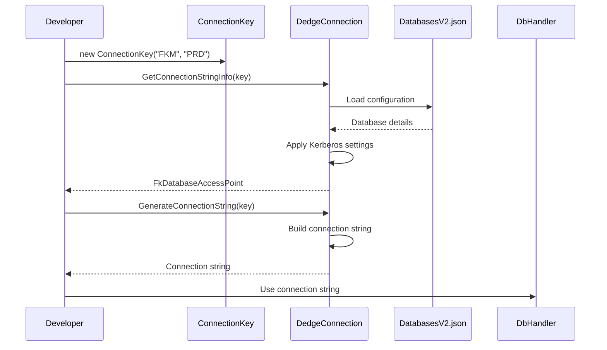
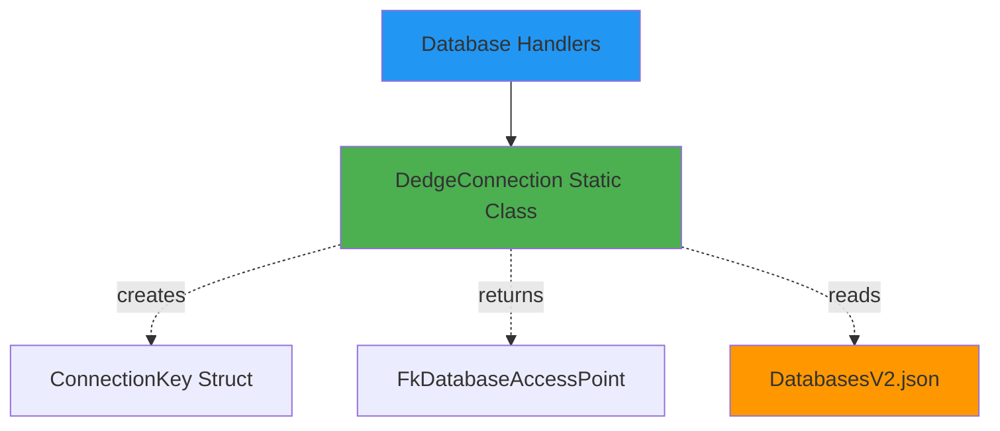

# DedgeConnection User Guide

**Class:** `DedgeCommon.DedgeConnection`  
**Version:** 1.5.21  
**Purpose:** Manages database connections and configurations from DatabasesV2.json

---

## 🎯 Quick Start

```csharp
using DedgeCommon;

var connectionKey = new DedgeConnection.ConnectionKey("FKM", "PRD");
string connectionString = DedgeConnection.GenerateConnectionString(connectionKey);
string databaseName = DedgeConnection.GetDatabaseName(connectionKey);
```

---

## 📋 Common Usage Patterns

### Pattern 1: Create Connection Key
```csharp
// From application and environment
var connectionKey = new DedgeConnection.ConnectionKey("FKM", "PRD");
// Result: Looks up FKMPRD database

// Get details
var accessPoint = DedgeConnection.GetConnectionStringInfo(connectionKey);
Console.WriteLine($"Database: {accessPoint.DatabaseName}");
Console.WriteLine($"Catalog: {accessPoint.CatalogName}");
Console.WriteLine($"Server: {accessPoint.ServerName}");
```

### Pattern 2: Lookup by Database Name
```csharp
// Direct database lookup
var accessPoint = DedgeConnection.GetAccessPointByDatabaseName("BASISPRO");
Console.WriteLine($"Server: {accessPoint.ServerName}");
Console.WriteLine($"Port: {accessPoint.Port}");
Console.WriteLine($"Auth: {accessPoint.AuthenticationType}");
```

### Pattern 3: Generate Connection String
```csharp
var connectionKey = new DedgeConnection.ConnectionKey("FKM", "TST");
string connectionString = DedgeConnection.GenerateConnectionString(connectionKey);
// Returns: Server=...; Database=BASISTST; Integrated Security=yes; ...
```

### Pattern 4: Kerberos Authentication
```csharp
// Kerberos is default for DB2
var connectionKey = new DedgeConnection.ConnectionKey("FKM", "PRD");
string connStr = DedgeConnection.GenerateConnectionString(connectionKey);
// Includes: Authentication=KERBEROS;KerberosServerName=...
```

---

## 🔄 Class Interactions

### Usage Flow


### Dependencies


---

## 💡 Complete Example - Multi-Environment Access

```csharp
using DedgeCommon;

// Access different environments
var environments = new[] {
    new DedgeConnection.ConnectionKey("FKM", "DEV"),
    new DedgeConnection.ConnectionKey("FKM", "TST"),
    new DedgeConnection.ConnectionKey("FKM", "PRD")
};

foreach (var connKey in environments)
{
    try
    {
        var accessPoint = DedgeConnection.GetConnectionStringInfo(connKey);
        
        Console.WriteLine($"\nEnvironment: {connKey.Environment}");
        Console.WriteLine($"  Database: {accessPoint.DatabaseName}");
        Console.WriteLine($"  Catalog: {accessPoint.CatalogName}");
        Console.WriteLine($"  Server: {accessPoint.ServerName}:{accessPoint.Port}");
        Console.WriteLine($"  Auth Type: {accessPoint.AuthenticationType}");
        Console.WriteLine($"  Provider: {accessPoint.Provider}");
        
        // Test connection
        using var db = DedgeDbHandler.Create(connKey);
        var result = db.ExecuteQueryAsDataTable("SELECT CURRENT SERVER FROM SYSIBM.SYSDUMMY1");
        Console.WriteLine($"  Connected: ✓ {result.Rows[0][0]}");
    }
    catch (Exception ex)
    {
        Console.WriteLine($"  Error: {ex.Message}");
    }
}
```

---

## 📚 Key Members

### ConnectionKey Struct
- **Application** - Application code (FKM, INL, etc.)
- **Environment** - Environment code (DEV, TST, PRD, etc.)

### Static Methods
- **GetConnectionStringInfo(ConnectionKey)** - Returns FkDatabaseAccessPoint with all details
- **GetAccessPointByDatabaseName(string)** - Direct lookup by database name
- **GenerateConnectionString(ConnectionKey)** - Builds complete connection string
- **GetDatabaseName(ConnectionKey)** - Returns catalog name from connection key
- **GetAccessPointByAlias(string)** - Lookup database by alias

### FkDatabaseAccessPoint Properties
- DatabaseName, CatalogName, ServerName, Port
- AuthenticationType, Provider, FkApplication
- IsActive, PriorityIndex, AccessPointType

---

## ⚠️ Error Handling

### Common Errors

**Error:** "Database configuration not found"
- **Cause:** Database not in DatabasesV2.json
- **Solution:** Check database name spelling, verify DatabasesV2.json contains entry

**Error:** "Multiple access points found"
- **Cause:** Database has multiple connection options
- **Solution:** Specify AccessPointType (Alias or PrimaryDb)

**Error:** "Connection string validation failed"
- **Cause:** Missing required properties in DatabasesV2.json
- **Solution:** Verify database entry has Server, Port, CatalogName

---

## 🔗 Related Classes

### DedgeDbHandler
Factory that uses DedgeConnection to create database handlers. See `DedgeDbHandlerUserGuide.md`.

### Db2Handler
Uses connection strings from DedgeConnection. See `Db2HandlerUserGuide.md`.

### DatabasesV2.json
Configuration file read by DedgeConnection (C:\opt\src\DedgeSrc\DedgeSystemTools\Folders\DedgeCommon\Configfiles\DatabasesV2.json).

---

**Last Updated:** 2025-12-16  
**Included in Package:** Yes
