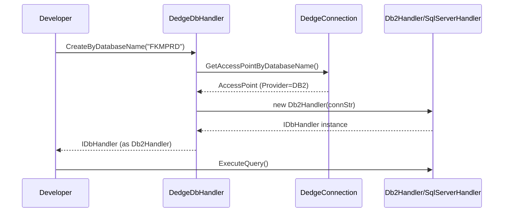
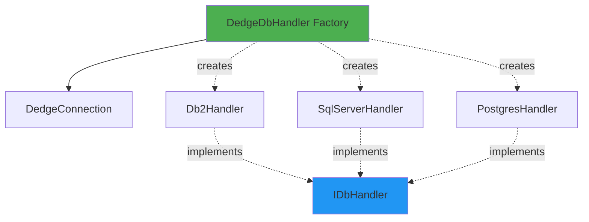

# DedgeDbHandler User Guide

**Class:** `DedgeCommon.DedgeDbHandler`  
**Version:** 1.5.22  
**Purpose:** Factory class for creating appropriate database handlers (DB2, SQL Server, PostgreSQL)

---

## 🎯 Quick Start

```csharp
using DedgeCommon;

// Simplest way - by database name
var db = DedgeDbHandler.CreateByDatabaseName("FKMPRD");
var data = db.ExecuteQueryAsDataTable("SELECT * FROM SYSCAT.TABLES FETCH FIRST 5 ROWS ONLY");
```

---

## 📋 Common Usage Patterns

### Pattern 1: Create by ConnectionKey
```csharp
var connectionKey = new DedgeConnection.ConnectionKey("FKM", "PRD");
using var db = DedgeDbHandler.Create(connectionKey);
// Automatically selects correct provider (DB2, SQL Server, etc.)
```

### Pattern 2: Create by Database Name
```csharp
using var db = DedgeDbHandler.CreateByDatabaseName("BASISPRO");
// Looks up in DatabasesV2.json and creates appropriate handler
```

### Pattern 3: With Credential Override
```csharp
using var db = DedgeDbHandler.CreateByDatabaseName("FKMPRD", "username", "password");
// Uses provided credentials instead of Kerberos
```

---

## 🔄 Class Interactions

### Usage Flow


### Dependencies


---

## 💡 Complete Example

```csharp
using DedgeCommon;

// Connect to multiple databases
var databases = new[] { "FKMPRD", "FKMTST", "INLPRD" };

foreach (var dbName in databases)
{
    try
    {
        using var db = DedgeDbHandler.CreateByDatabaseName(dbName);
        var result = db.ExecuteQueryAsDataTable(
            "SELECT CURRENT SERVER FROM SYSIBM.SYSDUMMY1");
        
        Console.WriteLine($"✓ {dbName}: Connected to {result.Rows[0][0]}");
    }
    catch (Exception ex)
    {
        Console.WriteLine($"✗ {dbName}: {ex.Message}");
    }
}
```

---

## 📚 Key Members

### Static Methods
- **Create(ConnectionKey)** - Creates handler from connection key
- **CreateByDatabaseName(string databaseName)** - Creates handler from database name
- **CreateByDatabaseName(string, string username, string password)** - With credentials

---

## ⚠️ Error Handling

**Error:** "Database not found in configuration"
- **Solution:** Check DatabasesV2.json contains the database

**Error:** "Unsupported provider type"
- **Solution:** Database must be DB2, SQL Server, or PostgreSQL

---

## 🔗 Related Classes

- **Db2Handler, SqlServerHandler, PostgresHandler** - Created by this factory
- **DedgeConnection** - Provides database configuration
- **IDbHandler** - Interface all handlers implement

---

**Last Updated:** 2025-12-16  
**Included in Package:** Yes
