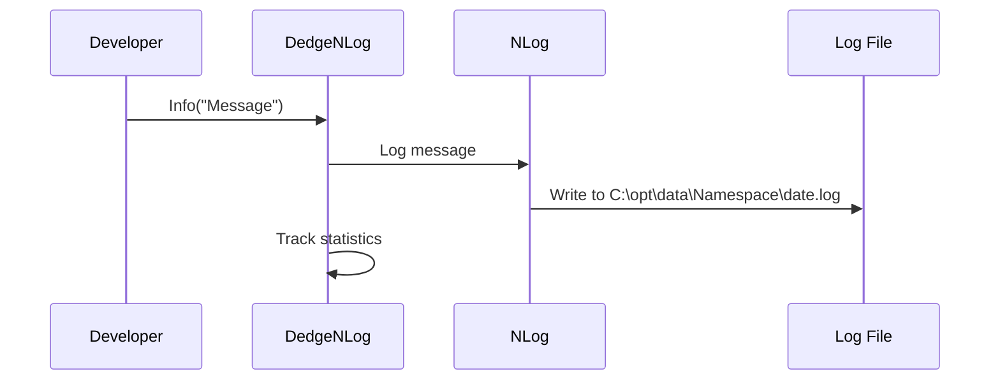
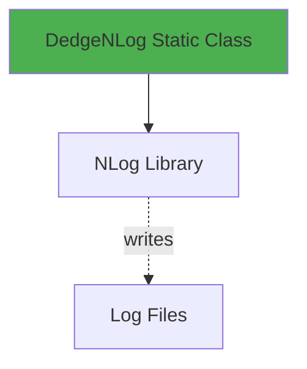

# DedgeNLog User Guide

**Class:** `DedgeCommon.DedgeNLog`  
**Version:** 1.5.22  
**Purpose:** Enhanced logging with automatic file and optional database logging

---

## 🎯 Quick Start

```csharp
using DedgeCommon;

DedgeNLog.Info("Application started");
DedgeNLog.Warn("Warning message");
DedgeNLog.Error("Error occurred");
```

---

## 📋 Common Usage Patterns

### Pattern 1: Basic Logging
```csharp
DedgeNLog.Trace("Detailed trace information");
DedgeNLog.Debug("Debug information");
DedgeNLog.Info("Informational message");
DedgeNLog.Warn("Warning condition");
DedgeNLog.Error("Error occurred");
DedgeNLog.Fatal("Fatal error");
```

### Pattern 2: Logging with Exception
```csharp
try
{
    // code
}
catch (Exception ex)
{
    DedgeNLog.Error(ex, "Operation failed");
    throw;
}
```

---

## 🔄 Class Interactions

### Usage Flow


### Dependencies


---

## 📚 Key Members

### Static Methods
- **Trace(string message)** - Trace level logging
- **Debug(string message)** - Debug level
- **Info(string message)** - Info level
- **Warn(string message)** - Warning level
- **Error(Exception ex, string message)** - Error with exception
- **Fatal(string message)** - Fatal error

---

**Last Updated:** 2025-12-16  
**Included in Package:** Yes
