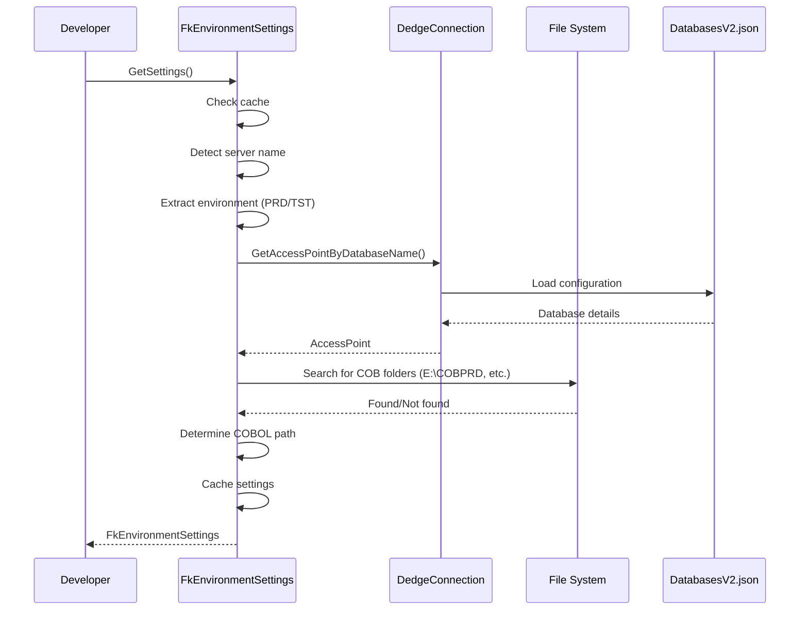
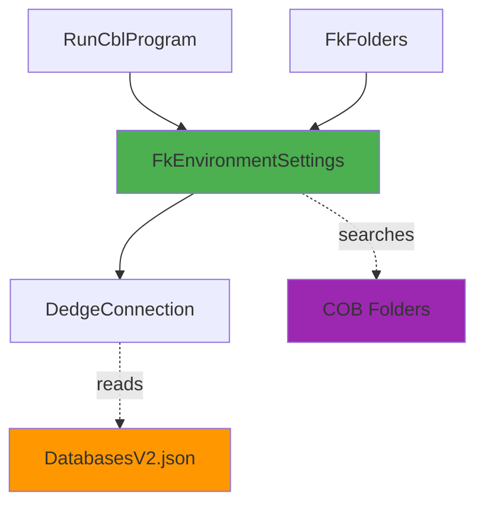

# FkEnvironmentSettings User Guide

**Class:** `DedgeCommon.FkEnvironmentSettings`  
**Version:** 1.5.21  
**Purpose:** Automatic environment detection and configuration for server/workstation

---

## 🎯 Quick Start

```csharp
using DedgeCommon;

var settings = FkEnvironmentSettings.GetSettings();
Console.WriteLine($"Database: {settings.Database}");
Console.WriteLine($"COBOL Path: {settings.CobolObjectPath}");
Console.WriteLine($"Is Server: {settings.IsServer}");
```

---

## 📋 Common Usage Patterns

### Pattern 1: Auto-Detection (Recommended)
```csharp
// Automatically detects environment from server name
var settings = FkEnvironmentSettings.GetSettings();

Console.WriteLine($"Application: {settings.Application}");      // FKM, INL, etc.
Console.WriteLine($"Environment: {settings.Environment}");      // PRD, TST, DEV
Console.WriteLine($"Database: {settings.Database}");            // BASISPRO, BASISTST
Console.WriteLine($"COBOL Path: {settings.CobolObjectPath}");  // E:\COBPRD\ or network
Console.WriteLine($"Is Server: {settings.IsServer}");          // true/false
```

### Pattern 2: Override Database
```csharp
// Force specific database (useful for COBOL execution)
var settings = FkEnvironmentSettings.GetSettings(overrideDatabase: "BASISPRO");

// Returns settings for BASISPRO regardless of server name
Console.WriteLine($"Database: {settings.Database}");           // BASISPRO
Console.WriteLine($"COBOL Path: {settings.CobolObjectPath}");  // Correct path for BASISPRO
```

### Pattern 3: COBOL Integration
```csharp
// Used by RunCblProgram for path resolution
var settings = FkEnvironmentSettings.GetSettings(overrideDatabase: "BASISPRO");

Console.WriteLine($"COBOL Object Path: {settings.CobolObjectPath}");
// On app server: E:\COBPRD\
// On workstation: \\DEDGE.fk.no\erpprog\cobnt\

Console.WriteLine($"Runtime: {settings.CobolRuntimeExecutable}");
// C:\Program Files (x86)\Micro Focus\...
```

### Pattern 4: Server Detection
```csharp
var settings = FkEnvironmentSettings.GetSettings();

if (settings.IsServer)
{
    Console.WriteLine("Running on server:");
    Console.WriteLine($"  Server-specific COBOL path: {settings.CobolObjectPath}");
    Console.WriteLine($"  Database from server name: {settings.Database}");
}
else
{
    Console.WriteLine("Running on workstation:");
    Console.WriteLine($"  Network COBOL path: {settings.CobolObjectPath}");
    Console.WriteLine($"  Default database: {settings.Database}");
}
```

---

## 🔄 Class Interactions

### Usage Flow


### Dependencies


---

## 💡 Complete Example - Environment Report

```csharp
using DedgeCommon;

var settings = FkEnvironmentSettings.GetSettings();

Console.WriteLine("═══════════════════════════════════════");
Console.WriteLine("     Environment Configuration");
Console.WriteLine("═══════════════════════════════════════");
Console.WriteLine();
Console.WriteLine($"Computer: {Environment.MachineName}");
Console.WriteLine($"Is Server: {settings.IsServer}");
Console.WriteLine();
Console.WriteLine("Application Settings:");
Console.WriteLine($"  Application: {settings.Application}");
Console.WriteLine($"  Environment: {settings.Environment}");
Console.WriteLine($"  Database: {settings.Database}");
Console.WriteLine($"  Database Server: {settings.DatabaseServerName}");
Console.WriteLine($"  Provider: {settings.DatabaseProvider}");
Console.WriteLine();
Console.WriteLine("COBOL Configuration:");
Console.WriteLine($"  Version: {settings.Version}");
Console.WriteLine($"  Object Path: {settings.CobolObjectPath}");
Console.WriteLine($"  Runtime: {settings.CobolRuntimeExecutable ?? "Not found"}");
Console.WriteLine($"  Compiler: {settings.CobolCompilerExecutable ?? "Not found"}");
Console.WriteLine();
Console.WriteLine("Paths:");
Console.WriteLine($"  DedgePshApps: {settings.DedgePshAppsPath}");
Console.WriteLine($"  EDI Standard: {settings.EdiStandardPath}");
Console.WriteLine($"  D365: {settings.D365Path}");
```

---

## 📚 Key Members

### Static Methods
- **GetSettings(bool force, string? overrideDatabase)** - Gets cached or new settings
- **ClearCache()** - Clears cached settings

### Properties
- **IsServer** - true if running on app/db server
- **Application** - FKM, INL, HST, etc.
- **Environment** - PRD, TST, DEV, etc.
- **Database** - BASISPRO, BASISTST, etc.
- **CobolObjectPath** - Path to COBOL programs
- **Version** - MF or VC
- **CobolRuntimeExecutable** - Path to run.exe
- **DatabaseServerName** - Database server hostname
- **AccessPoint** - Complete FkDatabaseAccessPoint

---

## ⚠️ Error Handling

### Common Errors

**Error:** "Could not determine environment from server name"
- **Cause:** Server name doesn't match pattern (p-no1fkmXXX-app)
- **Solution:** Use overrideDatabase parameter

**Error:** "COBOL runtime not found"
- **Cause:** Micro Focus COBOL not installed
- **Solution:** Install COBOL or use network path

**Error:** "COB folder not found and doesn't meet validation"
- **Cause:** Local COB folder has less than 100 .int files
- **Solution:** This is expected, will use network path

---

## 🔗 Related Classes

### RunCblProgram
Uses FkEnvironmentSettings for COBOL path resolution.

### FkFolders
Uses FkEnvironmentSettings in GetCobolIntFolderByDatabaseName().

### DedgeConnection
Used to lookup database configurations.

---

**Last Updated:** 2025-12-16  
**Included in Package:** Yes
