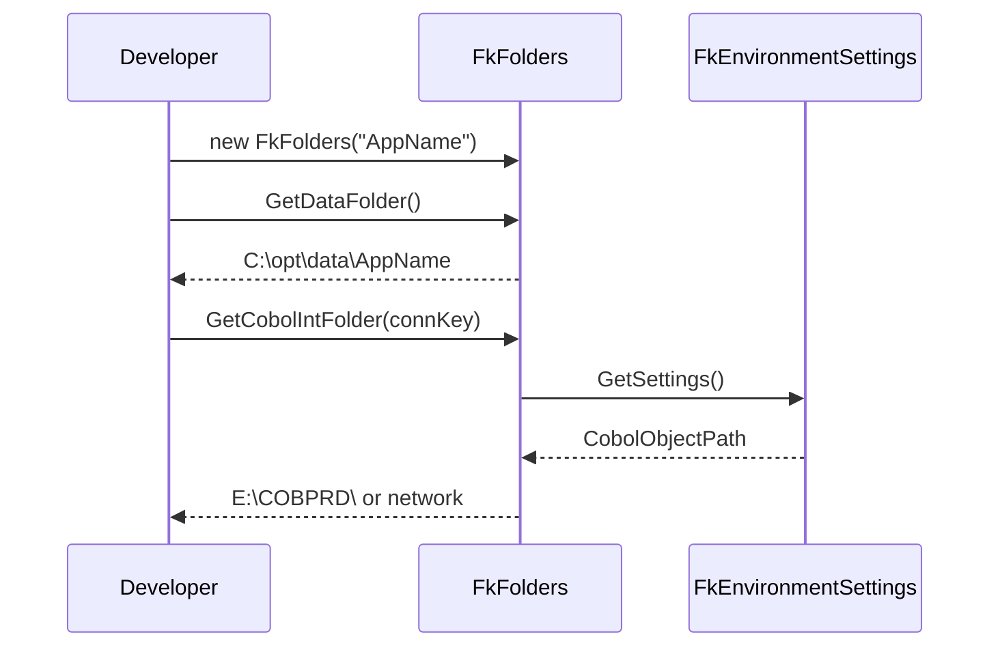
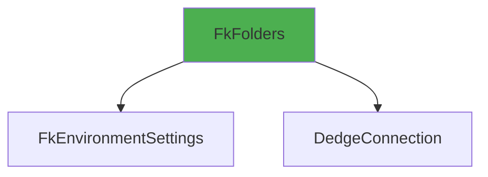

# FkFolders User Guide

**Class:** `DedgeCommon.FkFolders`  
**Version:** 1.5.22  
**Purpose:** Standardized folder path management for Dedge applications

---

## 🎯 Quick Start

```csharp
using DedgeCommon;

var folders = new FkFolders("MyApp");
string dataFolder = folders.GetDataFolder();
string logFolder = folders.GetLogFolder();
```

---

## 📋 Common Usage Patterns

### Pattern 1: Get Application Folders
```csharp
var folders = new FkFolders("GetPeppolDirectory");
string dataFolder = folders.GetDataFolder();  // C:\opt\data\GetPeppolDirectory
string logFolder = folders.GetLogFolder();    // C:\opt\data\GetPeppolDirectory
string appFolder = folders.GetAppFolder();    // C:\opt\apps\GetPeppolDirectory
```

### Pattern 2: COBOL INT Folder
```csharp
var folders = new FkFolders();
var connectionKey = new DedgeConnection.ConnectionKey("FKM", "PRD");
string cobolFolder = folders.GetCobolIntFolder(connectionKey);
// Returns: E:\COBPRD\ (on app server) or network path
```

---

## 🔄 Class Interactions

### Usage Flow


### Dependencies


---

## 📚 Key Members

### Methods
- **GetDataFolder()** - C:\opt\data\{namespace}
- **GetLogFolder()** - C:\opt\data\{namespace}
- **GetAppFolder()** - C:\opt\apps\{namespace}
- **GetCobolIntFolder(ConnectionKey)** - COBOL INT folder path

---

**Last Updated:** 2025-12-16  
**Included in Package:** Yes
