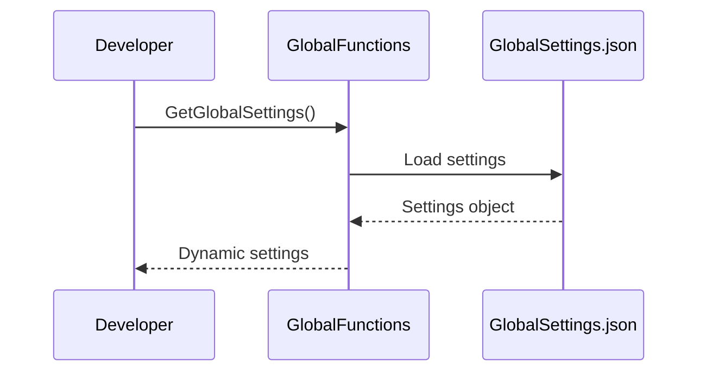
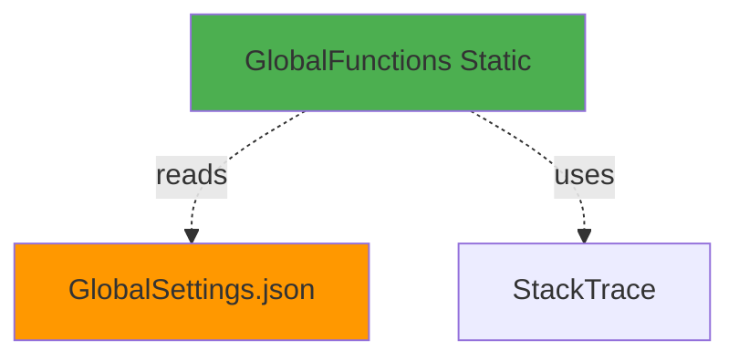

# GlobalFunctions User Guide

**Class:** `DedgeCommon.GlobalFunctions`  
**Version:** 1.5.22  
**Purpose:** Global utility functions for paths, settings, and caller information

---

## 🎯 Quick Start

```csharp
using DedgeCommon;

string commonPath = GlobalFunctions.GetCommonPath();
string namespace = GlobalFunctions.GetNamespaceName();
var settings = GlobalFunctions.GetGlobalSettings();
```

---

## 📋 Common Usage Patterns

### Pattern 1: Get Paths
```csharp
string commonPath = GlobalFunctions.GetCommonPath();
// Returns: C:\opt\src\DedgeSrc\DedgeSystemTools\Folders\DedgeCommon

string configPath = GlobalFunctions.GetConfigFilesPath();
// Returns: C:\opt\src\DedgeSrc\DedgeSystemTools\Folders\DedgeCommon\Configfiles
```

### Pattern 2: Caller Information
```csharp
string namespaceName = GlobalFunctions.GetNamespaceName();
string className = GlobalFunctions.GetClassName();
string methodName = GlobalFunctions.GetMethodName();

Console.WriteLine($"Called from: {namespaceName}.{className}.{methodName}");
```

### Pattern 3: Global Settings
```csharp
dynamic settings = GlobalFunctions.GetGlobalSettings();
string domain = settings.Organization.DefaultDomain;
string devToolsPath = settings.Paths.DevToolsWeb;
```

---

## 🔄 Class Interactions

### Usage Flow


### Dependencies


---

## 📚 Key Members

### Static Methods
- **GetNamespaceName()** - Returns caller namespace
- **GetClassName()** - Returns caller class name
- **GetCommonPath()** - Returns DedgeCommon UNC path
- **GetGlobalSettings()** - Returns dynamic settings object

---

**Last Updated:** 2025-12-16  
**Included in Package:** Yes
