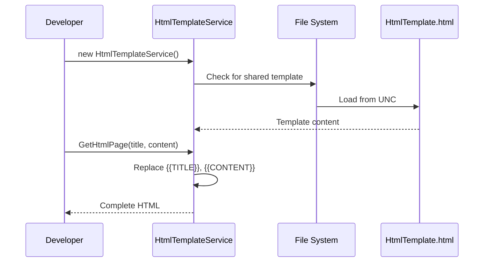
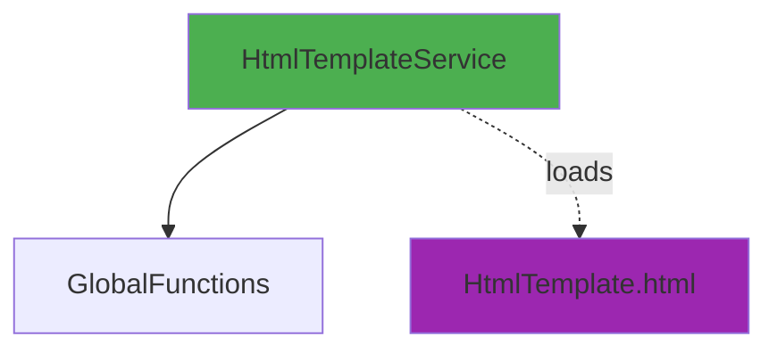

# HtmlTemplateService User Guide

**Class:** `DedgeCommon.HtmlTemplateService`  
**Version:** 1.5.22  
**Purpose:** Load and process HTML templates with placeholder replacement

---

## 🎯 Quick Start

```csharp
using DedgeCommon;

var templateService = new HtmlTemplateService();
string html = templateService.GetHtmlPage("My Title", "<p>Content here</p>", null);
```

---

## 📋 Common Usage Patterns

### Pattern 1: Basic HTML Generation
```csharp
var service = new HtmlTemplateService();
string content = "<h2>Report Data</h2><p>Details...</p>";
string html = service.GetHtmlPage("Report Title", content);
File.WriteAllText("report.html", html);
```

### Pattern 2: With Custom Styles
```csharp
string additionalCss = ".custom { color: red; font-weight: bold; }";
string html = service.GetHtmlPage("Styled Report", content, additionalCss);
```

---

## 🔄 Class Interactions

### Usage Flow


### Dependencies


---

## 📚 Key Members

### Methods
- **GetHtmlPage(title, content, additionalStyle)** - Generate complete HTML page

### Template Placeholders
- {{TITLE}} - Page title
- {{CONTENT}} - Main content
- {{ADDITIONAL_STYLE}} - Custom CSS

---

**Last Updated:** 2025-12-16  
**Included in Package:** Yes
