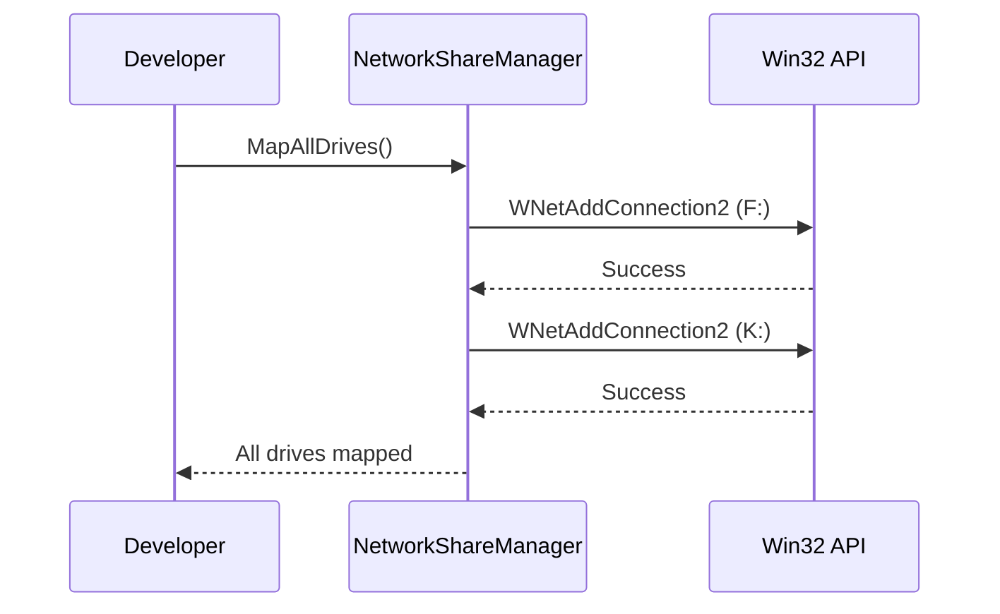
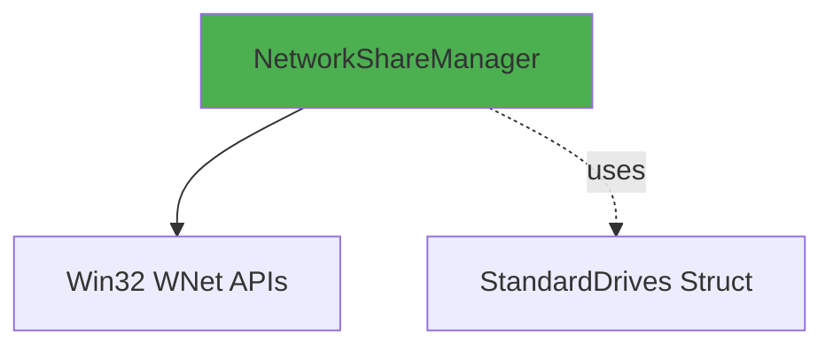

# NetworkShareManager User Guide

**Class:** `DedgeCommon.NetworkShareManager`  
**Version:** 1.5.22  
**Purpose:** Automatic network drive mapping using Win32 API

---

## 🎯 Quick Start

```csharp
using DedgeCommon;

// Map all standard Dedge drives
bool success = NetworkShareManager.MapAllDrives(persist: true);
```

---

## 📋 Common Usage Patterns

### Pattern 1: Map All Drives
```csharp
// Maps F:, K:, N:, R:, X: with standard UNC paths
bool result = NetworkShareManager.MapAllDrives(persist: true);
Console.WriteLine(result ? "All drives mapped" : "Some drives failed");
```

### Pattern 2: Map Single Drive
```csharp
NetworkShareManager.MapDrive("N", @"\\DEDGE.fk.no\erpprog", persist: true);
```

### Pattern 3: Check Mapped Drives
```csharp
var drives = NetworkShareManager.GetMappedDrives();
foreach (var drive in drives)
{
    Console.WriteLine($"{drive.Key}: → {drive.Value}");
}
```

---

## 🔄 Class Interactions

### Usage Flow


### Dependencies


---

## 📚 Key Members

### Static Methods
- **MapAllDrives(bool persist)** - Maps all standard drives
- **MapDrive(string letter, string uncPath, bool persist)** - Map single drive
- **GetMappedDrives()** - Returns Dictionary<string, string> of mapped drives

### StandardDrives
- F_Felles, K_Utvikling, N_ErrProg, R_ErpData, X_DedgeCommon

---

**Last Updated:** 2025-12-16  
**Included in Package:** Yes
