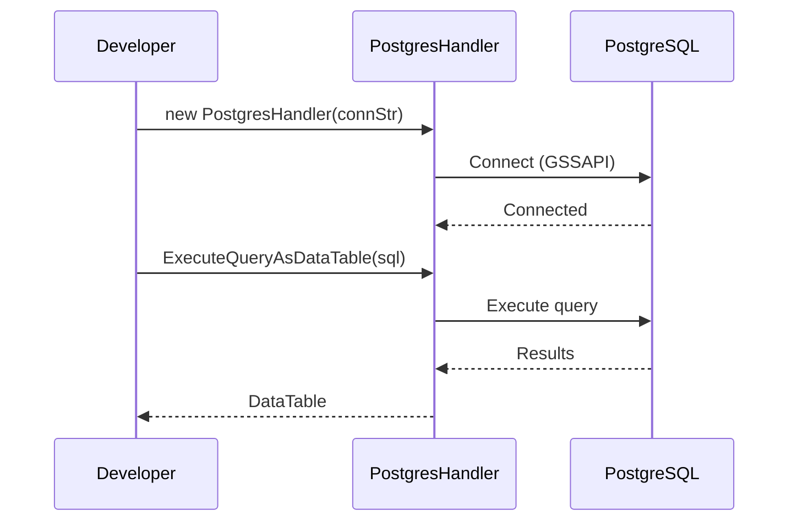
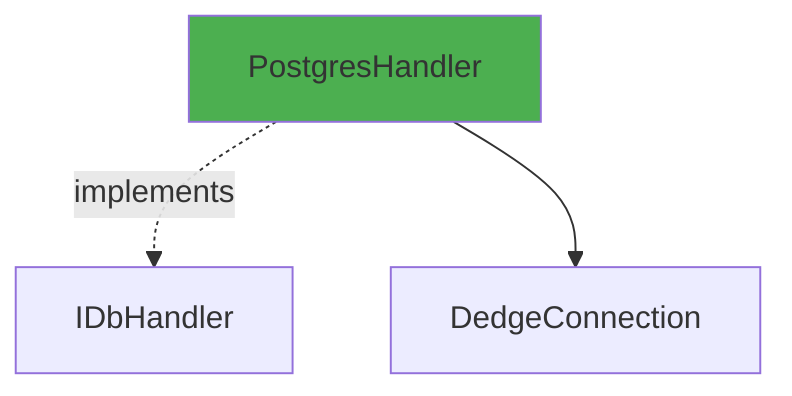

# PostgresHandler User Guide

**Class:** `DedgeCommon.PostgresHandler`  
**Version:** 1.5.22  
**Purpose:** PostgreSQL database operations with GSSAPI (Kerberos) support

---

## 🎯 Quick Start

```csharp
using DedgeCommon;

var db = DedgeDbHandler.CreateByDatabaseName("POSTGRESPRD");
var data = db.ExecuteQueryAsDataTable("SELECT * FROM information_schema.tables LIMIT 5");
```

---

## 📋 Common Usage Patterns

### Pattern 1: Query with GSSAPI
```csharp
using var db = DedgeDbHandler.CreateByDatabaseName("POSTGRESPRD");
var result = db.ExecuteQueryAsDataTable("SELECT current_database(), current_user");
Console.WriteLine($"Database: {result.Rows[0][0]}, User: {result.Rows[0][1]}");
```

---

## 🔄 Class Interactions

### Usage Flow


### Dependencies


---

## 💡 Complete Example

```csharp
using DedgeCommon;

using var db = DedgeDbHandler.CreateByDatabaseName("POSTGRESPRD");
var schemas = db.ExecuteQueryAsDataTable(
    "SELECT schema_name FROM information_schema.schemata WHERE schema_name NOT LIKE 'pg_%'");

foreach (DataRow row in schemas.Rows)
{
    Console.WriteLine($"Schema: {row["schema_name"]}");
}
```

---

## 📚 Key Members

Same as Db2Handler - implements IDbHandler interface.

---

## ⚠️ Error Handling

**Error:** "GSSAPI authentication failed"
- **Solution:** Verify Kerberos ticket with `klist`

---

## 🔗 Related Classes

- **DedgeDbHandler** - Factory that creates PostgresHandler
- **IDbHandler** - Interface implemented

---

**Last Updated:** 2025-12-16  
**Included in Package:** Yes
