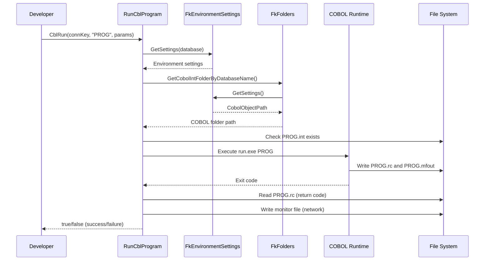
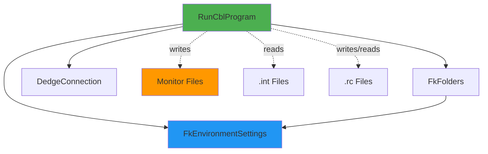

# RunCblProgram User Guide

**Class:** `DedgeCommon.RunCblProgram`  
**Version:** 1.5.21  
**Purpose:** Execute COBOL programs with automatic environment configuration

---

## 🎯 Quick Start

```csharp
using DedgeCommon;

var connectionKey = new DedgeConnection.ConnectionKey("FKM", "PRD");
bool success = RunCblProgram.CblRun(connectionKey, "AABELMA", null, RunCblProgram.ExecutionMode.Batch);
Console.WriteLine(success ? "COBOL program succeeded" : "COBOL program failed");
```

---

## 📋 Common Usage Patterns

### Pattern 1: Execute COBOL Program (Batch Mode)
```csharp
var connectionKey = new DedgeConnection.ConnectionKey("FKM", "PRD");

bool result = RunCblProgram.CblRun(
    connectionKey,
    "AABELMA",
    null,
    RunCblProgram.ExecutionMode.Batch);

if (result)
{
    Console.WriteLine("✓ COBOL program completed successfully");
}
else
{
    Console.WriteLine("✗ COBOL program failed - check logs");
}
```

### Pattern 2: With Parameters
```csharp
var connectionKey = new DedgeConnection.ConnectionKey("FKM", "TST");
string[] parameters = new[] { "PARAM1", "VALUE1", "PARAM2" };

bool result = RunCblProgram.CblRun(
    connectionKey,
    "MYPROG",
    parameters,
    RunCblProgram.ExecutionMode.Batch);
```

### Pattern 3: GUI Mode
```csharp
// Use GUI mode for programs with user interface
var connectionKey = new DedgeConnection.ConnectionKey("FKM", "PRD");

bool result = RunCblProgram.CblRun(
    connectionKey,
    "MENUPRG",
    null,
    RunCblProgram.ExecutionMode.Gui);  // Uses runw.exe instead of run.exe
```

### Pattern 4: By Database Name
```csharp
// Direct database name (bypasses ConnectionKey)
bool result = RunCblProgram.CblRun(
    "MYPROG",
    "BASISPRO",  // Database catalog name
    null,
    RunCblProgram.ExecutionMode.Batch);
```

---

## 🔄 Class Interactions

### Usage Flow


### Dependencies


---

## 💡 Complete Example - COBOL Execution with Tracking

```csharp
using DedgeCommon;

var connectionKey = new DedgeConnection.ConnectionKey("FKM", "PRD");

Console.WriteLine("Executing COBOL program AABELMA...");
Console.WriteLine($"  Application: {connectionKey.Application}");
Console.WriteLine($"  Environment: {connectionKey.Environment}");

// Execute COBOL program
bool result = RunCblProgram.CblRun(
    connectionKey,
    "AABELMA",
    null,
    RunCblProgram.ExecutionMode.Batch);

if (result)
{
    Console.WriteLine("✓ COBOL program AABELMA completed successfully");
    
    // Files created:
    // - E:\COBPRD\AABELMA.rc (return code file)
    // - E:\COBPRD\AABELMA.mfout (transcript file)
    // - \\DEDGE.fk.no\erpprog\cobnt\monitor\*.MON (monitor file)
}
else
{
    Console.WriteLine("✗ COBOL program AABELMA failed");
    Console.WriteLine("Check files:");
    Console.WriteLine("  - E:\\COBPRD\\AABELMA.rc (return code)");
    Console.WriteLine("  - E:\\COBPRD\\AABELMA.mfout (transcript)");
    Console.WriteLine("  - \\\\DEDGE.fk.no\\erpprog\\cobnt\\monitor\\*.MON (monitor)");
}
```

---

## 📚 Key Members

### Static Methods
- **CblRun(ConnectionKey, string programName, string[]? params, ExecutionMode)** - Execute with connection key
- **CblRun(string programName, string databaseName, string[]? params, ExecutionMode)** - Execute with database name
- **GetCobolObjectPath()** - Returns current COBOL object path
- **GetCobolVersion()** - Returns MF or VC
- **ClearCache()** - Clears cached environment settings

### Execution Modes
- **Batch** - Uses run.exe (console mode, no UI)
- **Gui** - Uses runw.exe (Windows mode, allows UI)

---

## ⚠️ Error Handling

### Common Errors

**Error:** DirectoryNotFoundException "COBOL INT folder does not exist"
- **Cause:** COBOL folder not found or doesn't have 100+ .int files
- **Solution:** Verify COB folder exists on app server or network path is accessible

**Error:** FileNotFoundException "COBOL runtime executable not found"
- **Cause:** Micro Focus COBOL not installed
- **Solution:** Install COBOL runtime on the machine

**Error:** "COBOL program returned code 0016"
- **Cause:** .rc file not found after execution
- **Solution:** Check COBOL program exists (.int file) and has permissions

---

## 🔗 Related Classes

### FkEnvironmentSettings
Used to determine COBOL paths and runtime configuration.

### FkFolders
Uses FkEnvironmentSettings to get COBOL INT folder path.

### DedgeConnection
Converts ConnectionKey to database name for COBOL execution.

---

**Last Updated:** 2025-12-16  
**Included in Package:** Yes
