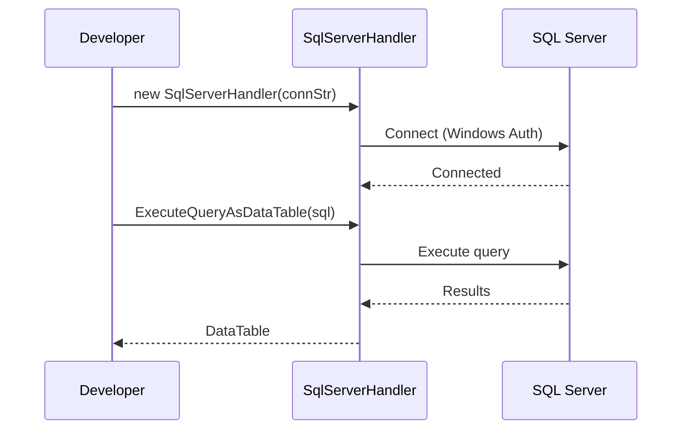
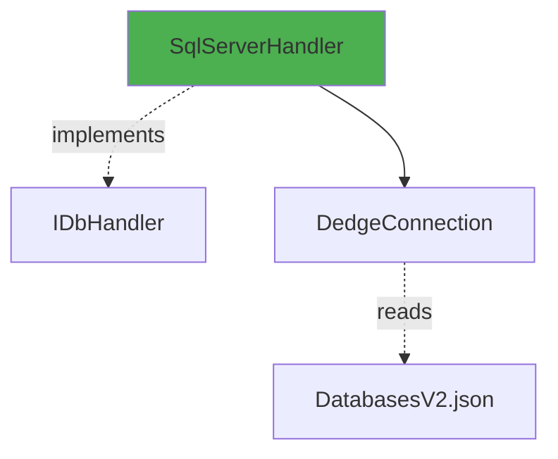

# SqlServerHandler User Guide

**Class:** `DedgeCommon.SqlServerHandler`  
**Version:** 1.5.22  
**Purpose:** SQL Server database operations with Integrated Security (Kerberos/Windows Auth)

---

## 🎯 Quick Start

```csharp
using DedgeCommon;

var db = DedgeDbHandler.CreateByDatabaseName("SQLSERVERPRD");
var data = db.ExecuteQueryAsDataTable("SELECT TOP 5 * FROM sys.tables");
```

---

## 📋 Common Usage Patterns

### Pattern 1: Windows Integrated Security
```csharp
using var db = DedgeDbHandler.CreateByDatabaseName("SQLSERVERPRD");
// Uses Windows Authentication automatically
var result = db.ExecuteQueryAsDataTable("SELECT @@SERVERNAME AS ServerName");
```

### Pattern 2: Execute Stored Procedure
```csharp
using var db = DedgeDbHandler.CreateByDatabaseName("SQLSERVERPRD");
string sql = "EXEC usp_GetCustomers @Region = 'North'";
var data = db.ExecuteQueryAsDataTable(sql);
```

---

## 🔄 Class Interactions

### Usage Flow


### Dependencies


---

## 💡 Complete Example

```csharp
using DedgeCommon;

using var db = DedgeDbHandler.CreateByDatabaseName("SQLSERVERPRD");

// Get database info
var info = db.ExecuteQueryAsDataTable(@"
    SELECT 
        DB_NAME() AS DatabaseName,
        @@VERSION AS Version,
        @@SERVERNAME AS ServerName");

Console.WriteLine($"Connected to: {info.Rows[0]["DatabaseName"]}");
```

---

## 📚 Key Members

Same as Db2Handler - implements IDbHandler interface.

---

## ⚠️ Error Handling

**Error:** "Login failed for user"
- **Solution:** Verify Windows authentication is enabled on SQL Server

---

## 🔗 Related Classes

- **DedgeDbHandler** - Factory that creates SqlServerHandler
- **IDbHandler** - Interface implemented by SqlServerHandler

---

**Last Updated:** 2025-12-16  
**Included in Package:** Yes
