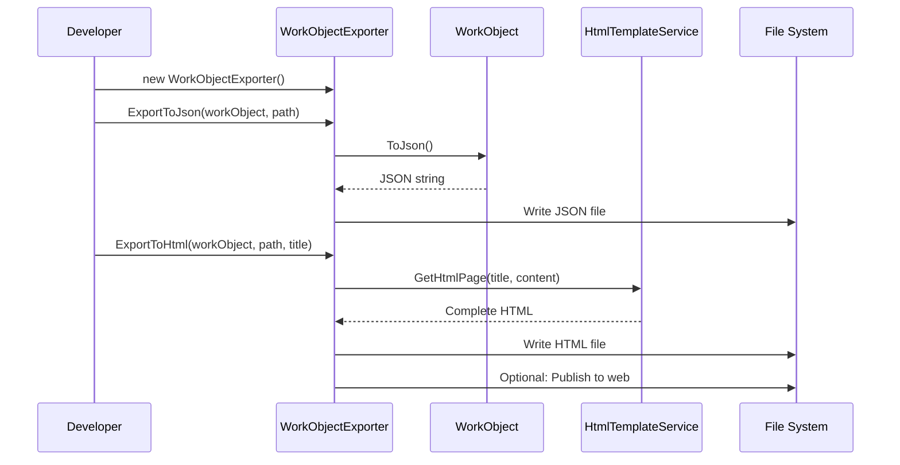
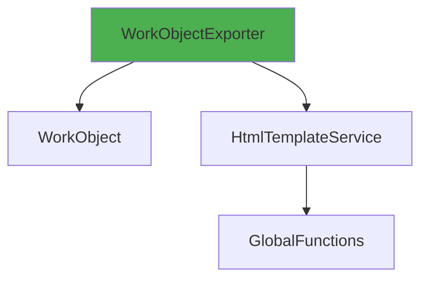

# WorkObjectExporter User Guide

**Class:** `DedgeCommon.WorkObjectExporter`  
**Version:** 1.5.22  
**Purpose:** Export WorkObject to JSON and HTML formats with web publishing

---

## 🎯 Quick Start

```csharp
using DedgeCommon;

var workObject = new WorkObject();
workObject.SetProperty("Status", "Success");

var exporter = new WorkObjectExporter();
exporter.ExportToJson(workObject, "report.json");
exporter.ExportToHtml(workObject, "report.html", "My Report");
```

---

## 📋 Common Usage Patterns

### Pattern 1: JSON Export
```csharp
var exporter = new WorkObjectExporter();
exporter.ExportToJson(workObject, @"C:\reports\execution.json", indented: true);
```

### Pattern 2: HTML Export with Auto-Open
```csharp
exporter.ExportToHtml(
    workObject,
    @"C:\reports\report.html",
    title: "Execution Report",
    autoOpen: true);  // Opens in browser
```

### Pattern 3: Web Publishing
```csharp
exporter.ExportToHtml(
    workObject,
    @"C:\reports\backup.html",
    title: "Backup Report",
    addToDevToolsWebPath: true,
    devToolsWebDirectory: "BackupReports",
    autoOpen: false);
// Publishes to http://server/DevTools/BackupReports/
```

---

## 🔄 Class Interactions

### Usage Flow


### Dependencies


---

## 📚 Key Members

### Methods
- **ExportToJson(workObject, filePath, indented)** - Export to JSON
- **ExportToHtml(workObject, filePath, title, additionalStyle, addToDevToolsWebPath, devToolsWebDirectory, autoOpen)** - Export to HTML

---

**Last Updated:** 2025-12-16  
**Included in Package:** Yes
