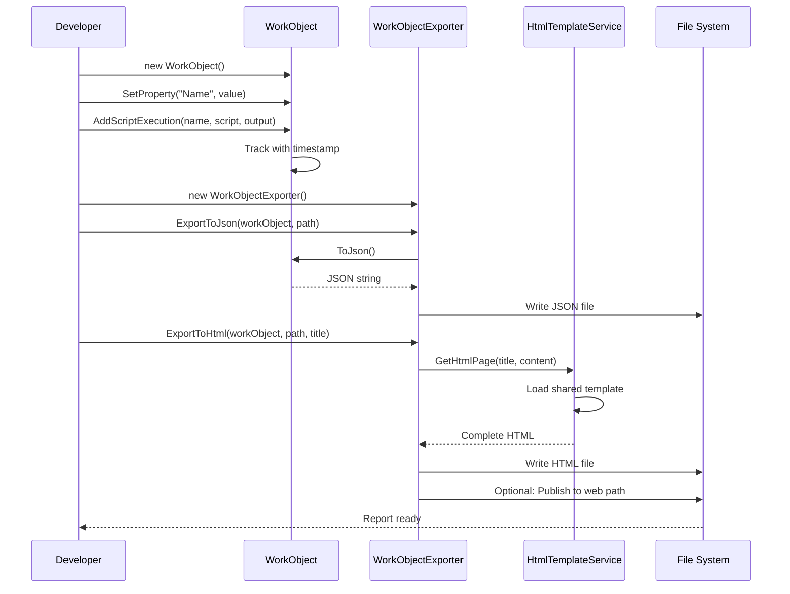
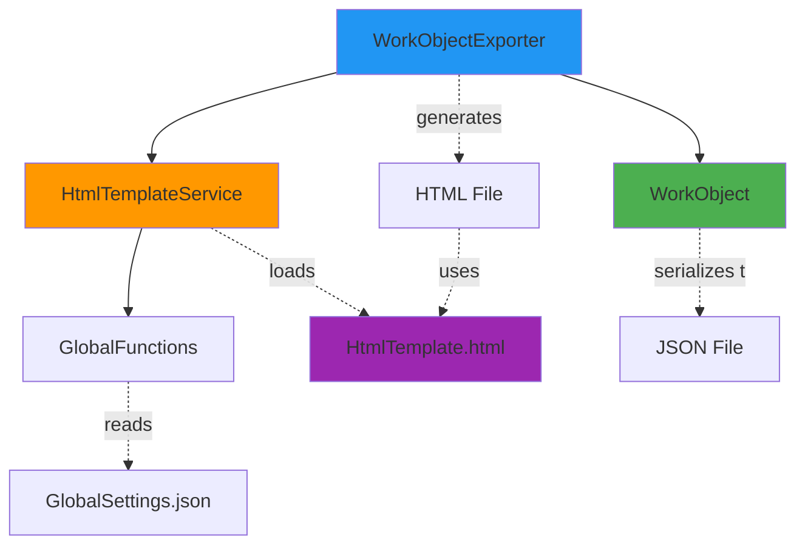

# WorkObject User Guide

**Class:** `DedgeCommon.WorkObject`  
**Version:** 1.5.20  
**Purpose:** Dynamic data container for accumulating execution data with JSON and HTML export capabilities

---

## 🎯 Quick Start

```csharp
using DedgeCommon;

var workObject = new WorkObject();
workObject.SetProperty("Status", "Success");
workObject.AddScriptExecution("Backup", "BACKUP DATABASE", "Completed");

var exporter = new WorkObjectExporter();
exporter.ExportToHtml(workObject, "report.html", "My Report", autoOpen: true);
```

---

## 📋 Common Usage Patterns

### Pattern 1: Track Database Operations
```csharp
var workObject = new WorkObject();
workObject.SetProperty("DatabaseName", "BASISPRO");
workObject.SetProperty("Server", "p-no1fkmprd-db");
workObject.SetProperty("StartTime", DateTime.Now);

workObject.AddScriptExecution(
    "Backup Database",
    "BACKUP DATABASE BASISPRO TO E:\\backups\\backup.bak",
    "Backup completed in 145 seconds");

workObject.SetProperty("EndTime", DateTime.Now);
workObject.SetProperty("Success", true);
```

### Pattern 2: Accumulate Multiple Script Executions
```csharp
// First script
workObject.AddScriptExecution("Check Tables", "SELECT COUNT(*) FROM SYSCAT.TABLES", "547");

// Later - append to same script
workObject.AddScriptExecution("Check Tables", "SELECT MAX(ID) FROM TABLES", "12345");

// Result: One tab with both executions timestamped
```

### Pattern 3: Export to JSON and HTML
```csharp
var exporter = new WorkObjectExporter();

// Export to JSON for programmatic access
exporter.ExportToJson(workObject, @"C:\reports\backup.json");

// Export to HTML with tabs and Monaco editor
exporter.ExportToHtml(
    workObject,
    @"C:\reports\backup.html",
    title: "Database Backup Report",
    autoOpen: true);
```

### Pattern 4: Web Publishing
```csharp
// Publish to DevTools web path for team access
exporter.ExportToHtml(
    workObject,
    @"C:\reports\local_backup.html",
    title: "Backup Report",
    addToDevToolsWebPath: true,
    devToolsWebDirectory: "DatabaseReports",
    autoOpen: true);

// Result: Available at http://server/DevTools/DatabaseReports/local_backup.html
```

---

## 🔄 Class Interactions

### Usage Flow


### Dependencies


---

## 💡 Complete Example - Database Backup Report

```csharp
using DedgeCommon;

// Create WorkObject
var workObject = new WorkObject();

// Add metadata
workObject.SetProperty("Operation", "Database Backup");
workObject.SetProperty("DatabaseName", "BASISPRO");
workObject.SetProperty("Server", "p-no1fkmprd-db");
workObject.SetProperty("StartTime", DateTime.Now);

// Track backup operation
workObject.AddScriptExecution(
    "Create Backup",
    "BACKUP DATABASE BASISPRO TO E:\\backups\\BASISPRO_20251216.bak",
    "Backup completed successfully in 145 seconds\nBackup size: 2.3 GB");

// Track verification
workObject.AddScriptExecution(
    "Verify Backup",
    "RESTORE DATABASE BASISPRO FROM E:\\backups\\BASISPRO_20251216.bak VERIFY ONLY",
    "Verification successful - backup is valid");

// Track statistics
workObject.AddScriptExecution(
    "Database Statistics",
    "SELECT TABSCHEMA, COUNT(*) AS TableCount FROM SYSCAT.TABLES GROUP BY TABSCHEMA",
    "SYSCAT: 1247 tables\nUSER: 547 tables\nSYS: 89 tables");

// Add completion metadata
workObject.SetProperty("EndTime", DateTime.Now);
workObject.SetProperty("Success", true);
workObject.SetProperty("BackupFile", @"E:\backups\BASISPRO_20251216.bak");

// Export reports
var exporter = new WorkObjectExporter();

// JSON for automation
exporter.ExportToJson(workObject, @"C:\reports\backup_20251216.json");

// HTML for team review with web publishing
exporter.ExportToHtml(
    workObject,
    @"C:\reports\backup_20251216.html",
    title: "BASISPRO Backup Report - 2025-12-16",
    addToDevToolsWebPath: true,
    devToolsWebDirectory: "DatabaseBackups",
    autoOpen: true);

// Result:
// - JSON saved: C:\reports\backup_20251216.json
// - HTML saved: C:\reports\backup_20251216.html
// - Web published: http://server/DevTools/DatabaseBackups/backup_20251216.html
// - Browser opens automatically
// - Report has 3 tabs: Properties, Create Backup, Verify Backup, Database Statistics
// - Each script tab has Monaco editor with syntax highlighting
```

---

## 📚 Key Members

### Constructor
- **WorkObject()** - Creates new empty work object

### Properties
- **ScriptArray** - List<ScriptExecutionEntry> - Read-only collection of script executions
- **Properties** - IReadOnlyDictionary<string, object?> - All dynamic properties

### Methods
- **SetProperty(string name, object? value)** - Adds or updates a property
- **GetProperty<T>(string name)** - Retrieves a property with type casting
- **HasProperty(string name)** - Checks if property exists
- **AddScriptExecution(string name, string script, string? output)** - Tracks script execution
- **ToJson(bool indented = true)** - Serializes to JSON string

---

## ⚠️ Error Handling

### Common Errors

**Error:** "Cannot set ScriptArray property directly"
- **Cause:** Trying to use `SetProperty("ScriptArray", ...)`
- **Solution:** Use `AddScriptExecution()` instead

**Error:** InvalidCastException in GetProperty<T>
- **Cause:** Requesting wrong type for property
- **Solution:** Check property type or use GetProperty<object>() first

### Best Practices

✅ **DO:**
- Use descriptive property names
- Keep script names consistent (enables appending)
- Include timestamps in property values
- Set Success/Failure properties
- Export both JSON and HTML

❌ **DON'T:**
- Don't store large binary data in properties
- Don't use special characters in script names
- Don't forget to export at the end
- Don't manually manipulate ScriptArray

---

## 🔗 Related Classes

### WorkObjectExporter
Handles exporting WorkObject to JSON and HTML formats. See `WorkObjectExporterUserGuide.md`.

### HtmlTemplateService
Loads HTML templates for WorkObject export. See `HtmlTemplateServiceUserGuide.md`.

### ScriptExecutionEntry
Represents individual script execution in ScriptArray. Created automatically by `AddScriptExecution()`.

### GlobalFunctions
Used by HtmlTemplateService to locate shared resources (GlobalSettings.json).

---

## 🎨 HTML Output Features

When exported to HTML, WorkObject produces:
- **Tabbed interface** - Properties tab + one tab per script
- **Monaco editor** - Syntax-highlighted code display
- **Dark/light themes** - Toggle button in top-right
- **Responsive design** - Works on desktop and mobile
- **Offline fallback** - Plain text if Monaco CDN fails

---

## 📦 PowerShell Equivalent

PowerShell developers use PSCustomObject with Add-ScriptAndOutputToWorkObject:

```powershell
$workObject = [PSCustomObject]@{ Status = "Success"; ScriptArray = @() }
$workObject = Add-ScriptAndOutputToWorkObject -WorkObject $workObject `
    -Name "Query" -Script "SELECT *" -Output "Results"
```

Both C# and PowerShell produce identical HTML reports!

---

**Last Updated:** 2025-12-16  
**Included in Package:** Yes  
**See Also:** WorkObjectExporterUserGuide.md, README_WORKOBJECT.md
