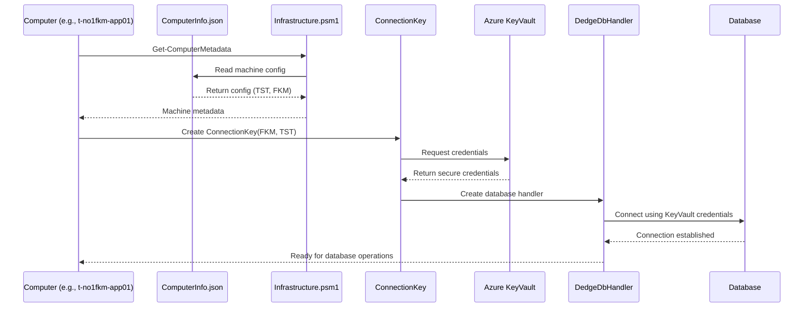
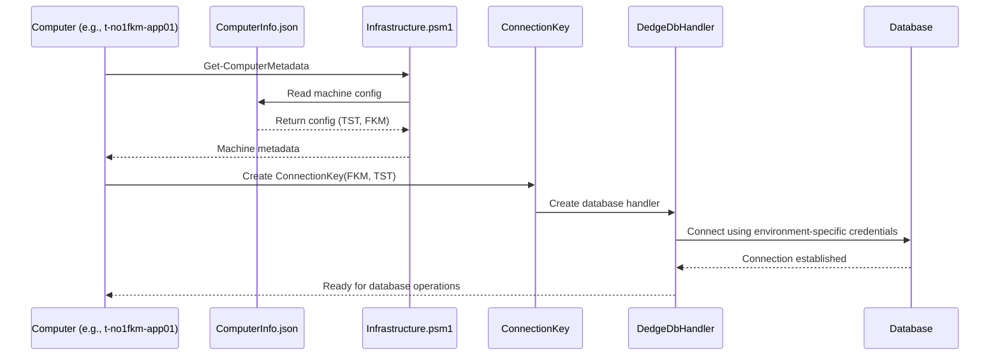
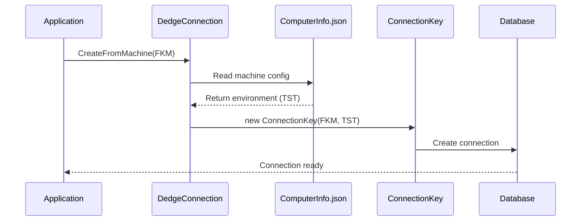
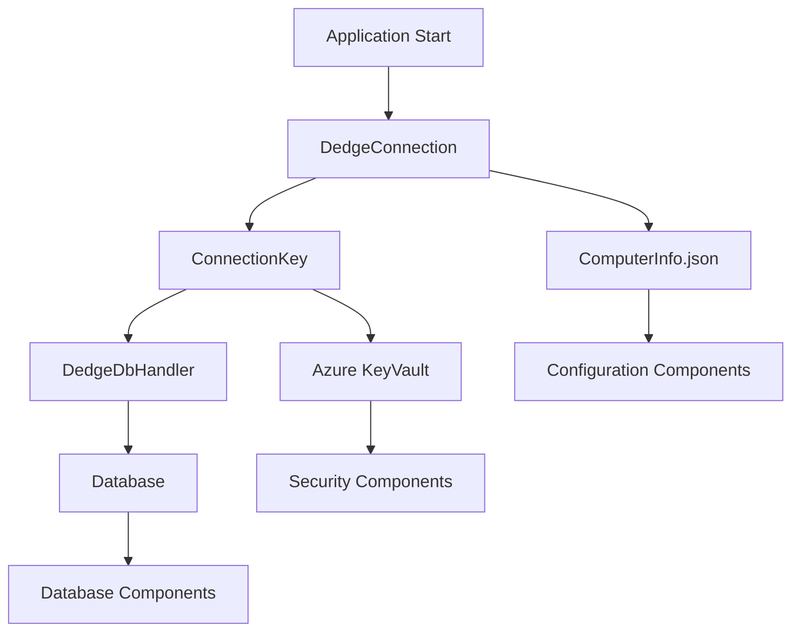
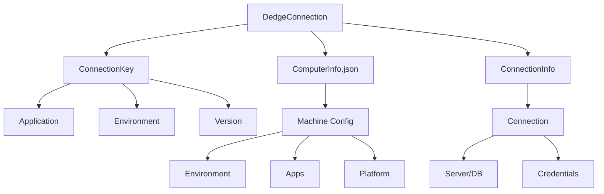

# Justification of DedgeConnection.ConnectionKey

## Purpose
The ConnectionKey system provides a structured way to manage database connections across different environments while leveraging machine-specific configurations. This approach replaces traditional hardcoded connection strings with a more secure and maintainable solution.

## Core Components Interaction

### 1. DedgeConnection.cs (Configuration Layer)
```csharp
public class ConnectionKey
{
    public FkApplication Application { get; set; }  // e.g., FKM, INL
    public FkEnvironment Environment { get; set; }  // e.g., DEV, TST, PRD
    public string Version { get; set; } = "2.0"
}
```
- Defines the structure for identifying database connections
- Maintains mapping between environments and connection details
- Will soon integrate with Azure KeyVault for credential management

### 2. ComputerInfo.json (Machine Configuration)
```json
{
    "Name": "t-no1fkm-app01",
    "Type": "Server",
    "Environment": "TST",
    "FkApplicationList": ["FKM"],
    "Platform": "Azure"
}
```
- Stores machine-specific environment information
- Maps machines to supported applications
- Enables automatic environment detection

### 3. Infrastructure.psm1 (PowerShell Layer)
```powershell
# Provides machine metadata access
Get-ComputerMetaData -Name $env:COMPUTERNAME
```
- Reads ComputerInfo.json
- Provides environment information to applications
- Manages machine configurations

### 4. DedgeDbHandler.cs (Database Access Layer)
```csharp
public static IDbHandler Create(ConnectionKey key)
{
    var connectionInfo = GetConnectionStringInfo(key);
    // Creates appropriate database handler
}
```
- Uses ConnectionKey to create database connections
- Enforces environment-specific access rules
- Handles different database providers

## Key Benefits

1. **Environment Safety**
   - Prevents accidental production database access from development code
   - Environment is determined by machine configuration
   - Compile-time checking of environment values

2. **Machine-Based Configuration**
   - Environment determined automatically from machine name
   - Applications restricted to authorized environments
   - Centralized machine configuration management

3. **Security**
   - Connection credentials managed centrally
   - Environment boundaries enforced by code
   - Upcoming Azure KeyVault integration

## Azure KeyVault Integration

### Current State
```csharp
// Currently credentials are stored in DedgeConnection.cs
public class ConnectionInfo {
    public string? UID { get; set; }
    public string? PWD { get; set; }
}
```

### Planned Migration
The system is being enhanced to move all sensitive credentials to Azure KeyVault:
- Database credentials will be stored securely in KeyVault
- Applications will use managed identities to access KeyVault
- No credentials will be stored in code or configuration files
- Real-time credential updates without application restarts



## Practical Example

```csharp
// Instead of:
var connString = "Server=prod-db;Database=BASISPRO;User=db2nt;Password=***";

// We use:
var machineConfig = GetComputerMetadata(Environment.MachineName);
var key = new ConnectionKey(
    machineConfig.FkApplicationList[0],
    machineConfig.Environment
);
var handler = DedgeDbHandler.Create(key);
```

## Why This Approach?

1. **Safety**: Prevents connecting to wrong environment
2. **Maintainability**: Central configuration management
3. **Security**: Credentials managed separately from code
4. **Flexibility**: Supports multiple database providers
5. **Automation**: Environment detection from machine name

## System Flow Diagram



## Flow Description
1. Computer starts application/script
2. PowerShell reads ComputerInfo.json to get machine's environment
3. ConnectionKey created using machine's environment and application
4. DedgeDbHandler uses ConnectionKey to establish correct database connection

## Automatic Environment Detection Enhancement

### Current Implementation Gap
Currently, the environment must be explicitly specified when creating a ConnectionKey, even though the environment information exists in ComputerInfo.json.

### Proposed Enhancement
Add automatic environment detection to DedgeConnection.cs:

```csharp
public class DedgeConnection
{
    // New method to get environment from machine name
    public static FkEnvironment GetEnvironmentFromMachine()
    {
        var machineName = Environment.MachineName;
        var computerInfo = GetComputerMetadata(machineName);
        return Enum.Parse<FkEnvironment>(computerInfo.Environment);
    }

    // Enhanced ConnectionKey factory method
    public static ConnectionKey CreateFromMachine(FkApplication application)
    {
        var environment = GetEnvironmentFromMachine();
        return new ConnectionKey(application, environment);
    }
}
```

### Updated Flow Diagram


### Usage Example
```csharp
// Before: Manual environment specification
var key = new ConnectionKey(FkApplication.FKM, FkEnvironment.TST);

// After: Automatic environment detection
var key = DedgeConnection.CreateFromMachine(FkApplication.FKM);
```

### Benefits
1. **Reduced Error Risk**: Eliminates manual environment selection
2. **Configuration Consistency**: Environment always matches machine config
3. **Simplified Usage**: Developers only need to specify application
4. **Centralized Control**: Environment managed through ComputerInfo.json

### Implementation Steps
1. Add JSON deserialization for ComputerInfo.json in DedgeConnection
2. Implement machine name to environment mapping
3. Add environment validation logic
4. Update DedgeDbHandler to use new automatic detection

## Conclusion
The ConnectionKey system, combined with machine-based configuration through ComputerInfo.json, provides a robust solution for managing database connections while maintaining security and environment isolation. The interaction between these components ensures consistent and secure database access across all applications.

## Future State Architecture



## ConnectionKey vs ConnectionString Analysis

### Object Analysis

#### ConnectionString
```csharp
// Traditional approach
"Server=server;Database=db;User=user;Password=pass;"
```

**Pros:**
1. Simplicity
   - Single string format
   - Easy to understand
   - Direct database connection

2. Portability
   - Can be easily copied between applications
   - Works with any ADO.NET compatible system
   - No additional dependencies

3. Performance
   - No object overhead
   - Direct parsing by database providers
   - Minimal memory footprint

**Cons:**
1. Security Risks
   - Credentials in plain text
   - Easy to accidentally commit to source control
   - No built-in environment protection

2. Maintenance Challenges
   - No version control
   - Hard to track changes
   - Duplicate strings across applications

3. Error Prone
   - Manual string manipulation
   - No compile-time checking
   - Environment mix-ups possible

#### ConnectionKey
```csharp
public class ConnectionKey
{
    public FkApplication Application { get; set; }
    public FkEnvironment Environment { get; set; }
    public string Version { get; set; }
}
```

**Pros:**
1. Security
   - No exposed credentials
   - Environment isolation
   - Azure KeyVault integration

2. Type Safety
   - Compile-time checking
   - Strong typing for environments
   - Version control built-in

3. Maintainability
   - Centralized configuration
   - Easy to update all applications
   - Environment tracking

4. Automation
   - Machine-based configuration
   - Automatic environment detection
   - Simplified deployment

**Cons:**
1. Complexity
   - More complex implementation
   - Additional dependencies
   - Learning curve for developers

2. Performance Overhead
   - Object creation cost
   - Additional layer of abstraction
   - Configuration loading time

3. FK-Specific
   - Not portable to other systems
   - Custom implementation
   - Requires documentation

### Decision Matrix

| Aspect | ConnectionString | ConnectionKey |
|--------|-----------------|---------------|
| Security | ⭐ | ⭐⭐⭐⭐⭐ |
| Simplicity | ⭐⭐⭐⭐⭐ | ⭐⭐⭐ |
| Maintainability | ⭐⭐ | ⭐⭐⭐⭐⭐ |
| Type Safety | ⭐ | ⭐⭐⭐⭐⭐ |
| Performance | ⭐⭐⭐⭐⭐ | ⭐⭐⭐⭐ |
| Portability | ⭐⭐⭐⭐⭐ | ⭐⭐ |
| Environment Safety | ⭐ | ⭐⭐⭐⭐⭐ |
| Automation Capability | ⭐ | ⭐⭐⭐⭐⭐ |

### Recommendation
While ConnectionString offers simplicity and portability, ConnectionKey provides significant advantages in security, maintainability, and environment safety. The additional complexity is justified by:

1. **Risk Reduction**
   - Prevents production accidents
   - Secures credentials
   - Enforces environment boundaries

2. **Maintenance Benefits**
   - Centralized management
   - Automated configuration
   - Version control

3. **Future Proofing**
   - Azure KeyVault integration
   - Extensible design
   - Enhanced security features

## Component Architecture



### Component Descriptions

1. **DedgeConnection**
   - Central configuration manager
   - Creates and manages ConnectionKeys
   - Provides database connection information

2. **ConnectionKey**
   - Application identifier
   - Environment specification
   - Version control

3. **ComputerInfo.json**
   - Machine configuration
   - Environment mapping
   - Application authorization

4. **ConnectionInfo**
   - Database details
   - Server information
   - Credentials (moving to KeyVault)

### Key Relationships

1. **DedgeConnection → ConnectionKey**
   - Creates keys based on machine environment
   - Manages application versions
   - Validates configurations

2. **DedgeConnection → ComputerInfo.json**
   - Reads machine configuration
   - Determines environment
   - Validates applications

3. **DedgeConnection → ConnectionInfo**
   - Provides connection details
   - Manages credentials
   - Handles different database providers
