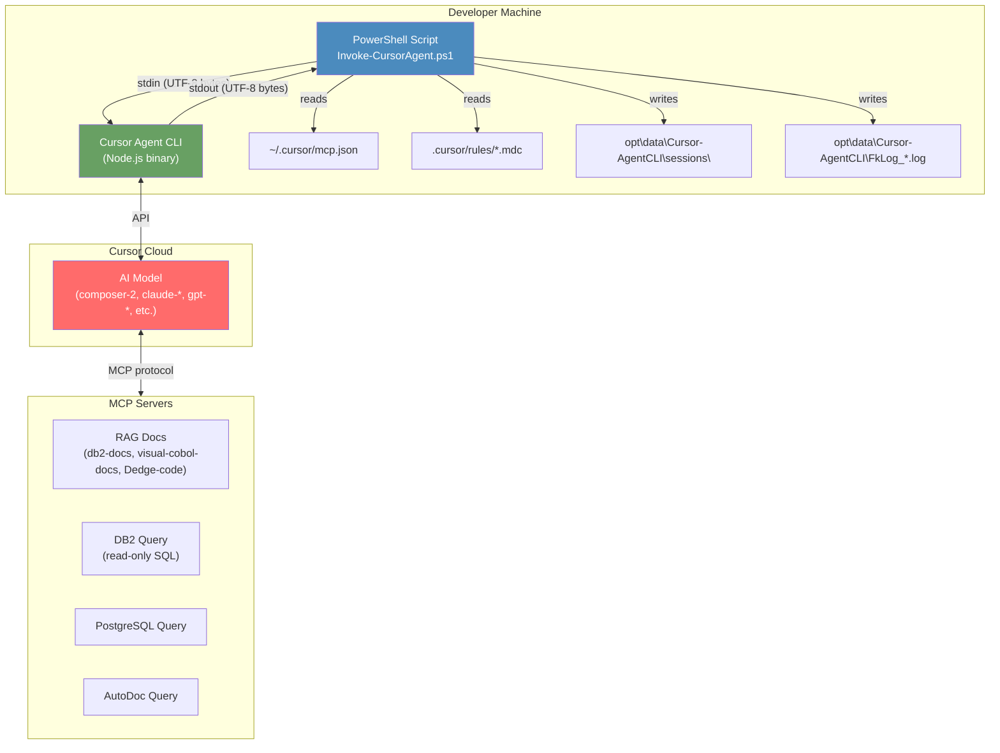
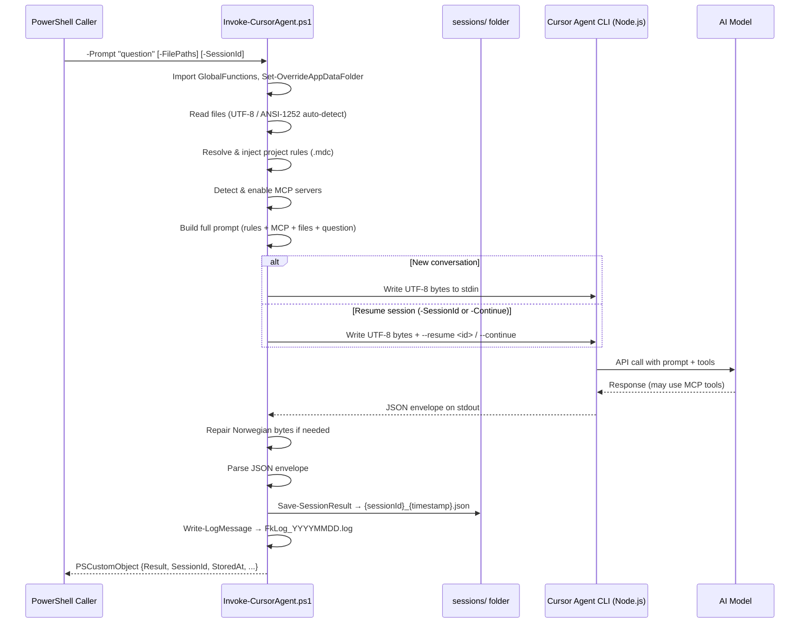
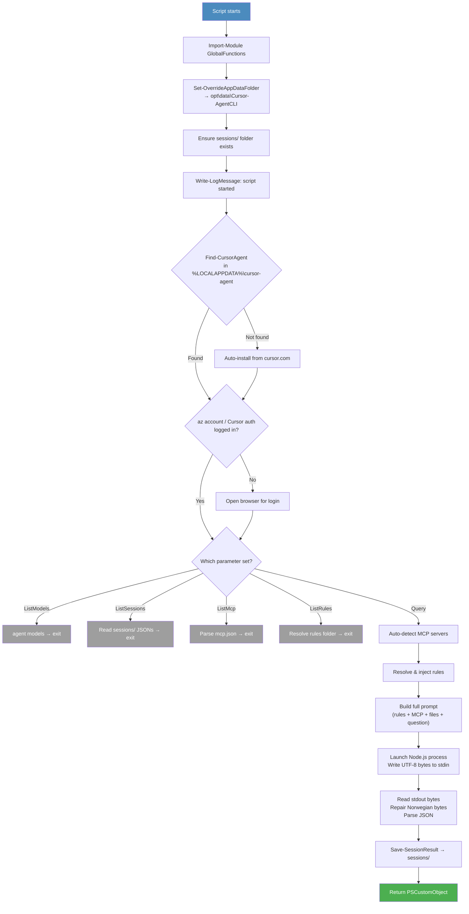
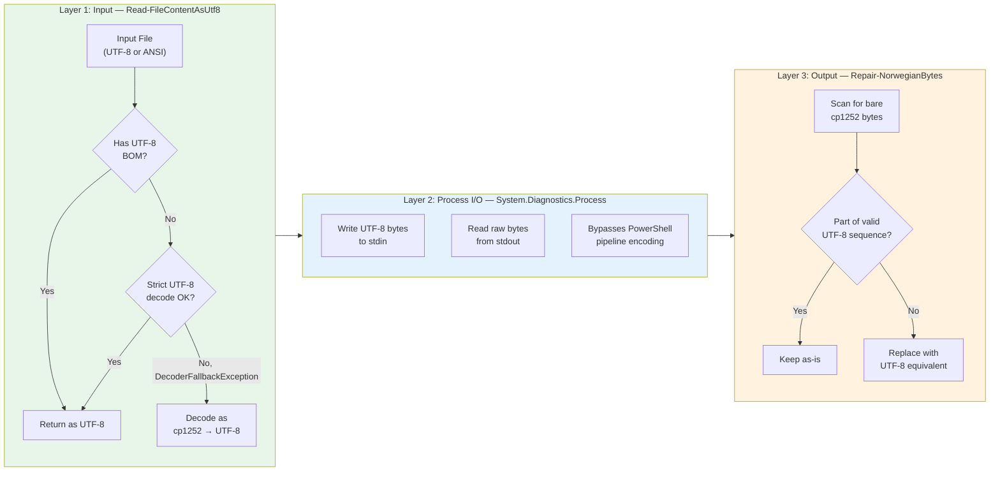
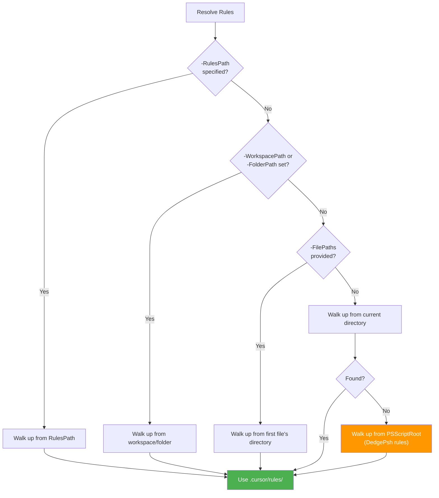
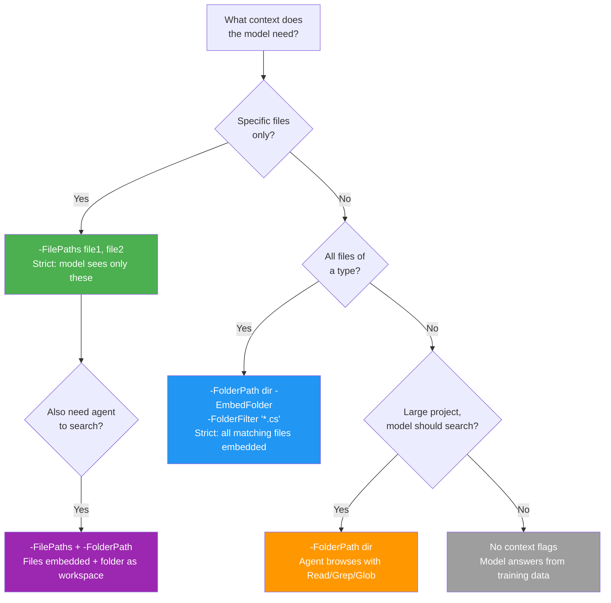

# Cursor Agent CLI — PowerShell Wrapper

**Authors:** Geir Helge Starholm (geir.helge.starholm@Dedge.no)
**Created:** 2026-03-18
**Updated:** 2026-03-26
**Technology:** PowerShell 7+

---

## Overview

`Invoke-CursorAgent.ps1` is a full-featured PowerShell wrapper for the [Cursor Agent CLI](https://docs.cursor.com/agent-cli) binary. It enables headless AI-powered code analysis, question answering, and automation from any PowerShell script or pipeline — no IDE required.

Key capabilities:

- **Multiple context modes** — embed specific files, let the agent browse a folder, or combine both
- **Automatic MCP server discovery** — RAG documentation search and database query tools are detected and enabled
- **Project rules injection** — `.cursor/rules/*.mdc` files are auto-resolved and injected into the prompt
- **Multi-turn conversations** — resume previous sessions via `-SessionId` or `-Continue` for follow-up questions
- **Persistent session storage** — every response saved as `{sessionId}_{timestamp}.json` under `Get-ApplicationDataPath`
- **Robust encoding** — handles UTF-8 and Windows-1252 (ANSI) input files, always returns UTF-8
- **Structured output** — JSON envelope with result, session ID, duration, and storage path
- **Full audit logging** — all operations logged via `Write-LogMessage` to `C:\opt\data\Cursor-AgentCLI\`
- **4 discovery commands** — list models, MCP servers, project rules, and stored sessions

---

## Architecture



---

## How It Works



---

## Startup Pipeline

Every invocation goes through this initialization sequence before the prompt is sent:



---

## Installation

The script auto-detects the Cursor Agent CLI binary from `%LOCALAPPDATA%\cursor-agent\versions\`. If not found, it downloads and installs it automatically.

**Prerequisites:**

- PowerShell 7+ (`pwsh.exe`)
- Cursor IDE installed (provides the agent binary)
- `GlobalFunctions` module on `$env:PSModulePath`

No manual installation steps needed.

---

## Parameters

### Core Parameters

| Parameter | Type | Default | Description |
|-----------|------|---------|-------------|
| `-Prompt` | string | *(required)* | The question or instruction for the model |
| `-Model` | string | `composer-2` | AI model to use. Run `-ListModels` to see all |
| `-Mode` | string | `ask` | Agent mode: `ask` (read-only) or `plan` (planning) |
| `-OutputFormat` | string | `json` | Output: `json` (structured), `text` (plain), `stream-json` (NDJSON) |
| `-Force` | switch | — | Allow file modifications and command execution |

### Context Modes

| Parameter | Type | Default | Description |
|-----------|------|---------|-------------|
| `-FilePaths` | string[] | — | Files embedded directly in prompt (strict context) |
| `-FolderPath` | string | — | Folder for `--workspace` browsing or embedding |
| `-EmbedFolder` | switch | — | Embed all matching files instead of workspace mode |
| `-FolderFilter` | string | `*` | Glob filter for `-EmbedFolder` (e.g. `*.ps1`, `*.cs`) |
| `-FolderMaxFiles` | int | `50` | Max files to embed from folder |
| `-FolderMaxChars` | int | `500000` | Max total characters to embed |
| `-WorkspacePath` | string | — | Explicit `--workspace` override |

### MCP Control

| Parameter | Type | Default | Description |
|-----------|------|---------|-------------|
| `-NoMcp` | switch | — | Suppress automatic MCP server detection |
| `-McpServers` | string[] | — | Explicit list of MCP server names to enable |

### Rules Injection

| Parameter | Type | Default | Description |
|-----------|------|---------|-------------|
| `-RulesPath` | string | — | Explicit path to folder with `.cursor/rules/*.mdc` |
| `-NoRules` | switch | — | Suppress automatic rule injection |

### Session Management

| Parameter | Type | Default | Description |
|-----------|------|---------|-------------|
| `-SessionId` | string | — | Resume a specific conversation by session ID |
| `-Continue` | switch | — | Resume the most recent session |

### Discovery Commands

| Parameter | Type | Description |
|-----------|------|-------------|
| `-ListModels` | switch | List available AI models and exit |
| `-ListMcp` | switch | List configured MCP servers and exit |
| `-ListRules` | switch | List rules that would be injected and exit |
| `-ListSessions` | switch | List stored conversation sessions and exit |

---

## Output Object

When `-OutputFormat json` (the default), the script returns a `PSCustomObject`:

| Property | Type | Description |
|----------|------|-------------|
| `Result` | string | The model's response text |
| `DurationMs` | int | API round-trip time in milliseconds |
| `SessionId` | string | UUID for this conversation (use with `-SessionId` to resume) |
| `Model` | string | Model name used |
| `IsError` | bool | Whether the agent returned an error |
| `McpUsed` | bool | Whether MCP servers were enabled |
| `StoredAt` | string | Full path to the saved session JSON file |

---

## Session Handling

Every agent invocation is automatically saved as a JSON file for audit, debugging, and conversation continuation.

### Storage Location

```
C:\opt\data\Cursor-AgentCLI\
├── sessions\
│   ├── <sessionId>_<yyyyMMdd-HHmmss>.json   ← one per invocation
│   ├── <sessionId>_<yyyyMMdd-HHmmss>.json   ← resumed session (same ID, new timestamp)
│   └── ...
└── FkLog_YYYYMMDD.log                        ← daily log file
```

The folder is created via `Set-OverrideAppDataFolder` using `Get-ApplicationDataPath` from `GlobalFunctions`.

### Session File Format

Each JSON file contains:

```json
{
  "SessionId": "031c9d35-3439-4b2b-975b-0b259a16264f",
  "Timestamp": "2026-03-26 17:33:02",
  "Model": "composer-2",
  "DurationMs": 4840,
  "IsError": false,
  "McpUsed": false,
  "OutputFormat": "json",
  "ResumedFrom": "",
  "PromptPreview": "What is 2+2? Answer with just the number.",
  "Result": "4"
}
```

| Field | Description |
|-------|-------------|
| `SessionId` | UUID from the Cursor Agent CLI (or `text-mode`/`stream-mode` for non-JSON output) |
| `Timestamp` | When the response was saved |
| `Model` | AI model used |
| `DurationMs` | API round-trip time |
| `IsError` | Whether the agent returned an error |
| `McpUsed` | Whether MCP servers were enabled |
| `OutputFormat` | `json`, `text`, or `stream-json` |
| `ResumedFrom` | Original session ID, `(continue)`, or empty for new sessions |
| `PromptPreview` | First 200 chars of the prompt |
| `Result` | Full model response text |

Filename pattern: `{sessionId}_{yyyyMMdd-HHmmss}.json`. Characters outside `[a-zA-Z0-9_-]` in the session ID are replaced with underscores.

### Multi-Turn Conversations

The underlying Cursor Agent CLI supports session resumption. The model sees the full conversation history from prior turns.

```powershell
# Turn 1: Ask the initial question
$r = .\Invoke-CursorAgent.ps1 -Prompt "Explain DB2 federated queries"

# Turn 2: Follow up using the session ID
.\Invoke-CursorAgent.ps1 -SessionId $r.SessionId -Prompt "Show an Oracle example"

# Turn 3: Continue most recent session (shorthand)
.\Invoke-CursorAgent.ps1 -Continue -Prompt "What about performance tuning?"
```

### Browsing Past Sessions

```powershell
# List all stored sessions (most recent first)
.\Invoke-CursorAgent.ps1 -ListSessions
```

Output:

```
Stored conversation sessions (3):
------------------------------------------------------------------------------------------
  2026-03-26 17:35:12  031c9d35-343...  [composer-2] (resumed)  What about performance tuning?
  2026-03-26 17:34:45  031c9d35-343...  [composer-2] (resumed)  Show an Oracle example
  2026-03-26 17:33:02  031c9d35-343...  [composer-2]  Explain DB2 federated queries

Session files: C:\opt\data\Cursor-AgentCLI\sessions
To resume:     -SessionId '<full-session-id>' -Prompt 'follow-up question'
               -Continue -Prompt 'follow-up question'  (resumes most recent)
```

---

## CLI Arguments Mapping

The script translates PowerShell parameters to Cursor Agent CLI flags:

| PowerShell Parameter | CLI Argument | Notes |
|---------------------|-------------|-------|
| *(always)* | `-p --trust` | Pipe mode, trust workspace |
| `-Model` | `--model <value>` | Default: `composer-2` |
| `-OutputFormat` | `--output-format <value>` | `json`, `text`, `stream-json` |
| `-Mode` | `--mode <value>` | `ask` or `plan` |
| `-Force` | `--force` | Allow edits and commands |
| `-WorkspacePath` / `-FolderPath` | `--workspace <path>` | Agent can browse/search |
| MCP enabled | `--approve-mcps` | Auto-approve detected MCP servers |
| `-SessionId` | `--resume <id>` | Resume specific conversation |
| `-Continue` | `--continue` | Resume most recent conversation |

The prompt (including injected rules, MCP block, and embedded files) is written to stdin as UTF-8 bytes.

---

## Internal Functions

| Function | Purpose |
|----------|---------|
| `Read-FileContentAsUtf8` | Read file bytes; auto-detect UTF-8 vs ANSI-1252 |
| `Repair-NorwegianBytes` | Fix bare cp1252 Norwegian chars in byte arrays |
| `Find-CursorAgent` | Locate latest `cursor-agent` binary by version |
| `Get-McpServerList` | Parse `~/.cursor/mcp.json` into categorized list |
| `Find-RulesFolderUpward` | Walk directory tree to find `.cursor/rules/` |
| `Resolve-RulesFolder` | Apply priority chain to resolve rules folder |
| `Save-SessionResult` | Persist response as `{sessionId}_{timestamp}.json` |

---

## Encoding Pipeline

The script handles a mixed-encoding environment where input files may be UTF-8 or Windows-1252 (ANSI), and ensures all output is clean UTF-8.

### The Problem

| Source | Encoding | Examples |
|--------|----------|---------|
| COBOL source files | Windows-1252 (cp1252) | Norwegian chars: Æ Ø Å æ ø å |
| DB2 data exports | Windows-1252 | Column data with Nordic characters |
| PowerShell scripts | UTF-8 (usually) | Modern files |
| Node.js agent output | UTF-8 | Model responses |
| PowerShell console | cp850 (OEM) | Terminal display |

Without careful handling, Norwegian characters get corrupted through multiple encoding mismatches (UTF-8 misread as cp850 produces `ÔÇö`; ANSI bytes passed as UTF-8 produce `�`).

### Three-Layer Encoding Strategy



#### Layer 1: `Read-FileContentAsUtf8`

Reads any input file and returns a proper UTF-8 string:

1. Check for UTF-8 BOM (`0xEF 0xBB 0xBF`) — if present, decode as UTF-8 (skip BOM bytes)
2. Attempt strict UTF-8 decode (`DecoderFallbackException` on invalid sequences)
3. If strict decode fails, the file contains ANSI bytes — decode as Windows-1252 (code page 1252)

This handles COBOL sources, DB2 exports, and legacy scripts transparently.

#### Layer 2: `System.Diagnostics.Process` for I/O

Instead of piping through PowerShell (which applies `$OutputEncoding` / `[Console]::OutputEncoding` conversions), the script uses `System.Diagnostics.Process` directly:

- **stdin:** UTF-8 bytes written via `BaseStream.Write()` — no encoding conversion
- **stdout/stderr:** Raw bytes captured via `BaseStream.CopyToAsync()` into `MemoryStream`

This prevents PowerShell's pipeline from reinterpreting bytes through the console's OEM codepage (cp850).

#### Layer 3: `Repair-NorwegianBytes`

A final safeguard that scans the raw output byte array for any remaining bare Windows-1252 Norwegian character bytes and replaces them with correct UTF-8 multi-byte sequences:

| Character | cp1252 byte | UTF-8 bytes |
|-----------|-------------|-------------|
| Å | `0xC5` | `0xC3 0x85` |
| Æ | `0xC6` | `0xC3 0x86` |
| Ø | `0xD8` | `0xC3 0x98` |
| å | `0xE5` | `0xC3 0xA5` |
| æ | `0xE6` | `0xC3 0xA6` |
| ø | `0xF8` | `0xC3 0xB8` |

The function is context-aware: it checks whether each target byte is already part of a valid UTF-8 multi-byte sequence (by inspecting continuation bytes `10xxxxxx`) before replacing. This prevents double-encoding.

---

## MCP Auto-Detection

The script reads `~/.cursor/mcp.json` and automatically:

1. **Discovers** all configured MCP servers
2. **Categorizes** them as `rag` (documentation search), `query` (database), or `other`
3. **Enables** unapproved servers via `agent mcp enable <name>`
4. **Injects** a prompt block telling the model which MCP tools are available

### Supported MCP Categories

| Category | Servers | Usage |
|----------|---------|-------|
| **RAG** | `db2-docs`, `visual-cobol-docs`, `Dedge-code` | `query_docs` tool for semantic documentation search |
| **Query** | `db2-query`, `postgresql-query`, `autodoc-query` | Read-only SQL queries against databases |
| **Other** | Any unrecognized server | Generic MCP tools |

### Controlling MCP

```powershell
# Auto-detect all (default)
.\Invoke-CursorAgent.ps1 -Prompt "Explain SQL30082N"

# Only enable specific servers
.\Invoke-CursorAgent.ps1 -Prompt "Query users" -McpServers "db2-query"

# Disable all MCP
.\Invoke-CursorAgent.ps1 -Prompt "General question" -NoMcp
```

---

## Rules Auto-Resolution

The script automatically finds and injects `.cursor/rules/*.mdc` files into the prompt. Rules provide project-specific conventions, naming standards, and domain knowledge to the model.

### Resolution Priority



At each level, the script walks up the directory tree looking for a `.cursor/rules/` folder. The first match wins.

### Verifying Rules

```powershell
# See which rules would be picked up for a file
.\Invoke-CursorAgent.ps1 -ListRules -FilePaths "C:\opt\src\DedgePsh\SomeScript.ps1"

# See rules for a workspace
.\Invoke-CursorAgent.ps1 -ListRules -FolderPath "C:\opt\src\SystemAnalyzer"

# Suppress rules entirely
.\Invoke-CursorAgent.ps1 -Prompt "Generic question" -NoRules
```

---

## Logging

All operations are logged to `C:\opt\data\Cursor-AgentCLI\FkLog_YYYYMMDD.log` using the standard `Write-LogMessage` from `GlobalFunctions`.

### Log Format

```
YYYY-MM-DD HH:mm:ss|COMPUTER|INFO|Powershell|PID|Invoke-CursorAgent|Function|Line|USER|Message
```

### Logged Events

| Event | Level | Description |
|-------|-------|-------------|
| Script start | INFO | Prompt preview (first 100 chars) |
| Agent version | INFO | CLI version detected |
| MCP detection | INFO | Number of servers detected and enabled |
| Rules loaded | INFO | Number of rule files and total size |
| Session resume | INFO | Session ID being resumed |
| CLI invocation | INFO | Model, mode, format, context summary, prompt length |
| Completion | INFO | Duration in ms, exit code |
| Session saved | INFO | Full path to stored JSON file |
| Parse error | ERROR | JSON parse failure details |
| Agent error | ERROR | Error message from the agent |

---

## Usage Examples

### Simple Question

```powershell
$r = .\Invoke-CursorAgent.ps1 -Prompt "What are the SOLID principles?"
$r.Result
```

### Analyze a File

```powershell
$r = .\Invoke-CursorAgent.ps1 `
    -Prompt "List all functions and their parameters" `
    -FilePaths "C:\opt\src\DedgePsh\_Modules\Db2-Handler\Db2-Handler.psm1"
$r.Result
```

### Analyze ANSI-1252 Encoded Files

```powershell
# COBOL source with Norwegian characters — encoding handled automatically
$r = .\Invoke-CursorAgent.ps1 `
    -Prompt "Extract all authors and changes from the header" `
    -FilePaths "C:\opt\data\VisualCobol\Sources\cbl\AABELMA.CBL"
```

### Browse an Entire Project

```powershell
$r = .\Invoke-CursorAgent.ps1 `
    -Prompt "Find all API endpoints and list them with HTTP methods" `
    -FolderPath "C:\opt\src\DedgeAuth"
```

### Embed All Files of a Type

```powershell
$r = .\Invoke-CursorAgent.ps1 `
    -Prompt "Find security vulnerabilities" `
    -FolderPath "C:\opt\src\MyProject\Controllers" `
    -EmbedFolder -FolderFilter "*.cs" -FolderMaxFiles 30
```

### Use a Specific Model

```powershell
$r = .\Invoke-CursorAgent.ps1 `
    -Prompt "Explain SQL30082N reason code 36" `
    -Model "claude-4.5-sonnet"
```

### Multi-Turn Conversation

```powershell
# Ask initial question
$r = .\Invoke-CursorAgent.ps1 -Prompt "Explain DB2 federation"

# Follow up (model remembers context)
$r2 = .\Invoke-CursorAgent.ps1 -SessionId $r.SessionId `
    -Prompt "Show a concrete example with Oracle"

# Continue most recent (shorthand)
$r3 = .\Invoke-CursorAgent.ps1 -Continue `
    -Prompt "What about performance considerations?"
```

### Extract Structured Data

```powershell
$logText = Get-Content "C:\opt\data\AllPwshLog\FkLog_20260326.log" -Raw
$r = .\Invoke-CursorAgent.ps1 -Prompt @"
Parse these log entries and return a JSON array with:
- timestamp, level, module, function, message
Only include ERROR entries.

$logText
"@
$errors = $r.Result | ConvertFrom-Json
$errors | Format-Table -AutoSize
```

### Code Review via Pipeline

```powershell
$files = git diff --name-only HEAD~1 | Where-Object { $_ -match '\.ps1$' }
foreach ($f in $files) {
    $r = .\Invoke-CursorAgent.ps1 `
        -Prompt "Review this PowerShell script for bugs, performance issues, and style" `
        -FilePaths $f
    Write-Host "=== $f ===" -ForegroundColor Cyan
    Write-Host $r.Result
}
```

---

## Context Mode Decision Guide



---

## File Structure

```
Cursor-AgentCLI/
├── Invoke-CursorAgent.ps1          ← Main script (~955 lines)
├── Cursor-Agent-CLI.md             ← Official CLI binary documentation
├── README.md                       ← This documentation
├── _deploy.ps1                     ← Deploy to servers via Deploy-Handler
├── .cursor/rules/
│   └── cursor-agent-cli.mdc       ← Project-specific AI rules
└── Examples/
    ├── Example-01-SimpleQuestion.ps1       Ask a question, get PSObject back
    ├── Example-02-AnalyzeFile.ps1          Analyze a file with -FilePaths
    ├── Example-03-CompareModels.ps1        Same question across 3 models
    ├── Example-04-CodeReview.ps1           Review code for bugs/style
    ├── Example-05-ExtractStructuredData.ps1 Parse logs into JSON array
    ├── Example-06-GitDiffReview.ps1        Review git diff changes
    ├── Example-07-BatchSummarize.ps1       Summarize multiple files
    ├── Example-08-TranslateText.ps1        Translate text between languages
    ├── Example-09-GenerateTestData.ps1     Generate test datasets
    └── Example-10-ExplainErrorCode.ps1     Look up error codes (SQL30082N etc.)
```

## Data Files (Runtime)

```
C:\opt\data\Cursor-AgentCLI\
├── sessions/
│   ├── <sessionId>_<timestamp>.json    ← Conversation results
│   └── ...
└── FkLog_YYYYMMDD.log                  ← Daily operation log
```

---

## Troubleshooting

| Symptom | Cause | Fix |
|---------|-------|-----|
| `ÔÇö` or garbled text | Console encoding mismatch | Script handles this via `System.Diagnostics.Process` — ensure you're using `pwsh.exe` not `powershell.exe` |
| `�` (replacement char) in Norwegian text | ANSI file read as UTF-8 | `Read-FileContentAsUtf8` handles this automatically; verify file isn't double-encoded |
| `Agent CLI not installed` | Binary not found | Script auto-installs; ensure internet access |
| `Not logged in` | Auth expired | Script opens browser for login automatically |
| `Failed to parse JSON` | Model returned non-JSON | Check raw output; try `-OutputFormat text` to debug |
| MCP servers not used | Servers not in `mcp.json` | Run `-ListMcp` to check; run setup scripts if needed |
| Wrong rules loaded | Auto-resolution picked wrong folder | Use `-ListRules -FilePaths <file>` to verify; use `-RulesPath` to override |
| Session resume fails | Invalid session ID | Use `-ListSessions` to find valid IDs; try `-Continue` for most recent |

---

## Quick Reference

```powershell
# Ask a question
.\Invoke-CursorAgent.ps1 -Prompt "What is X?"

# Analyze files
.\Invoke-CursorAgent.ps1 -Prompt "Review this" -FilePaths file1.ps1, file2.ps1

# Browse a project
.\Invoke-CursorAgent.ps1 -Prompt "Find all TODOs" -FolderPath C:\opt\src\MyProject

# Follow up on a conversation
.\Invoke-CursorAgent.ps1 -Continue -Prompt "Explain more"

# Discovery
.\Invoke-CursorAgent.ps1 -ListModels
.\Invoke-CursorAgent.ps1 -ListMcp
.\Invoke-CursorAgent.ps1 -ListRules -FilePaths C:\opt\src\DedgePsh\SomeScript.ps1
.\Invoke-CursorAgent.ps1 -ListSessions
```

---

## Dependencies

| Dependency | Purpose | Required |
|------------|---------|----------|
| `GlobalFunctions` module | Logging (`Write-LogMessage`), data path (`Get-ApplicationDataPath`, `Set-OverrideAppDataFolder`) | Yes |
| Cursor Agent CLI binary | AI model interaction (auto-installed from cursor.com) | Yes (auto) |
| Node.js (bundled) | Runtime for the CLI binary (bundled with cursor-agent) | Yes (bundled) |
| `~/.cursor/mcp.json` | MCP server configuration | Optional |
| `.cursor/rules/*.mdc` | Project rules for prompt injection | Optional |
