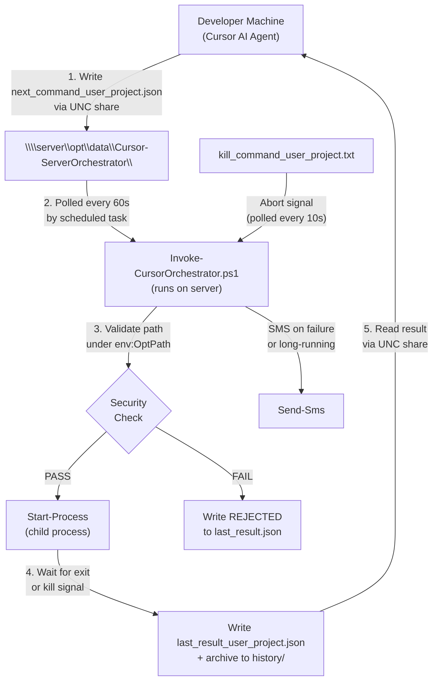
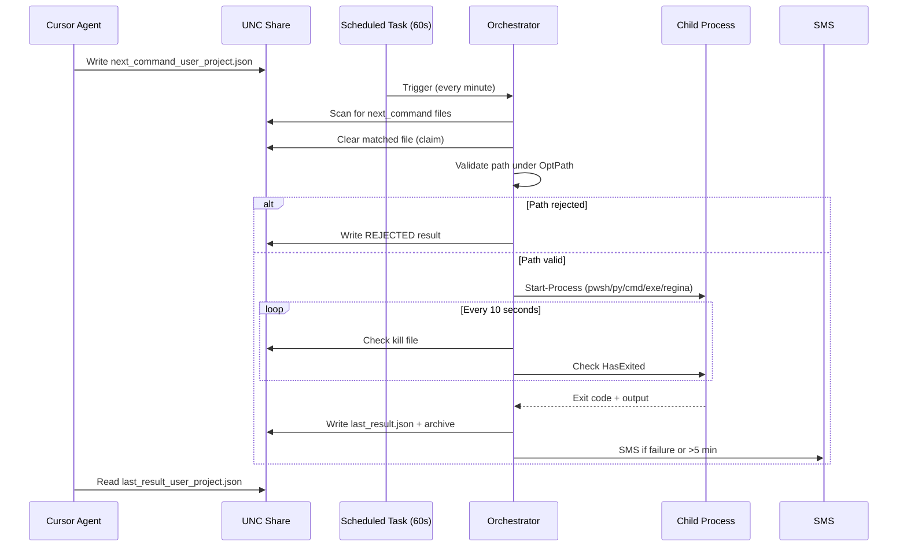
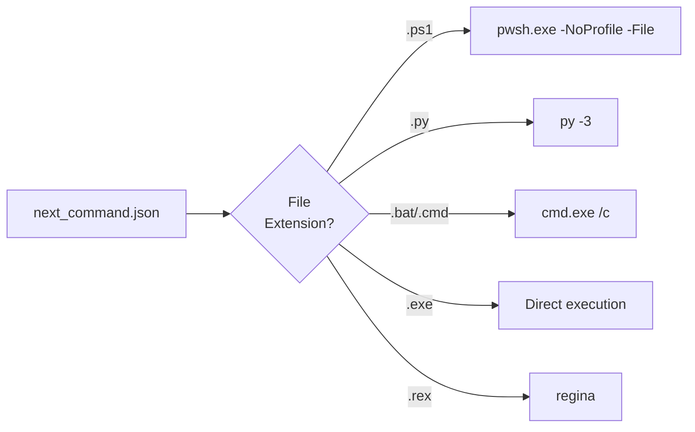
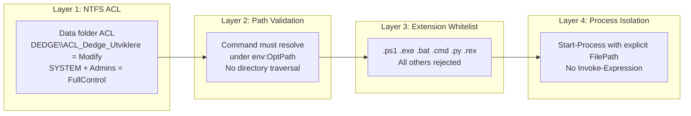

# Cursor Server Orchestrator

**Authors:** Geir Helge Starholm (geir.helge.starholm@Dedge.no)  
**Created:** 2026-03-03  
**Technology:** PowerShell 7 / Windows Server 2025

---

## Overview

Remote command execution framework for Cursor AI agents and developers. Runs scripts and executables on remote servers **without SSH or PSRemoting** by using a file-based command/result protocol over UNC shares, secured by Active Directory group ACL.

A scheduled task on each server polls every 60 seconds for command files. When a command is detected, the orchestrator validates the path, starts the process, monitors for kill signals, captures stdout/stderr, and writes a structured JSON result. Multiple user+project slots can run concurrently on the same server.

---

## Quick Start

### Trigger a remote command (from developer machine or AI agent)

```powershell
. "C:\opt\src\DedgePsh\DevTools\CodingTools\Cursor-ServerOrchestrator\_helpers\_CursorAgent.ps1"

Invoke-ServerCommand -ServerName 't-no1fkxtst-db' `
    -Command '%OptPath%\DedgePshApps\MyApp\Run-Main.ps1' `
    -Arguments '-Param1 value1' `
    -Project 'my-project' `
    -Timeout 600
```

### Check result

```powershell
$result = Read-ResultFile -ServerName 't-no1fkxtst-db' -Project 'my-project'
Write-Host "Status: $($result.status), Exit: $($result.exitCode)"
```

### Kill a running job

```powershell
Stop-ServerProcess -ServerName 't-no1fkxtst-db' -Project 'my-project' -Reason 'Stopping for redeploy'
```

### Monitor live stdout

```powershell
Get-ServerStdout -ServerName 't-no1fkxtst-db' -Project 'my-project' -TailLines 30
```

---

## How It Works



### Command lifecycle



### Executor mapping



---

## File Protocol

### Data folder (per server)

```
$env:OptPath\data\Cursor-ServerOrchestrator\
    next_command_<user>_<project>.json    ← Client writes, orchestrator consumes
    kill_command_<user>_<project>.txt     ← Client writes to abort
    running_command_<user>_<project>.json ← Present while executing
    last_result_<user>_<project>.json     ← Written on completion
    stdout_capture_<user>_<project>.txt   ← Temporary, deleted after result
    stderr_capture_<user>_<project>.txt   ← Temporary, deleted after result
    history\                              ← Archived results (last 100)
```

### Command file format

```json
{
  "command": "%OptPath%\\DedgePshApps\\MyApp\\Run-Main.ps1",
  "arguments": "-Param1 value1",
  "project": "my-project",
  "requestedBy": "FKGEISTA",
  "requestedAt": "2026-03-25T12:30:00",
  "captureOutput": true,
  "showWindow": false
}
```

### Result statuses

| Status | Meaning |
|---|---|
| COMPLETED | Exited with code 0 |
| FAILED | Exited with non-zero code |
| KILLED | Aborted via kill file |
| REJECTED | Path validation failed |
| PARSE_ERROR | Invalid JSON in command file |

---

## Concurrency

Each `<username>_<project>` combination is an independent execution slot. Within a slot, commands are serial (last-writer-wins). Across slots, commands run fully in parallel.

Example: `FKGEISTA_shadow-pipeline` and `FKSVEERI_log-checker` run concurrently on the same server without interference.

---

## Scripts and Files

| File | Purpose |
|---|---|
| `Invoke-CursorOrchestrator.ps1` | Server-side orchestrator (scheduled task entry point) |
| `_deploy.ps1` | Deploy to servers via Deploy-Handler |
| `_install.ps1` | Register scheduled task + set NTFS ACL |
| `_helpers/_CursorAgent.ps1` | Client API for agents (dot-source to use) |
| `_helpers/_Shared.ps1` | Low-level client helpers (Write-CommandFile, Read-ResultFile, etc.) |
| `_helpers/Set-CommandFolderAcl.ps1` | NTFS ACL setup for data folder |
| `_helpers/Test-CommandSecurity.ps1` | Standalone path validation |
| `_helpers/Run-InlineScript.ps1` | Execute base64-encoded PowerShell |
| `_localHelpers/Get-OrchestratorStatus.ps1` | Dev-machine probe: check all servers |
| `projects/_template/` | Template for new orchestrator projects |
| `docs/Architecture-CursorServerOrchestrator.md` | Full architecture documentation |
| `docs/Design-MultiProjectConcurrency.md` | Multi-slot concurrency design notes |

---

## Client API (`_CursorAgent.ps1`)

Dot-source to get these functions:

| Function | Description |
|---|---|
| `Invoke-ServerCommand` | Send command, wait for result (blocking) |
| `Invoke-ServerScript` | Shortcut for running a deployed script |
| `Get-ServerLog` | Read remote log files |
| `Test-OrchestratorReady` | Check if a slot is idle |
| `Get-AllRunningSlots` | List all active slots on a server |
| `Get-RunningProcess` | Get details of a running slot |
| `Stop-ServerProcess` | Write kill file to abort |
| `Get-ServerStdout` | Read live stdout capture |

---

## Security



---

## Deployment

```powershell
# Deploy to all servers
pwsh.exe -NoProfile -File "DevTools\CodingTools\Cursor-ServerOrchestrator\_deploy.ps1"
```

After first deploy, run `_install.ps1` on each target server to register the scheduled task and set folder ACL.

---

## Dependencies

| Module | Purpose |
|---|---|
| `GlobalFunctions` | Logging (`Write-LogMessage`), SMS (`Send-Sms`), app data paths |
| `Deploy-Handler` | Deployment (`Deploy-Files`) |
| `ScheduledTask-Handler` | Scheduled task registration (`_install.ps1`) |
