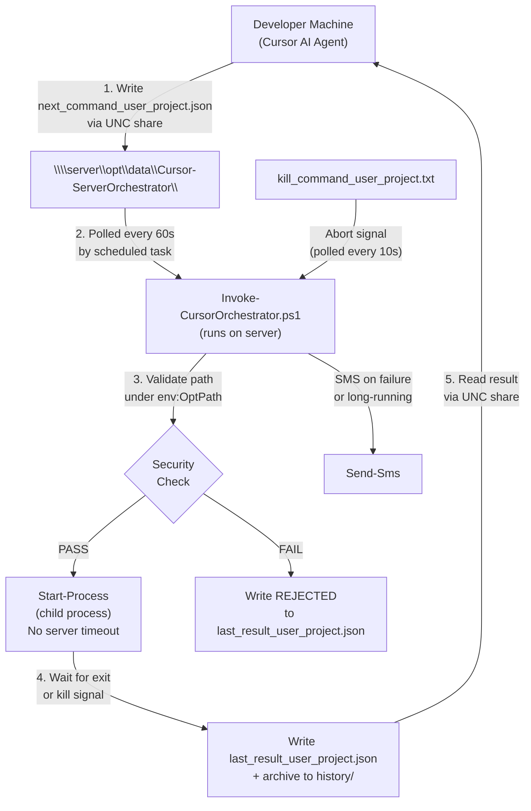
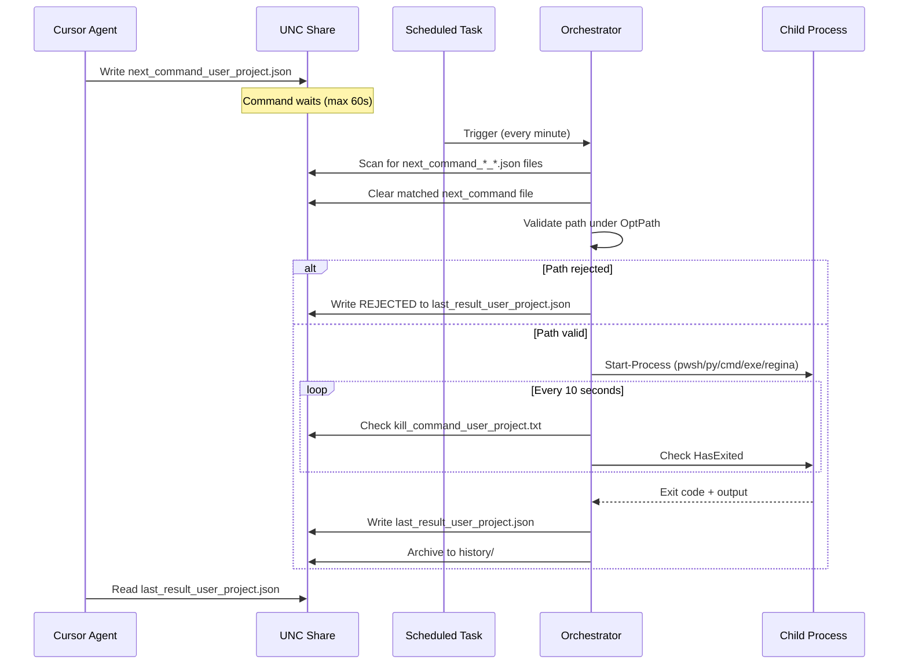
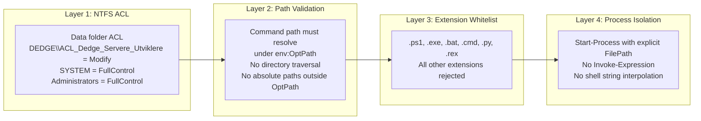
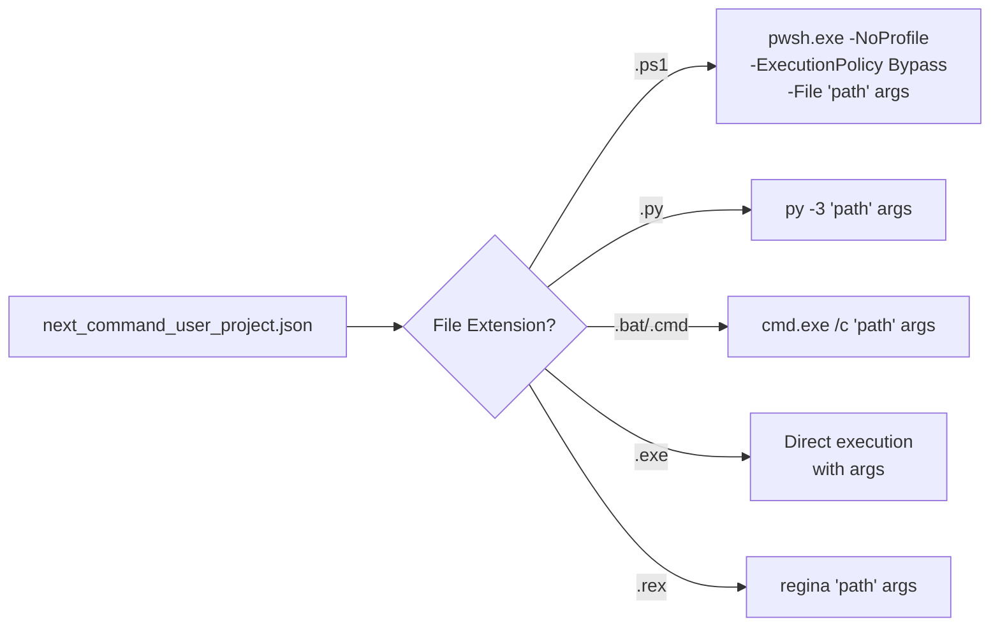

# Architecture: Cursor Server Orchestrator

**Author:** Geir Helge Starholm, www.dEdge.no  
**Created:** 2026-03-03  
**Technology:** PowerShell 7 / Windows Server 2025

---

## Overview

The Cursor Server Orchestrator is a generic remote command execution framework that allows Cursor AI agents (or developers) to trigger scripts and executables on remote servers without SSH or PSRemoting. It uses a file-based command/result protocol over UNC shares, secured by AD group ACL.

The design is modeled after the [Db2-ShadowDatabase orchestrator](../../DatabaseTools/Db2-ShadowDatabase/docs/Architecture-ShadowDatabasePipeline.md) but generalized to support any executable type under `$env:OptPath`.

---

## High-Level Architecture



---

## Command Lifecycle



---

## Folder Structure

```
DevTools/CodingTools/Cursor-ServerOrchestrator/
    Invoke-CursorOrchestrator.ps1       Main orchestrator (scheduled task entry point)
    _deploy.ps1                          Deploy to servers via Deploy-Handler
    _install.ps1                         Register scheduled task + set ACL
    _helpers/
        _Shared.ps1                      Client-side helpers (Write-CommandFile, Read-ResultFile, etc.)
        _CursorAgent.ps1                 High-level client helpers (Invoke-ServerCommand, etc.)
        Set-CommandFolderAcl.ps1         NTFS ACL setup for data folder
        Test-CommandSecurity.ps1         Standalone security validation script
    projects/
        _template/                       Template for new projects
            config.json
            README.md
            Run-Main.ps1
    docs/
        Architecture-CursorServerOrchestrator.md   (this file)
    .cursor/
        rules/
            cursor-orchestrator-projects.mdc        AI guidance for using the orchestrator
```

---

## Data Folder Layout (per server)

Data files use a `_<username>_<project>` suffix to support concurrent execution across
multiple user+project slots. For example, user `FKGEISTA` with project `shadow-pipeline`:

```
C:\opt\data\Cursor-ServerOrchestrator\
    next_command_FKGEISTA_shadow-pipeline.json      Written by developer/agent, consumed by orchestrator
    kill_command_FKGEISTA_shadow-pipeline.txt        Written by developer/agent to abort running command
    last_result_FKGEISTA_shadow-pipeline.json        Written by orchestrator after each execution
    running_command_FKGEISTA_shadow-pipeline.json    Present while the slot's command is executing
    stdout_capture_FKGEISTA_shadow-pipeline.txt      Temporary; deleted after result is written
    stderr_capture_FKGEISTA_shadow-pipeline.txt      Temporary; deleted after result is written
    history/
        2026-03-03_143022_FKGEISTA_shadow-pipeline_result.json
        2026-03-03_150510_FKGEISTA_shadow-pipeline_result.json
        ...                     Last 100 results archived per slot
```

Each unique `<username>_<project>` combination is an independent slot. Multiple slots
can execute concurrently on the same server without interfering with each other.

---

## Security Model



### ACL Details

The `_install.ps1` script calls `Set-CommandFolderAcl.ps1` which:
1. Disables inheritance on the data folder
2. Grants `NT AUTHORITY\SYSTEM` FullControl (for the scheduled task)
3. Grants `BUILTIN\Administrators` FullControl
4. Grants `DEDGE\ACL_Dedge_Servere_Utviklere` Modify access (read, write, delete)

Only members of the AD group can write `next_command_*_*.json` or `kill_command_*_*.txt` files.

### Path Validation

Before any command is executed, the orchestrator:
1. Expands environment variables in the command path (`$env:OptPath` -> `C:\opt`)
2. Resolves to a full absolute path via `[System.IO.Path]::GetFullPath()`
3. Verifies the resolved path starts with `$env:OptPath`
4. Verifies the file exists on disk
5. Verifies the file extension is in the allowed list

---

## Command File Format (next_command_user_project.json)

```json
{
  "command": "$env:OptPath\\DedgePshApps\\MyScript\\MyScript.ps1",
  "arguments": "-Param1 value1 -Param2 value2",
  "project": "my-project",
  "requestedBy": "FKGEISTA",
  "requestedAt": "2026-03-03T14:30:00",
  "captureOutput": true,
  "showWindow": false
}
```

| Field | Required | Default | Description |
|-------|----------|---------|-------------|
| command | Yes | -- | Path to executable. Must start with or resolve under `$env:OptPath` |
| arguments | No | "" | Command-line arguments passed to the executable |
| project | No | "" | Project name for organizing history |
| requestedBy | No | "" | Username of requester (for audit) |
| requestedAt | No | "" | ISO 8601 timestamp of request |
| captureOutput | No | true | Whether to capture stdout/stderr to result |
| showWindow | No | false | Show a visible console window for the process |

**Note:** The server-side job never times out. It runs until the process exits naturally or is killed via `kill_command_<user>_<project>.txt`. Client-side polling timeout is controlled by `-Timeout` on `Invoke-ServerCommand` (default 1800s / 30 min).

---

## Result File Format (last_result_user_project.json)

```json
{
  "command": "$env:OptPath\\DedgePshApps\\MyScript\\MyScript.ps1",
  "arguments": "-Param1 value1",
  "project": "my-project",
  "exitCode": 0,
  "status": "COMPLETED",
  "startedAt": "2026-03-03T14:30:22",
  "completedAt": "2026-03-03T14:31:45",
  "elapsedSeconds": 83.0,
  "output": "... stdout ...",
  "errorOutput": "... stderr ...",
  "executedBy": "SYSTEM",
  "server": "dedge-server"
}
```

### Status Values

| Status | Meaning |
|--------|---------|
| COMPLETED | Command exited with code 0 |
| FAILED | Command exited with non-zero code |
| KILLED | Aborted via kill_command_user_project.txt |
| REJECTED | Security validation failed |
| PARSE_ERROR | next_command file was not valid JSON |

---

## Executor Mapping



---

## Scheduled Task Configuration

Registered via `_install.ps1` using the `ScheduledTask-Handler` module:

| Setting | Value |
|---------|-------|
| Task Name | Cursor-ServerOrchestrator |
| Task Folder | DevTools |
| Executable | Invoke-CursorOrchestrator.ps1 |
| Frequency | Every minute |
| Run Level | Highest (elevated) |
| Window Style | Hidden |
| Run As | Current user (service account) |

---

## Project System

Each use case lives in `projects/<projectname>/` with:
- `config.json` -- project metadata and parameters
- `README.md` -- documentation
- One or more scripts that the orchestrator can execute

To create a new project, copy `projects/_template/` to `projects/<your-name>/` and customize.

### Example Projects

| Project | Purpose |
|---------|---------|
| log-checker | Search and summarize log files on remote servers |
| iis-health | Check IIS app pool status, recycle pools |
| db2-health | Check DB2 instance status, active connections |
| scheduled-task-status | Report on scheduled task health |

---

## Client-Side Usage

### Trigger a Command

```powershell
Import-Module GlobalFunctions -Force
. "C:\opt\src\DedgePsh\DevTools\CodingTools\Cursor-ServerOrchestrator\_helpers\_Shared.ps1"

Write-CommandFile -ServerName "dedge-server" `
    -Command '$env:OptPath\DedgePshApps\MyScript\Run.ps1' `
    -Arguments "-Environment Test" `
    -Project "my-project"

# With visible console window on the server
Write-CommandFile -ServerName "dedge-server" `
    -Command '$env:OptPath\DedgePshApps\MyScript\Run.ps1' `
    -Project "my-project" -ShowWindow
```

The `-Project` parameter (combined with the current `$env:USERNAME`) determines which
suffixed data files are used (e.g. `next_command_FKGEISTA_my-project.json`).

### Read the Result

```powershell
$result = Read-ResultFile -ServerName "dedge-server" -Project "my-project"
Write-Host "Status: $($result.status), Exit: $($result.exitCode)"
Write-Host "Output: $($result.output)"
```

### Wait for Result

```powershell
$result = Wait-ForResult -ServerName "dedge-server" -Project "my-project" `
    -TimeoutSeconds 120 -PollIntervalSeconds 10
if ($result) {
    Write-Host "Done: $($result.status)"
} else {
    Write-Host "Timed out waiting for result"
}
```

### Abort a Running Command

```powershell
Write-KillFile -ServerName "dedge-server" -Project "my-project" `
    -Reason "Aborting for redeployment"
```

---

## Deployment and Installation

### Deploy to Servers

```powershell
# From developer machine
.\DevTools\CodingTools\Cursor-ServerOrchestrator\_deploy.ps1
```

This deploys the orchestrator scripts to all `*-app` and `*-db` servers.

### Install on Server

After deployment, run on each target server:

```powershell
# On the server (or via deployment pipeline)
.\Cursor-ServerOrchestrator\_install.ps1
```

This:
1. Registers the `Cursor-ServerOrchestrator` scheduled task (runs every minute)
2. Creates the data folder with proper ACL

---

## Error Handling

- If a `next_command_*_*.json` file contains invalid JSON, a `PARSE_ERROR` result is written
- If the command path fails security validation, a `REJECTED` result is written
- If the slot's kill file is detected, the process tree is killed and a `KILLED` result is written
- The server-side job **never times out** -- it runs until the process exits or is killed
- If the orchestrator itself crashes, an SMS is sent to the default number
- SMS is sent for any non-zero exit code or execution longer than 5 minutes

---

## Concurrency Model

The orchestrator supports concurrent execution through a **file suffix** model. Each
combination of `<username>` and `<project>` forms an independent execution slot with its
own set of data files:

- `next_command_<user>_<project>.json`
- `kill_command_<user>_<project>.txt`
- `last_result_<user>_<project>.json`
- `running_command_<user>_<project>.json`
- `stdout_capture_<user>_<project>.txt`
- `stderr_capture_<user>_<project>.txt`

**One command per user+project slot** -- within a single slot, commands are serial
(last-writer-wins on the next_command file). Across different slots, commands run fully
in parallel without interference.

The scheduled task scans the data folder for all `next_command_*_*.json` files on each
invocation. Each match is picked up and started as a separate child process. The
dispatcher monitors all running slots concurrently (checking kill files and process exit
every 10 seconds) and writes results back to the slot-specific files.

This design was chosen over a subfolder-per-project approach because it is simpler: no
folder creation, no ACL propagation, and the flat file list is easy to scan and monitor.
See `Design-MultiProjectConcurrency.md` for the design history.

---

## Comparison with Db2-ShadowDatabase Orchestrator

| Aspect | Db2-ShadowDatabase | Cursor-ServerOrchestrator |
|--------|-------------------|--------------------------|
| Command file | `next_command.txt` (plain text) | `next_command_<user>_<project>.json` (structured JSON, per slot) |
| Scope | Shadow DB step scripts only | Any executable under `$env:OptPath` |
| Extensions | `.ps1` only | `.ps1`, `.exe`, `.bat`, `.cmd`, `.py`, `.rex` |
| Result file | None (log only) | `last_result.json` with structured output |
| History | None | `history/` folder with last 100 results |
| Security | Implicit (scripts in same folder) | ACL + path validation + extension whitelist |
| Server timeout | None | None (job runs until exit or kill) |
| Client wait timeout | N/A | Configurable (default 1800s / 30 min) |
| Visible window | N/A | Optional via `showWindow` in command JSON |
| Output capture | None | stdout + stderr captured to result file |
| Project system | Single purpose | Multi-project with templates |
