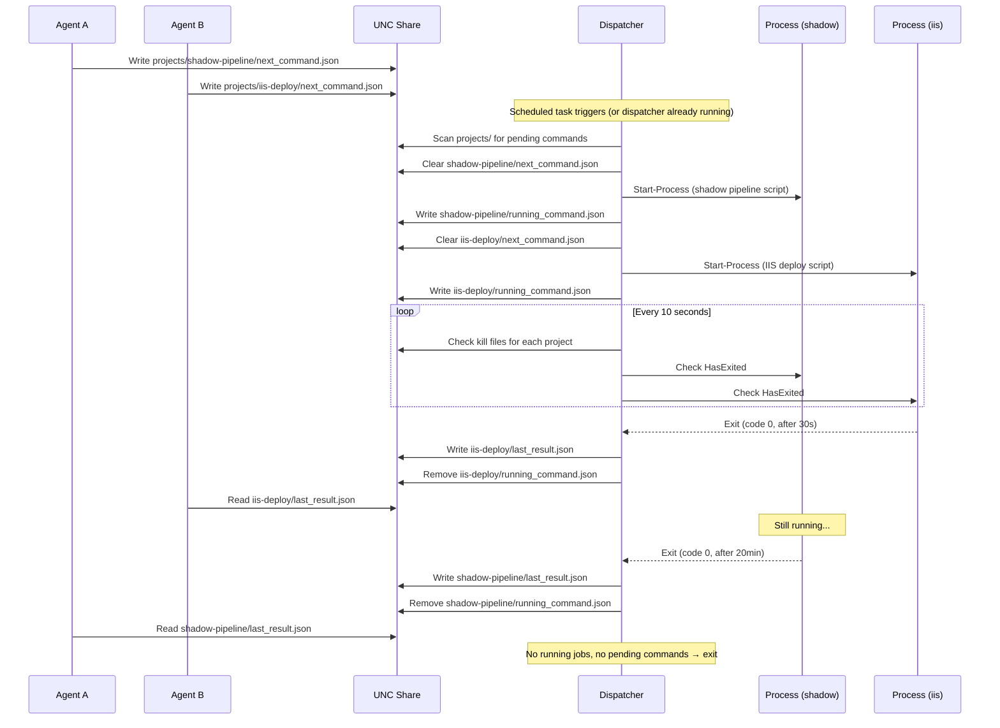

# Design: Multi-Project Concurrent Execution

**Author:** Geir Helge Starholm, www.dEdge.no  
**Created:** 2026-03-16  
**Technology:** PowerShell 7 / Windows Server 2025  
**Status:** Superseded

> **SUPERSEDED** -- The subfolder approach described below was replaced by a simpler
> `_username_project` file suffix approach. See
> [Architecture-CursorServerOrchestrator.md](Architecture-CursorServerOrchestrator.md)
> for the implemented design.

---

## Problem Statement

The current orchestrator processes **one command at a time per server**. All command, result, kill, running, and output files share a single flat folder (`opt\data\Cursor-ServerOrchestrator\`). When two clients target the same server, the second command silently overwrites the first — a last-writer-wins race condition with no warning.

The `project` field already exists in the command JSON but is only used for logging and audit. It is the natural key for enabling concurrent execution.

---

## Goal

Allow multiple projects to run commands **simultaneously** on the same server, isolated from each other, while preserving full backward compatibility with existing single-project usage.

---

## Current Architecture (Single-Slot)

```
opt\data\Cursor-ServerOrchestrator\
    next_command.json        ← single slot, overwritten by any client
    kill_command.txt         ← kills whatever is running
    last_result.json         ← overwritten after each execution
    running_command.json     ← single "busy" indicator
    stdout_capture.txt       ← shared, deleted after read
    stderr_capture.txt       ← shared, deleted after read
    history\                 ← flat archive, no project separation
```

**Bottleneck:** Every file is singular. The scheduled task reads one command, runs it to completion, then exits. The task scheduler prevents overlapping runs.

---

## Proposed Architecture (Multi-Project)

### New Folder Layout

```
opt\data\Cursor-ServerOrchestrator\
    projects\
        cursor-agent\
        │   next_command.json
        │   kill_command.txt
        │   last_result.json
        │   running_command.json
        │   stdout_capture.txt
        │   stderr_capture.txt
        │   history\
        shadow-pipeline\
        │   next_command.json
        │   kill_command.txt
        │   last_result.json
        │   running_command.json
        │   stdout_capture.txt
        │   stderr_capture.txt
        │   history\
        orchestrator-probe\
        │   (same structure)
        (any new project auto-creates its subfolder)
```

Each project gets a fully isolated set of files. Projects are created on-demand when the first command is written.

### Legacy Compatibility

The old flat files (`next_command.json` in the root) must continue to work during a transition period. The orchestrator checks the root first, and if a command exists there, processes it as project `_default`. This allows a rolling upgrade — servers can be updated before all clients are updated.

---

## Component Changes

### 1. `_Shared.ps1` — Client-Side Helpers

#### `Get-OrchestratorServerPath` → Add `-Project` parameter

```powershell
function Get-OrchestratorServerPath {
    param(
        [Parameter(Mandatory)]
        [string]$ServerName,

        [string]$Project = ""
    )
    $hostname = $ServerName.Split('.')[0]
    $basePath = "\\$($hostname)\opt\data\Cursor-ServerOrchestrator"

    if ([string]::IsNullOrWhiteSpace($Project)) {
        return $basePath
    }

    $sanitized = $Project -replace '[^a-zA-Z0-9_\-]', '_'
    return Join-Path $basePath "projects" $sanitized
}
```

#### `Write-CommandFile` → Use project-scoped path

The function already accepts `$Project`. Change the path resolution to use the project subfolder. Auto-create the subfolder via UNC if it doesn't exist.

```powershell
function Write-CommandFile {
    param(
        [Parameter(Mandatory)] [string]$ServerName,
        [Parameter(Mandatory)] [string]$Command,
        [string]$Arguments = "",
        [string]$Project = "cursor-agent",    # default project name
        [bool]$CaptureOutput = $true,
        [switch]$ShowWindow
    )

    $serverPath = Get-OrchestratorServerPath -ServerName $ServerName -Project $Project

    if (-not (Test-Path $serverPath)) {
        New-Item -ItemType Directory -Path $serverPath -Force | Out-Null
    }

    $commandFile = Join-Path $serverPath "next_command.json"
    # ... rest unchanged ...
}
```

#### `Read-ResultFile`, `Read-RunningCommand`, `Write-KillFile`, `Wait-ForResult` → Add `-Project` parameter

All functions that resolve server paths must accept an optional `-Project` to read from the correct subfolder. Default to `"cursor-agent"` for backward compatibility.

#### `Stop-RunningCommand` → Project-aware kill

Must accept `-Project` to target the correct `kill_command.txt` and `running_command.json`.

---

### 2. `_CursorAgent.ps1` — High-Level Client Helpers

#### `Invoke-ServerCommand` → Pass `-Project` through the chain

```powershell
function Invoke-ServerCommand {
    param(
        [Parameter(Mandatory)] [string]$Command,
        [string]$Arguments = "",
        [string]$ServerName = $script:DefaultServer,
        [string]$Project = "cursor-agent",
        [int]$Timeout = 1800,
        [int]$PollInterval = 15,
        [bool]$CaptureOutput = $true,
        [switch]$ShowWindow
    )

    Write-CommandFile -ServerName $ServerName -Command $Command `
        -Arguments $Arguments -Project $Project `
        -CaptureOutput $CaptureOutput @showWindowSplat

    $result = Wait-ForResult -ServerName $ServerName -Project $Project `
        -TimeoutSeconds $Timeout -PollIntervalSeconds $PollInterval

    # ... rest unchanged ...
}
```

#### `Test-OrchestratorReady` → Project-scoped busy check

Currently checks one global `running_command.json`. Two options:

- **Option A (recommended):** Accept `-Project` and check only that project's slot. This answers "can I submit a command for this project?"
- **Option B:** Check all project subfolders and report which are busy. This answers "what's running on this server?"

Implement both:

```powershell
function Test-OrchestratorReady {
    param(
        [string]$ServerName = $script:DefaultServer,
        [string]$Project = "cursor-agent"
    )
    # Check only the specified project's slot
}

function Get-AllRunningProjects {
    param(
        [string]$ServerName = $script:DefaultServer
    )
    # Scan all project subfolders for running_command.json
    # Return list of project names with their running command details
}
```

#### `Get-ServerStdout` → Project-scoped

Must accept `-Project` to read from the correct `stdout_capture.txt`.

#### `Stop-ServerProcess` → Project-scoped

Must accept `-Project` to kill the correct project's process.

---

### 3. `Invoke-CursorOrchestrator.ps1` — Server-Side (Major Change)

This is the biggest change. The orchestrator must become a **dispatcher** that can manage multiple concurrent child processes.

#### Current Flow (Serial)

```
1. Read next_command.json
2. Clear it
3. Execute (blocking)
4. Write result
5. Exit
```

#### New Flow (Dispatcher)

```
1. Scan projects\ for subfolders with non-empty next_command.json
2. Also check root next_command.json (legacy compatibility)
3. For each pending command:
   a. Clear its next_command.json
   b. Start-Process as a child (non-blocking)
   c. Write running_command.json in that project's folder
4. Monitor ALL running child processes:
   a. Poll kill files for each project every 10 seconds
   b. Check HasExited on each child process
   c. When a child exits: write result, archive to history, clean up
5. Stay alive while ANY child process is running OR any new commands appear
6. Exit when all children have finished and no new commands are pending
```

#### Dispatcher Architecture

```powershell
$script:RunningJobs = @{}  # key = project name, value = job info hashtable

function Start-ProjectCommand {
    param([string]$ProjectName, [hashtable]$Command, [string]$ProjectDataPath)

    # Validate security, resolve executor, Start-Process
    # Write running_command.json to project subfolder
    # Add to $script:RunningJobs
}

function Test-ProjectKillRequested {
    param([string]$ProjectDataPath)
    # Check kill_command.txt in the project's subfolder
}

function Complete-ProjectJob {
    param([string]$ProjectName)
    # Write result, archive to history, remove from $script:RunningJobs
    # Remove running_command.json
    # Send SMS if needed
}

# Main loop
while ($true) {
    # 1. Scan for new commands in all project subfolders
    $pendingProjects = Get-PendingCommands

    foreach ($pending in $pendingProjects) {
        if ($script:RunningJobs.ContainsKey($pending.Name)) {
            # This project already has a running job — skip (or queue)
            continue
        }
        Start-ProjectCommand -ProjectName $pending.Name `
            -Command $pending.Command -ProjectDataPath $pending.Path
    }

    # 2. Monitor running jobs
    foreach ($jobName in @($script:RunningJobs.Keys)) {
        $job = $script:RunningJobs[$jobName]

        # Check kill file
        if (Test-ProjectKillRequested -ProjectDataPath $job.DataPath) {
            Stop-ProcessTree -ParentPid $job.Process.Id
            Complete-ProjectJob -ProjectName $jobName
            continue
        }

        # Check if process exited
        if ($job.Process.HasExited) {
            Complete-ProjectJob -ProjectName $jobName
        }
    }

    # 3. Exit condition: no running jobs and no pending commands
    if ($script:RunningJobs.Count -eq 0) {
        $anyPending = Get-PendingCommands
        if ($anyPending.Count -eq 0) {
            break
        }
    }

    Start-Sleep -Seconds 10
}
```

#### Scheduled Task Behavior

The scheduled task triggers every 60 seconds with "do not start new instance if already running." This is still correct:

- If the dispatcher is idle (no jobs, no pending commands), it exits immediately. The next trigger starts a new instance.
- If the dispatcher is monitoring running jobs, it stays alive. The scheduler skips the trigger. When all jobs finish and no new commands exist, the dispatcher exits. The next trigger picks up any new commands.
- While the dispatcher is alive and monitoring, it also scans for **new** pending commands every 10 seconds (the same loop that checks kill files and process exits). This means a new command submitted while another is running gets picked up within 10 seconds, not 60.

#### Concurrency Limit (Optional Safety)

Add a configurable maximum concurrent jobs per server to prevent resource exhaustion:

```powershell
$script:MaxConcurrentJobs = 5  # configurable

if ($script:RunningJobs.Count -ge $script:MaxConcurrentJobs) {
    Write-LogMessage "Max concurrent jobs ($($script:MaxConcurrentJobs)) reached, deferring new commands" -Level WARN
    # Don't pick up new commands this cycle
}
```

---

### 4. `_install.ps1` — Installation

#### Create `projects\` subfolder with ACL

```powershell
$projectsPath = Join-Path $dataPath "projects"
if (-not (Test-Path $projectsPath)) {
    New-Item -ItemType Directory -Path $projectsPath -Force | Out-Null
}
```

The ACL set by `Set-CommandFolderAcl.ps1` already uses inheritance flags (`ContainerInherit + ObjectInherit`), so subfolders inherit the same permissions automatically. No ACL changes needed.

---

### 5. `Get-OrchestratorStatus.ps1` — Local Helper

Currently sends probes and waits for results using the flat structure. Must be updated to:

1. Send probes to a dedicated `orchestrator-probe` project subfolder
2. Read results from that project's `last_result.json`
3. Optionally report all running projects per server

---

### 6. History Archiving

Each project gets its own `history\` subfolder. The `Save-ResultToHistory` function receives the project-specific `$DataPath` and archives there. The `MaxHistoryFiles` limit (100) applies per project.

---

## File Change Summary

| File | Change Type | Description |
|------|-------------|-------------|
| `_helpers/_Shared.ps1` | Modify | Add `-Project` param to all path-resolving functions; auto-create project subfolders |
| `_helpers/_CursorAgent.ps1` | Modify | Pass `-Project` through all high-level functions; add `Get-AllRunningProjects` |
| `Invoke-CursorOrchestrator.ps1` | **Rewrite** | Convert from single-command executor to multi-project dispatcher with monitoring loop |
| `_install.ps1` | Minor | Create `projects\` subfolder |
| `_helpers/Set-CommandFolderAcl.ps1` | No change | Inheritance flags already propagate to subfolders |
| `_helpers/Run-InlineScript.ps1` | No change | Stateless, project-unaware |
| `_localHelpers/Get-OrchestratorStatus.ps1` | Modify | Use project-scoped probes and result reading |
| `docs/Architecture-*.md` | Update | Document new folder layout and dispatcher architecture |
| `.cursor/rules/cursor-orchestrator-internals.mdc` | Update | Document multi-project data flow |
| `.cursor/rules/cursor-orchestrator-projects.mdc` | Update | Update concurrency section, add project examples |

---

## Migration Strategy

### Phase 1: Server-Side (Deploy First)

1. Update `Invoke-CursorOrchestrator.ps1` with the dispatcher logic
2. Add legacy check: if root `next_command.json` has content, treat it as project `_default` and move the command to `projects\_default\next_command.json` before processing
3. Deploy to all servers via `_deploy.ps1`
4. Run `_install.ps1` on each server to create the `projects\` folder (optional — the dispatcher creates it on first use)

### Phase 2: Client-Side

1. Update `_Shared.ps1` and `_CursorAgent.ps1` with project-scoped functions
2. Default project remains `"cursor-agent"` — existing callers that don't pass `-Project` work unchanged
3. Deploy client helpers to servers (they're used both locally and remotely)

### Phase 3: Update Consumers

Update scripts that use the orchestrator to pass meaningful project names:

| Consumer | Suggested Project Name |
|----------|----------------------|
| Cursor AI agent (default) | `cursor-agent` |
| Shadow Database pipeline | `shadow-pipeline` |
| Orchestrator status probe | `orchestrator-probe` |
| IIS deployment | `iis-deploy` |
| Inline script execution | `cursor-agent-inline` |

### Phase 4: Remove Legacy Support

After all clients are updated (verify no root-level `next_command.json` files are being created on any server), remove the legacy fallback code.

---

## Backward Compatibility

| Scenario | Behavior |
|----------|----------|
| Old client → New server | Client writes root `next_command.json`. Server treats it as project `_default`. Works. |
| New client → Old server | Client writes to `projects\cursor-agent\next_command.json`. Old server ignores it (only reads root). **Fails silently.** |
| New client → New server | Full project isolation. Works. |

**Risk mitigation for "New client → Old server":** The updated `Write-CommandFile` should check if the project subfolder structure exists on the target server. If not, fall back to writing to the root path and log a warning. This avoids silent failures during rolling upgrades.

```powershell
$projectPath = Get-OrchestratorServerPath -ServerName $ServerName -Project $Project
if (-not (Test-Path (Split-Path $projectPath))) {
    Write-LogMessage "Server $($ServerName) does not have projects\ folder — using legacy root path" -Level WARN
    $projectPath = Get-OrchestratorServerPath -ServerName $ServerName
}
```

---

## Per-Project Isolation Guarantees

| Aspect | Isolation |
|--------|-----------|
| Command file | Each project has its own `next_command.json` — no overwrite risk |
| Kill file | Each project has its own `kill_command.txt` — killing project A does not affect project B |
| Result file | Each project has its own `last_result.json` — no clobber |
| Running indicator | Each project has its own `running_command.json` — accurate busy/idle per project |
| Stdout/stderr | Each project captures to its own files — no interleaving |
| History | Each project archives to its own `history\` — clean audit trail |
| Process | Each project's command runs as a separate `Start-Process` child — OS-level isolation |

---

## Concurrency Scenarios

### Scenario 1: Two Different Projects, Same Server

```
Client A: Invoke-ServerCommand -Project 'shadow-pipeline' -Command '...' -ServerName 'srv'
Client B: Invoke-ServerCommand -Project 'iis-deploy' -Command '...' -ServerName 'srv'
```

Both commands run simultaneously. Each has its own command/result/kill files. No conflict.

### Scenario 2: Same Project, Same Server (Still Serial)

```
Client A: Invoke-ServerCommand -Project 'cursor-agent' -Command '...' -ServerName 'srv'
Client B: Invoke-ServerCommand -Project 'cursor-agent' -Command '...' -ServerName 'srv'
```

Same behavior as today within a single project slot — last-writer-wins on `next_command.json`. This is by design: a single project represents a single logical workstream.

### Scenario 3: Long-Running Job + Quick Probe

```
Client A: Invoke-ServerCommand -Project 'shadow-pipeline' -Command '...' -Timeout 7200
   (running for 45 minutes)
Client B: Invoke-ServerScript -Project 'orchestrator-probe' -Script 'hostname'
   (completes in 2 seconds)
```

The probe completes independently. Client A's long-running job is unaffected. Currently impossible — the probe would have to wait for the 45-minute job to finish.

---

## Sequence Diagram: Multi-Project Dispatcher



---

## Resource and Risk Considerations

### CPU / Memory

Each concurrent command spawns a separate process (`pwsh.exe`, `py`, `cmd.exe`, etc.). On typical database/app servers with 8-16 cores and 32-64 GB RAM, running 2-3 concurrent PowerShell scripts is not a concern. The configurable `$MaxConcurrentJobs` provides a safety cap.

### Disk I/O

Stdout capture files are written per-project, so there's no contention. Log files may interleave entries from multiple projects, but `Write-LogMessage` already includes source context (function name, PID) for disambiguation.

### Network (UNC)

No additional UNC traffic beyond the new subfolder paths. The polling frequency is unchanged.

### Failure Modes

| Failure | Impact | Mitigation |
|---------|--------|------------|
| Dispatcher crashes mid-execution | All running child processes become orphans | Child processes are independent OS processes — they continue to run. `running_command.json` files remain on disk, allowing manual cleanup. The next dispatcher invocation can detect orphaned `running_command.json` files (PID no longer exists) and clean them up. |
| Subprocess hangs | Blocks that project's slot but not others | Kill file mechanism works per-project |
| Disk full | Cannot write result files | Same as today — no new risk |
| Folder permission error | Cannot create project subfolder | Fail with clear error; existing projects unaffected |

### Orphan Detection (Recommended)

When the dispatcher starts, before scanning for new commands, it should check all existing `running_command.json` files. If the PID recorded in the file is no longer running on the system, the file is orphaned. The dispatcher should:

1. Write a `CRASHED` result for that project
2. Remove the orphaned `running_command.json`
3. Log a warning

```powershell
function Resolve-OrphanedJobs {
    param([string]$ProjectsPath)

    $projectDirs = Get-ChildItem -Path $ProjectsPath -Directory -ErrorAction SilentlyContinue
    foreach ($dir in $projectDirs) {
        $runningFile = Join-Path $dir.FullName "running_command.json"
        if (-not (Test-Path $runningFile)) { continue }

        $content = Get-Content $runningFile -Raw -ErrorAction SilentlyContinue
        if ([string]::IsNullOrWhiteSpace($content)) { continue }

        $running = $content | ConvertFrom-Json
        $proc = Get-Process -Id $running.pid -ErrorAction SilentlyContinue
        if ($null -eq $proc) {
            Write-LogMessage "Orphaned job detected: project=$($dir.Name), PID=$($running.pid)" -Level WARN
            # Write CRASHED result, remove running file
        }
    }
}
```

---

## Testing Plan

### Unit Tests (Local)

1. **Write-CommandFile** creates correct project subfolder and writes JSON
2. **Read-ResultFile** reads from correct project subfolder
3. **Get-OrchestratorServerPath** returns correct path with and without `-Project`
4. **Legacy fallback** — `Write-CommandFile` with no project subfolder on target falls back to root

### Integration Tests (Server)

1. Submit two commands to different projects on the same server — both complete successfully
2. Submit a command while another project is running — new command starts immediately
3. Kill one project while another is running — only the targeted project is killed
4. Submit a command with no `-Project` (uses default) — backward compatible
5. Orphan detection — kill a child process externally, verify the dispatcher writes a CRASHED result on next startup
6. Legacy client writes root `next_command.json` — dispatcher processes it as `_default`
7. `Get-OrchestratorStatus.ps1` correctly probes and reports per-project status
8. Max concurrent jobs limit is respected

---

## Implementation Order

1. **`_Shared.ps1`** — Add `-Project` parameter to all functions (low risk, backward compatible via defaults)
2. **`_CursorAgent.ps1`** — Pass `-Project` through, add `Get-AllRunningProjects`
3. **`Invoke-CursorOrchestrator.ps1`** — Rewrite as dispatcher (highest risk, most complex)
4. **`_install.ps1`** — Create `projects\` folder
5. **`Set-CommandFolderAcl.ps1`** — Verify inheritance propagates (likely no change needed)
6. **`Get-OrchestratorStatus.ps1`** — Update to use project-scoped probes
7. **Deploy and test** on `dedge-server` first
8. **Deploy to all servers** after validation
9. **Update cursor rules** and architecture documentation
10. **Remove legacy fallback** after all clients are confirmed on the new path

---

## Implemented Design: File Suffix Approach

The subfolder approach described above was evaluated but ultimately replaced by a simpler
**file suffix** model. Instead of creating per-project subfolders, all data files remain
in the flat `Cursor-ServerOrchestrator\` data folder with a `_<username>_<project>` suffix
appended to each filename:

```
next_command_FKGEISTA_shadow-pipeline.json
kill_command_FKGEISTA_shadow-pipeline.txt
last_result_FKGEISTA_shadow-pipeline.json
running_command_FKGEISTA_shadow-pipeline.json
stdout_capture_FKGEISTA_shadow-pipeline.txt
stderr_capture_FKGEISTA_shadow-pipeline.txt
```

### Why the suffix approach was preferred

| Concern | Subfolder approach | Suffix approach |
|---------|-------------------|-----------------|
| Folder creation | Requires auto-creating subfolders via UNC on first use | No folder creation needed |
| ACL propagation | Must verify inheritance flags propagate to new subfolders | No new folders, existing ACL covers all files |
| File scanning | `Get-ChildItem -Recurse` across subfolders | Simple `Get-ChildItem -Filter 'next_command_*_*.json'` on flat directory |
| Legacy compatibility | Complex fallback for root-level files during migration | No migration needed; new files coexist with old ones |
| Monitoring / debugging | Must inspect multiple subdirectories | All state files visible in one `dir` listing |
| Code complexity | Path resolution needs subfolder logic everywhere | Suffix logic is a simple string append |

The suffix model achieves the same concurrency guarantees (one command per user+project
slot, full isolation of command/result/kill/output files) with significantly less
implementation and operational complexity.
