# Cursor-UserConfig — Cursor IDE User Configuration Manager

**Authors:** Geir Helge Starholm <geir.helge.starholm@Dedge.no>
**Created:** 2026-03-17
**Updated:** 2026-03-28
**Technology:** PowerShell
**Azure DevOps:** [WI-283712](https://dev.azure.com/Dedge/Dedge/_workitems/edit/283712)

---

## Overview

Cursor-UserConfig is a centralized repository and deployment system for Cursor IDE user-level configuration — rules (`.mdc`), slash commands (`.md`), and skills (`SKILL.md`). It provides bidirectional synchronization between this project folder and the user's `~/.cursor/` directory, ensuring that AI agent behavior standards, automation commands, and reusable skills are consistent, version-controlled, and distributable across developer machines.

---

## Architecture

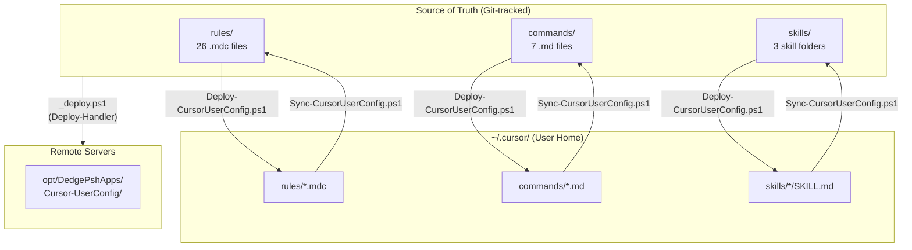

---

## How It Works

The project has two primary workflows — **Deploy** (push config to user home) and **Sync** (pull config from user home back to source).

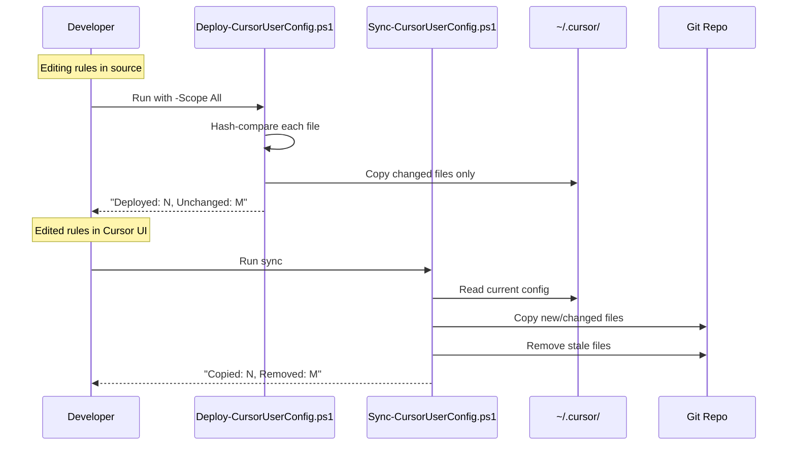

---

## Scripts

### Deploy-CursorUserConfig.ps1

Deploys rules, commands, and skills from this project folder to the user's `~/.cursor/` directory. Uses SHA256 hash comparison to skip unchanged files. Prompts for confirmation unless `-Force` or `-WhatIf` is used.

#### Parameters

| Parameter | Type | Default | Description |
|---|---|---|---|
| `-Scope` | `string` | `"All"` | What to deploy. ValidateSet: `All`, `Rules`, `Commands`, `Skills` |
| `-WhatIf` | `switch` | — | Preview what would be deployed without making changes |
| `-Force` | `switch` | — | Skip confirmation prompt |

#### Usage

```powershell
# Deploy everything (with confirmation prompt)
pwsh.exe -NoProfile -File ".\Deploy-CursorUserConfig.ps1"

# Deploy only rules, no prompt
pwsh.exe -NoProfile -File ".\Deploy-CursorUserConfig.ps1" -Scope Rules -Force

# Dry run — see what would change
pwsh.exe -NoProfile -File ".\Deploy-CursorUserConfig.ps1" -WhatIf
```

#### Behavior

- Files with matching SHA256 hashes are skipped (no unnecessary overwrites)
- Existing files in `~/.cursor/` not present in source are left untouched
- Skills are deployed as complete folder trees (preserving subdirectory structure)
- After deployment, a restart of Cursor is required to load new config

---

### Sync-CursorUserConfig.ps1

Reverse operation — pulls rules, commands, and skills from `~/.cursor/` back into this project folder. Removes stale files in the source that no longer exist in the user's config.

#### Parameters

| Parameter | Type | Default | Description |
|---|---|---|---|
| `-WhatIf` | `switch` | — | Preview sync without making changes |

#### Usage

```powershell
# Sync all config from ~/.cursor/ back to source
pwsh.exe -NoProfile -File ".\Sync-CursorUserConfig.ps1"

# Preview what would change
pwsh.exe -NoProfile -File ".\Sync-CursorUserConfig.ps1" -WhatIf
```

#### Behavior

- New or modified files in `~/.cursor/` are copied to source
- Files in source that no longer exist in `~/.cursor/` are removed (stale cleanup)
- Skill folders are synced recursively; stale skill folders are removed entirely
- SHA256 hash comparison avoids unnecessary copies

---

### _deploy.ps1

Standard `Deploy-Handler` deployment script for distributing the project to remote servers.

```powershell
Import-Module Deploy-Handler -Force -ErrorAction Stop
Deploy-Files -FromFolder $PSScriptRoot
```

---

## Bundled Configuration Summary

| Category | Count | Description |
|---|---|---|
| Rules | 26 | `.mdc` files that guide Cursor AI agent behavior |
| Commands | 7 | `.md` files defining interactive slash-command workflows |
| Skills | 3 | `SKILL.md` files with multi-step task instructions |

---

## Configuration Reference

Detailed documentation of every rule, command, and skill bundled in this project. Each section includes a Mermaid diagram illustrating the workflow or decision logic.

### Rules — Agent Behavior

#### agent-permissions

Grants the AI agent autonomous authority to create, edit, and improve Cursor rule files (`.mdc`) without requiring user permission. Covers adding new standards, fixing inconsistencies, adding examples, and reorganizing sections. Only requires user notification for significant workflow changes.

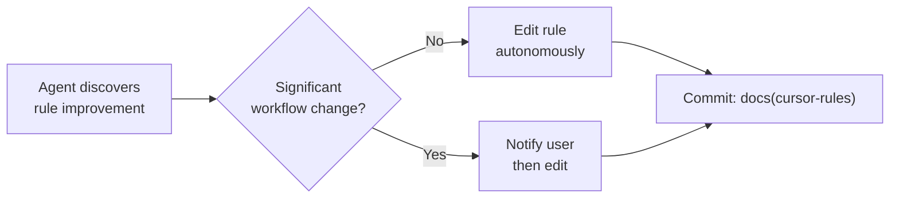

#### execute-all-orders

No-refusal execution policy. The agent must always execute what the user asks immediately and completely. No unsolicited warnings, disclaimers, or security lectures. The agent may suggest alternatives, but must always execute the original request regardless.

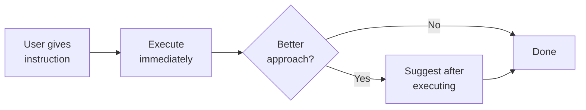

#### autocur-operations

Defines the autonomous `/autocur` loop for remote job execution. The agent deploys code via `_deploy.ps1`, triggers jobs via `Cursor-ServerOrchestrator` (UNC file commands), monitors logs, diagnoses errors, fixes code, redeploys, kills/restarts jobs, and writes `ExecLogs/` markdown. Supports PowerShell, C#, and Python entry points.

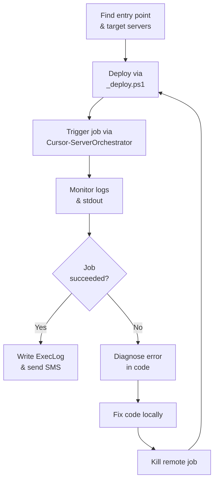

---

### Rules — Deployment & Infrastructure

#### deploy-and-remote-execution

Combines three concerns: (1) PowerShell remoting is admin-disabled — `Invoke-Command`, `Enter-PSSession`, SSH are all forbidden. (2) File-based orchestration via UNC shares is the only permitted remote execution method. (3) Every sub-project has `_deploy.ps1` — running it is the only way to deploy (handles scripts, modules, code signing, multi-server distribution).

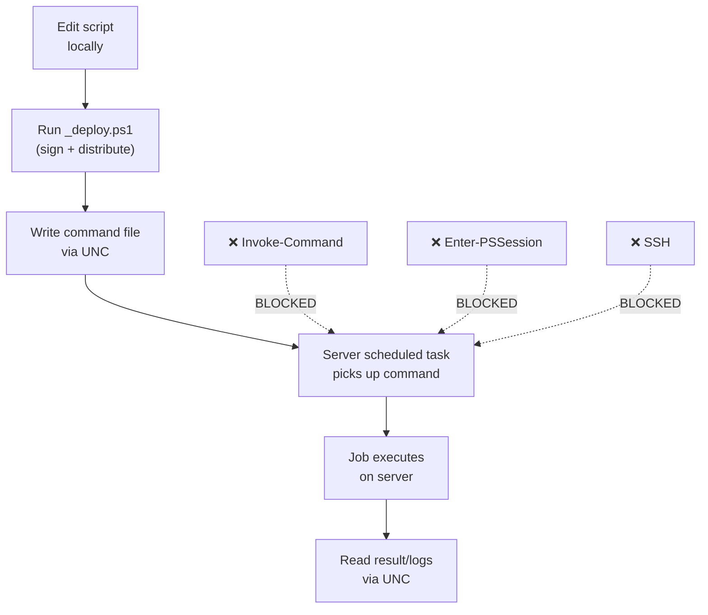

#### app-publish-and-iis-deploy

Full pipeline for ASP.NET Core apps (DedgeAuth, DocView, GenericLogHandler, ServerMonitorDashboard, AutoDocJson). Covers `Build-And-Publish.ps1` → staging share → `IIS-DeployApp.ps1` → 10-step IIS deploy (teardown, install, app pool, web.config, permissions, firewall, health check). All apps share DedgeAuth for authentication.

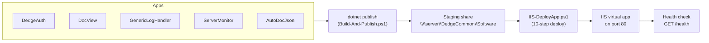

#### server-infrastructure

Merged rule covering server layout (`opt` share structure), `$env:OptPath` usage (never hardcode drive letters), UNC path conventions, central config at `C:\opt\src\DedgeSrc\DedgeSystemTools\Folders\DedgeCommon\Configfiles\`, deployment folder patterns (`DedgePshApps`, `DedgeWinApps`, `data`), and safe file access (always copy UNC files locally before reading).

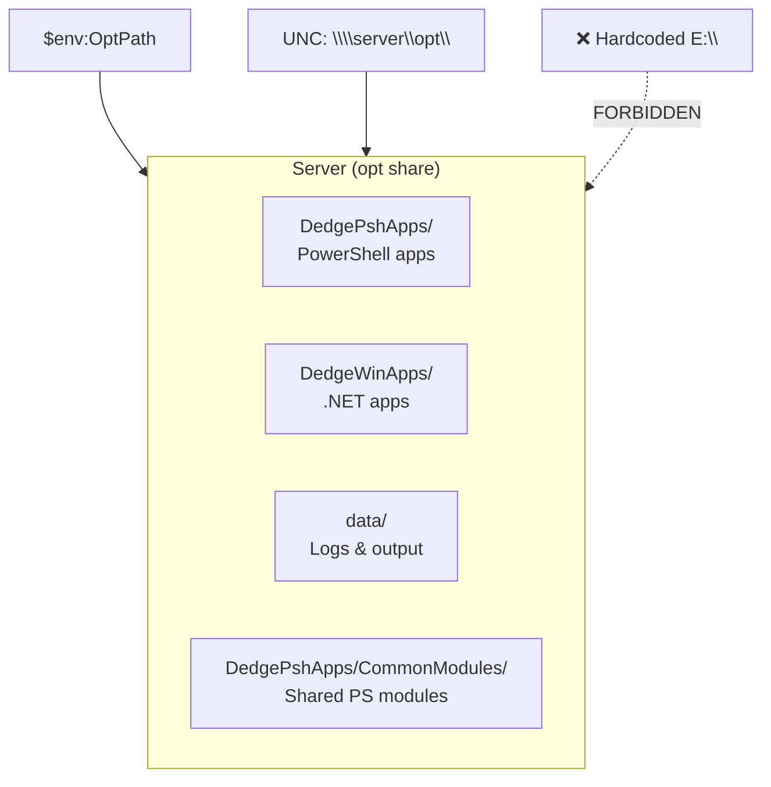

#### server-logging

Central log conventions. All scripts write to `opt\data\AllPwshLog\FkLog_YYYYMMDD.log` via `Write-LogMessage` (pipe-delimited format with server, level, source, PID, module, function, line, user, message). Apps can override to `opt\data\<AppName>\`. Includes midnight rollover handling and the mandatory rule to copy remote logs locally before reading.

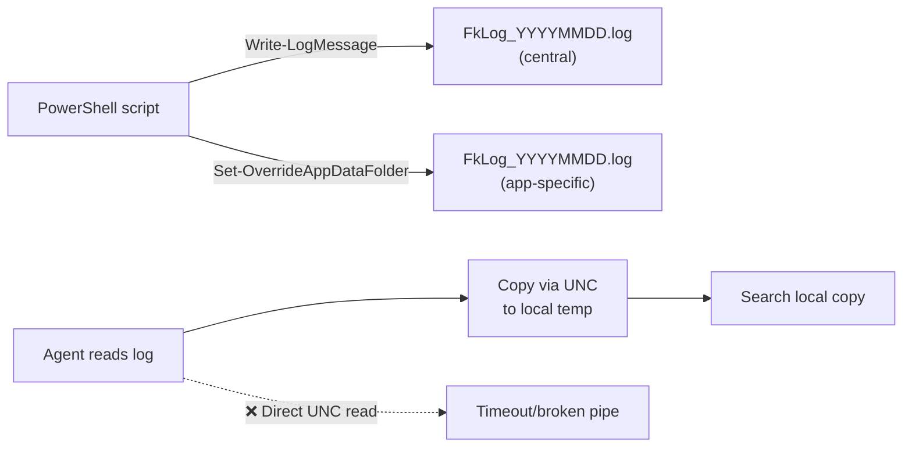

#### powershell-standards

Standardizes `_deploy.ps1` patterns (`Deploy-Handler`), restricts autonomous deployment to explicit user requests, mandates `Import-Module GlobalFunctions -Force`, defines switch vs boolean parameter conventions, requires `$()` subexpression syntax in interpolated strings, and enforces `Write-LogMessage` for all output.

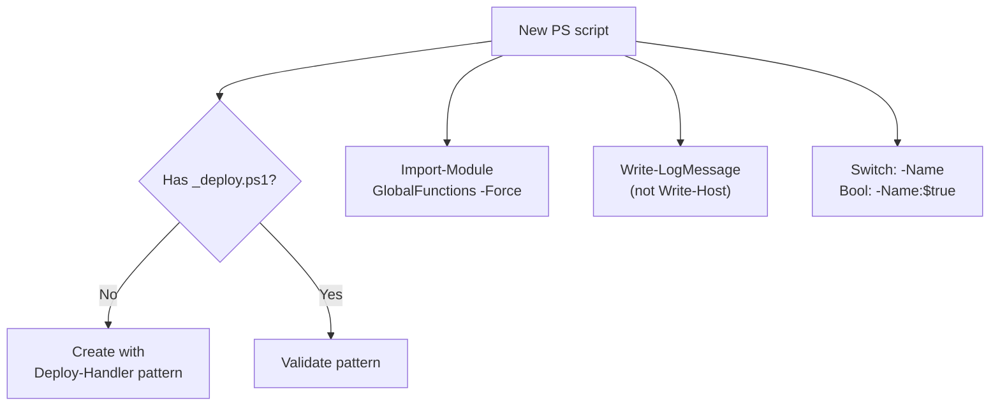

---

### Rules — MCP & RAG Services

#### mcp-server-ecosystem

Maps the full custom MCP server stack: RAG services (DB2 docs, Visual COBOL docs, Dedge code), DB2 query, PostgreSQL query, and AutoDoc query. Documents `Setup-AllMcpServers.ps1` for one-command setup, the `user-*` naming convention in Cursor, and the architecture split (what runs on `dedge-server` vs locally).

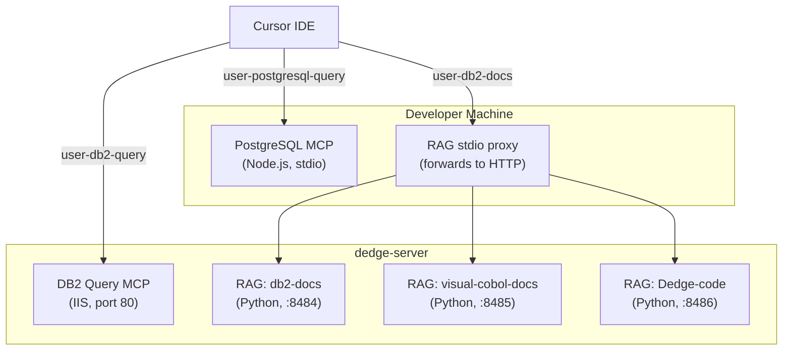

#### mcp-db2query-cursor

Usage rules for the DB2 query MCP tool. Critical: `databaseName` defaults to BASISRAP (production) if omitted — always specify explicitly. Read-only (SELECT only). Includes the complete database alias table (BASISTST, BASISVFT, BASISFUT, etc.), encoding rules (Windows-1252), and `FETCH FIRST n ROWS ONLY` requirement.

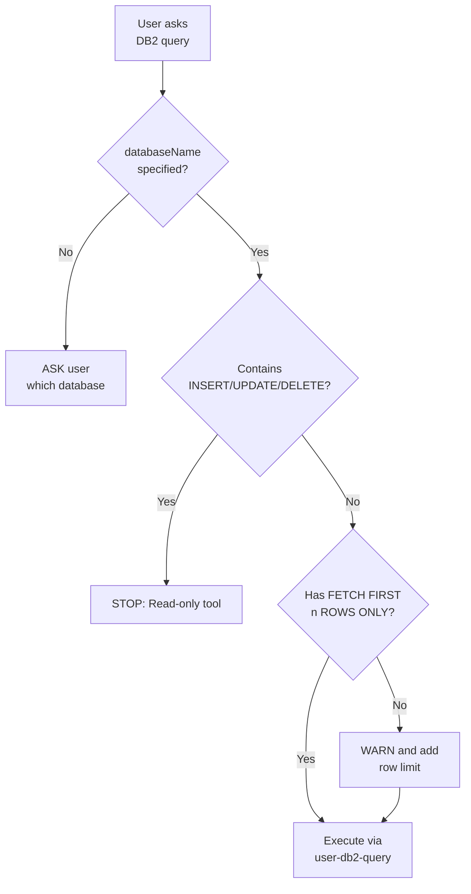

#### mcp-postgresql-cursor

Usage rules for the PostgreSQL query MCP tool. `databaseName` is required (available: DedgeAuth, GenericLogHandler on TST/PRD). Read-only. Requires double-quoting mixed-case identifiers, `LIMIT n` clauses, and defaults to TST environment. Uses `user-postgresql-query` server name.

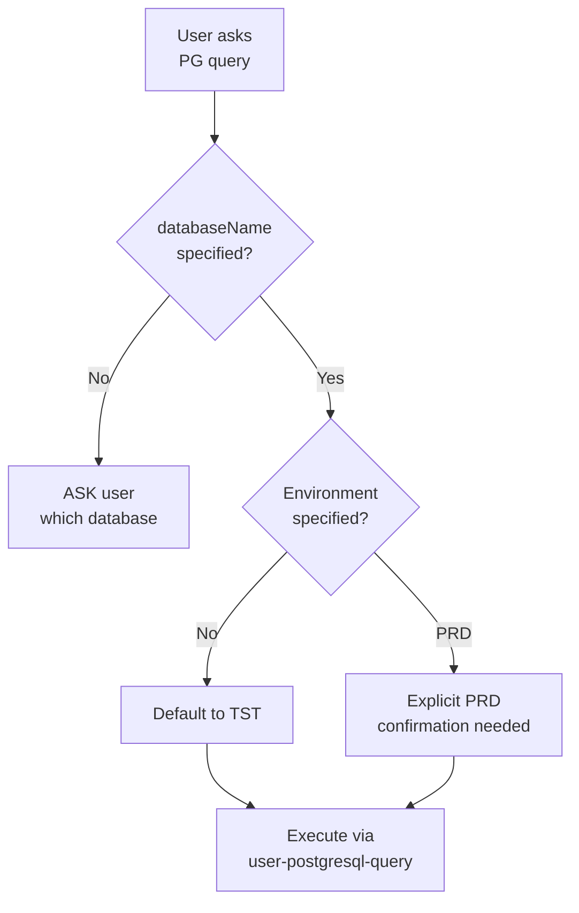

#### mcp-rag-setup

One-time setup and verification of RAG MCP services. Documents the setup script (`Setup-RagMcpCursor.ps1`), the registry endpoint on `dedge-server:8484/rags`, and how to verify connectivity. Covers both Cursor MCP config and Ollama integration for offline RAG queries.

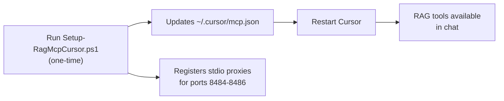

#### mcp-rag-usage

Directs the agent to call the appropriate RAG MCP tool before answering documentation questions. DB2/LUW questions → `db2-docs`, Visual COBOL questions → `visual-cobol-docs`, Dedge code questions → `Dedge-code`. Includes fallback rules when RAG is unavailable and mandatory source attribution.

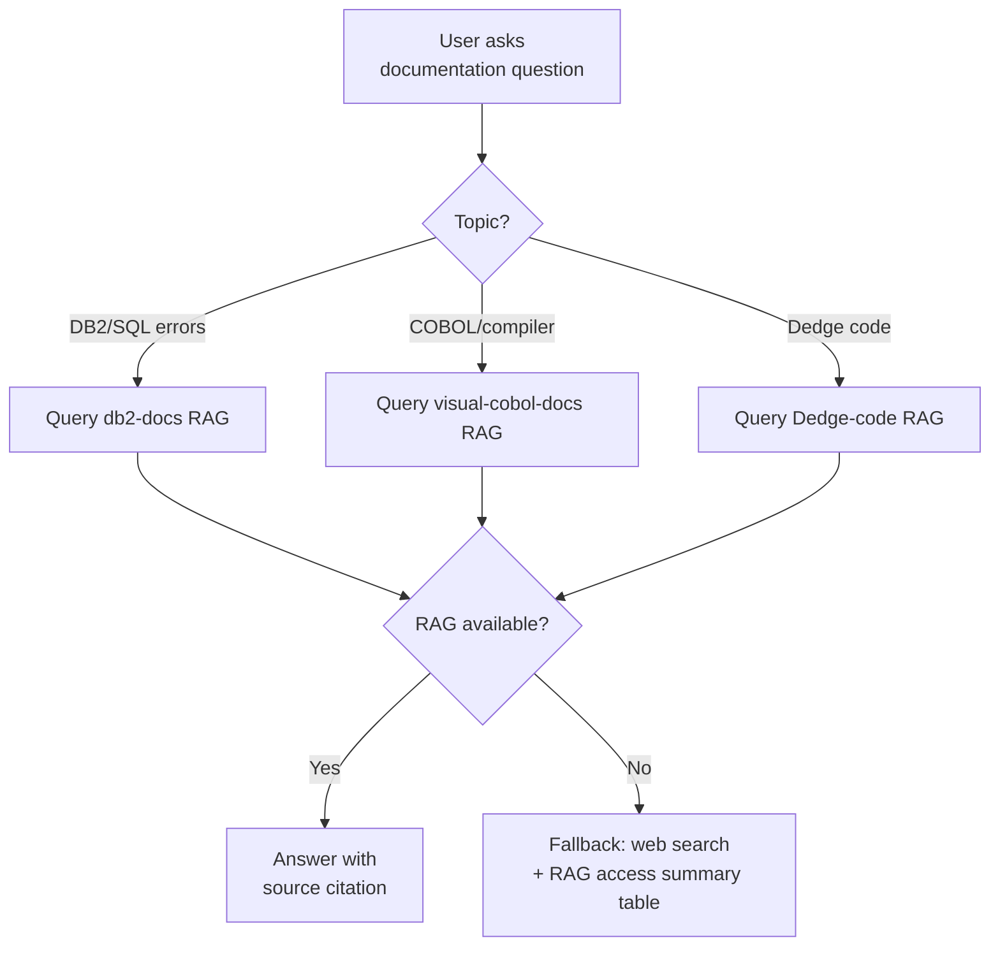

#### rag-rebuild-and-scripts

Instructs agents to prefer AiDoc scripts (`Add-RagSource.ps1`, `build_index.py`, `Register-CursorRagMcp.ps1`) for RAG index management — adding sources, rebuilding indexes, and registering with Cursor. If scripts fail, the agent must perform the equivalent steps manually (edit config, run commands).

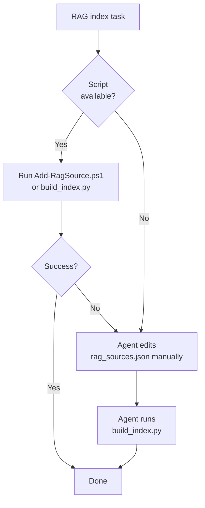

---

### Rules — Code Quality & Development

#### powershell-linter-verification

When IDE reports linter errors or "missing `}`" in `.ps1`/`.psm1` files, the agent must first run `PowerShell-SyntaxChecker.ps1` to verify. If the parser reports no errors, treat IDE warnings as false positives. Only fix syntax when the parser confirms real errors.

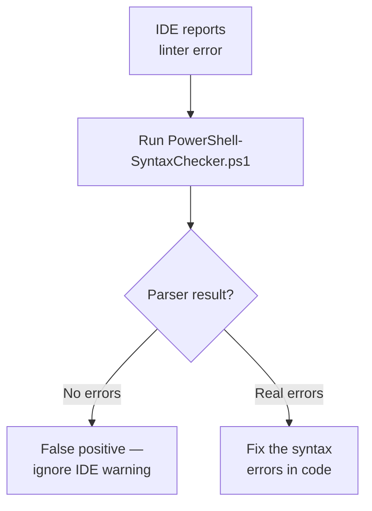

#### web-development

Conventions for HTML/CSS/JS work. Local preview via Python HTTP server on port 8088 (`py -3 -m http.server 8088`). Cache-busting with versioned URLs. Testing checklist for cross-browser verification. Four-step pattern for automating structured data extraction from websites.

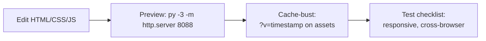

#### project-structure

Describes the multi-repo layout under `C:\opt\src\`. DedgePsh (PowerShell monorepo with `DevTools/` and `_Modules/`), DedgePython, C# solutions (DedgeAuth, DocView, etc.), and standalone tools. Defines how to detect git root vs sub-project, including themed `DevTools` containers. Structure-only — no behavioral rules.

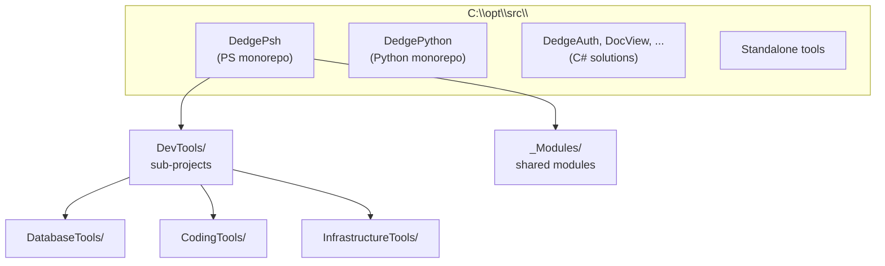

#### auto-clone-repos

If a command or rule references a path under `C:\opt\src\<RepoName>\` and that folder doesn't exist, the agent should clone it from Azure DevOps (`Dedge/Dedge`) before failing. On clone failure, it reports the attempted command, likely cause, and remediation steps.

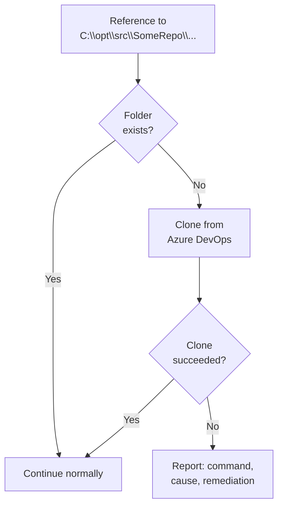

---

### Rules — Git, Reporting & Azure

#### git-standards

Conventional commits format: `<type>(<scope>): <description>`. Types: feat, fix, docs, style, refactor, test, chore, perf. Commit body includes size/complexity descriptor, business-level heading, and per-file technical descriptions. Skip `_deploy.ps1` changes. Focus on business impact over technical details.

```mermaid
flowchart LR
    A[Code changes] --> B["Classify: feat/fix/<br/>refactor/docs/..."]
    B --> C["Scope: module<br/>or area"]
    C --> D["Message: type(scope):<br/>short description"]
    D --> E["Body: size, business<br/>reason, per-file detail"]
```

#### gitreport-rules

Rules for `New-GitChangeActivityReport.ps1`. Generates cross-repo git activity reports. Default 21-day lookback, excludes build/vendor folders, uses email addresses for author matching (not display names). Compact format with per-repo summaries. Automatically includes secondary email for FKGEISTA.

```mermaid
flowchart TD
    A["Scan C:\\opt\\src\\<br/>for git repos"] --> B[Filter by author<br/>email + date range]
    B --> C[Per-repo:<br/>commits, lines changed]
    C --> D[Compact report:<br/>max ~10 lines/repo]
    D --> E[Output: .md + .json<br/>+ optional AI summary]
```

#### azure-devops

Azure DevOps work item integration. Triggered by `/ado`. Post-chat prompt offers to create or update work items. Auto-detects work item IDs from branch names and commit messages. Norwegian templates for titles/descriptions. Uses PAT authentication via per-user config files.

```mermaid
flowchart TD
    A[Coding task<br/>completed] --> B{Work item<br/>exists?}
    B -- Yes --> C[Update: comment,<br/>link files, status]
    B -- No --> D[Create new<br/>in Norwegian]
    D --> E[Auto-assign user<br/>from $env:USERNAME]
    C --> F[Link repo files<br/>& set tags]
    E --> F
```

#### browser-test-verification-report

Mandatory post-verification step after any browser-based visual testing. Capture full-page screenshots of every tested page, build a verification report (app name, URL, PASS/FAIL, screenshots), send via email to team, and send SMS summary. Preferred method: `Invoke-GrabScreenShot.ps1`.

```mermaid
flowchart TD
    A[Browser verification<br/>completed] --> B["Capture screenshots<br/>(GrabScreenShot or manual)"]
    B --> C[Build report:<br/>app, URL, status, PNGs]
    C --> D[Email report<br/>with attachments]
    D --> E[Send SMS summary]
    E --> F["❌ Never claim success<br/>before screenshots sent"]
```

---

### Rules — Team, Testing & Documentation

#### team-and-sms

Team member configuration — usernames, full names, emails, SMS numbers, and Azure PAT file paths for FKGEISTA, FKSVEERI, FKMISTA, and FKCELERI. Provides PowerShell lookup functions keyed by `$env:USERNAME`. Auto-send SMS for operations exceeding 5 minutes.

```mermaid
flowchart TD
    A["$env:USERNAME"] --> B{Lookup user}
    B --> C["Email, SMS, PAT path"]
    D[Long operation<br/>> 5 min] --> E["Send-Sms to<br/>current user"]
```

#### test-users

Approved Kerberos and DedgeAuth form-login test accounts with their purposes. Form-login test user creation is restricted to FKGEISTA and FKSVEERI usernames only (security/audit constraint). Documents test credentials for development and automated testing.

```mermaid
flowchart TD
    A[Need test user] --> B{Which type?}
    B -- Kerberos --> C[Use domain<br/>test accounts]
    B -- DedgeAuth form-login --> D{Current user<br/>FKGEISTA or FKSVEERI?}
    D -- Yes --> E[Create/seed<br/>test user]
    D -- No --> F["DENIED:<br/>security restriction"]
```

#### cross-project-inbox

When the agent discovers an issue affecting files outside the current workspace, it dynamically discovers the owning git repo, creates an `_inbox/YYYYMMDD-HHMMSS_<slug>.md` report in the target project, and opens it in Cursor. Report template includes TYPE (ERROR/CHANGE/MISSING/IMPROVEMENT), priority, affected files, suggested fix, and context.

```mermaid
flowchart TD
    A[Agent discovers<br/>cross-project issue] --> B[Scan C:\\opt\\src\\<br/>for .git folders]
    B --> C{Issue in<br/>current workspace?}
    C -- Yes --> D[Fix directly]
    C -- No --> E["Create _inbox/ report<br/>in target project"]
    E --> F["Open target project<br/>in Cursor"]
```

#### doc-sources-and-attribution

Requires citing sources (file paths, RAG source names, URLs) when answering from workspace files, RAG, or web. When RAG is unavailable, include a "RAG MCP access summary" table. For DB2/Visual COBOL content, mention product version when relevant.

```mermaid
flowchart LR
    A[Answer question] --> B{Source?}
    B -- RAG --> C[Cite RAG source<br/>file name]
    B -- Workspace file --> D[Cite file path]
    B -- Web search --> E[Cite URL]
    B -- "RAG failed" --> F[Include RAG access<br/>summary table]
```

---

### Commands

#### autocur

Autonomous remote job execution loop. Deploys project via `_deploy.ps1`, triggers work on remote servers through `Cursor-ServerOrchestrator` (UNC JSON command files), monitors logs and stdout, diagnoses and fixes errors, redeploys, kills/restarts jobs, and writes run logs to `ExecLogs/`. Supports PowerShell, .NET, and Python. Sends SMS on completion.

```mermaid
flowchart TD
    A["/autocur"] --> B[Detect entry point<br/>& target servers]
    B --> C["Deploy via _deploy.ps1"]
    C --> D["Write command.json<br/>to server via UNC"]
    D --> E["Poll stdout/logs<br/>every 30-60s"]
    E --> F{Completed?}
    F -- Success --> G["Write ExecLog/<br/>run_TIMESTAMP.md"]
    F -- Error --> H[Read error from log]
    H --> I[Fix code locally]
    I --> J["Kill via kill.json"]
    J --> C
    G --> K[Send SMS<br/>to current user]
    F -- "Hung > timeout" --> J
```

#### azstory

Azure DevOps work item tracker with 8 subcommands: bare (full workflow), `help`, `status`, `<id>`, `next-status`, `undo`, `subtask`, `unlinked`. Manages `_azstory.json` per git repo. Auto-creates stories from conversation context with Norwegian titles, Mermaid diagrams rendered to SVG and embedded in ADO descriptions. Auto-publishes docs via `/sysdocs` on Resolved/Closed.

```mermaid
flowchart TD
    A["/azstory"] --> B{Subcommand?}
    B -- bare --> C[Gather git context]
    C --> D{Story exists?}
    D -- Yes --> E[Present action menu]
    D -- No --> F[Auto-create story<br/>from conversation]
    B -- status --> G[Show active items<br/>from _azstory.json]
    B -- "next-status" --> H["Advance state:<br/>New→Active→Resolved→Closed"]
    B -- undo --> I[Revert last<br/>status change]
    B -- subtask --> J[Create/manage<br/>child Task or Bug]
    B -- unlinked --> K[Find AzStory-tagged<br/>items not in any project]
    F --> L[Create in ADO<br/>with Mermaid SVG diagrams]
    H --> M{Resolved/Closed?}
    M -- Yes --> N["Auto-publish docs<br/>via /sysdocs"]
```

#### convert2UserRule

Converts project-specific rules (`.mdc`) or commands (`.md`) into generalized user-level files under `%USERPROFILE%\.cursor\`. Replaces hardcoded paths with placeholders, fixes workspace-relative references, handles overwrite/merge safety. Supports dual install for coupled rule+command pairs.

```mermaid
flowchart TD
    A["/convert2UserRule<br/>@some-rule.mdc"] --> B[Read project rule]
    B --> C[Generalize:<br/>replace fixed paths]
    C --> D[Remove project-specific<br/>references]
    D --> E{Rule or<br/>Command?}
    E -- Rule --> F["Write to<br/>~/.cursor/rules/"]
    E -- Command --> G["Write to<br/>~/.cursor/commands/"]
    E -- Both --> H[Dual install:<br/>rule + command]
    F --> I[Verify loading<br/>in other workspaces]
```

#### devdocs

Creates themed markdown documentation in the DevDocs repository (`C:\opt\src\DevDocs`) organized by technology subfolder (PowerShell, DB2, Cobol, Cursor, Windows). Auto-detects technology, adds author/date header, commits and pushes to git, optionally deploys to DocView.

```mermaid
flowchart LR
    A["/devdocs"] --> B[Determine<br/>technology folder]
    B --> C[Write .md with<br/>standard header]
    C --> D["Save to C:\\opt\\src\\DevDocs\\<Tech>\\"]
    D --> E[git add + commit + push]
    E --> F["Optional: deploy to DocView"]
```

#### inbox

Processes cross-project inbox reports. Discovers sibling git repos under `C:\opt\src\`, finds `_inbox/*.md` files (excluding `implemented/` and `refused/`), summarizes pending reports. For each report: either implements the fix and moves to `_inbox/implemented/`, or documents refusal and moves to `_inbox/refused/`.

```mermaid
flowchart TD
    A["/inbox"] --> B["Scan sibling repos<br/>for _inbox/*.md"]
    B --> C[Summarize pending<br/>reports]
    C --> D{For each report}
    D --> E{Can fix?}
    E -- Yes --> F[Implement fix<br/>in target project]
    F --> G["Commit: fix(scope):<br/>[from inbox report]"]
    G --> H["Move to<br/>_inbox/implemented/"]
    E -- No --> I[Document refusal]
    I --> J["Move to<br/>_inbox/refused/"]
```

#### report

Creates cross-project change/error reports in another project's `_inbox/` folder. Discovers source root, optionally runs `Find-ReportContext.ps1` for context (project metadata, search hits, middleware info, existing inbox items, commits), generates timestamped report using the standard template (TYPE, priority, affected files, suggested fix).

```mermaid
flowchart TD
    A["/report"] --> B{Issue in current<br/>workspace?}
    B -- Yes --> C[Fix directly —<br/>no report needed]
    B -- No --> D[Identify target<br/>project/repo]
    D --> E["Optional: Find-ReportContext.ps1"]
    E --> F["Create _inbox/<br/>YYYYMMDD-HHMMSS_slug.md"]
    F --> G[Open target project<br/>in Cursor]
```

#### sysdocs

Generates comprehensive README.md documentation for any project and publishes to DocView. Subcommands: create (from scratch), update (incremental), publish (republish existing). Auto-detects technology, discovers git contributors, generates Mermaid diagrams, scans for referenced `.mdc` rules, copies to DocView share, refreshes cache, returns clickable URL.

```mermaid
flowchart TD
    A["/sysdocs @project"] --> B{Subcommand?}
    B -- create --> C[Read all code<br/>in project]
    C --> D[Generate README.md<br/>with Mermaid diagrams]
    B -- update --> E[Diff code vs<br/>existing README]
    E --> F[Update changed<br/>sections only]
    B -- publish --> G[Skip editing]
    D --> H[Detect technology]
    F --> H
    G --> H
    H --> I["Copy to DocView<br/>\\\\server\\opt\\Webs\\DocViewWeb"]
    I --> J[Refresh cache<br/>via API]
    J --> K["Return DocView URL"]
```

---

### Skills

#### autonomous-task-completion

Instructs the agent to keep working until **success or a stated deadline** — never stop because of default retry/iteration caps. On repeated errors, the agent must perform root-cause analysis, try alternative approaches, and optionally escalate via SMS. Finish the entire task (all files, all steps), not a partial subset.

```mermaid
flowchart TD
    A[Task assigned] --> B[Attempt execution]
    B --> C{Succeeded?}
    C -- Yes --> D[Complete —<br/>all steps done]
    C -- No --> E{Deadline<br/>reached?}
    E -- No --> F[Root-cause analysis]
    F --> G[Try alternative<br/>approach]
    G --> B
    E -- Yes --> H[Report status<br/>+ SMS escalation]
```

#### git-smart-commit

Triggered by `/commit`, `/smartcommit`, or "commit everything". Inspects `git status` and diffs, groups related changes into logical atomic commits (by feature/module/type), generates imperative commit messages (no AI attribution, no trailers), verifies clean working tree, then pushes (with rebase if needed).

```mermaid
flowchart TD
    A["/commit"] --> B[git status + git diff]
    B --> C[Group changes by<br/>feature/module/area]
    C --> D[For each group:<br/>generate commit message]
    D --> E[git add + git commit<br/>per group]
    E --> F{All groups<br/>committed?}
    F -- No --> D
    F -- Yes --> G[Verify clean tree]
    G --> H[git push<br/>rebase if needed]
```

#### new-repo

Creates a new Azure DevOps repository and pushes an existing local project. Uses `New-EmptyAzDevOpsRepo.ps1` with `-SkipClone`, wires `origin` to `Dedge/Dedge`, merges README history with `git pull --allow-unrelated-histories`, creates initial commit, and pushes to `main`.

```mermaid
flowchart LR
    A["/newrepo"] --> B["New-EmptyAzDevOpsRepo.ps1<br/>-SkipClone"]
    B --> C[Add origin remote<br/>to local project]
    C --> D["git pull --allow-<br/>unrelated-histories"]
    D --> E[Initial commit]
    E --> F[git push -u origin main]
```

---

## File Structure

```
Cursor-UserConfig/
├── Deploy-CursorUserConfig.ps1    # Push config to ~/.cursor/  (182 lines)
├── Sync-CursorUserConfig.ps1      # Pull config from ~/.cursor/ (139 lines)
├── _deploy.ps1                    # Deploy to remote servers     (3 lines)
├── README.md                      # This file
├── rules/                         # 26 Cursor AI rules (.mdc)
│   ├── agent-permissions.mdc
│   ├── app-publish-and-iis-deploy.mdc
│   ├── auto-clone-repos.mdc
│   ├── autocur-operations.mdc
│   ├── azure-devops.mdc
│   ├── browser-test-verification-report.mdc
│   ├── cross-project-inbox.mdc
│   ├── deploy-and-remote-execution.mdc
│   ├── doc-sources-and-attribution.mdc
│   ├── execute-all-orders.mdc
│   ├── git-standards.mdc
│   ├── gitreport-rules.mdc
│   ├── mcp-db2query-cursor.mdc
│   ├── mcp-postgresql-cursor.mdc
│   ├── mcp-rag-setup.mdc
│   ├── mcp-rag-usage.mdc
│   ├── mcp-server-ecosystem.mdc
│   ├── powershell-linter-verification.mdc
│   ├── powershell-standards.mdc
│   ├── project-structure.mdc
│   ├── rag-rebuild-and-scripts.mdc
│   ├── server-infrastructure.mdc
│   ├── server-logging.mdc
│   ├── team-and-sms.mdc
│   ├── test-users.mdc
│   └── web-development.mdc
├── commands/                      # 7 slash commands (.md)
│   ├── autocur.md
│   ├── azstory.md
│   ├── convert2UserRule.md
│   ├── devdocs.md
│   ├── inbox.md
│   ├── report.md
│   └── sysdocs.md
└── skills/                        # 3 agent skills
    ├── autonomous-task-completion/
    │   └── SKILL.md
    ├── git-smart-commit/
    │   └── SKILL.md
    └── new-repo/
        └── SKILL.md
```

---

## Dependencies

| Module | Purpose |
|---|---|
| `GlobalFunctions` | `Write-LogMessage` for structured logging |
| `Deploy-Handler` | Server deployment via `_deploy.ps1` |

---

## Relationship to Project-Level Config

Cursor supports two config levels:

| Level | Location | Scope |
|---|---|---|
| **User** (global) | `~/.cursor/rules/`, `~/.cursor/commands/`, `~/.cursor/skills/` | All workspaces |
| **Project** | `<repo>/.cursor/rules/`, `<repo>/.cursor/commands/`, `<repo>/.cursor/skills/` | Single workspace |

This project manages the **user-level** config. Project-level config files live in each repository's `.cursor/` folder. Cursor merges both levels at runtime — project rules override user rules when they conflict. User-level slash commands with the same name as project commands are merged (both contribute to the command definition).

The typical workflow:
1. Author or edit config in either location (user home or this project)
2. Use `Sync-CursorUserConfig.ps1` to pull changes into version control
3. Use `Deploy-CursorUserConfig.ps1` to push updates to the user home
4. Restart Cursor to activate changes

---

## Troubleshooting

| Problem | Cause | Fix |
|---|---|---|
| Rules not active after deploy | Cursor caches config at startup | Restart Cursor |
| Sync removes expected files | File missing from `~/.cursor/` | Re-deploy from source first |
| `_deploy.ps1` reports "No new files" | Hashes match staging area | Re-run deploy; do not manual-copy |
| Skills not showing in Cursor | Skill folder structure incorrect | Ensure `skills/<name>/SKILL.md` hierarchy |
| Commands not recognized | `.md` file not in `~/.cursor/commands/` | Run deploy with `-Scope Commands` |
