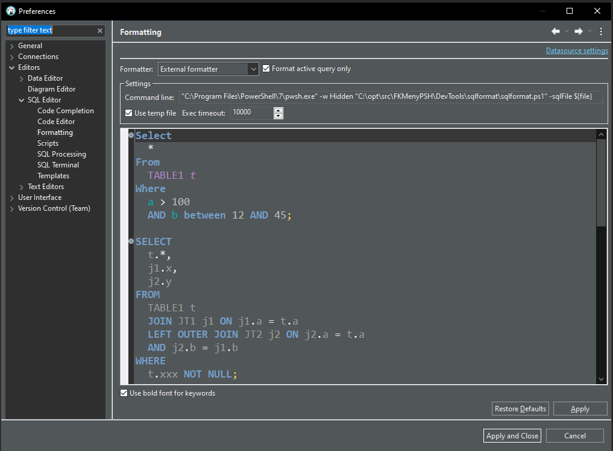

<h3 align="center">SqlFormatter for Dbeaver</h3>

<div align="center">

[]()

</div>

---

<p align="center"> Install Sql Formatter Plus as Dbeaver External Formatter
    <br> 
</p>

## 📝 Table of Contents

- [About](#About)
- [Prerequisites](#Prerequisites)
- [Setup](#Setup)
- [Usage](#Usage)
- [Built Using](#Built)
- [Authors](#Authors)
- [Acknowledgements](#Acknowledgement)

## 🧐 About <a name = "About"></a>

This script adds support for a better SqlFormatter for Dbeaver using [Sql Formatter Plus](https://github.com/kufii/sql-formatter-plus)

### Prerequisites <a name = "Prerequisites"></a>
- Install [Dbeaver](https://dbeaver.io/)
- Install [NodeJs](https://nodejs.org/en/) 
- Install sql-formatter
```
npm install sql-formatter
```

### Setup External Formatter In Dbeaver <a name = "Setup"></a>
- Open Dbeaver
- Goto Windows->Preferences->Editors->Sql Editor->Formatting
- Set combobox "Formatter" = External Formatter
- Check checkbox "Format active query only"
- Check checkbox "Use temp"
- Set "Command line" = "C:\Program Files\PowerShell\7\pwsh.exe" -w Hidden "C:\opt\src\DevTools\sqlformat\sqlformat.ps1" -sqlFile ${file}
- Press apply
 

  
 


 
## ⛏️ Built Using <a name = "Built"></a>

- [PowerShell](https://www.mongodb.com/) - Script
- [NodeJs](https://nodejs.org/en/) - Runtime for Script

## ✍️ Authors <a name = "Authors"></a>

- [@stagei](https://github.com/stagei) - Idea & Initial work


## 🎉 Acknowledgements <a name = "acknowledgement"></a>

- Thanks for creating a good Sql Formatter: [Adrien Pyke](https://github.com/kufii)
