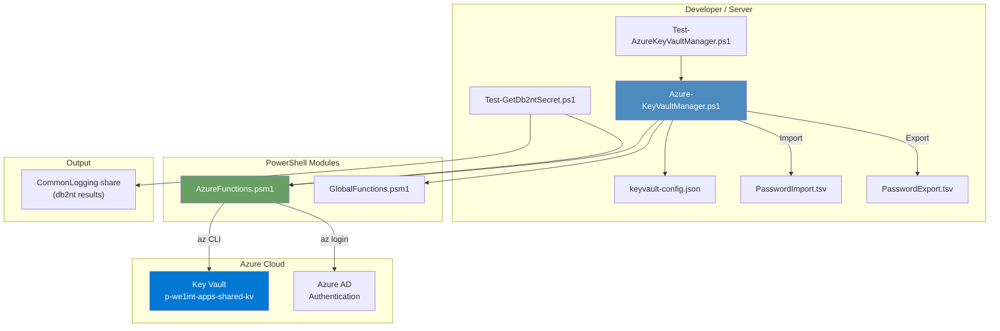
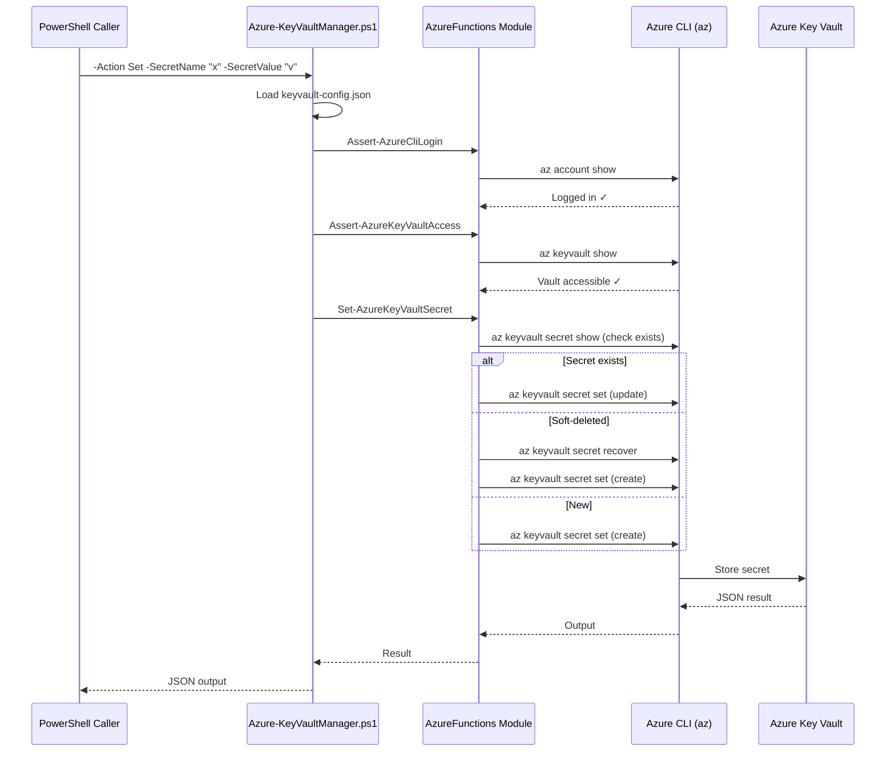
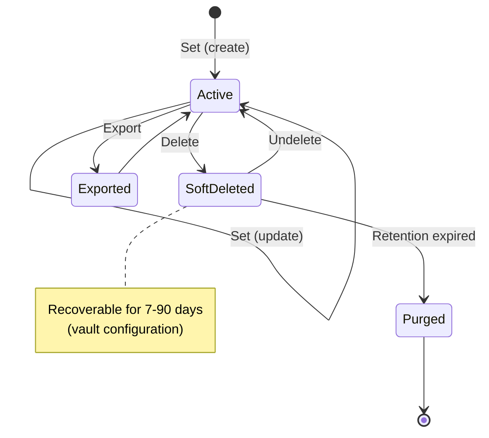
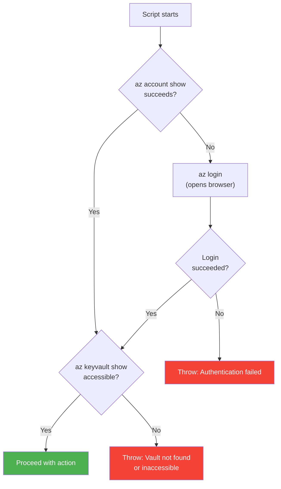

# Azure Key Vault Manager

**Authors:** Geir Helge Starholm (geir.helge.starholm@Dedge.no)
**Created:** 2026-03-18
**Technology:** PowerShell 7+

---

## Overview

PowerShell tool for managing Azure Key Vault secrets via Azure CLI. Supports the full secret lifecycle: create, update, retrieve, list, soft-delete, recover, bulk import from TSV, and bulk export to TSV. Uses subscription-aware vault configuration from `keyvault-config.json`.

Deployed to all servers via `_deploy.ps1`. Includes a test suite and a specialized `db2nt` secret retrieval script for server-side use.

---

## Architecture



---

## How It Works



---

## Parameters

| Parameter | Type | Default | Required For | Description |
|-----------|------|---------|-------------|-------------|
| `-Action` | ValidateSet | `Set` | All | Operation: `Set`, `Get`, `List`, `Delete`, `Undelete`, `Import`, `Export` |
| `-KeyVaultName` | string | From config | All | Azure Key Vault name |
| `-SecretName` | string | — | Set, Get, Delete, Undelete | Secret name (underscores auto-converted to hyphens) |
| `-SecretValue` | string | — | Set | Secret value to store |
| `-SubscriptionId` | string | From config | — | Azure subscription ID override |
| `-ImportPath` | string | — | Import | Path to TSV file for bulk import |

---

## Actions

### Set — Create or Update

Creates a new secret or updates an existing one. If the secret is soft-deleted, it is recovered first, then updated.

```powershell
.\Azure-KeyVaultManager.ps1 -Action Set -SecretName "MyApiKey" -SecretValue "sk-abc123"
```

### Get — Retrieve Secret Value

Returns the full secret object as JSON (includes `value`, `name`, `attributes`, `contentType`).

```powershell
.\Azure-KeyVaultManager.ps1 -Action Get -SecretName "MyApiKey"
```

### List — List All Secrets

Returns an array of secret metadata (key, contentType, lastChanged, enabled). Does **not** return values.

```powershell
.\Azure-KeyVaultManager.ps1 -Action List
```

### Delete — Soft-Delete

Soft-deletes a secret. The secret can be recovered within the retention period (7–90 days, configured on the vault).

```powershell
.\Azure-KeyVaultManager.ps1 -Action Delete -SecretName "MyApiKey"
```

### Undelete — Recover Soft-Deleted Secret

Recovers a soft-deleted secret back to active state.

```powershell
.\Azure-KeyVaultManager.ps1 -Action Undelete -SecretName "MyApiKey"
```

### Import — Bulk Import from TSV

Imports secrets from a tab-separated file. Existing secrets are updated; soft-deleted secrets are recovered first.

```powershell
.\Azure-KeyVaultManager.ps1 -Action Import -ImportPath ".\PasswordImport.tsv"
```

### Export — Bulk Export to TSV

Exports all secrets (including values) to `PasswordExport.tsv` in the script folder. Format matches import for round-trip compatibility.

```powershell
.\Azure-KeyVaultManager.ps1 -Action Export
```

---

## Secret Lifecycle



---

## Import / Export TSV Format

TSV files use tab-separated columns, UTF-8 encoding, no quotes:

| Column | Required | Description |
|--------|----------|-------------|
| `contentType` | No | MIME type or label (e.g. `service-account`, `devops-pat`) |
| `key` | Yes | Secret name |
| `secret` | Yes | Secret value |

**Example:**

```
contentType	key	secret
service-account	db2nt	s3cret-p@ss
devops-pat	srv-Dedge-repo-pat	ghp_abc123
api-key	my-external-api	xk-def456
```

### Key Normalization

Azure Key Vault secret names allow only alphanumerics and hyphens. The script normalizes underscores to hyphens automatically via `ConvertTo-KeyVaultSecretName`:

| Input | Normalized |
|-------|-----------|
| `p1_srv_docprd_db` | `p1-srv-docprd-db` |
| `my_api_key` | `my-api-key` |
| `already-hyphenated` | `already-hyphenated` |

This normalization applies to Set, Get, Delete, Undelete, and Import.

---

## Configuration

`keyvault-config.json` defines available vaults and the default:

```json
{
  "vaults": [
    {
      "name": "p-we1int-apps-shared-kv",
      "uri": "https://p-we1int-apps-shared-kv.vault.azure.net/",
      "subscriptionId": "3ff40d06-aca3-45e8-81d7-e1008211c37b",
      "subscriptionName": "Management",
      "resourceGroup": "p-we1internal-apps-shared-rg",
      "environment": "production",
      "description": "Shared Key Vault for integration apps"
    }
  ],
  "defaultVault": "p-we1int-apps-shared-kv"
}
```

The config file is loaded at startup. If `-KeyVaultName` or `-SubscriptionId` are provided, they override the config values.

---

## Authentication Flow



1. `Assert-AzureCliLogin` — checks `az account show`; opens `az login` if not authenticated
2. `Assert-AzureKeyVaultAccess` — verifies the vault exists and is accessible with current credentials
3. If subscription ID is provided, it's passed to all `az` commands via `--subscription`

---

## Test Script: Test-GetDb2ntSecret.ps1

A specialized script deployed to servers that retrieves the `db2nt` secret and saves it to a shared logging folder. Used to verify Key Vault connectivity from server machines.

```powershell
.\Test-GetDb2ntSecret.ps1
```

**Output location:** `C:\opt\src\DedgeSrc\DedgeSystemTools\Folders\Commonlogging\Az\Azure-KeyVaultManager\<COMPUTERNAME>.txt`

The output file contains the secret key, retrieval timestamp, computer name, password value, and the full JSON result.

### Parameters

| Parameter | Default | Description |
|-----------|---------|-------------|
| `-KeyVaultName` | From config | Override vault name |
| `-OutputFolder` | `C:\opt\src\DedgeSrc\DedgeSystemTools\Folders\Commonlogging\Az\Azure-KeyVaultManager` | Output directory |

---

## Test Suite: Test-AzureKeyVaultManager.ps1

Automated test suite that validates all CRUD operations against the configured vault.

```powershell
.\Test-AzureKeyVaultManager.ps1
```

### Test Cases

| # | Test | What It Validates |
|---|------|-------------------|
| 1 | Set (create) | Creates a new secret |
| 2 | Get (read) | Retrieves and verifies the value |
| 3 | List | Verifies the secret appears in the list |
| 4 | Set (update) | Updates the value and verifies the change |
| 5 | Delete | Soft-deletes and confirms it's no longer readable |
| 6 | Undelete | Recovers and confirms it's readable again |
| 7 | Cleanup | Deletes the test secret (skippable with `-SkipCleanup`) |

### Parameters

| Parameter | Default | Description |
|-----------|---------|-------------|
| `-KeyVaultName` | From config | Override vault name |
| `-TestSecretName` | `test-cursor-agent-<timestamp>` | Custom test secret name |
| `-SkipCleanup` | — | Leave the test secret in the vault |

---

## AzureFunctions Helper Reference

The main script delegates all operations to functions in the `AzureFunctions` module (`_Modules/AzureFunctions/AzureFunctions.psm1`):

| Function | Purpose |
|----------|---------|
| `Assert-AzureCliLogin` | Ensure Azure CLI is authenticated |
| `Assert-AzureKeyVaultAccess` | Verify vault exists and is accessible |
| `ConvertTo-KeyVaultSecretName` | Normalize names (underscores → hyphens) |
| `Set-AzureKeyVaultSecret` | Create or update secret (handles soft-deleted state) |
| `Get-AzureKeyVaultSecret` | Retrieve secret value as JSON |
| `Get-AzureKeyVaultSecretList` | List secret metadata (no values) |
| `Remove-AzureKeyVaultSecret` | Soft-delete a secret |
| `Restore-AzureKeyVaultSecret` | Recover a soft-deleted secret |
| `Import-AzureKeyVaultSecretsFromTsv` | Bulk import from TSV file |
| `Export-AzureKeyVaultSecretsToTsv` | Bulk export to TSV file |
| `Invoke-AzKeyVaultSecretCmd` | Low-level `az` CLI wrapper (temp file for values with special chars) |

---

## File Layout

| File | Purpose |
|------|---------|
| `Azure-KeyVaultManager.ps1` | Main script — all actions |
| `keyvault-config.json` | Default vault and subscription config |
| `Test-AzureKeyVaultManager.ps1` | Automated test suite (7 tests) |
| `Test-GetDb2ntSecret.ps1` | Server-side db2nt secret retrieval |
| `KeyVault-RecordDescription.md` | Record/schema docs for vault and secret entities |
| `README.md` | This documentation |
| `_deploy.ps1` | Deploy to all servers via Deploy-Handler |

---

## Deployment

Deployed to all valid servers via:

```powershell
pwsh.exe -NoProfile -File ".\DevTools\AzureTools\Azure-KeyVaultManager\_deploy.ps1"
```

On servers, the scripts land at `$env:OptPath\DedgePshApps\Azure-KeyVaultManager\`.

---

## Dependencies

| Dependency | Purpose | Required |
|------------|---------|----------|
| `AzureFunctions` module | All Key Vault operations, Azure login, assertions | Yes |
| `GlobalFunctions` module | Logging (`Write-LogMessage`) | Optional (fallback stub) |
| Azure CLI (`az`) | Backend for all vault operations | Yes |
| `Az.Accounts` PowerShell module | Required by test script | Test only |

---

## Troubleshooting

| Issue | Cause | Fix |
|-------|-------|-----|
| `Key Vault not found or inaccessible` | Wrong vault name, subscription, or no access | Verify name in `keyvault-config.json`; check `az account show`; verify RBAC |
| `Azure CLI authentication failed` | Not logged in or token expired | Run `az login`; check network connectivity |
| `Permission denied` on secret | Missing Key Vault access policy or RBAC role | Add `Key Vault Secrets Officer` role for the user |
| Import fails with `TSV must have columns` | Wrong column names or delimiter | Ensure TSV has headers: `contentType`, `key`, `secret` (tab-separated) |
| Import fails on special characters | Values contain tabs or newlines | The module uses temp files for values; ensure no embedded tabs |
| Export/Import round-trip mismatch | Key normalization (underscores → hyphens) | Expected behavior; keys are always stored with hyphens in the vault |
| `Secret is soft-deleted` on Set | Previously deleted secret blocks recreation | Script auto-recovers; if manual, use `-Action Undelete` first |

---

## See Also

- `KeyVault-RecordDescription.md` — Vault and secret entity schema
- `_Modules/AzureFunctions/AzureFunctions.psm1` — All Key Vault helper functions
- [Azure Key Vault documentation](https://learn.microsoft.com/en-us/azure/key-vault/)
