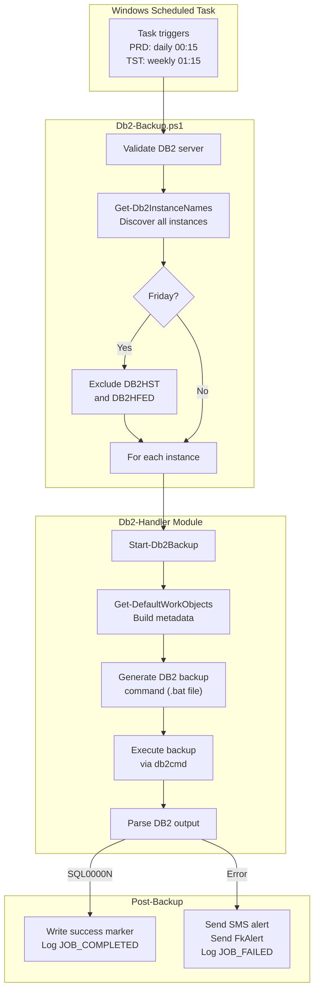

# Db2-Backup — Automated DB2 Backup System

**Authors:** Geir Helge Starholm
**Created:** 2025-07-04
**Updated:** 2026-03-17
**Technology:** PowerShell
**Version:** 2.0

---

## Overview

Db2-Backup is a fully automated backup system for IBM DB2 databases deployed across all FK database servers. It runs as a Windows Scheduled Task, discovers all DB2 instances on a server, and performs online (or offline) backups of every database — primary and federated. On failure, it sends SMS alerts to the on-call team immediately.

The system covers 10+ DB2 servers across production, test, development, and migration environments, executing roughly 550+ backups per year with no manual intervention.

---

## Architecture



---

## Scripts

| Script | Description |
|--------|-------------|
| `Db2-Backup.ps1` | Main orchestrator — discovers instances, delegates to `Start-Db2Backup` |
| `Db2-BackupOnlineAllDB2.ps1` | Wrapper — runs `Db2-Backup.ps1` for the `DB2` instance only |
| `Db2-BackupOnlineAllDB2HST.ps1` | Wrapper — runs `Db2-Backup.ps1` for the `DB2HST` instance (PrimaryDb only) |
| `Db2-LogBackup.ps1` | Transaction log backup — copies DB2 log files to a remote backup share |
| `_deploy.ps1` | Deploys to all DB2 servers (`*-db`) |
| `_install.ps1` | Creates a scheduled task (daily for PRD, weekly for TST/DEV, none for RAP) |

---

## Parameters (Db2-Backup.ps1)

| Parameter | Type | Default | Description |
|-----------|------|---------|-------------|
| `InstanceName` | `string` | `"*"` | DB2 instance to back up. `"*"` = all instances on the server. |
| `DatabaseType` | `string` | `"BothDatabases"` | Which databases to include. ValidateSet: `PrimaryDb`, `FederatedDb`, `BothDatabases`. |
| `Offline` | `switch` | off | Use offline backup instead of the default online backup. |
| `SmsNumbers` | `string[]` | `@("+4797188358")` | Phone numbers to receive SMS alerts on failure. |
| `OverrideWorkFolder` | `string` | `""` | Override the default work folder path. |

---

## Parameters (Db2-LogBackup.ps1)

| Parameter | Type | Required | Description |
|-----------|------|----------|-------------|
| `DbName` | `string` | Yes | Database name (currently only `FKMPRD` is implemented). |

---

## Backup Types

| Type | Downtime | DB2 Command | Use Case |
|------|----------|-------------|----------|
| **Online** (default) | None | `BACKUP DATABASE ... ONLINE TO ... WITH 10 BUFFERS BUFFER 2050 PARALLELISM 10 UTIL_IMPACT_PRIORITY 75 INCLUDE LOGS` | Production — zero downtime, parallel I/O, includes transaction logs |
| **Offline** | ~5 min | `BACKUP DATABASE ... TO ... EXCLUDE LOGS` | Pre-migration or consistency-critical scenarios |

---

## Scheduling Strategy

| Environment | Frequency | Time | Notes |
|-------------|-----------|------|-------|
| **PRD** (production) | Daily | 00:15 | All instances. HST/HFED excluded on Fridays (too large). |
| **TST/DEV/MIG/SIT/VFT/VFK** | Weekly | 01:15 | Lower criticality, reduces disk usage. |
| **RAP** (report) | None | — | Read-only historical data, no backup needed. |

The Friday exclusion for `DB2HST` and `DB2HFED` avoids running 1+ TB backups when there is less time before the weekend.

---

## How It Works

### Main Flow (Db2-Backup.ps1)

1. Imports `GlobalFunctions`, `Db2-Handler`, and `Infrastructure` modules
2. Validates the machine is a DB2 server via `Test-IsDb2Server`
3. If `InstanceName` is `"*"`, calls `Get-Db2InstanceNames` to discover all local instances; on Fridays, filters out `DB2HST` and `DB2HFED`
4. For each instance, calls `Start-Db2Backup` from the `Db2-Handler` module

### Backup Execution (Db2-Handler)

`Start-Db2Backup` handles per-instance backup:

1. Calls `Get-DefaultWorkObjects` to build a work object with database metadata, paths, and folders
2. Creates a timestamped work directory under `$env:OptPath\data\Db2-Backup\<DB>\<timestamp>\`
3. Generates a `.bat` file containing DB2 backup commands
4. Executes the batch file via `cmd.exe`
5. Parses DB2 output for success (`SQL0000N`) or failure
6. On success: writes a `Backup_success.txt` marker file and logs `JOB_COMPLETED`
7. On failure: sends SMS via `Send-Sms`, sends internal alert via `Send-FkAlert`, and logs `JOB_FAILED`

### Log Backup Flow (Db2-LogBackup.ps1)

1. Uses a lock file (`C:\WKAKT\DB2LOGCOPY.AKT`) to prevent concurrent runs
2. Reads the current active log number from DB2 configuration (`db2 get db cfg`)
3. Reads the last-copied log number from a tracking file (`DB2LOGCOPY_<DB>.SPAR`)
4. Copies all new log files (`S0000001.LOG` ... `S000NNNN.LOG`) from the local log directory to a remote backup share (`\\p-no1bck-01\BackupDB2\...`)
5. Updates the tracking file after each successful copy
6. Sends `FkAlert` on copy failure

---

## Dependencies

| Module | Purpose |
|--------|---------|
| `GlobalFunctions` | Logging (`Write-LogMessage`), SMS (`Send-Sms`), path utilities (`Get-ApplicationDataPath`) |
| `Db2-Handler` | Core DB2 operations: `Start-Db2Backup`, `Backup-SingleDatabase`, `Get-Db2InstanceNames`, `Get-DefaultWorkObjects`, `Invoke-Db2ContentAsScript` |
| `Infrastructure` | Server detection (`Test-IsDb2Server`, `Test-IsServer`, `Get-EnvironmentFromServerName`) |
| `ScheduledTask-Handler` | Scheduled task creation in `_install.ps1` |
| `Deploy-Handler` | Script deployment and code signing in `_deploy.ps1` |

---

## Deployment

### Deploy to servers

```powershell
pwsh.exe -NoProfile -File "C:\opt\src\DedgePsh\DevTools\DatabaseTools\Db2-Backup\_deploy.ps1"
```

Target: all servers matching `*-db` (10-15 DB2 servers across all environments).

Deployed location on each server: `$env:OptPath\DedgePshApps\Db2-Backup\`

### Install scheduled task

After deployment, `_install.ps1` runs automatically on each server and creates a scheduled task under `\DevTools\`:

- **PRD servers:** Daily at 00:15, runs as the current user (typically `db2admin`)
- **TST/DEV/MIG/SIT/VFT/VFK servers:** Weekly at 01:15
- **RAP servers:** No task created (read-only data)

### Verify installation

```powershell
Get-ScheduledTask -TaskPath "\DevTools\" -TaskName "Db2-Backup"
```

---

## File Structure

```
DevTools/DatabaseTools/Db2-Backup/
├── Db2-Backup.ps1                    Main backup orchestrator (56 lines)
├── Db2-BackupOnlineAllDB2.ps1        Wrapper for DB2 instance (6 lines)
├── Db2-BackupOnlineAllDB2HST.ps1     Wrapper for DB2HST instance (6 lines)
├── Db2-LogBackup.ps1                 Transaction log backup (205 lines)
├── _deploy.ps1                       Deployment script (2 lines)
├── _install.ps1                      Scheduled task setup (15 lines)
├── README.md                         This documentation
└── README_no.md                      Norwegian documentation
```

---

## Usage Examples

### Automatic daily backup (default, via scheduled task)

No manual action needed. The scheduled task triggers `Db2-Backup.ps1` which backs up all instances.

### Back up all instances manually

```powershell
pwsh.exe -NoProfile -File "$env:OptPath\DedgePshApps\Db2-Backup\Db2-Backup.ps1"
```

### Back up a specific instance

```powershell
pwsh.exe -NoProfile -File "$env:OptPath\DedgePshApps\Db2-Backup\Db2-Backup.ps1" -InstanceName "DB2"
```

### Back up only primary databases (no federated)

```powershell
pwsh.exe -NoProfile -File "$env:OptPath\DedgePshApps\Db2-Backup\Db2-Backup.ps1" -DatabaseType "PrimaryDb"
```

### Offline backup before migration

```powershell
pwsh.exe -NoProfile -File "$env:OptPath\DedgePshApps\Db2-Backup\Db2-Backup.ps1" `
    -InstanceName "DB2" -DatabaseType "PrimaryDb" -Offline `
    -OverrideWorkFolder "D:\MigrationBackups"
```

### Run transaction log backup

```powershell
pwsh.exe -NoProfile -File "$env:OptPath\DedgePshApps\Db2-Backup\Db2-LogBackup.ps1" -DbName "FKMPRD"
```

---

## Output Paths

| Item | Path |
|------|------|
| Work folder | `$env:OptPath\data\Db2-Backup\<DB>\<YYYYMMDD-HHmmss>\` |
| Backup files | `R:\Db2Backup\<DB>.0.<Instance>.<timestamp>.001` |
| Success marker | `$env:OptPath\data\Db2-Backup\<DB>\<timestamp>\Backup_success.txt` |
| Logs | `$env:OptPath\data\AllPwshLog\FkLog_YYYYMMDD.log` |
| Log backup tracking | `C:\WKAKT\DB2LOGCOPY_<DB>.SPAR` |
| Log backup destination | `\\p-no1bck-01\BackupDB2\<COMPUTERNAME>\Log\` |

---

## Troubleshooting

| Problem | Cause | Resolution |
|---------|-------|------------|
| `SQL1224N` — disk full | Backup drive `R:\` out of space | Free space on `R:\`, remove old backups, increase disk |
| Backup takes >2 hours | Large database or slow I/O | Check DB size with `db2 list tablespaces show detail`; consider increasing parallelism |
| No SMS on failure | SMS gateway unreachable or wrong number | Test manually: `Send-Sms -Receiver "+47..." -Message "Test"` |
| Scheduled task did not run | Task disabled, server off, or auth failure | Check `Get-ScheduledTask -TaskName "Db2-Backup"` and Task Scheduler event log |
| `SQL30082N` — auth error | Credentials expired or insufficient privileges | Verify DB2 admin authority; see `db2-sql30082n-troubleshooting.mdc` rule |

---

## Monitoring

Check today's log for backup results:

```powershell
$logDir = Join-Path $env:OptPath "data\AllPwshLog"
$logFile = Join-Path $logDir "FkLog_$((Get-Date).ToString('yyyyMMdd')).log"
Select-String -Path $logFile -Pattern "Db2-Backup|JOB_STARTED|JOB_COMPLETED|JOB_FAILED"
```

Verify backup files exist:

```powershell
Get-ChildItem "R:\Db2Backup\" -Filter "*.001" |
    Sort-Object LastWriteTime -Descending |
    Select-Object -First 10 Name, @{N='SizeGB';E={[math]::Round($_.Length/1GB,1)}}, LastWriteTime
```

---

**Document created:** 2025-07-04
**Last updated:** 2026-03-17
**Version:** 2.0
