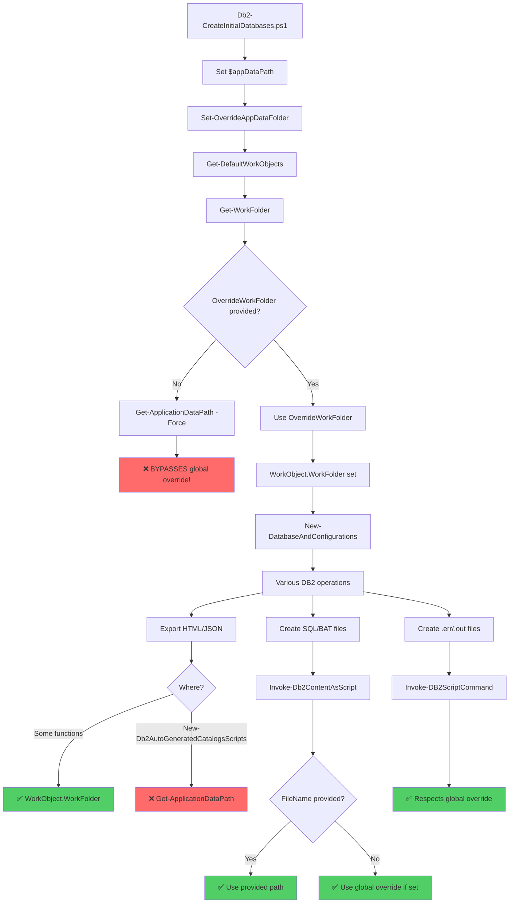
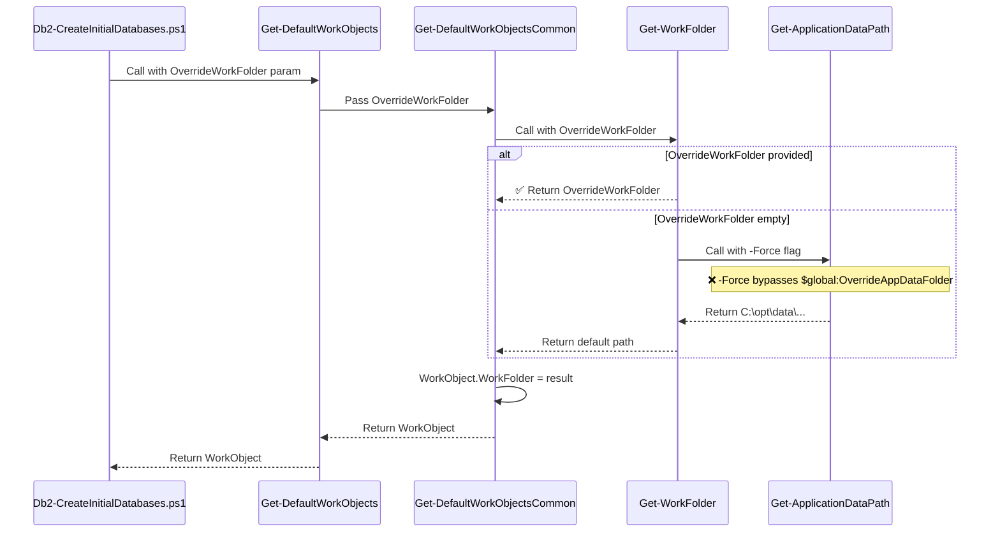
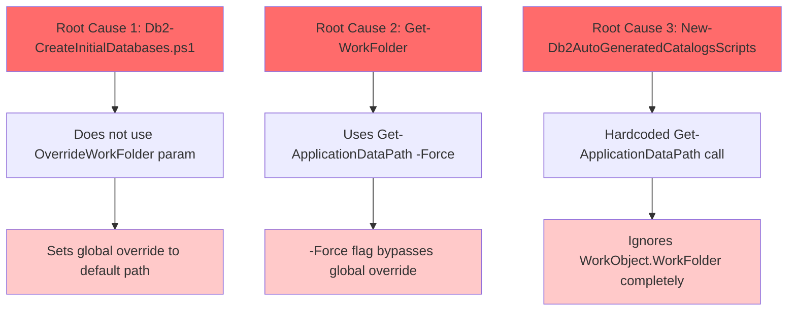
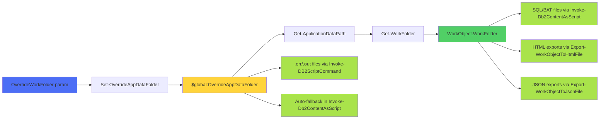

# OverrideWorkFolder File Path Analysis

## Executive Summary

The `OverrideWorkFolder` parameter in `Db2-CreateInitialDatabases.ps1` is intended to consolidate all output files (logs, SQL/BAT scripts, .err/.out files, HTML reports, JSON exports) into a single location. However, **critical bugs prevent this from working correctly**, causing files to scatter across multiple locations.

### The Problem

Files end up in different locations:
- ✅ **SQL/BAT files, .err/.out files**: Correctly placed in override folder (when properly set)
- ❌ **HTML exports from catalog scripts**: Placed in `Get-ApplicationDataPath()` instead of `WorkFolder`
- ⚠️ **WorkFolder itself**: Created using `Get-ApplicationDataPath -Force`, which **bypasses the global override**

---

## Architecture Overview



---

## Detailed Flow Analysis

### Step 1: Initial Setup in Db2-CreateInitialDatabases.ps1

**Location**: `DevTools\DatabaseTools\Db2-CreateInitialDatabases\Db2-CreateInitialDatabases.ps1`

```powershell
# Lines 62-63
$appDataPath = Get-ApplicationDataPath
Set-OverrideAppDataFolder -Path $appDataPath
```

**Issue**: The script calls `Get-ApplicationDataPath` **without** considering `$OverrideWorkFolder` parameter. This sets the global override to the default path, not the intended override path.

**Expected behavior**: Should be:
```powershell
if (-not [string]::IsNullOrEmpty($OverrideWorkFolder)) {
    Set-OverrideAppDataFolder -Path $OverrideWorkFolder
}
else {
    $appDataPath = Get-ApplicationDataPath
    Set-OverrideAppDataFolder -Path $appDataPath
}
```

---

### Step 2: WorkFolder Creation



**Location**: `_Modules\Db2-Handler\Db2-Handler.psm1`

**Function**: `Get-WorkFolder` (lines 9899-9915)

```powershell
function Get-WorkFolder {
    param(
        [Parameter(Mandatory = $true)]
        [string]$PrimaryDatabaseName,
        [Parameter(Mandatory = $false)]
        [string]$OverrideWorkFolder
    )
    $workFolder = ""
    if (-not [string]::IsNullOrEmpty($OverrideWorkFolder)) {
        $workFolder = $OverrideWorkFolder  # ✅ Correct
    }
    else {
        # ❌ BUG: -Force flag bypasses global override
        $workFolder = $(Join-Path $(Get-ApplicationDataPath -Force) $PrimaryDatabaseName $(Get-Date -Format "yyyyMMdd-HHmmss"))
    }
    return $workFolder
}
```

**The Bug**: The `-Force` flag on line 9911 causes `Get-ApplicationDataPath` to **ignore** `$global:OverrideAppDataFolder`.

**From GlobalFunctions.psm1** (lines 1001-1036):
```powershell
function Get-ApplicationDataPath {
    param(
        [Parameter(Mandatory = $false)]
        [switch]$Force = $false
    )
    if (-not [string]::IsNullOrEmpty($global:OverrideAppDataFolder) -and -not $Force) {
        return $global:OverrideAppDataFolder  # This line is SKIPPED when -Force is used!
    }
    # ... falls back to C:\opt\data\...
}
```

---

### Step 3: File Creation During Database Operations

#### ✅ Files that WORK correctly:

##### A. SQL/BAT Script Files

**Function**: `Invoke-Db2ContentAsScript` (lines 606-756)

```powershell
if (-not $FileName) {
    if (Use-OverrideAppDataFolder) {
        $FileName = Join-Path $global:OverrideAppDataFolder "db2_script_$(Get-Date -Format 'yyyyMMddHHmmssfff').$($ExecutionType)"
    }
    else {
        $FileName = "$($env:TEMP)\db2_script_$($PID)_$(Get-Date -Format 'yyyyMMddHHmmssfff').$($ExecutionType)"
    }
}
```

**Status**: ✅ **WORKS** - Respects global override when `$FileName` not provided

**Usage**: Most functions provide explicit `$FileName` using `WorkObject.WorkFolder`:
```powershell
# Example from line 10128
Invoke-Db2ContentAsScript -Content $db2Commands -ExecutionType BAT -FileName "$(Join-Path $WorkObject.WorkFolder "$($MyInvocation.MyCommand.Name)_$(Get-Date -Format 'yyyyMMddHHmmssfff').bat")"
```

##### B. .err and .out Files

**Function**: `Invoke-DB2ScriptCommand` (lines 448-603)

```powershell
if (Use-OverrideAppDataFolder) {
    $appDataPath = $global:OverrideAppDataFolder
}
else {
    $appDataPath = Get-ApplicationDataPath
}

$tempOutFile = Join-Path $($appDataPath.ToString()) "$baseName.out"
$tempErrFile = Join-Path $($appDataPath.ToString()) "$baseName.err"
```

**Status**: ✅ **WORKS** - Respects global override

##### C. Most HTML/JSON Exports

**Functions**: `Export-WorkObjectToHtmlFile`, `Export-WorkObjectToJsonFile`

```powershell
# Lines 7850-7851 (Backup)
$outputFileName = "$($WorkObject.WorkFolder)\Db2-Backup-Report-$($WorkObject.DatabaseName).html"
Export-WorkObjectToHtmlFile -WorkObject $WorkObject -FileName $outputFileName

# Lines 11645-11646 (Create Database)
$outputFileName = "$($WorkObject.WorkFolder)\Db2-CreateInitialDatabase_$($WorkObject.DatabaseName).html"
Export-WorkObjectToHtmlFile -WorkObject $WorkObject -FileName $outputFileName
```

**Status**: ✅ **WORKS** - Uses `WorkObject.WorkFolder`

#### ❌ Files that FAIL:

##### Catalog Scripts HTML Export

**Location**: `_Modules\Db2-Handler\Db2-Handler.psm1` (lines 9817-9821)

**Function**: `New-Db2AutoGeneratedCatalogsScripts`

```powershell
# ❌ BUG: Ignores WorkObject.WorkFolder completely
$outputFileName = $(Join-Path $(Get-ApplicationDataPath) "Db2-AutoGeneratedCatalogsScripts_$(Get-Date -Format "yyyyMMdd_HHmmss").html")
Export-WorkObjectToHtmlFile -WorkObject $WorkObject -FileName $outputFileName -Title "Db2 Auto Generated Catalogs Scipts" -AutoOpen $false -AddToDevToolsWebPath $true -DevToolsWebDirectory "Db2"
```

**Status**: ❌ **BROKEN** - Directly calls `Get-ApplicationDataPath()` instead of using `WorkObject.WorkFolder`

**Result**: File ends up in `C:\opt\data\Db2-CreateInitialDatabases\` instead of the override folder

---

## File Location Matrix

| File Type | Expected Location | Actual Location | Status | Fix Location |
|-----------|------------------|-----------------|---------|--------------|
| SQL scripts (*.sql) | `$OverrideWorkFolder` | `$WorkObject.WorkFolder` (may be wrong) | ⚠️ | Get-WorkFolder line 9911 |
| BAT scripts (*.bat) | `$OverrideWorkFolder` | `$WorkObject.WorkFolder` (may be wrong) | ⚠️ | Get-WorkFolder line 9911 |
| Error files (*.err) | `$OverrideWorkFolder` | Respects global override ✅ | ✅ | None needed |
| Output files (*.out) | `$OverrideWorkFolder` | Respects global override ✅ | ✅ | None needed |
| Backup HTML | `$OverrideWorkFolder` | `$WorkObject.WorkFolder` (may be wrong) | ⚠️ | Get-WorkFolder line 9911 |
| Backup JSON | `$OverrideWorkFolder` | `$WorkObject.BackupFolder` ❓ | ❓ | Needs investigation |
| Create DB HTML | `$OverrideWorkFolder` | `$WorkObject.WorkFolder` (may be wrong) | ⚠️ | Get-WorkFolder line 9911 |
| **Catalog HTML** | `$OverrideWorkFolder` | `Get-ApplicationDataPath()` ❌ | ❌ | Line 9819 |
| Federation HTML | `$OverrideWorkFolder` | `$WorkObject.WorkFolder` (may be wrong) | ⚠️ | Get-WorkFolder line 9911 |

---

## Root Cause Analysis



### Issue #1: Initial Setup Ignores Parameter
**File**: `DevTools\DatabaseTools\Db2-CreateInitialDatabases\Db2-CreateInitialDatabases.ps1`  
**Lines**: 62-63

The script accepts `$OverrideWorkFolder` parameter but never uses it to set the global override.

### Issue #2: Get-WorkFolder Bypasses Global Override
**File**: `_Modules\Db2-Handler\Db2-Handler.psm1`  
**Function**: `Get-WorkFolder`  
**Line**: 9911

When `$OverrideWorkFolder` is empty/null, it calls `Get-ApplicationDataPath -Force`, which explicitly bypasses `$global:OverrideAppDataFolder`.

### Issue #3: Hardcoded Path in Catalog Export
**File**: `_Modules\Db2-Handler\Db2-Handler.psm1`  
**Function**: `New-Db2AutoGeneratedCatalogsScripts`  
**Line**: 9819

Directly uses `Get-ApplicationDataPath()` instead of `$WorkObject.WorkFolder`.

---

## The Solution

### Fix #1: Db2-CreateInitialDatabases.ps1

**Replace lines 62-63** with:

```powershell
# Set override folder if provided, otherwise use default application data path
if (-not [string]::IsNullOrEmpty($OverrideWorkFolder)) {
    # Use the explicitly provided override folder
    Set-OverrideAppDataFolder -Path $OverrideWorkFolder
}
else {
    # Use default application data path
    $appDataPath = Get-ApplicationDataPath
    Set-OverrideAppDataFolder -Path $appDataPath
}
```

### Fix #2: Get-WorkFolder Function

**Replace lines 9906-9913** with:

```powershell
$workFolder = ""
if (-not [string]::IsNullOrEmpty($OverrideWorkFolder)) {
    # Use explicitly provided override folder
    $workFolder = $OverrideWorkFolder
}
else {
    # FIXED: Remove -Force flag to respect global override
    # This allows Set-OverrideAppDataFolder to control the base path
    $baseFolder = Get-ApplicationDataPath
    $workFolder = Join-Path $baseFolder $PrimaryDatabaseName $(Get-Date -Format "yyyyMMdd-HHmmss")
}
return $workFolder
```

**Explanation**: Removing `-Force` allows the function to respect `$global:OverrideAppDataFolder` set earlier.

### Fix #3: New-Db2AutoGeneratedCatalogsScripts Function

**Replace lines 9817-9820** with:

```powershell
# Export database object to file
Write-LogMessage "Exporting object to file" -Level INFO

# FIXED: Use WorkFolder from WorkObject if available, otherwise fall back to Get-ApplicationDataPath
if ($WorkObject.PSObject.Properties['WorkFolder'] -and -not [string]::IsNullOrEmpty($WorkObject.WorkFolder)) {
    $outputFileName = Join-Path $WorkObject.WorkFolder "Db2-AutoGeneratedCatalogsScripts_$(Get-Date -Format "yyyyMMdd_HHmmss").html"
}
else {
    $outputFileName = Join-Path $(Get-ApplicationDataPath) "Db2-AutoGeneratedCatalogsScripts_$(Get-Date -Format "yyyyMMdd_HHmmss").html"
}

Export-WorkObjectToHtmlFile -WorkObject $WorkObject -FileName $outputFileName -Title "Db2 Auto Generated Catalogs Scipts" -AutoOpen $false -AddToDevToolsWebPath $true -DevToolsWebDirectory "Db2"
Write-LogMessage "Finished creating client configuration scripts" -Level INFO
```

---

## Testing Strategy

### Test Case 1: With OverrideWorkFolder Parameter

```powershell
# Run with explicit override folder
$testFolder = "C:\TestOutput\$(Get-Date -Format 'yyyyMMdd-HHmmss')"
.\Db2-CreateInitialDatabases.ps1 -OverrideWorkFolder $testFolder -DatabaseType PrimaryDb -PrimaryInstanceName DB2

# Expected: ALL files in $testFolder:
# - *.sql, *.bat scripts
# - *.err, *.out files
# - *.html reports
# - *.json exports
```

### Test Case 2: Without OverrideWorkFolder Parameter

```powershell
# Run without override - should use default C:\opt\data path
.\Db2-CreateInitialDatabases.ps1 -DatabaseType PrimaryDb -PrimaryInstanceName DB2

# Expected: ALL files in C:\opt\data\Db2-CreateInitialDatabases\<DatabaseName>\<Timestamp>
```

### Verification Script

```powershell
# After running Db2-CreateInitialDatabases.ps1
$expectedFolder = "C:\TestOutput\..."  # or wherever you specified

Get-ChildItem -Path $expectedFolder -Recurse | 
    Group-Object Extension | 
    Select-Object Name, Count | 
    Format-Table

# Should show:
# .bat, .sql, .err, .out, .html, .json files
# NO files should exist in C:\opt\data\Db2-CreateInitialDatabases (when override specified)
```

---

## Summary of Changes

| File | Function | Line(s) | Change | Impact |
|------|----------|---------|--------|--------|
| Db2-CreateInitialDatabases.ps1 | Main | 62-63 | Use `$OverrideWorkFolder` param to set override | All files respect override |
| Db2-Handler.psm1 | Get-WorkFolder | 9911 | Remove `-Force` flag | WorkFolder respects global override |
| Db2-Handler.psm1 | New-Db2AutoGeneratedCatalogsScripts | 9819 | Use `WorkObject.WorkFolder` | Catalog HTML in correct location |

---

## Dependency Graph



---

## Additional Findings

### Other Functions Using Get-ApplicationDataPath Directly

These should be audited to ensure they respect WorkFolder when appropriate:

1. **Line 8496-8498** (GlobalFunctions.psm1): `Test-GlobalEnvironmentSettings`
   - Creates HTML in `Get-ApplicationDataPath` 
   - May need to accept WorkFolder parameter

2. **Line 8625** (GlobalFunctions.psm1): `Export-EventLog`
   - Creates folder in `Get-ApplicationDataPath`
   - Probably OK (not related to DB2 operations)

3. **Line 5987** (Infrastructure.psm1): `Compare-AdUserSettings`
   - Creates comparison output
   - Probably OK (not related to DB2 operations)

---

## Conclusion

The `OverrideWorkFolder` mechanism is **well-designed** but has **three critical bugs** that prevent it from working:

1. ✅ **Design**: Global override + WorkFolder inheritance = Good architecture
2. ❌ **Bug**: Script doesn't set global override from parameter
3. ❌ **Bug**: Get-WorkFolder bypasses global override with `-Force` flag
4. ❌ **Bug**: One function hardcodes output path

**After fixes**: All files will consistently land in the specified override folder, making log collection and troubleshooting significantly easier.

---

**Generated**: 2025-12-16  
**Analyzed by**: AI Code Analysis  
**Status**: Ready for implementation
