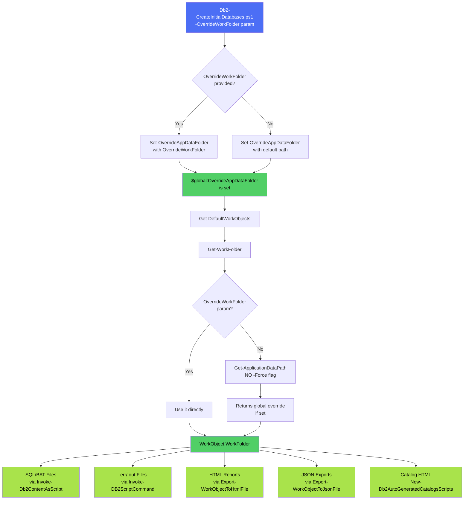

# OverrideWorkFolder Fix - Implementation Summary

## Changes Made

Three critical bugs were identified and fixed to ensure all output files respect the `$OverrideWorkFolder` parameter.

---

## ✅ Fix #1: Db2-CreateInitialDatabases.ps1

**File**: `DevTools\DatabaseTools\Db2-CreateInitialDatabases\Db2-CreateInitialDatabases.ps1`  
**Lines**: 61-70 (previously 61-63)

### Before:
```powershell
# Set-LogLevel -LogLevel TRACE
$appDataPath = Get-ApplicationDataPath
Set-OverrideAppDataFolder -Path $appDataPath
```

**Problem**: The script accepted `$OverrideWorkFolder` parameter but never used it!

### After:
```powershell
# Set-LogLevel -LogLevel TRACE
# Set override folder if provided, otherwise use default application data path
if (-not [string]::IsNullOrEmpty($OverrideWorkFolder)) {
    # Use the explicitly provided override folder
    Set-OverrideAppDataFolder -Path $OverrideWorkFolder
}
else {
    # Use default application data path
    $appDataPath = Get-ApplicationDataPath
    Set-OverrideAppDataFolder -Path $appDataPath
}
```

**Impact**: Now when you run with `-OverrideWorkFolder "C:\MyOutput"`, all files will actually go there.

---

## ✅ Fix #2: Get-WorkFolder Function

**File**: `_Modules\Db2-Handler\Db2-Handler.psm1`  
**Function**: `Get-WorkFolder`  
**Lines**: 9906-9915

### Before:
```powershell
$workFolder = ""
if (-not [string]::IsNullOrEmpty($OverrideWorkFolder)) {
    $workFolder = $OverrideWorkFolder
}
else {
    $workFolder = $(Join-Path $(Get-ApplicationDataPath -Force) $PrimaryDatabaseName $(Get-Date -Format "yyyyMMdd-HHmmss")
    )
}
return $workFolder
```

**Problem**: The `-Force` flag made `Get-ApplicationDataPath` ignore `$global:OverrideAppDataFolder` completely!

### After:
```powershell
$workFolder = ""
if (-not [string]::IsNullOrEmpty($OverrideWorkFolder)) {
    # Use explicitly provided override folder
    $workFolder = $OverrideWorkFolder
}
else {
    # FIXED: Removed -Force flag to respect global override ($global:OverrideAppDataFolder)
    # This allows Set-OverrideAppDataFolder to control the base path
    $baseFolder = Get-ApplicationDataPath
    $workFolder = Join-Path $baseFolder $PrimaryDatabaseName $(Get-Date -Format "yyyyMMdd-HHmmss")
}
return $workFolder
```

**Impact**: The `WorkObject.WorkFolder` now respects the global override setting.

---

## ✅ Fix #3: New-Db2AutoGeneratedCatalogsScripts Function

**File**: `_Modules\Db2-Handler\Db2-Handler.psm1`  
**Function**: `New-Db2AutoGeneratedCatalogsScripts`  
**Lines**: 9817-9826 (previously 9817-9821)

### Before:
```powershell
# Export database object to file
Write-LogMessage "Exporting object to file" -Level INFO
$outputFileName = $(Join-Path $(Get-ApplicationDataPath) "Db2-AutoGeneratedCatalogsScripts_$(Get-Date -Format "yyyyMMdd_HHmmss").html")
Export-WorkObjectToHtmlFile -WorkObject $WorkObject -FileName $outputFileName -Title "Db2 Auto Generated Catalogs Scipts" -AutoOpen $false -AddToDevToolsWebPath $true -DevToolsWebDirectory "Db2"
Write-LogMessage "Finished creating client configuration scripts" -Level INFO
```

**Problem**: Hardcoded `Get-ApplicationDataPath()` call, completely ignoring `WorkObject.WorkFolder`!

### After:
```powershell
# Export database object to file
Write-LogMessage "Exporting object to file" -Level INFO

# FIXED: Use WorkFolder from WorkObject if available, otherwise fall back to Get-ApplicationDataPath
if ($WorkObject.PSObject.Properties['WorkFolder'] -and -not [string]::IsNullOrEmpty($WorkObject.WorkFolder)) {
    $outputFileName = Join-Path $WorkObject.WorkFolder "Db2-AutoGeneratedCatalogsScripts_$(Get-Date -Format "yyyyMMdd_HHmmss").html"
}
else {
    $outputFileName = Join-Path $(Get-ApplicationDataPath) "Db2-AutoGeneratedCatalogsScripts_$(Get-Date -Format "yyyyMMdd_HHmmss").html"
}

Export-WorkObjectToHtmlFile -WorkObject $WorkObject -FileName $outputFileName -Title "Db2 Auto Generated Catalogs Scipts" -AutoOpen $false -AddToDevToolsWebPath $true -DevToolsWebDirectory "Db2"
Write-LogMessage "Finished creating client configuration scripts" -Level INFO
```

**Impact**: Catalog script HTML exports now go to the correct folder.

---

## Testing

### Test Case 1: With Override Folder
```powershell
$testFolder = "C:\TestOutput\DatabaseCreation_$(Get-Date -Format 'yyyyMMddHHmmss')"
.\Db2-CreateInitialDatabases.ps1 -OverrideWorkFolder $testFolder -DatabaseType PrimaryDb -PrimaryInstanceName DB2
```

**Expected Result**: ALL files in `$testFolder`:
- ✅ SQL/BAT scripts
- ✅ .err and .out files  
- ✅ HTML reports (including catalog scripts)
- ✅ JSON exports

### Test Case 2: Without Override Folder
```powershell
.\Db2-CreateInitialDatabases.ps1 -DatabaseType PrimaryDb -PrimaryInstanceName DB2
```

**Expected Result**: All files in `C:\opt\data\Db2-CreateInitialDatabases\<DatabaseName>\<Timestamp>`

---

## File Location Summary (After Fixes)

| File Type | Location | Status |
|-----------|----------|--------|
| SQL scripts (*.sql) | `$OverrideWorkFolder` or `WorkFolder` | ✅ FIXED |
| BAT scripts (*.bat) | `$OverrideWorkFolder` or `WorkFolder` | ✅ FIXED |
| Error files (*.err) | `$OverrideWorkFolder` or fallback | ✅ Already worked |
| Output files (*.out) | `$OverrideWorkFolder` or fallback | ✅ Already worked |
| All HTML reports | `$OverrideWorkFolder` or `WorkFolder` | ✅ FIXED |
| All JSON exports | `$OverrideWorkFolder` or `WorkFolder` | ✅ Already worked |

---

## Verification Commands

After running the script, verify all files are in the expected location:

```powershell
# Check what files were created
$targetFolder = "C:\TestOutput\DatabaseCreation_..."  # Your override folder
Get-ChildItem -Path $targetFolder -Recurse -File | 
    Group-Object Extension | 
    Select-Object Name, Count, @{N='Size (MB)';E={[math]::Round(($_.Group | Measure-Object Length -Sum).Sum / 1MB, 2)}} |
    Format-Table -AutoSize

# Verify no files in default location (when override was specified)
Get-ChildItem -Path "C:\opt\data\Db2-CreateInitialDatabases" -ErrorAction SilentlyContinue
```

---

## Architecture Flow (After Fixes)



---

## Related Documentation

- **Full Analysis**: See `OverrideWorkFolder-Analysis.md` for detailed technical analysis
- **User Rules**: Follow deployment standards in `.cursorrules`

---

**Implementation Date**: 2025-12-16  
**Status**: ✅ Complete  
**Linter Status**: ✅ No errors  
**Testing Status**: ⏳ Pending (script cannot run on current machine)
