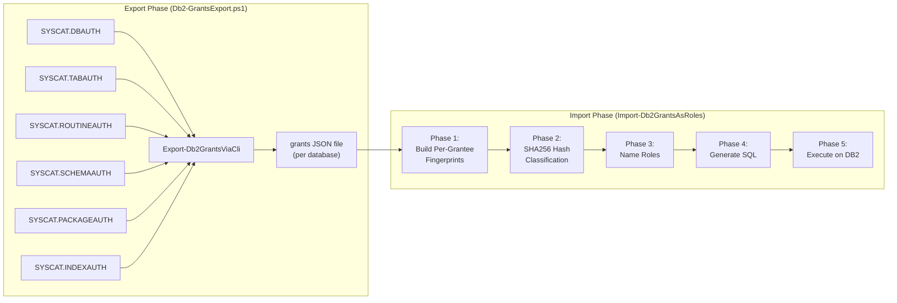
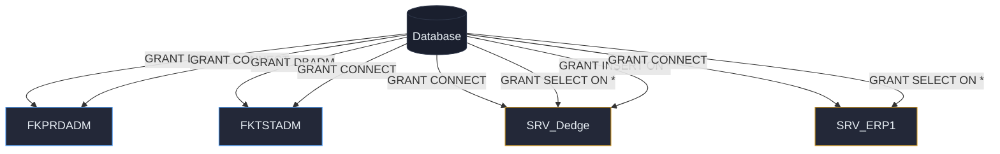
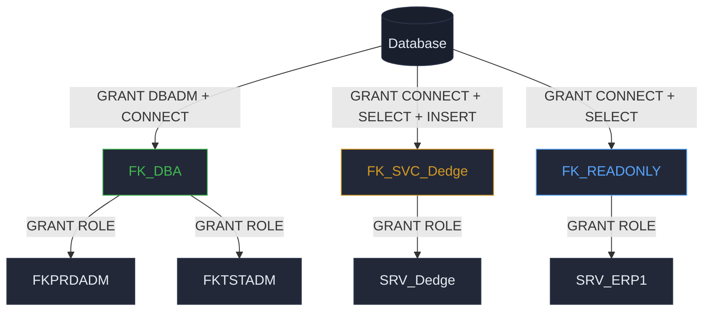
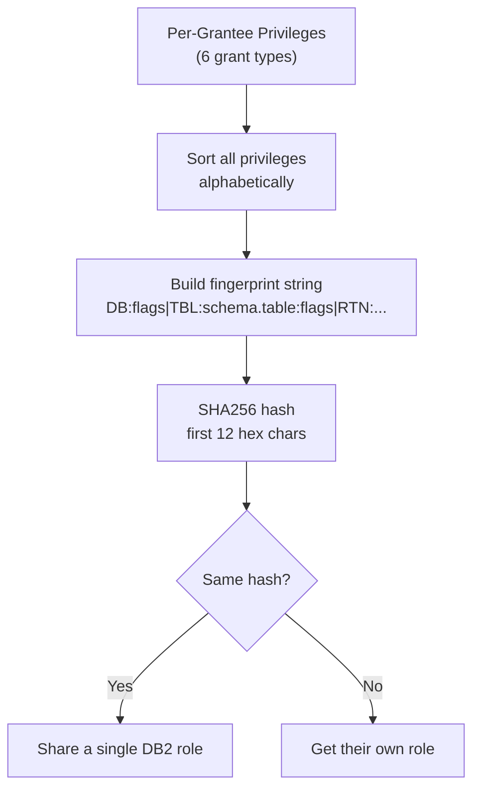
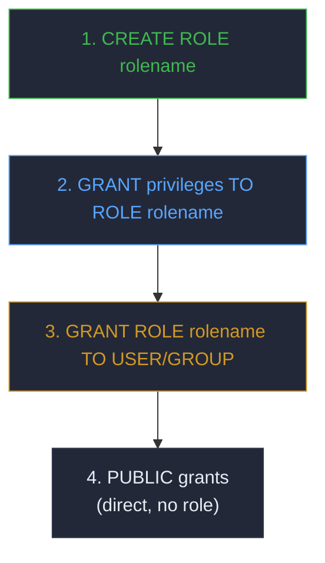
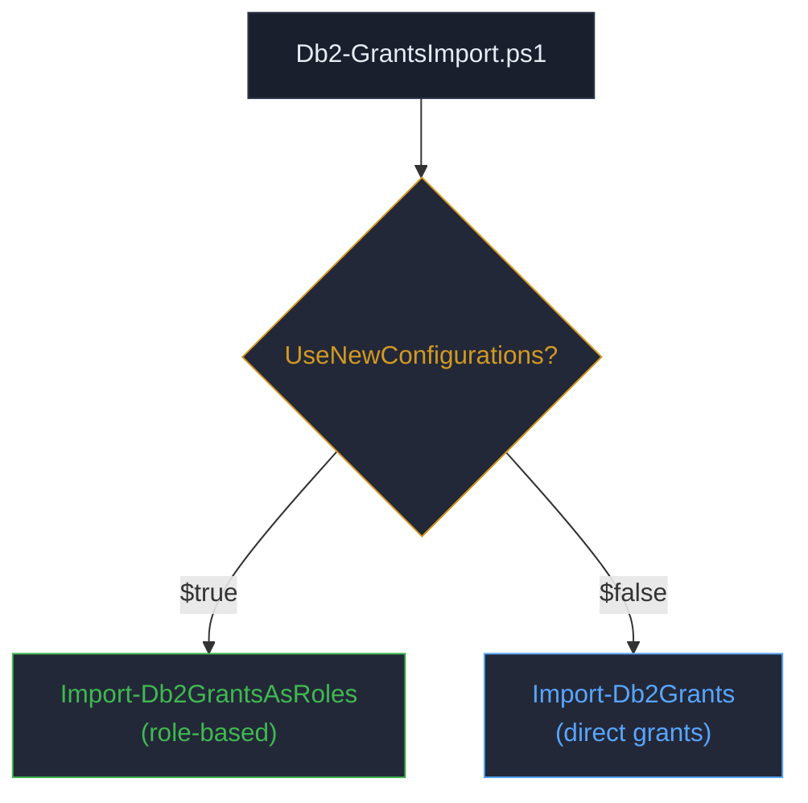
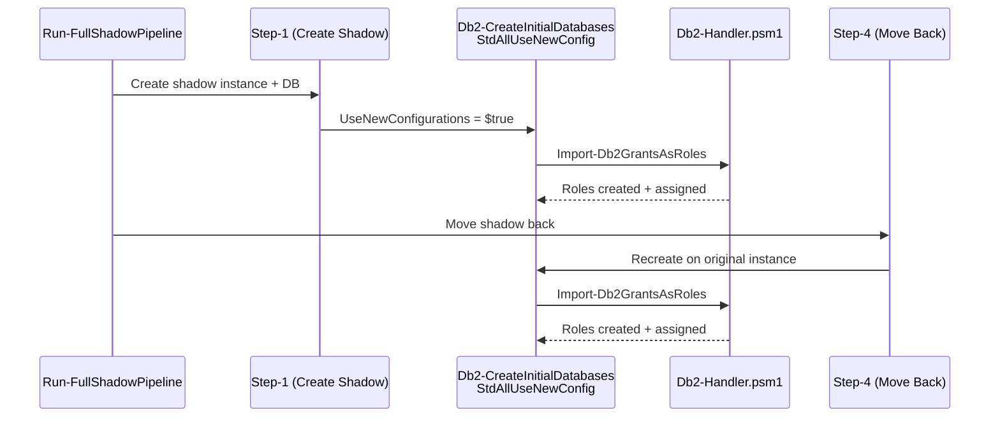

# DB2 Role-Based Grants Migration

**Author:** Geir Helge Starholm, www.dEdge.no  
**Created:** 2026-03-06  
**Technology:** DB2 LUW / PowerShell

---

## Overview

The shadow database pipeline supports two modes for applying database privileges after a restore:

- **Classic mode** (`UseNewConfigurations = $false`): Direct GRANT statements are replayed from the export JSON, one per grantee per object — identical to the source database.
- **Role-based mode** (`UseNewConfigurations = $true`): Direct grants are analyzed, grouped by identical privilege patterns, and converted into DB2 roles. Users and groups receive role membership instead of direct grants.

### Benefits of Role-Based Grants

| Classic (Direct) | Role-Based |
|---|---|
| N users × M privileges = N×M GRANT statements | K roles × M grants + N memberships |
| Adding a new user requires replicating all grants | Adding a user requires one `GRANT ROLE TO USER` |
| Auditing requires inspecting every user's grants | Auditing inspects role definitions only |
| Privilege drift between environments is hard to detect | Roles are named and comparable |

---

## End-to-End Architecture



---

## Classic vs Role-Based Comparison

### Before: Classic Direct Grants



Each user gets direct GRANT statements. With M privileges and N users, the total is N×M statements.

### After: Role-Based Grants



Roles consolidate identical privilege sets. Adding user FKTST2ADM with the same privileges as FKPRDADM requires only: `GRANT ROLE FK_DBA TO USER FKTST2ADM`.

---

## Fingerprint Algorithm

The system automatically discovers which grantees share the same privilege pattern using a deterministic fingerprint hash.



### How the Fingerprint String Is Built

For each grantee, the function collects privileges from all 6 SYSCAT auth views and builds a sorted, pipe-delimited string:

| Prefix | Source | Flags |
|---|---|---|
| `DB:` | SYSCAT.DBAUTH | CONNECTAUTH, CREATETABAUTH, DBADMAUTH, ... |
| `TBL:schema.table:` | SYSCAT.TABAUTH | SELECTAUTH, INSERTAUTH, UPDATEAUTH, ... |
| `RTN:PROC/FUNC:schema.name` | SYSCAT.ROUTINEAUTH | EXECUTEAUTH |
| `SCH:schema:` | SYSCAT.SCHEMAAUTH | CREATEINAUTH, ALTERINAUTH, DROPINAUTH |
| `PKG:schema.name:` | SYSCAT.PACKAGEAUTH | CONTROLAUTH, BINDAUTH, EXECUTEAUTH |
| `IDX:schema.name` | SYSCAT.INDEXAUTH | CONTROLAUTH |

The string is then hashed with SHA256, and the first 12 hex characters are used as the group key.

### Example

```
Grantee FKPRDADM:
  DB:CONNECTAUTH,DBADMAUTH|SCH:DBM:CREATEINAUTH,ALTERINAUTH,DROPINAUTH
  → SHA256 → "A3F7B2C91D0E"

Grantee FKTSTADM:
  DB:CONNECTAUTH,DBADMAUTH|SCH:DBM:CREATEINAUTH,ALTERINAUTH,DROPINAUTH
  → SHA256 → "A3F7B2C91D0E"  (same hash → same role)
```

---

## Role Naming Convention

The system auto-generates role names based on the dominant privilege pattern:

| Pattern Detected | Role Name | Example |
|---|---|---|
| Has `DBADMAUTH` | `FK_DBA` | Full admin users |
| All tables: SELECT only | `FK_READONLY` | Read-only reporting |
| All tables: SELECT+INSERT+UPDATE+DELETE | `FK_READWRITE` | Application accounts |
| First member starts with `SRV_` | `FK_SVC_<name>` | `FK_SVC_Dedge` |
| GranteeType is `G` (group) | `FK_GRP_<name>` | `FK_GRP_DB2ADMNS` |
| Other patterns | `FK_CUSTOM_<name>` | `FK_CUSTOM_APPUSER` |

### Collision Handling

If the same role name would be generated for two groups with different privilege fingerprints, a numeric suffix is appended: `FK_DBA_2`, `FK_DBA_3`, etc.

---

## SQL Execution Sequence

The generated SQL follows this strict order:



1. **CREATE ROLE**: Each unique fingerprint group gets a role
2. **GRANT TO ROLE**: All privileges from the fingerprint are granted to the role
3. **GRANT ROLE TO USER/GROUP**: Each member receives role membership
4. **PUBLIC grants**: Applied directly (DB2 limitation: PUBLIC cannot hold role membership)

### SQL Examples

```sql
-- Step 1: Create roles
CREATE ROLE FK_DBA;
CREATE ROLE FK_SVC_Dedge;
CREATE ROLE FK_READONLY;

-- Step 2: Grant privileges to roles
GRANT DBADM, CONNECT ON DATABASE TO ROLE FK_DBA;
GRANT CONNECT ON DATABASE TO ROLE FK_SVC_Dedge;
GRANT SELECT ON TABLE DBM.CUSTOMERS TO ROLE FK_SVC_Dedge;
GRANT CONNECT ON DATABASE TO ROLE FK_READONLY;
GRANT SELECT ON TABLE DBM.CUSTOMERS TO ROLE FK_READONLY;

-- Step 3: Assign users to roles
GRANT ROLE FK_DBA TO USER FKPRDADM;
GRANT ROLE FK_DBA TO USER FKTSTADM;
GRANT ROLE FK_SVC_Dedge TO USER SRV_Dedge;
GRANT ROLE FK_READONLY TO USER SRV_ERP1;

-- Step 4: PUBLIC grants (direct)
GRANT CONNECT ON DATABASE TO PUBLIC;
GRANT EXECUTE ON PROCEDURE DBM.MY_PROC TO PUBLIC;
```

---

## Special Cases

### PUBLIC Grants

DB2 does not allow `GRANT ROLE TO PUBLIC`. All grants where the grantee is `PUBLIC` are preserved as direct GRANT statements, bypassing the role system entirely.

### System Accounts

Grantees `SYSIBM` and `SYSIBMINTERNAL` are internal DB2 system accounts. Their grants are always skipped during import — they are managed by DB2 itself.

### UseNewConfigurations Gate

The entire role-based conversion is gated by the `UseNewConfigurations` flag:



This ensures existing production workflows are unaffected until the flag is explicitly enabled.

---

## Integration with Shadow Pipeline

The role-based grants import is invoked during the shadow pipeline through `Db2-CreateInitialDatabasesStdAllUseNewConfig.ps1`, which sets `UseNewConfigurations = $true`.



---

## Source Code References

| Component | Location |
|---|---|
| Grant Export (CLI) | `Db2-Handler.psm1` → `Export-Db2GrantsViaCli` (line ~14432) |
| Grant Export Script | `DevTools/DatabaseTools/Db2-GrantsExport/Db2-GrantsExport.ps1` |
| Grant Import (classic) | `Db2-Handler.psm1` → `Import-Db2Grants` (line ~14800) |
| Grant Import (roles) | `Db2-Handler.psm1` → `Import-Db2GrantsAsRoles` (line ~14904) |
| Import Router | `DevTools/DatabaseTools/Db2-GrantsImport/Db2-GrantsImport.ps1` |
| Grantee Clause Helper | `Db2-Handler.psm1` → `Get-GranteeClause` (line ~15471) |
| Pipeline Integration | `DevTools/DatabaseTools/Db2-CreateInitialDatabases/Db2-CreateInitialDatabasesStdAllUseNewConfig.ps1` |
