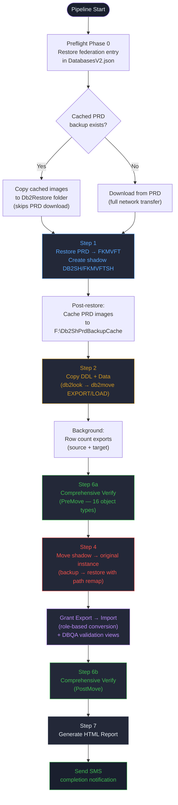
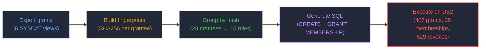
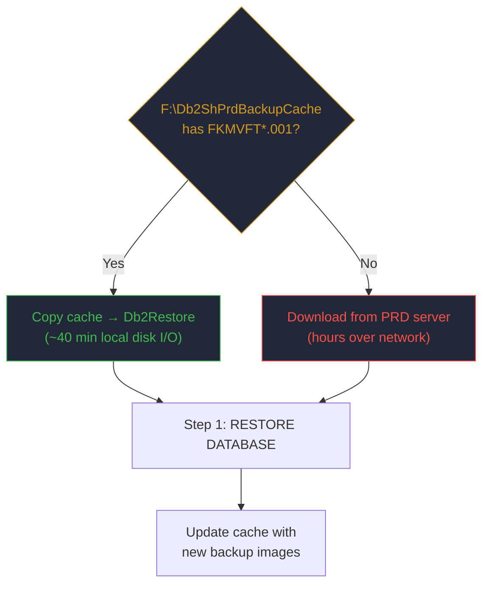

# Db2-ShadowDatabase — Shadow Database Pipeline

**Authors:** Geir Helge Starholm (geir.helge.starholm@Dedge.no)
**Created:** 2026-03-06
**Technology:** PowerShell 7+ / DB2 LUW 12.1

---

## Overview

The Db2-ShadowDatabase pipeline performs a **full non-disruptive refresh** of a DB2 database from a production backup image. It creates a temporary "shadow" database on a separate DB2 instance, copies all schema objects and data into it, verifies integrity, and then moves it back to the original instance — all without manual intervention.

The pipeline replaces a legacy manual process that required multiple DBA interventions, hours of downtime, and was prone to configuration drift. It runs autonomously from start to finish, sends SMS notifications on progress, errors, and completion, and produces an HTML verification report comparing 16+ object types and row counts between source and target.

**Primary server:** `t-no1fkmvft-db` (VFT environment — Forsprang test)

**Latest validated run:** 2026-03-25/26, total duration **1,240 minutes (20.7 hours)**, zero row count mismatches across 2,925 tables.

---

## How It Works



---

## Latest Run Statistics (2026-03-26)

| Metric | Value |
|---|---|
| **Server** | `t-no1fkmvft-db` |
| **Source DB** | FKMVFT (instance DB2) |
| **Shadow DB** | FKMVFTSH (instance DB2SH) |
| **Total Duration** | 1,240.3 minutes (20.7 hours) |
| **Tables Copied** | 2,975 |
| **Views** | 461 |
| **Indexes** | 1,950 |
| **Triggers** | 175 |
| **Procedures** | 243 |
| **Functions** | 220 |
| **Primary Keys** | 1,871 |
| **Foreign Keys** | 309 |
| **Rows Verified** | 2,925 tables, **0 mismatches** |
| **Object Types Checked** | 16 |
| **Object Mismatches** | 1 (cosmetic — PK constraint names differ due to creation timestamps) |
| **Fix-Deploy-Restart Cycles** | 0 |
| **Data Exported** | 5,904 tables via `db2move EXPORT` |
| **Data Loaded** | 5,901 tables via `db2move LOAD` |
| **PRD Backup Image** | ~486 GB (cached, no download needed) |
| **Roles Created** | 15 (from 28 users/groups) |
| **DBQA Privilege Rows** | 34,158 |

### Step Timing Breakdown

| Step | Duration | Description |
|---|---|---|
| Preflight cache copy | 40 min | Copy cached PRD image to Db2Restore |
| Step 1 (PRD Restore + Shadow Create) | 111.6 min | Restore FKMVFT, create DB2SH/FKMVFTSH |
| Post-Step 1 cache copy | 126 min | Cache 2 backup files (~976 GB total) |
| Step 2 (Copy Data) | 726 min | DDL extraction + EXPORT + LOAD |
| Step 6a (PreMove Verify) | 2.7 min | Object + row count comparison |
| Step 4 (Move to Original Instance) | 222.6 min | Backup shadow → restore on DB2 |
| Grant Export + Import | 2.3 min | Role-based conversion + DBQA views |
| Step 6b (PostMove Verify) | 1.3 min | Final object comparison |
| Step 7 (HTML Report) | 0.1 min | Generate verification report |

---

## Major Improvements Over Legacy Process

### 1. Federation Removal (FederatedDb → Alias)

The legacy database setup used DB2 Federation (a separate `DB2FED` instance with `XFKMVFT` as a federated access point) to link databases. This added operational complexity: a separate instance to manage, federation-specific DDL in exports, and authentication issues between instances.

The shadow pipeline **eliminates federation entirely**. During Step 4 (move-back), the `XFKMVFT` access point in `DatabasesV2.json` is converted from `FederatedDb` to a simple `Alias` on the primary DB2 instance using `KerberosServerEncrypt` authentication. On the next pipeline run, Step 1 restores the federation entry temporarily for the shadow instance, and Step 4 removes it again.

**Impact:** No more `DB2FED` instance management, no federation DDL filtering, no cross-instance authentication problems. All databases use standard Kerberos authentication via the single DB2 instance.

### 2. Role-Based Grants (Direct → DB2 Roles)

The legacy approach replayed thousands of direct GRANT statements from the production backup — one per user per object. This led to privilege drift, made auditing nearly impossible, and required manual intervention when adding new users.

The pipeline now uses **automatic fingerprint-based role conversion**:

1. **Export** all grants from 6 SYSCAT auth views (DBAUTH, TABAUTH, ROUTINEAUTH, SCHEMAAUTH, PACKAGEAUTH, INDEXAUTH)
2. **Fingerprint** each grantee's complete privilege set using SHA256 hashing
3. **Group** grantees with identical fingerprints into DB2 roles
4. **Execute**: CREATE ROLE → GRANT privileges TO ROLE → GRANT ROLE TO USER/GROUP → REVOKE direct grants



**Latest run result:** 15 roles created from 28 users/groups, with 407 grants to roles, 28 role memberships, and 529 direct grants revoked.

| Role | Members | Privilege Level |
|---|---|---|
| FK_DBA | FKGEISTA, FKSVEERI, FKCELERI, FKMISTA, +5 more | DBADM (full admin) |
| FK_SVC_DATAVAREHUS | SRV_DATAVAREHUS, DB2USERS, DB2ADMIN, +2 more | Data warehouse service |
| FK_READWRITE_* | ISYS, FORIT, SRV_CRM, SRV_KPDB, SRV_TST_BIZTALKHIA | Per-service read/write |
| FK_DBA_* | DB2NT, DB2ADMNS, FKTSTDBA, T1_SRV_FKMVFT_DB | System/service DBA |
| FK_CUSTOM_* | SYSGEOADM, SYSTS_ADM, SYSTS_MGR, SYSDEBUG | Special-purpose |

### 3. DBQA Privilege Validation Views

After role-based grant import, the pipeline creates two validation views in schema `TV`:

| View | Purpose | Rows |
|---|---|---|
| `TV.V_DBQA_ALL_PRIVS` | One normalized row per (grantee, object, privilege) across all auth views | 34,158 |
| `TV.V_DBQA_ROLE_MEMBERS` | Role membership map from SYSCAT.ROLEAUTH | 32 |

These views enable post-pipeline validation and cross-environment comparison of privilege configurations.

**V_DBQA_ALL_PRIVS breakdown by object type:**

| OBJ_TYPE | Count |
|---|---|
| TABLE | 25,274 |
| INDEX | 3,822 |
| VIEW | 2,151 |
| PACKAGE | 1,609 |
| FUNCTION | 634 |
| SCHEMA | 333 |
| PROCEDURE | 277 |
| DATABASE | 58 |

### 4. Automatic Storage & Self-Tuning Memory

The shadow database is created with **DB2 Automatic Storage** (`AUTOSTORAGE YES`) and all objects are placed in the default `USERSPACE1` tablespace. Step 2 explicitly strips tablespace references from DDL so that DB2 manages storage allocation automatically.

Key database configurations applied by the pipeline via `Set-StandardConfigurations` (1,000+ settings):

| Configuration | Value | Benefit |
|---|---|---|
| `SELF_TUNING_MEM` | ON | DB2 auto-tunes buffer pools, sort heap, package cache |
| `AUTO_MAINT` | ON | Automatic maintenance (runstats, reorg, backup scheduling) |
| `AUTO_TBL_MAINT` | ON | Automatic table reorganization |
| `AUTO_RUNSTATS` | ON | Automatic statistics collection |
| `DATABASE_MEMORY` | AUTOMATIC | DB2 manages total database memory allocation |
| `SORTHEAP` | AUTOMATIC | Sort operations auto-sized |
| `SHEAPTHRES_SHR` | AUTOMATIC | Shared sort heap threshold auto-managed |
| `LOGFILSIZ` / `LOGPRIMARY` / `LOGSECFIL` | Sized per DB | Transaction log sized for workload |
| `TABLESPACE_MAP` | SYS_ANY | All objects go to automatic storage tablespace |

**Impact:** No manual tablespace management, no "tablespace full" errors, no DBA intervention for memory tuning. DB2 self-optimizes based on workload patterns.

### 5. PRD Backup Image Caching

On first run, the pipeline downloads the PRD backup image (~486 GB) from the production report server. After a successful restore, it **caches the image** to `F:\Db2ShPrdBackupCache`. On subsequent runs, the cached image is copied locally instead of downloading over the network.



**Impact:** Repeat runs save hours of network transfer time. The cache is refreshed after each successful restore, so it always holds the latest production snapshot.

### 6. Comprehensive 16-Type Object Verification

The legacy process had no automated verification. The pipeline runs a full comparison across **16 object types** at two points (pre-move and post-move):

Tables, Views, Indexes, PrimaryKeys, ForeignKeys, UniqueConstraints, CheckConstraints, Triggers, Procedures, Functions, Sequences, Aliases, Nicknames, Table Comments, Column Comments, MQTs (Materialized Query Tables)

Row counts are exported in background processes during Step 2 to minimize total pipeline duration.

### 7. Autonomous Operation with SMS Notifications

The pipeline sends SMS at key milestones: start, per-step completion, errors, and final result. When triggered via `Cursor-ServerOrchestrator`, the full lifecycle (deploy → trigger → monitor → fix → restart → report) is managed by the AI agent without human intervention.

---

## Configuration

Each server has a `config.<database>.json` file:

```json
{
  "SourceInstance": "DB2",
  "SourceDatabase": "FKMVFT",
  "TargetInstance": "DB2SH",
  "TargetDatabase": "FKMVFTSH",
  "ServerFqdn": "t-no1fkmvft-db.DEDGE.fk.no",
  "DataDisk": "F:",
  "DbUser": "db2nt",
  "DbPassword": "ntdb2",
  "Application": "FKM",
  "ControlTable": "dbm.AH_ORDREHODE",
  "ServiceUserName": "t1_srv_fkmvft_db"
}
```

| Field | Description |
|---|---|
| `SourceInstance` | Primary DB2 instance name |
| `SourceDatabase` | Database to refresh (restored from PRD) |
| `TargetInstance` | Shadow instance name (temporary) |
| `TargetDatabase` | Shadow database name |
| `DataDisk` | Disk for shadow DB storage and backup cache |
| `ServiceUserName` | Windows service account running the DB2 instance |

### Supported Environments

| Config File | Server | Source DB | Shadow DB | Application |
|---|---|---|---|---|
| `config.fkmvft.json` | t-no1fkmvft-db | FKMVFT | FKMVFTSH | FKM (Dedge) |
| `config.fkmmig.json` | t-no1fkmmig-db | FKMMIG | FKMMIGSH | FKM (Migration) |
| `config.inltst.json` | t-no1inltst-db | INLTST | INLTSTSH | INL (Innlan) |
| `config.inldev.json` | t-no1inldev-db | INLDEV | INLDEVSH | INL (Innlan) |
| `config.json` | (default) | INLTST | INLTSTSH | INL |

---

## Usage

### Full Pipeline (recommended)

```powershell
pwsh.exe -NoProfile -File "Run-FullShadowPipeline.ps1"
```

### Skip Switches (restart from specific point)

```powershell
# Skip restore, only create shadow + copy + verify + move back
pwsh.exe -NoProfile -File "Run-FullShadowPipeline.ps1" -SkipPrdRestore

# Skip restore + shadow create, only copy data + verify + move back
pwsh.exe -NoProfile -File "Run-FullShadowPipeline.ps1" -SkipPrdRestore -SkipShadowCreate

# Skip everything except verify + move back
pwsh.exe -NoProfile -File "Run-FullShadowPipeline.ps1" -SkipPrdRestore -SkipShadowCreate -SkipCopy
```

### Parameters

| Parameter | Type | Default | Description |
|---|---|---|---|
| `-SkipPrdRestore` | switch | - | Skip PRD backup restore |
| `-SkipShadowCreate` | switch | - | Skip shadow instance/DB creation |
| `-SkipCopy` | switch | - | Skip data copy (Step 2) |
| `-SkipVerify` | switch | - | Skip verification steps |
| `-StopAfterVerify` | switch | - | Stop before moving shadow back |
| `-SkipBackup` | bool | `$true` | Skip pre-migration backup |
| `-MinStep2Minutes` | int | `120` | Minimum Step 2 duration (guard) |
| `-UseRoleBasedGrants` | bool | `$true` | Convert grants to DB2 roles |
| `-SmsNumbers` | string[] | Auto-detect | SMS notification recipients |

### Remote Execution via Cursor-ServerOrchestrator

```powershell
. "C:\opt\src\DedgePsh\DevTools\CodingTools\Cursor-ServerOrchestrator\_helpers\_CursorAgent.ps1"

Invoke-ServerCommand -ServerName 't-no1fkmvft-db' `
    -Command '%OptPath%\DedgePshApps\Db2-ShadowDatabase\Run-FullShadowPipeline.ps1' `
    -Project 'shadow-pipeline' `
    -Timeout 43200
```

---

## Deployment

```powershell
pwsh.exe -NoProfile -File "DevTools\DatabaseTools\Db2-ShadowDatabase\_deploy.ps1"
```

The deploy script automatically:
- Reads target servers from `config.*.json` files
- Deploys the pipeline scripts
- Deploys related projects: `Db2-CreateInitialDatabases`, `Db2-Backup`, `Db2-Restore`, `Db2-GrantsExport`, `Db2-GrantsImport`
- Signs all `.ps1` and `.psm1` files via `Deploy-Handler`
- Distributes dependent modules from `_Modules/`

---

## Scripts

| Script | Purpose |
|---|---|
| `Run-FullShadowPipeline.ps1` | Main orchestrator — runs all steps end-to-end |
| `Step-1-CreateShadowDatabase.ps1` | Restore PRD + create shadow instance and DB |
| `Step-2-CopyDatabaseContent.ps1` | Copy DDL and data (db2look + db2move EXPORT/LOAD) |
| `Step-3-CleanupShadowDatabase.ps1` | Clean up shadow artifacts |
| `Step-4-MoveToOriginalInstance.ps1` | Move shadow back to original instance |
| `Step-5-VerifyRowCounts.ps1` | Row count verification |
| `Step-6-ComprehensiveVerification.ps1` | 16-type object + row count comparison |
| `Step-6-RowCountExport.ps1` | Background row count export to JSON |
| `Step-7-GenerateReport.ps1` | Generate HTML verification report |
| `Invoke-ShadowDatabaseOrchestrator.ps1` | Wrapper for orchestrator integration |
| `Invoke-RemoteShadowPipeline.ps1` | Trigger remote pipeline via orchestrator |
| `Stop-RemoteShadowPipeline.ps1` | Kill a running remote pipeline |
| `Monitor-ShadowPipeline.ps1` | Monitor pipeline progress |
| `Report-PipelineProgress.ps1` | Report current pipeline state |
| `Get-PipelineLog.ps1` | Read pipeline log entries |
| `Verify-LocalDb2Connection.ps1` | Test local DB2 connectivity |
| `_deploy.ps1` | Deploy all scripts to target servers |
| `_install.ps1` | One-time server setup |
| `_install-run-all.ps1` | Full install + first run |

### Fix Scripts (troubleshooting)

| Script | Purpose |
|---|---|
| `Step-Fix-ApplyPermissions.ps1` | Re-apply database permissions |
| `Step-Fix-ReconfigAuth.ps1` | Reconfigure authentication settings |
| `Step-Fix-AlternateAuthEnc.ps1` | Fix alternate authentication encoding |
| `Step-Fix-SrvconAuth.ps1` | Fix server connection authentication |
| `Step-Fix-CheckAuthConfig.ps1` | Verify authentication configuration |
| `Step-Fix-ListDatabases.ps1` | List databases on all instances |

---

## Log Locations

| Log | Path |
|---|---|
| Primary (app-specific) | `\\t-no1fkmvft-db\opt\data\Db2-ShadowDatabase\FkLog_YYYYMMDD.log` |
| Central log | `\\t-no1fkmvft-db\opt\data\AllPwshLog\FkLog_YYYYMMDD.log` |
| Execution logs | `DevTools\DatabaseTools\Db2-ShadowDatabase\ExecLogs\` |
| HTML reports | `\\t-no1fkmvft-db\opt\DedgePshApps\Db2-ShadowDatabase\ExecLogs\*_Report_*.html` |
| JSON inventories | `\\t-no1fkmvft-db\opt\DedgePshApps\Db2-ShadowDatabase\ExecLogs\*_PreMove_*.json` / `*_PostMove_*.json` |

---

## Dependencies

| Module / Project | Purpose |
|---|---|
| `GlobalFunctions` | Logging (`Write-LogMessage`), SMS (`Send-Sms`), configuration |
| `Db2-Handler` | DB2 operations, grant export/import, DBQA views, instance management |
| `Deploy-Handler` | Script deployment and code signing |
| `Db2-CreateInitialDatabases` | Database creation with 1,000+ standard configurations |
| `Db2-Backup` | Online backup operations |
| `Db2-Restore` | Database restore with path remapping |
| `Db2-GrantsExport` | Export grants to JSON from SYSCAT views |
| `Db2-GrantsImport` | Import grants (classic or role-based) |
| `Infrastructure` | Windows services file management |

---

## Summary of Improvements vs Legacy

| Aspect | Legacy Process | Shadow Pipeline |
|---|---|---|
| **Automation** | Manual DBA steps, hours of active work | Fully autonomous, SMS notifications |
| **Federation** | DB2FED instance, federated access points | Eliminated — simple Alias/Kerberos |
| **Grants** | Direct GRANT replay (N×M statements) | Role-based (K roles, automatic grouping) |
| **Memory** | Manual buffer pool / heap tuning | `SELF_TUNING_MEM ON`, `DATABASE_MEMORY AUTOMATIC` |
| **Tablespaces** | Manual tablespace management | Automatic storage (`TABLESPACE_MAP SYS_ANY`) |
| **Verification** | None or spot-check | 16 object types + full row count comparison |
| **Reporting** | None | HTML report with object matrix and diff detail |
| **Caching** | Every run downloads from PRD | Cached PRD images on local disk |
| **Restart** | Start over from scratch | Skip switches for partial restart |
| **Grant Auditing** | Inspect every user individually | DBQA views (34K+ privilege rows queryable) |
| **Maintenance** | Manual runstats, reorg scheduling | `AUTO_MAINT ON`, `AUTO_RUNSTATS ON` |
| **Duration** | ~24-48 hours with interventions | ~20.7 hours fully unattended |
