# Architecture: Shadow Database Pipeline

**Author:** Geir Helge Starholm, www.dEdge.no  
**Created:** 2026-03-02  
**Technology:** DB2 12.1 LUW / PowerShell 7

---

## Overview

The shadow database pipeline rebuilds a DB2 database from production data through an intermediate "shadow" instance. This avoids downtime on the primary instance during the restore+reconfiguration process. The pipeline also converts the legacy federated database setup (DB2FED/NTLM) to the new alias setup (single DB2 instance/KerberosServerEncrypt).

All scripts read `config.json` for database names, instances, and credentials.

---

## High-Level Pipeline Flow

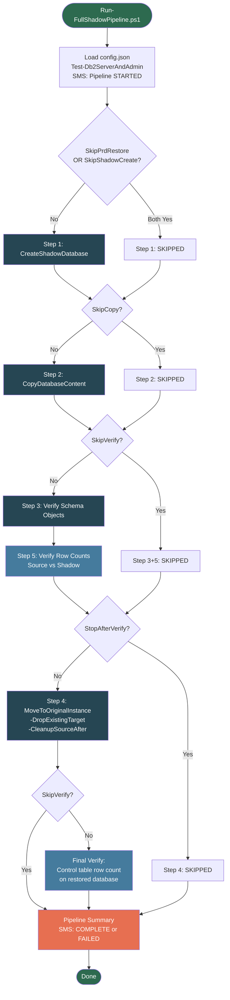

---

## Step 1: Create Shadow Database

**Script:** `Step-1-CreateShadowDatabase.ps1`

Restores the source database from production, then creates a clean shadow instance and database using the UseNewConfigurations pipeline.

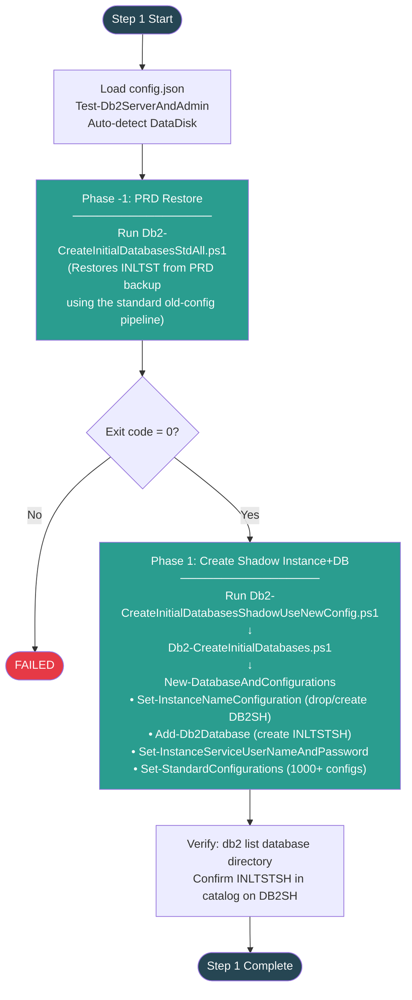

### Instance Layout After Step 1

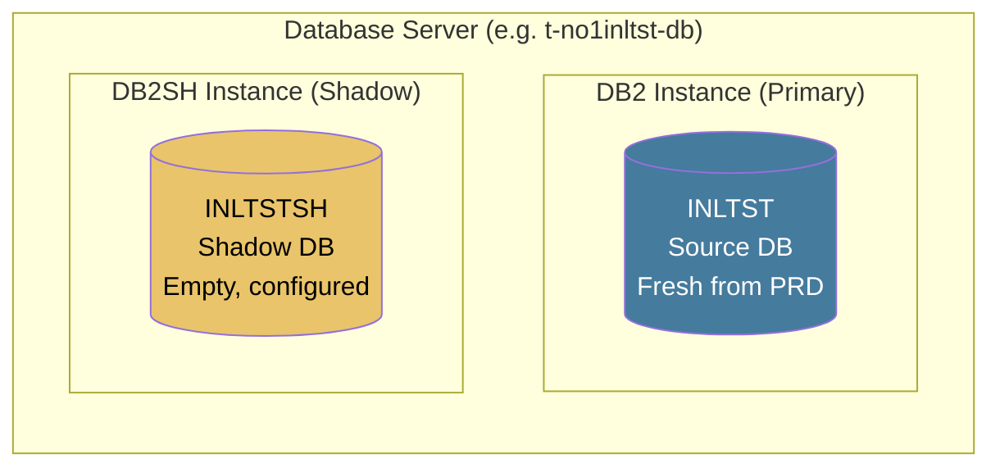

---

## Step 2: Copy Database Content

**Script:** `Step-2-CopyDatabaseContent.ps1`

Copies all user schemas, tables, views, triggers, functions, and data from source to shadow. Uses cross-instance mode (db2look DDL + db2move EXPORT/LOAD).

```mermaid
flowchart TD
    S2START([Step 2 Start]) --> INIT2[Load config.json\nDetect cross-instance mode]

    INIT2 --> PH1_2["Phase 1: Auto-Discover Schemas\n─────────────────\nSELECT DISTINCT TABSCHEMA FROM SYSCAT.TABLES\n(exclude system schemas)\nResult: INL, DBM, etc."]

    PH1_2 --> PH2A["Phase 2a: Extract DDL\n─────────────────\ndb2look -d INLTST -e -l -td @\nExtracts all CREATE statements"]

    PH2A --> PH2B["Phase 2b: Clean + Apply DDL\n─────────────────\n• Strip CONNECT/TERMINATE/COMMIT\n• Strip CREATE BUFFERPOOL/TABLESPACE\n• Strip IN tablespace-name clauses\n• Fix USER/SESSION_USER defaults\n• Apply cleaned DDL to shadow DB"]

    PH2B --> PH2B2["Phase 2b2: Disable Triggers\n─────────────────\nALTER TRIGGER ... DISABLE\non all user triggers in shadow\n(prevents firing during data load)"]

    PH2B2 --> PH2C["Phase 2c: Export Data\n─────────────────\ndb2move INLTST EXPORT -sn INL,DBM,...\nExports to IXF files on data disk"]

    PH2C --> PH2D["Phase 2d: Load Data\n─────────────────\ndb2move INLTSTSH LOAD\nLoads IXF files into shadow DB"]

    PH2D --> PH2E["Phase 2e: Clear LOAD PENDING\n─────────────────\nSET INTEGRITY FOR ... IMMEDIATE CHECKED\non all tables with pending state"]

    PH2E --> PH2F["Phase 2f: Fix Triggers\n─────────────────\nCompare trigger lists src vs tgt\nFix alias.* column expansion\nRecreate missing triggers"]

    PH2F --> PH4_2["Phase 4: Enable Triggers\n─────────────────\nALTER TRIGGER ... ENABLE\non all user triggers"]

    PH4_2 --> PH5_2["Phase 5: Control SQL\n─────────────────\nSELECT COUNT(*) FROM inl.KONTOTYPE\nVerify rows > 0"]

    PH5_2 --> S2END([Step 2 Complete])

    style S2START fill:#264653,color:#fff
    style S2END fill:#264653,color:#fff
    style PH2A fill:#2a9d8f,color:#fff
    style PH2B fill:#2a9d8f,color:#fff
    style PH2C fill:#e9c46a,color:#000
    style PH2D fill:#e9c46a,color:#000
    style PH2F fill:#f4a261,color:#000
```

### Data Flow During Step 2

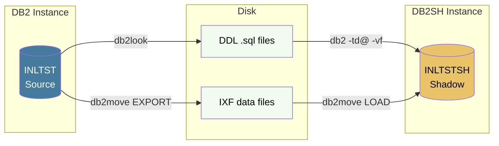

---

## Step 3: Verify Schema Objects

**Script:** `Step-3-CleanupShadowDatabase.ps1`

Compares all schema objects between source and shadow to ensure nothing was lost during the copy.

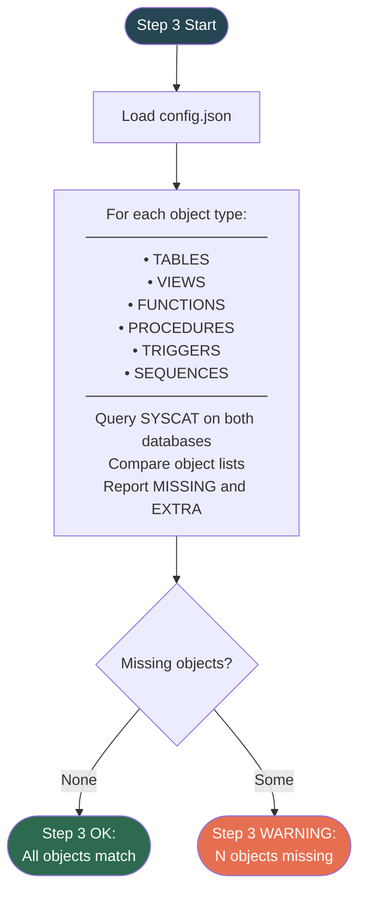

---

## Step 5: Verify Row Counts

**Script:** `Step-5-VerifyRowCounts.ps1`

Counts rows per table in both databases and compares. Each query includes `CURRENT SERVER` to prove the count came from the correct database.

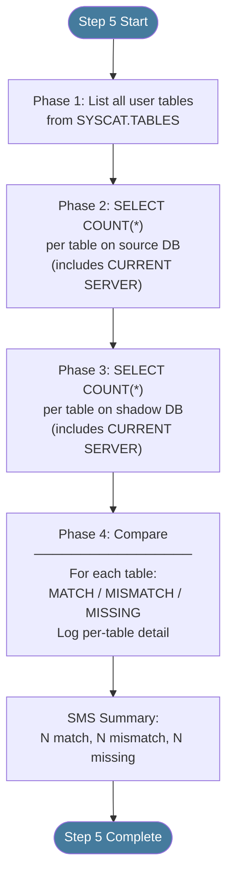

---

## Step 4: Move to Original Instance

**Script:** `Step-4-MoveToOriginalInstance.ps1`

The most critical step. Backs up the verified shadow database, drops the old original, restores via the UseNewConfigurations pipeline, and optionally cleans up the shadow instance.

**Note:** Source/Target are REVERSED compared to Steps 1-3.  
Shadow (DB2SH/INLTSTSH) is the source, Original (DB2/INLTST) is the target.

```mermaid
flowchart TD
    S4START([Step 4 Start]) --> INIT4[Load config.json\nReverse source/target]

    INIT4 --> PH0["Phase 0: Convert DatabasesV2.json\n─────────────────\nFind FederatedDb access point\nConvert to Alias:\n  AccessPointType: FederatedDb → Alias\n  InstanceName: DB2FED → DB2\n  NodeName: NODEFED → XINLTST\n  Auth: Ntlm → KerberosServerEncrypt\nBackup .bak file, write + verify"]

    PH0 --> PH0_CHK{FederatedDb\nfound?}
    PH0_CHK -- "No (already converted)" --> PH1_4
    PH0_CHK -- Yes --> PH0_CONV[Convert + Write + Verify]
    PH0_CONV --> PH1_4

    PH1_4["Phase 1: Backup Shadow DB\n─────────────────\ndb2 backup database INLTSTSH\non DB2SH instance\nExtract backup timestamp"]

    PH1_4 --> PH1B["Phase 1b: Copy Backup File\n─────────────────\nCopy backup .001 file from\nDB2SH backup folder to\nDB2 restore folder"]

    PH1B --> PH2_4{"DropExistingTarget?"}
    PH2_4 -- Yes --> DROP4["Phase 2: Drop Original\n─────────────────\ndb2 drop database INLTST\ndb2 uncatalog database INLTST\nClean log/temp folders"]
    PH2_4 -- No --> PH3_4

    DROP4 --> PH3_4["Phase 3: Restore via Full Pipeline\n─────────────────\nDb2-CreateInitialDatabasesStdAllUseNewConfig.ps1\n↓\nDb2-CreateInitialDatabases.ps1\n  DatabaseType = PrimaryDb\n  UseNewConfigurations = true\n↓\nNew-DatabaseAndConfigurations:\n• Restore-DuringDatabaseCreationNew\n• Add-DatabaseConfigurations\n  (KRB_SERVER_ENCRYPT, AES_ONLY)\n• Add-CatalogingForNodes\n  (NODE1, NODE2, XINLTST)\n• Add-ServerCatalogingForLocalDatabase\n  (INLTST, FKKTOTST, XINLTST)\n• Add-Db2ServicesToServiceFile\n• Add-FirewallRules\n• Set-DatabasePermissions\n• Set-StandardConfigurations"]

    PH3_4 --> PH3B_4["Phase 3b: Control SQL\n─────────────────\nSELECT COUNT(*) FROM inl.KONTOTYPE\nVerify rows > 0 on restored DB"]

    PH3B_4 --> PH4_4{"CleanupSourceAfter?"}
    PH4_4 -- Yes --> CLEAN4["Phase 4: Cleanup Shadow\n─────────────────\ndb2 drop database INLTSTSH\ndb2 uncatalog database INLTSTSH\ndb2 uncatalog node SHINST\nClean shadow folders"]
    PH4_4 -- No --> S4END

    CLEAN4 --> S4END["SMS: Step 4 COMPLETE"]
    S4END --> S4DONE([Step 4 Complete])

    style S4START fill:#264653,color:#fff
    style S4DONE fill:#264653,color:#fff
    style PH0 fill:#e76f51,color:#fff
    style PH3_4 fill:#2a9d8f,color:#fff
    style DROP4 fill:#e63946,color:#fff
    style CLEAN4 fill:#e63946,color:#fff
```

### Instance Layout During Step 4

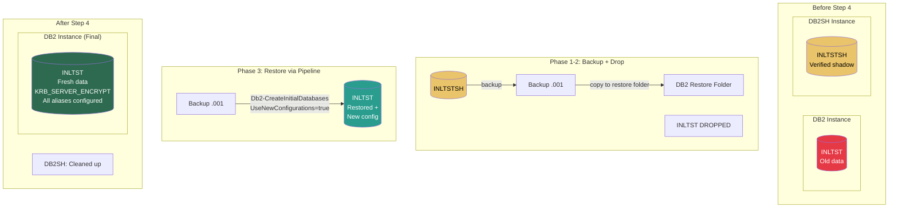

---

## Phase 0: FederatedDb → Alias Conversion Detail

This is the JSON transformation that Phase 0 performs inside Step 4.

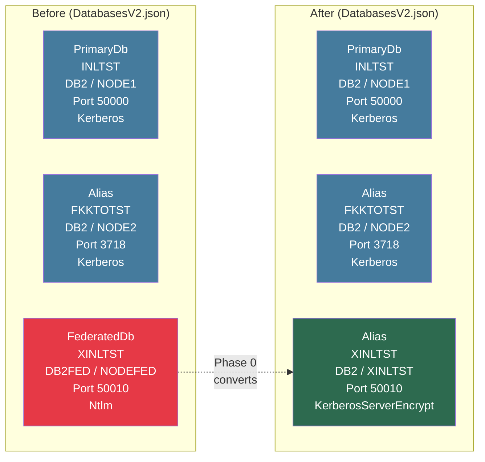

---

## Authentication Configuration Flow

When `UseNewConfigurations = true`, the `Add-DatabaseConfigurations` function in `Db2-Handler.psm1` applies these DBM settings:

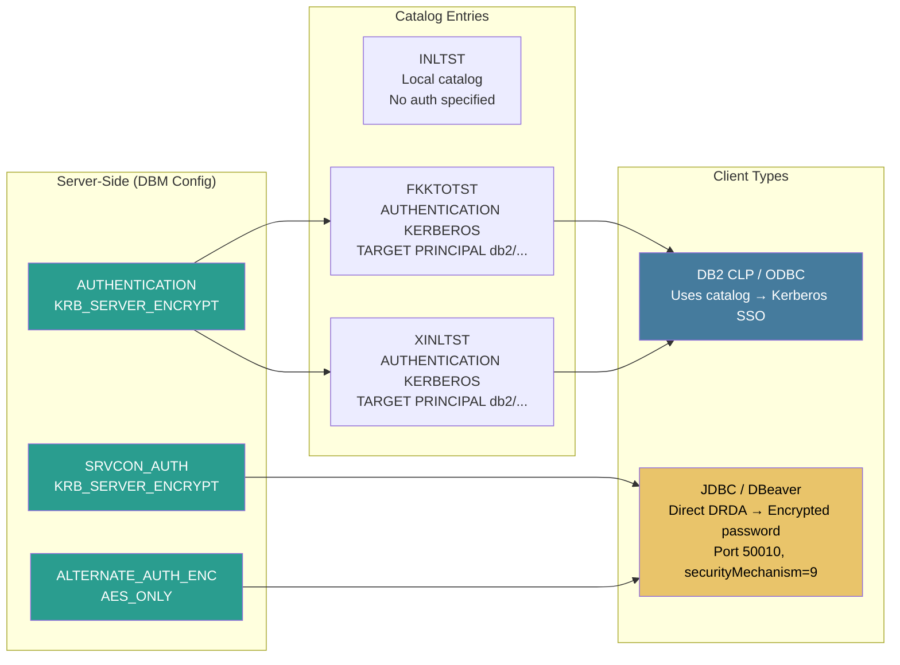

---

## File Dependencies

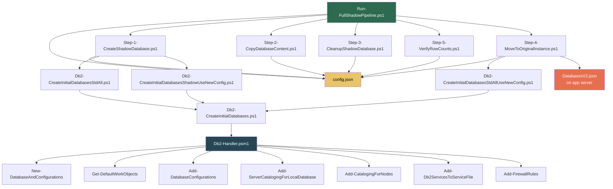

---

## config.json Reference

```json
{
  "SourceInstance": "DB2",
  "SourceDatabase": "INLTST",
  "TargetInstance": "DB2SH",
  "TargetDatabase": "INLTSTSH",
  "ServerFqdn": "t-no1inltst-db.DEDGE.fk.no",
  "DataDisk": "F:",
  "DbUser": "db2nt",
  "DbPassword": "ntdb2",
  "Application": "INL",
  "ControlTable": "inl.KONTOTYPE",
  "ServiceUserName": "t1_srv_inltst_db"
}
```

| Field | Used By | Purpose |
|---|---|---|
| SourceInstance | Steps 1-5 | Primary DB2 instance name |
| SourceDatabase | Steps 1-5 | Database to refresh from PRD |
| TargetInstance | Steps 1-3 | Shadow instance name |
| TargetDatabase | Steps 1-3 | Shadow database name |
| DataDisk | Step 1-2 | Disk for DB2 data files |
| DbUser/DbPassword | Step 2 | Credentials for db2move |
| ControlTable | Step 2, 4 | Table for post-restore validation |

---

## Execution Timeline (Typical)

```mermaid
gantt
    title Shadow Database Pipeline Timeline
    dateFormat HH:mm
    axisFormat %H:%M

    section Step 1
    Phase -1 PRD Restore          :s1a, 00:00, 90min
    Phase 1 Shadow Create         :s1b, after s1a, 20min

    section Step 2
    Schema Discovery              :s2a, after s1b, 2min
    DDL Extract + Apply           :s2b, after s2a, 10min
    Data Export                   :s2c, after s2b, 30min
    Data Load                    :s2d, after s2c, 20min
    Trigger Fix + Enable          :s2e, after s2d, 5min

    section Verify
    Step 3 Schema Objects         :s3, after s2e, 5min
    Step 5 Row Counts             :s5, after s3, 15min

    section Step 4
    Phase 0 JSON Convert          :s4a, after s5, 1min
    Phase 1 Backup Shadow         :s4b, after s4a, 10min
    Phase 2 Drop Original         :s4c, after s4b, 2min
    Phase 3 Restore Pipeline      :s4d, after s4c, 30min
    Phase 4 Cleanup Shadow        :s4e, after s4d, 2min

    section Final
    Final Verification            :sf, after s4e, 2min
```

**Estimated total: ~4-5 hours** (depends on database size, disk I/O, and network speed)

---

## Error Handling

Every step runs as a child `pwsh.exe` process. If any step exits with non-zero:

1. The step result is recorded as `FAILED`
2. The pipeline summary is printed with all step statuses
3. SMS notification is sent with the error message
4. The pipeline exits with code `1`

The pipeline does **not** attempt to rollback previous steps. Manual intervention is required after a failure. See `Checklist-FederatedToAlias-Conversion.md` for rollback procedures.
