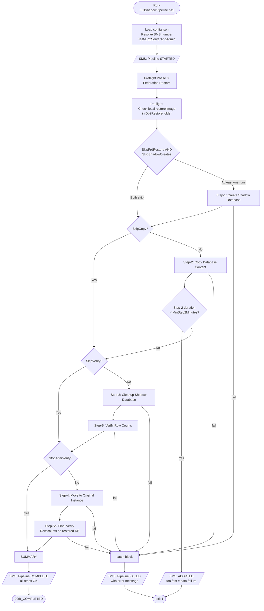
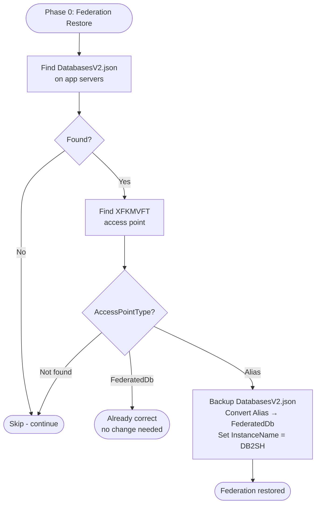
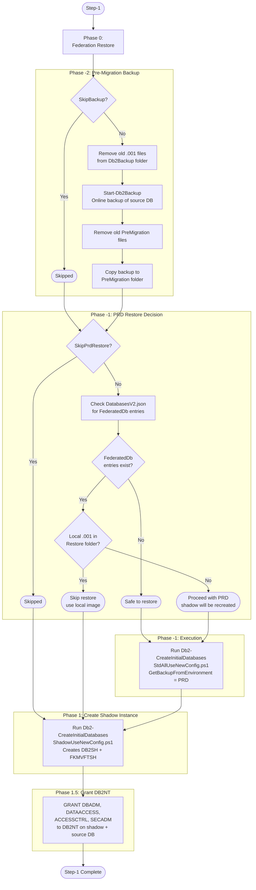
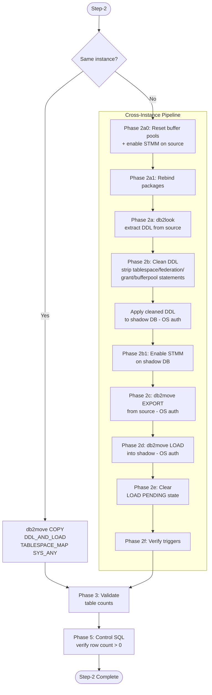
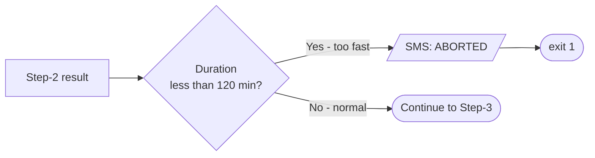
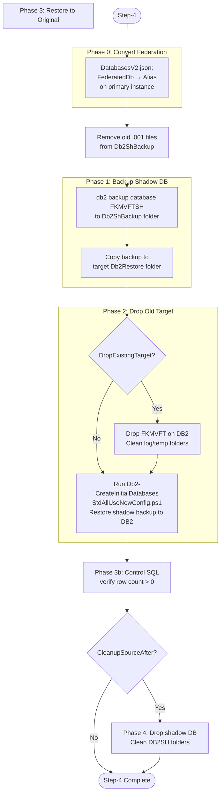
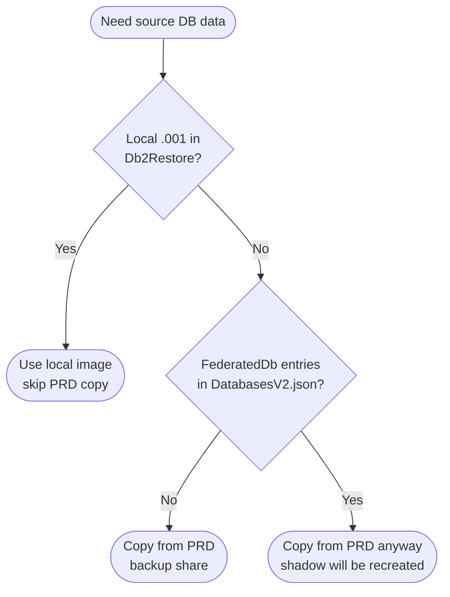
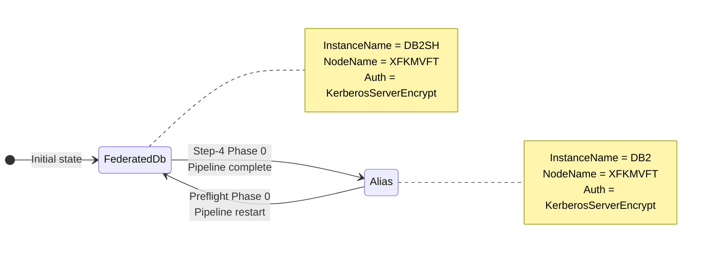

# Shadow Database Pipeline — Run-FullShadowPipeline.ps1

**Author:** Geir Helge Starholm, www.dEdge.no  
**Created:** 2026-03-16  
**Technology:** PowerShell / DB2

---

## Overview

`Run-FullShadowPipeline.ps1` is the canonical pipeline script. It orchestrates:  
**Step-1 → Step-2 → Step-3 → Step-5 → Step-4 → Step-5b**

It can be run interactively on the server, triggered via the orchestrator's `RUN_ALL` command,
or deployed and monitored via `--autocur`.

Previous script `Run-Manually.ps1` has been retired to `_old/`.

---

## Top-Level Pipeline Flow

---

## Preflight Phase 0 — Federation Restore

Ensures `DatabasesV2.json` has `XFKMVFT` as `FederatedDb` on the shadow instance,  
undoing Step-4's conversion from the previous run.

---

## Step-1: Create Shadow Database

---

## Step-2: Copy Database Content (Cross-Instance)

All DB2 connections use **OS authentication** (service account = SYSADM).

---

## Step-2 Duration Guard

A Step-2 completing in under 2 hours indicates a data transfer failure.

---

## Step-4: Move Shadow Back to Original Instance

---

## Backup Source Decision Tree

---

## DatabasesV2.json Federation Lifecycle

---

## Skip Switches for Partial Reruns

| Switch | Effect |
|---|---|
| `-SkipPrdRestore` | Skip Step-1 Phase -1 (PRD restore) |
| `-SkipShadowCreate` | Skip Step-1 Phase 1 (shadow instance creation) |
| `-SkipBackup` | Skip Step-1 Phase -2 (pre-migration backup) |
| `-SkipCopy` | Skip Step-2 entirely |
| `-SkipVerify` | Skip Step-3 and Step-5 |
| `-StopAfterVerify` | Stop after Step-3/5, do not run Step-4 |

When both `-SkipPrdRestore` and `-SkipShadowCreate` are set, Step-1 is skipped entirely.

---

## Disk Cleanup Points

| When | Folder | What is removed |
|---|---|---|
| Step-1 Phase -2 (before backup) | `Db2Backup` | Old `.001` files |
| Step-1 Phase -2 (before copy) | `PreMigration` | Old `.001` files |
| Step-4 Phase 1 (before backup) | `Db2ShBackup` | Old `.001` files |
| Step-4 Phase 1b (before copy) | `Db2Restore` | Old `.001` files |

---

## SMS Notification Points

| Trigger | Message |
|---|---|
| Pipeline start | `Shadow pipeline STARTED on <server>: FKMVFT->FKMVFTSH` |
| Step-2 too fast | `Shadow pipeline ABORTED: Step-2 completed in X min` |
| Any step fails | `Shadow pipeline FAILED after X min: <error>` |
| All steps complete | `Shadow pipeline COMPLETE: all steps OK in X min` |
