# Shadow Pipeline — Autocur Phrase Book and Parameter Reference

Quick-reference for invoking `/shadow-pipeline-autocur` with natural language.
The agent translates phrases in this document into exact `Invoke-ServerCommand` calls.

## Known Servers and Configs

Config is selected automatically on the server by matching `$env:COMPUTERNAME` inside each `config.*.json`.
There is no `-Config` switch; only `-ServerName` matters.


| Short name | ServerName       | Source DB | Shadow DB | Shadow Instance | Config file        |
| ---------- | ---------------- | --------- | --------- | --------------- | ------------------ |
| FKMVFT     | `t-no1fkmvft-db` | FKMVFT    | FKMVFTSH  | DB2SH           | config.fkmvft.json |
| FKMVCT     | `t-no1fkmvct-db` | FKMVCT    | FKMVCTSH  | DB2SH           | config.fkmvct.json |
| FKMMIG     | `t-no1fkmmig-db` | FKMMIG    | FKMMIGSH  | DB2SH           | config.fkmmig.json |
| INLDEV     | `t-no1inldev-db` | INLDEV    | INLDEVSH  | DB2SH           | config.inldev.json |
| INLTST     | `t-no1inltst-db` | INLTST    | INLTSTSH  | DB2SH           | config.inltst.json |


---

## Parameter Glossary

### Switch parameters (`[switch]`)

These are enabled by adding the flag name. Never pass a value after a switch.


| Parameter                | What it skips / controls                                                                                                   | Default |
| ------------------------ | -------------------------------------------------------------------------------------------------------------------------- | ------- |
| `-SkipPrdRestore`        | Skips Step 1 Phase -1 (restore from PRD backup). Use when source DB already has fresh data.                                | Off     |
| `-SkipShadowCreate`      | Skips Step 1 Phase 1 (creating shadow instance and database). Use when shadow already exists.                              | Off     |
| `-SkipCopy`              | Skips Step 2 (db2look DDL + db2move EXPORT/LOAD). Use when shadow already has data.                                        | Off     |
| `-SkipVerify`            | Skips Step 3 (schema verify), Step 5 (row counts), Step 6a/6b (comprehensive verify).                                      | Off     |
| `-StopAfterVerify`       | Stops after Step 3/5/6a. Step 4 (move back), grants, post-move backup, Step 6b, and Step 7 do NOT run.                     | Off     |
| `-RunPostMoveBackup`     | Runs Db2-Backup on SourceInstance after Step 4 + grants, before Step 6b. Also controllable via config `RunPostMoveBackup`. | Off     |
| `-PostMoveBackupOffline` | Passes `-Offline` to Db2-Backup (offline backup). Also controllable via config `PostMoveBackupOffline`. Default is online. | Off     |


### Boolean parameters (`[bool]`) — require `:$true` or `:$false`

These **must** include a colon and a value. Bare `-SkipBackup` without a value causes a parse error.


| Parameter                                                  | What it controls                                                                                                                        | Default                  |
| ---------------------------------------------------------- | --------------------------------------------------------------------------------------------------------------------------------------- | ------------------------ |
| `-SkipBackup:$true` / `-SkipBackup:$false`                 | Skips Step 1 Phase -2 (pre-migration backup of source DB before restore).                                                               | `$true` (backup skipped) |
| `-UseRoleBasedGrants:$true` / `-UseRoleBasedGrants:$false` | `$true`: converts direct grants to DB2 role-based grants after Step 4. `$false`: re-applies production grants as classic direct grants. | `$true` (role-based)     |


### Value parameters


| Parameter                     | Type         | What it controls                                                                                           | Default     |
| ----------------------------- | ------------ | ---------------------------------------------------------------------------------------------------------- | ----------- |
| `-MinStep2Minutes`            | `[int]`      | Minimum acceptable Step 2 duration in minutes. Pipeline aborts if Step 2 finishes faster (likely failure). | `120`       |
| `-PostMoveBackupDatabaseType` | `[string]`   | `PrimaryDb`, `FederatedDb`, or `BothDatabases`. Passed to Db2-Backup. Also controllable via config.        | `PrimaryDb` |
| `-SmsNumbers`                 | `[string[]]` | Phone numbers for SMS. Auto-detected per `$env:USERNAME` if omitted.                                       | Auto        |


---

## Pipeline Step Order

```mermaid
flowchart LR
  S1["Step 1: Restore + Shadow Create"]
  S2["Step 2: Copy DDL + Data"]
  S3["Step 3: Schema Verify"]
  S5["Step 5: Row Count Verify"]
  S6a["Step 6a: PreMove Verify"]
  S4["Step 4: Move Back"]
  G["Grants Export + Import"]
  B["Post-move Backup"]
  S6b["Step 6b: PostMove Verify"]
  S7["Step 7: HTML Report"]
  S1 --> S2 --> S3 --> S5 --> S6a --> S4 --> G --> B --> S6b --> S7
```




## Step Inclusion Map


| Step                | What runs                                      | Skipped by                                               | Typical duration |
| ------------------- | ---------------------------------------------- | -------------------------------------------------------- | ---------------- |
| Step 1 Phase -2     | Pre-migration backup of source DB              | `-SkipBackup:$true` (default)                            | 10-30 min        |
| Step 1 Phase -1     | Restore source DB from PRD backup              | `-SkipPrdRestore`                                        | 15-60 min        |
| Step 1 Phase 1      | Create shadow instance + database              | `-SkipShadowCreate`                                      | 5-15 min         |
| Step 2              | db2look DDL export + db2move EXPORT/LOAD       | `-SkipCopy`                                              | 2-8 hours        |
| Step 3              | Schema object comparison                       | `-SkipVerify`                                            | 10-30 min        |
| Step 5              | Row count comparison                           | `-SkipVerify`                                            | 10-30 min        |
| Step 6a             | Comprehensive inventory (PreMove)              | `-SkipVerify`                                            | 10-30 min        |
| Step 4              | Move shadow DB back to original instance       | `-StopAfterVerify`                                       | 1-4 hours        |
| Grant export/import | Export + import grants (role-based or classic) | Always runs after Step 4; mode via `-UseRoleBasedGrants` | 1-5 min          |
| Post-move backup    | Db2-Backup on SourceInstance                   | Only runs when `-RunPostMoveBackup` is set (or config)   | 30-120 min       |
| Step 6b             | Comprehensive inventory (PostMove)             | `-SkipVerify` or `-StopAfterVerify`                      | 10-30 min        |
| Step 7              | Generate HTML diff report                      | `-SkipVerify` or `-StopAfterVerify`                      | 1-5 min          |


---

## Natural-Language Phrases and Exact Commands

Each entry shows: the phrase you give the agent, parsed intent, and the exact `Invoke-ServerCommand` the agent should run.
All examples use `-Project 'shadow-pipeline' -Timeout 43200`. Replace `<server>` with the target server from the table above.

### 1. Full pipeline from scratch (default server FKMVFT)

> Run shadow pipeline on FKMVFT, full from start.

```powershell
Invoke-ServerCommand -ServerName 't-no1fkmvft-db' `
    -Command '%OptPath%\DedgePshApps\Db2-ShadowDatabase\Run-FullShadowPipeline.ps1' `
    -Project 'shadow-pipeline' -Timeout 43200
```

No skip switches. All steps run. `UseRoleBasedGrants` defaults to `$true`, `SkipBackup` defaults to `$true`.

### 2. Full pipeline on a different server (FKMVCT)

> Run shadow pipeline on FKMVCT, full from start.

```powershell
Invoke-ServerCommand -ServerName 't-no1fkmvct-db' `
    -Command '%OptPath%\DedgePshApps\Db2-ShadowDatabase\Run-FullShadowPipeline.ps1' `
    -Project 'shadow-pipeline' -Timeout 43200
```

Same as (1) but targeting `t-no1fkmvct-db`. Config auto-resolves to `config.fkmvct.json` (FKMVCT / FKMVCTSH).

### 3. Full pipeline with post-move backup

> Run full shadow pipeline on FKMVFT with post-move backup.

```powershell
Invoke-ServerCommand -ServerName 't-no1fkmvft-db' `
    -Command '%OptPath%\DedgePshApps\Db2-ShadowDatabase\Run-FullShadowPipeline.ps1 -RunPostMoveBackup' `
    -Project 'shadow-pipeline' -Timeout 43200
```

### 4. Full pipeline with post-move backup and classic grants (no role conversion)

> Run full pipeline on FKMVFT with post-move backup but classic grants, no role conversion.

```powershell
Invoke-ServerCommand -ServerName 't-no1fkmvft-db' `
    -Command '%OptPath%\DedgePshApps\Db2-ShadowDatabase\Run-FullShadowPipeline.ps1 -RunPostMoveBackup -UseRoleBasedGrants:$false' `
    -Project 'shadow-pipeline' -Timeout 43200
```

### 5. Skip restore and shadow create, re-run from Step 2

> Restart from Step 2 on FKMVFT (shadow already exists, skip restore and create).

```powershell
Invoke-ServerCommand -ServerName 't-no1fkmvft-db' `
    -Command '%OptPath%\DedgePshApps\Db2-ShadowDatabase\Run-FullShadowPipeline.ps1 -SkipPrdRestore -SkipShadowCreate -SkipBackup:$true' `
    -Project 'shadow-pipeline' -Timeout 43200
```

### 6. Skip everything up to verify (restart from Step 3/5/6a)

> Skip restore, create, and copy — just run verification steps on FKMVFT.

```powershell
Invoke-ServerCommand -ServerName 't-no1fkmvft-db' `
    -Command '%OptPath%\DedgePshApps\Db2-ShadowDatabase\Run-FullShadowPipeline.ps1 -SkipPrdRestore -SkipShadowCreate -SkipBackup:$true -SkipCopy' `
    -Project 'shadow-pipeline' -Timeout 43200
```

### 7. Skip to move-back (Step 4 onwards)

> Shadow data is verified. Just move back, run grants, and generate the report on FKMVFT.

```powershell
Invoke-ServerCommand -ServerName 't-no1fkmvft-db' `
    -Command '%OptPath%\DedgePshApps\Db2-ShadowDatabase\Run-FullShadowPipeline.ps1 -SkipPrdRestore -SkipShadowCreate -SkipBackup:$true -SkipCopy -SkipVerify' `
    -Project 'shadow-pipeline' -Timeout 43200
```

Note: `-SkipVerify` skips Step 3, 5, 6a, and 6b, but Step 4, grants, and post-move backup still run. Step 7 report is skipped because there is no PreMove JSON to compare.

### 8. Verify only — do not move back

> Run verification on FKMVFT but stop before moving back. Do not touch the original instance.

```powershell
Invoke-ServerCommand -ServerName 't-no1fkmvft-db' `
    -Command '%OptPath%\DedgePshApps\Db2-ShadowDatabase\Run-FullShadowPipeline.ps1 -SkipPrdRestore -SkipShadowCreate -SkipBackup:$true -SkipCopy -StopAfterVerify' `
    -Project 'shadow-pipeline' -Timeout 43200
```

Step 4 (move back), grants, post-move backup, Step 6b, and Step 7 do NOT run.

### 9. MVCT: skip restore and copy, with post-move backup and role conversion

> Start shadow pipeline on MVCT without initial copy from production and without initial restore, but run it with post-move backup and role conversion.

**Interpretation A** — "initial copy from production" means PRD restore only (Step 2 still runs):

```powershell
Invoke-ServerCommand -ServerName 't-no1fkmvct-db' `
    -Command '%OptPath%\DedgePshApps\Db2-ShadowDatabase\Run-FullShadowPipeline.ps1 -SkipPrdRestore -SkipShadowCreate -SkipBackup:$true -UseRoleBasedGrants:$true -RunPostMoveBackup' `
    -Project 'shadow-pipeline' -Timeout 43200
```

**Interpretation B** — "initial copy" means both PRD restore AND Step 2 db2move (shadow already has data):

```powershell
Invoke-ServerCommand -ServerName 't-no1fkmvct-db' `
    -Command '%OptPath%\DedgePshApps\Db2-ShadowDatabase\Run-FullShadowPipeline.ps1 -SkipPrdRestore -SkipShadowCreate -SkipBackup:$true -SkipCopy -UseRoleBasedGrants:$true -RunPostMoveBackup' `
    -Project 'shadow-pipeline' -Timeout 43200
```

Use Interpretation A unless the user explicitly says "skip Step 2" or "shadow already has data".

### 10. Full pipeline with offline post-move backup (both primary and federated)

> Run full pipeline on FKMMIG with offline backup of both databases after move-back.

```powershell
Invoke-ServerCommand -ServerName 't-no1fkmmig-db' `
    -Command '%OptPath%\DedgePshApps\Db2-ShadowDatabase\Run-FullShadowPipeline.ps1 -RunPostMoveBackup -PostMoveBackupOffline -PostMoveBackupDatabaseType BothDatabases' `
    -Project 'shadow-pipeline' -Timeout 43200
```

### 11. Full pipeline with pre-migration backup enabled

> Run full pipeline on FKMVFT but also take a backup before restoring PRD (enable pre-migration backup).

```powershell
Invoke-ServerCommand -ServerName 't-no1fkmvft-db' `
    -Command '%OptPath%\DedgePshApps\Db2-ShadowDatabase\Run-FullShadowPipeline.ps1 -SkipBackup:$false' `
    -Project 'shadow-pipeline' -Timeout 43200
```

### 12. Monitor only (no deploy, no trigger)

> Check status of shadow pipeline on FKMVFT.

No `Invoke-ServerCommand` needed. The agent should:

1. `Test-OrchestratorReady -ServerName 't-no1fkmvft-db' -Project 'shadow-pipeline'`
2. Copy and tail `\\t-no1fkmvft-db\opt\data\Db2-ShadowDatabase\FkLog_YYYYMMDD.log` locally.
3. Copy and tail `\\t-no1fkmvft-db\opt\data\Cursor-ServerOrchestrator\stdout_capture_*_shadow-pipeline.txt` locally.
4. Report current step, elapsed time, and last meaningful log line.

---

## Ambiguous Phrases — Disambiguation Guide


| Phrase                                 | Could mean                                                                                           | Default interpretation                                                  |
| -------------------------------------- | ---------------------------------------------------------------------------------------------------- | ----------------------------------------------------------------------- |
| "without initial copy from production" | Skip PRD restore only (`-SkipPrdRestore`) OR skip PRD restore + Step 2 (`-SkipPrdRestore -SkipCopy`) | Skip PRD restore only (Interpretation A)                                |
| "skip restore"                         | Skip Step 1 Phase -1 (`-SkipPrdRestore`) OR skip all of Step 1 (`-SkipPrdRestore -SkipShadowCreate`) | Skip Phase -1 only (`-SkipPrdRestore`)                                  |
| "just verify"                          | Run verification only (`-SkipPrdRestore -SkipShadowCreate -SkipCopy -StopAfterVerify`)               | Verify without move-back                                                |
| "skip everything, just move back"      | `-SkipPrdRestore -SkipShadowCreate -SkipCopy -SkipVerify`                                            | Move back + grants + report (no pre/post verify)                        |
| "with backup"                          | Pre-migration backup (`-SkipBackup:$false`) OR post-move backup (`-RunPostMoveBackup`)               | Post-move backup (`-RunPostMoveBackup`), since pre-migration is unusual |
| "with role conversion"                 | `-UseRoleBasedGrants:$true`                                                                          | Already the default; include explicitly for clarity                     |
| "classic grants"                       | `-UseRoleBasedGrants:$false`                                                                         | Disable role-based conversion                                           |
| "run on FKMVCT" / "towards FKMVCT"     | `-ServerName 't-no1fkmvct-db'`                                                                       | Look up the server table above                                          |


---

## Agent Scope Templates

Copy-paste blocks for the agent when executing `/shadow-pipeline-autocur`.

### Scope A: Full autocur (FKMVFT, default)

Deploy, create exec log, trigger full pipeline, monitor, fix errors, validate report, send SMS.

- Server: `t-no1fkmvft-db`
- Config: FKMVFT -> FKMVFTSH (DB2 -> DB2SH)
- Command: `Run-FullShadowPipeline.ps1` (no skip args)
- Add `-RunPostMoveBackup` if user requested post-move backup.

### Scope B: Full autocur (alternate server)

Same as Scope A but replace every `t-no1fkmvft-db` reference with the target server.
The config auto-resolves. No code changes needed for server selection.

Known alternates: `t-no1fkmvct-db` (FKMVCT), `t-no1fkmmig-db` (FKMMIG), `t-no1inldev-db` (INLDEV), `t-no1inltst-db` (INLTST).

### Scope C: Monitor only / status check

No deploy, no trigger. Poll logs and report progress.
Use when the user says "status", "check progress", or "monitor".

### Scope D: Restart from Step 2 (after Step 1 completed)

Deploy (in case of code fixes), kill existing job, then:

```
-SkipPrdRestore -SkipShadowCreate -SkipBackup:$true
```

### Scope E: Restart from verification (after Step 2 completed)

Deploy, kill existing job, then:

```
-SkipPrdRestore -SkipShadowCreate -SkipBackup:$true -SkipCopy
```

### Scope F: Restart from move-back (after verification completed)

Deploy, kill existing job, then:

```
-SkipPrdRestore -SkipShadowCreate -SkipBackup:$true -SkipCopy -SkipVerify
```

### Scope G: Verify only — do not move back

Deploy, trigger with:

```
-SkipPrdRestore -SkipShadowCreate -SkipBackup:$true -SkipCopy -StopAfterVerify
```

Step 4, grants, post-move backup, Step 6b, Step 7 are all skipped.

---

## Ready-to-Paste Sentences (FKMVCT examples)

Copy any sentence below directly into the agent chat. Each covers a different scenario.
Replace `FKMVCT` with `FKMVFT`, `FKMMIG`, `INLDEV`, or `INLTST` to target a different server.

### Full pipeline

> Run /shadow-pipeline-autocur towards FKMVCT, full from start.

### Full pipeline with post-move backup

> Run /shadow-pipeline-autocur towards FKMVCT, full from start, with post-move backup.

### Full pipeline with post-move backup and classic grants

> Run /shadow-pipeline-autocur towards FKMVCT, full from start, with post-move backup and classic grants (no role conversion).

### Full pipeline with post-move offline backup

> Run /shadow-pipeline-autocur towards FKMVCT, full from start, with offline post-move backup.

### Full pipeline with pre-migration backup enabled

> Run /shadow-pipeline-autocur towards FKMVCT, full from start, enable pre-migration backup.

### Skip PRD restore and shadow create — restart from Step 2

> Run /shadow-pipeline-autocur towards FKMVCT,skip restore and sh adow create, restart from Step 2.

### Skip restore, create, and copy — restart from verification

> Run /shadow-pipeline-autocur towards FKMVCT, skip restore, create, and copy, restart from verification.

### Skip to move-back (Step 4 onwards)

> Run /shadow-pipeline-autocur towards FKMVCT, skip restore, create, copy, and verify, just move back and finish.

### Verify only — do not move back

> Run /shadow-pipeline-autocur towards FKMVCT, skip restore, create, and copy, verify only, do not move back.

### Skip restore and copy, with post-move backup and role conversion

> Run /shadow-pipeline-autocur towards FKMVCT, skip restore and shadow create, skip copy, with post-move backup and role conversion.

### Skip restore only (keep shadow create and copy)

> Run /shadow-pipeline-autocur towards FKMVCT, skip PRD restore only, run everything else.

### Restart from move-back with post-move backup

> Run /shadow-pipeline-autocur towards FKMVCT, skip restore, create, copy, and verify, move back with post-move backup.

### Full pipeline with post-move backup for both primary and federated

> Run /shadow-pipeline-autocur towards FKMVCT, full from start, with post-move backup for BothDatabases.

### Skip PRD restore and shadow create, run rest with post-move backup

> Run /shadow-pipeline-autocur towards FKMVCT, skip restore and shadow create, run rest of pipeline with post-move backup.

### Monitor only

> Check status of /shadow-pipeline-autocur on FKMVCT.

Run /shadow-pipeline-autocur towards FKMVFT, skip restore and shadow create, run rest of pipeline with post-move backup.

