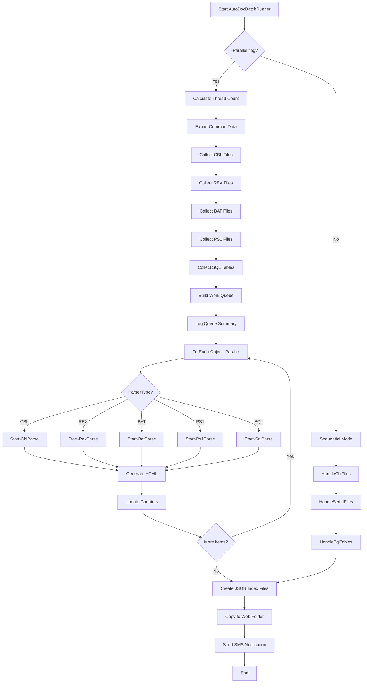

# AutoDoc Parallel Processing Architecture

**Author:** Geir Helge Starholm, www.dEdge.no  
**Last Updated:** 2026-01-19

## Overview

AutoDoc uses a **Unified Work Queue** parallel processing architecture to maximize CPU utilization when generating documentation for multiple code types (COBOL, Rexx, Batch, PowerShell, SQL).

## Architecture Diagram

```
┌─────────────────────────────────────────────────────────────────────────────┐
│                           FILE COLLECTION PHASE                              │
│  ┌──────────┐ ┌──────────┐ ┌──────────┐ ┌──────────┐ ┌──────────┐          │
│  │ CBL Files│ │REX Files │ │BAT Files │ │PS1 Files │ │SQL Tables│          │
│  │ (~500)   │ │ (~50)    │ │ (~30)    │ │ (~200)   │ │ (~2900)  │          │
│  └────┬─────┘ └────┬─────┘ └────┬─────┘ └────┬─────┘ └────┬─────┘          │
│       │            │            │            │            │                 │
│       └────────────┴────────────┴────────────┴────────────┘                 │
│                                 │                                            │
│                                 ▼                                            │
│  ┌─────────────────────────────────────────────────────────────────────┐    │
│  │                    UNIFIED WORK QUEUE                                │    │
│  │  ┌─────┬─────┬─────┬─────┬─────┬─────┬─────┬─────┬─────┬─────┐      │    │
│  │  │CBL1 │CBL2 │REX1 │SQL1 │CBL3 │BAT1 │PS11 │SQL2 │CBL4 │ ... │      │    │
│  │  └─────┴─────┴─────┴─────┴─────┴─────┴─────┴─────┴─────┴─────┘      │    │
│  │  Each item tagged with: ParserType, FilePath, FileName, TableName   │    │
│  └─────────────────────────────────────────────────────────────────────┘    │
└─────────────────────────────────────────────────────────────────────────────┘
                                      │
                                      ▼
┌─────────────────────────────────────────────────────────────────────────────┐
│                        PARALLEL PROCESSING PHASE                             │
│                                                                              │
│  Thread Pool: 75% of CPU cores (e.g., 21 threads on 28-core system)         │
│                                                                              │
│  ┌───────────────────────────────────────────────────────────────────────┐  │
│  │                    ForEach-Object -Parallel                            │  │
│  │  ┌─────┐ ┌─────┐ ┌─────┐ ┌─────┐ ┌─────┐       ┌─────┐              │  │
│  │  │ T1  │ │ T2  │ │ T3  │ │ T4  │ │ T5  │  ...  │ T21 │              │  │
│  │  ├─────┤ ├─────┤ ├─────┤ ├─────┤ ├─────┤       ├─────┤              │  │
│  │  │CBL1 │ │CBL2 │ │REX1 │ │SQL1 │ │CBL3 │       │BAT1 │              │  │
│  │  │  ↓  │ │  ↓  │ │  ↓  │ │  ↓  │ │  ↓  │       │  ↓  │              │  │
│  │  │CBL22│ │CBL23│ │REX2 │ │SQL22│ │CBL24│       │PS11 │              │  │
│  │  │  ↓  │ │  ↓  │ │  ↓  │ │  ↓  │ │  ↓  │       │  ↓  │              │  │
│  │  │ ... │ │ ... │ │ ... │ │ ... │ │ ... │       │ ... │              │  │
│  │  └─────┘ └─────┘ └─────┘ └─────┘ └─────┘       └─────┘              │  │
│  │                                                                       │  │
│  │  Dynamic load balancing: threads pick next item when done             │  │
│  └───────────────────────────────────────────────────────────────────────┘  │
└─────────────────────────────────────────────────────────────────────────────┘
                                      │
                                      ▼
┌─────────────────────────────────────────────────────────────────────────────┐
│                           PARSER DISPATCH                                    │
│                                                                              │
│  switch ($item.ParserType) {                                                │
│      "CBL" → Start-CblParse  →  COBOL flowchart + sequence diagram          │
│      "REX" → Start-RexParse  →  Rexx flowchart                              │
│      "BAT" → Start-BatParse  →  Batch flowchart                             │
│      "PS1" → Start-Ps1Parse  →  PowerShell flowchart                        │
│      "SQL" → Start-SqlParse  →  SQL table documentation                     │
│  }                                                                           │
└─────────────────────────────────────────────────────────────────────────────┘
                                      │
                                      ▼
┌─────────────────────────────────────────────────────────────────────────────┐
│                              OUTPUT                                          │
│                                                                              │
│  dedge-server\FkAdminWebContent\AutoDoc\content\                       │
│  ├── AABELMA.CBL.html      (COBOL documentation)                            │
│  ├── AD_USER_IMP.REX.html  (Rexx documentation)                             │
│  ├── backup.bat.html       (Batch documentation)                            │
│  ├── Deploy-Files.ps1.html (PowerShell documentation)                       │
│  ├── dbm_kunde.sql.html    (SQL table documentation)                        │
│  └── *.json                (Index files for web UI)                         │
└─────────────────────────────────────────────────────────────────────────────┘
```

## Thread Allocation

| Setting | Value | Description |
|---------|-------|-------------|
| `ThreadPercentage` | 75% (default) | Percentage of CPU cores to use |
| `ThrottleLimit` | Dynamic | Calculated as `cores × (percentage / 100)` |
| Example (28 cores) | 21 threads | `28 × 0.75 = 21` |

### Formula

```powershell
function Get-OptimalThreadCount {
    param([int]$Percentage = 75)
    $totalCores = [Environment]::ProcessorCount
    $threads = [Math]::Max(2, [Math]::Floor($totalCores * ($Percentage / 100)))
    return $threads
}
```

## Work Queue Structure

Each work item in the queue contains:

```powershell
[PSCustomObject]@{
    ParserType = "CBL" | "REX" | "BAT" | "PS1" | "SQL"
    FilePath   = "C:\...\AABELMA.CBL"  # Full path to source file
    FileName   = "AABELMA.CBL"          # File name only
    TableName  = "DBM.KUNDE"            # For SQL items only
}
```

## Benefits of Unified Work Queue

### Before (Sequential Handlers)

```
Time →
├── CBL Handler ──────────────────────────────┤
                                              ├── Script Handler ────────┤
                                                                         ├── SQL Handler ────┤
Total: ~45 minutes
```

### After (Unified Work Queue)

```
Time →
├── All parsers running simultaneously ───────────────────────────────────────┤
│   CBL ████████████████████████████████████████                              │
│   REX ██████                                                                 │
│   BAT ████                                                                   │
│   PS1 ████████████                                                           │
│   SQL ████████████████████████████████████████████████████████████          │
Total: ~25 minutes (estimated 40-50% faster)
```

## Processing Flow



## Error Handling

- Each parallel thread handles its own errors
- Failed items create `.err` files in output folder
- Thread-safe counters track processed/error counts
- Processing continues despite individual failures

```powershell
try {
    # Parse file/table
    [System.Threading.Interlocked]::Increment($processedCount)
}
catch {
    [System.Threading.Interlocked]::Increment($errorCount)
    # Create .err file for debugging
}
```

## Module Dependencies

Each parallel runspace imports:
- `GlobalFunctions` - Logging, utilities, SMS
- `AutodocFunctions` - Parser functions (Start-CblParse, etc.)

```powershell
$workQueue | ForEach-Object -Parallel {
    Import-Module -Name GlobalFunctions -Force
    Import-Module -Name AutodocFunctions -Force
    # ... processing
} -ThrottleLimit $throttleLimit
```

## Configuration Parameters

| Parameter | Type | Default | Description |
|-----------|------|---------|-------------|
| `-Parallel` | Switch | Off | Enable parallel processing |
| `-ThreadPercentage` | Int | 75 | % of CPU cores to use |
| `-maxFilesPerType` | Int | 0 (unlimited) | Limit files per parser type |
| `-ClientSideRender` | Switch | Off | Use browser-side Mermaid.js |
| `-regenerate` | String | "std" | all/std/err/json/single |

## Example Usage

```powershell
# Full parallel run (recommended)
.\AutoDocBatchRunner.ps1 -regenerate all -Parallel -ClientSideRender

# Test run with 100 files per type
.\AutoDocBatchRunner.ps1 -regenerate all -Parallel -ClientSideRender -maxFilesPerType 100

# Use 50% of cores (lighter load)
.\AutoDocBatchRunner.ps1 -regenerate all -Parallel -ThreadPercentage 50

# Sequential mode (debugging)
.\AutoDocBatchRunner.ps1 -regenerate all -ClientSideRender
```

## Performance Comparison

| Mode | Architecture | Estimated Time (full run) |
|------|--------------|---------------------------|
| Sequential (no -Parallel) | Handler → Handler → Handler | ~60 minutes |
| Parallel (old) | Handler[parallel files] → Handler[parallel] → Handler[parallel] | ~45 minutes |
| **Parallel (new)** | **Unified queue with all parsers** | **~25 minutes** |

## File Locations

| Component | Path |
|-----------|------|
| Main Script | `DevTools/LegacyCodeTools/AutoDoc/AutoDocBatchRunner.ps1` |
| Parser Modules | `_Modules/AutodocFunctions/*.psm1` |
| Temp Data | `$env:OptPath\data\AutoDoc\tmp\` |
| Output | `dedge-server\FkAdminWebContent\AutoDoc\content\` |
| Log File | `$env:OptPath\data\AutoDoc\full_run_log.txt` |

## Future Enhancements

1. **Priority Queue** - Process CBL files first (most numerous)
2. **Progress Reporting** - Real-time progress bar
3. **Adaptive Threading** - Adjust threads based on system load
4. **Retry Logic** - Automatic retry for failed items
5. **Distributed Processing** - Spread work across multiple servers
