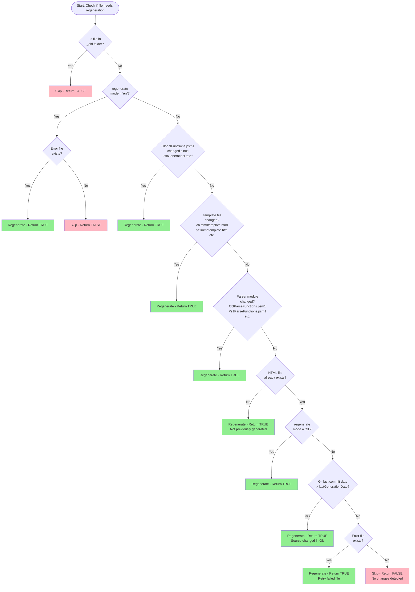
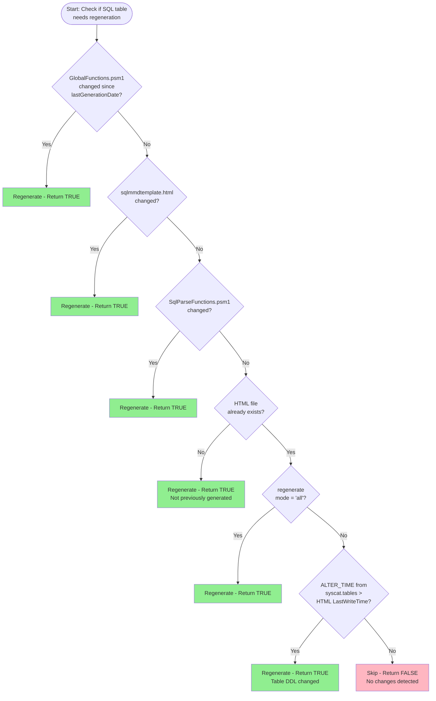
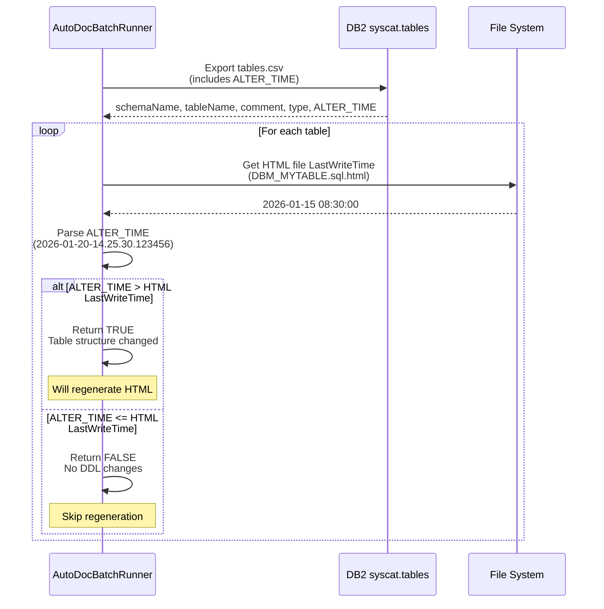
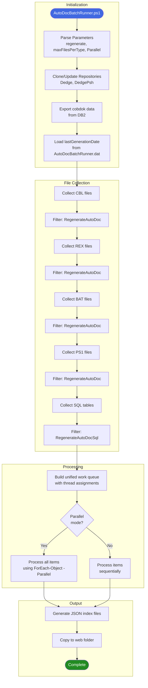

# AutoDoc Regeneration Logic

**Author:** Geir Helge Starholm, www.dEdge.no  
**Description:** This document explains when AutoDoc regenerates HTML documentation files for source code and SQL tables.

---

## Overview

AutoDoc uses **incremental regeneration** to avoid re-processing unchanged files. This significantly reduces processing time when running daily scheduled tasks.

There are two main regeneration functions:

| Function | Purpose |
|----------|---------|
| `RegenerateAutoDoc` | Determines if CBL, PS1, REX, or BAT files need regeneration |
| `RegenerateAutoDocSql` | Determines if SQL table documentation needs regeneration |

---

## Source File Regeneration (CBL, PS1, REX, BAT)



### Key Decision Points for Source Files

| Priority | Condition | Result |
|----------|-----------|--------|
| 1 | File is in `_old` folder | **SKIP** - Archived files are ignored |
| 2 | Mode is `err` and error file exists | **REGENERATE** - Retry failed files |
| 3 | `GlobalFunctions.psm1` changed | **REGENERATE** - Core module updated |
| 4 | Template HTML changed | **REGENERATE** - Output format changed |
| 5 | Parser module changed | **REGENERATE** - Parsing logic updated |
| 6 | HTML file doesn't exist | **REGENERATE** - Never generated before |
| 7 | Mode is `all` | **REGENERATE** - Force all |
| 8 | Git commit date > lastGenerationDate | **REGENERATE** - Source code changed |
| 9 | Error file exists | **REGENERATE** - Retry previous failure |
| 10 | None of the above | **SKIP** - No changes detected |

---

## SQL Table Regeneration



### Key Decision Points for SQL Tables

| Priority | Condition | Result |
|----------|-----------|--------|
| 1 | `GlobalFunctions.psm1` changed | **REGENERATE** - Core module updated |
| 2 | `sqlmmdtemplate.html` changed | **REGENERATE** - Output format changed |
| 3 | `SqlParseFunctions.psm1` changed | **REGENERATE** - Parsing logic updated |
| 4 | HTML file doesn't exist | **REGENERATE** - Never generated before |
| 5 | Mode is `all` | **REGENERATE** - Force all |
| 6 | `ALTER_TIME` > HTML file date | **REGENERATE** - Table DDL changed |
| 7 | None of the above | **SKIP** - No changes detected |

---

## ALTER_TIME Comparison (SQL Tables)

The `ALTER_TIME` column in `syscat.tables` stores the timestamp of the last DDL change (CREATE, ALTER) for each table.



### ALTER_TIME Format

The `ALTER_TIME` from DB2 `syscat.tables` is in format: `YYYY-MM-DD-HH.MM.SS.nnnnnn`

Example: `2026-01-20-14.25.30.123456`

The code extracts the date portion (`2026-01-20`) and converts it to an integer (`20260120`) for comparison with the HTML file's `LastWriteTime`.

```powershell
# Extract date from ALTER_TIME (first 10 characters)
$alterTimeInt = [int]($tableInfo.alter_time.Substring(0, 10).Replace("-", ""))
# Result: 20260120

# Get HTML file date
$contentFileDate = [int](Get-Item $htmlFilename).LastWriteTime.ToString("yyyyMMdd")
# Result: 20260115

# Compare: If HTML is older than DDL change, regenerate
if ($contentFileDate -lt $alterTimeInt) {
    return $true  # Regenerate
}
```

---

## Regeneration Modes

AutoDoc supports different regeneration modes via the `-regenerate` parameter:

| Mode | Description |
|------|-------------|
| `std` | **Standard** - Regenerate only changed files (default) |
| `all` | **Force All** - Regenerate everything regardless of changes |
| `err` | **Errors Only** - Only regenerate files that previously failed |
| `json` | **JSON Only** - Only update JSON index files, no parsing |
| `single` | **Single File** - Process only one specific file (for testing) |

---

## Complete Flow Diagram



---

## Summary

AutoDoc's incremental regeneration saves significant time by only processing files that have actually changed:

1. **Source files (CBL, PS1, REX, BAT)**: Uses **Git last commit date** to detect changes
2. **SQL tables**: Uses **ALTER_TIME from syscat.tables** to detect DDL changes
3. **Infrastructure changes**: If templates or parser modules change, all files of that type are regenerated

This approach ensures documentation stays current while minimizing processing time for daily scheduled runs.
