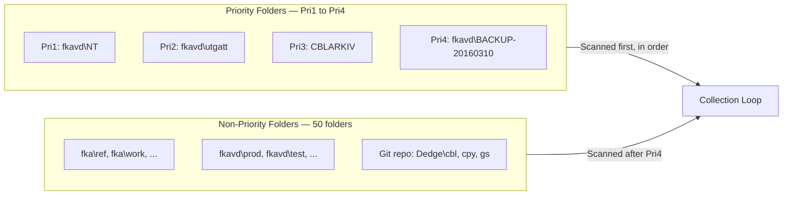
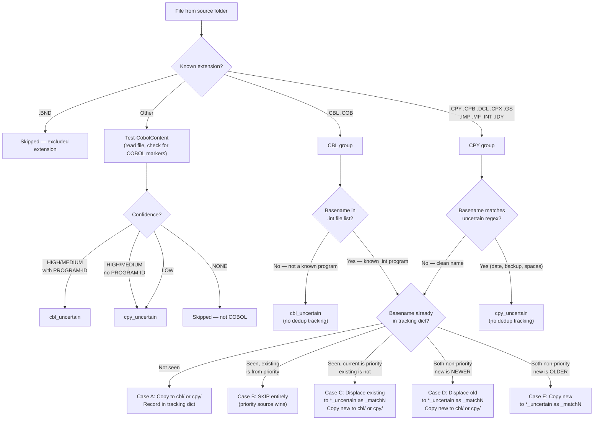
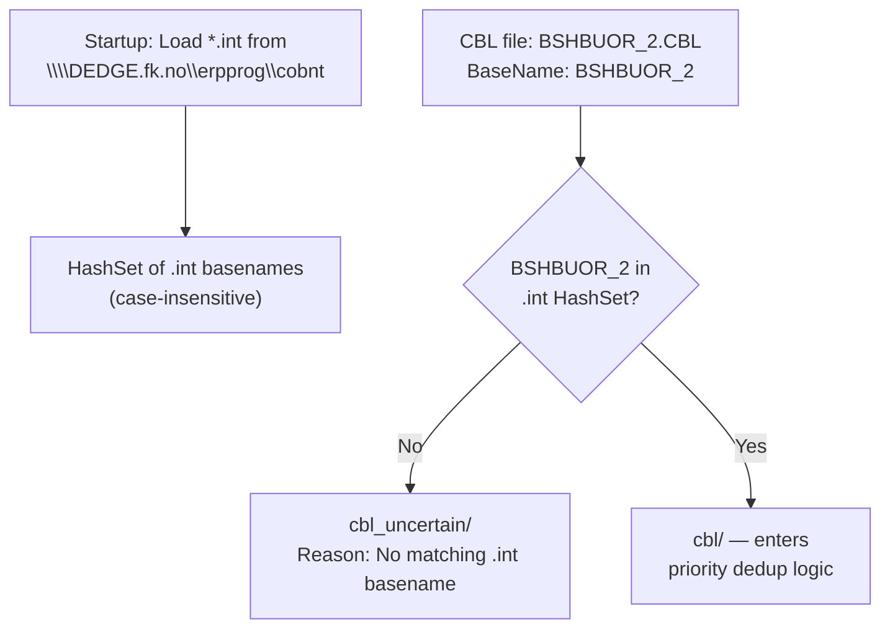
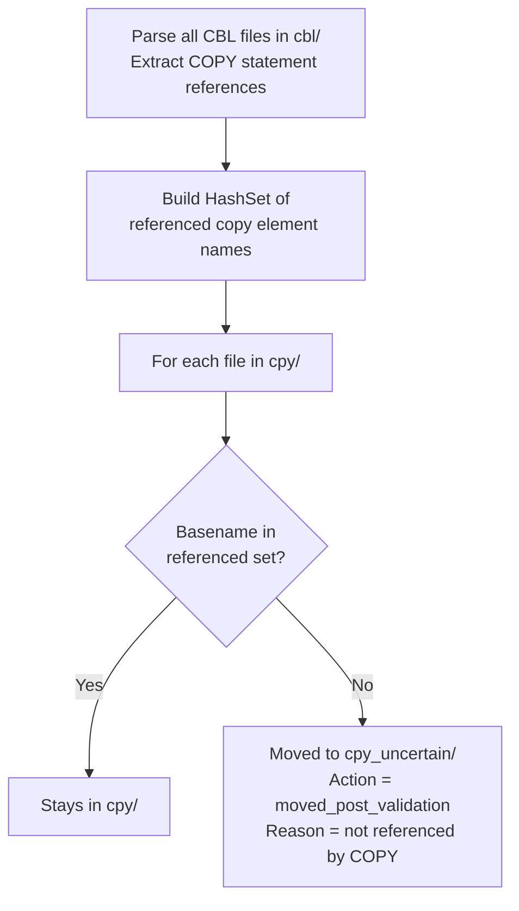

# Copy-VcSourceFiles — Collection and Match Process

**Script:** `DevTools/LegacyCodeTools/VisualCobol/Copy-VcSourceFiles.ps1 -CollectAll`
**Created:** 2026-03-11

---

## Output Folder Structure

```
C:\opt\data\VisualCobol\Copy-VcSourceFiles\
├── Sources\
│   ├── cbl\                  # CBL programs — basename matches a .int file
│   ├── cbl_uncertain\        # CBL programs — no .int match, or displaced
│   ├── cpy\                  # Copy elements — referenced by COPY statements
│   └── cpy_uncertain\        # Copy elements — unreferenced or uncertain
├── FileIndex-{timestamp}.json    # Full metadata for every file processed
├── FileIndex-{timestamp}.tsv     # Tab-separated summary for Excel/grep
└── CollectAll-{timestamp}.json   # Run summary with stats
```

---

## Source Folders (54 total)



---

## Collection Flow



---

## CBL Basename Matching — .int File Comparison

The script loads all `*.int` files from `\\DEDGE.fk.no\erpprog\cobnt` (non-recursive) at startup. The basenames of these files are the **canonical program names**. A CBL file is "certain" only if its basename exactly matches one of these `.int` basenames.



### Examples with .int comparison

| Filename | BaseName | In .int list? | Result |
|---|---|---|---|
| `BSHBUOR.CBL` | `BSHBUOR` | YES — `BSHBUOR.INT` exists | `cbl/` |
| `bshbuor_20100305.cbl` | `bshbuor_20100305` | NO | `cbl_uncertain/` |
| `BSHBUOR_2.CBL` | `BSHBUOR_2` | NO | `cbl_uncertain/` |
| `BSHBUOR_NY.CBL` | `BSHBUOR_NY` | NO | `cbl_uncertain/` |
| `BACKUP_OIAAUTO.CBL` | `BACKUP_OIAAUTO` | NO | `cbl_uncertain/` |
| `AAAM006.CBL` | `AAAM006` | YES — `AAAM006.INT` exists | `cbl/` |

No regex heuristic needed for CBL files — the `.int` list is the single source of truth.

---

## CPY Basename Matching — Two-Phase

CPY files do not have `.int` equivalents. They are validated in two phases:

**Phase 1 (during collection):** Regex heuristic catches obvious non-basenames:

```
^(BACKUP|KOPI|...)[-_]      prefix markers
[\s_-]\d{4,}                date suffixes (_170108)
[-_](OLD|NY|ASK|...)        backup/variant suffixes
\s                          spaces in name
\d{6,}                      6+ consecutive digits
```

**Phase 2 (post-collection):** Parse all CBL files for `COPY` statements. Any CPY file not referenced by any COPY statement is moved to `cpy_uncertain/`.



---

## JSON Tracking

Every file encountered generates a metadata record in `FileIndex-{timestamp}.json`:

```
BaseName, OriginalName, SourcePath, SourceFolder, Extension,
Type (cbl/cpy), IsPrioritySource, CreationTime, LastWriteTime,
FileSize, Action, Reason, DestinationPath, DestinationFolder,
RenamedTo, DisplacedBy, MatchTag, IntMatch, PostValidation
```

| Action | Meaning |
|---|---|
| `copied` | File copied to destination folder |
| `skipped` | Duplicate skipped (priority exists, same-size, or non-COBOL) |
| `displaced` | Existing file moved to *_uncertain because a newer/priority file replaced it |
| `moved_post_validation` | CPY file moved from cpy/ to cpy_uncertain/ (not referenced by COPY) |
