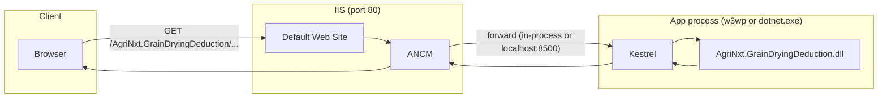
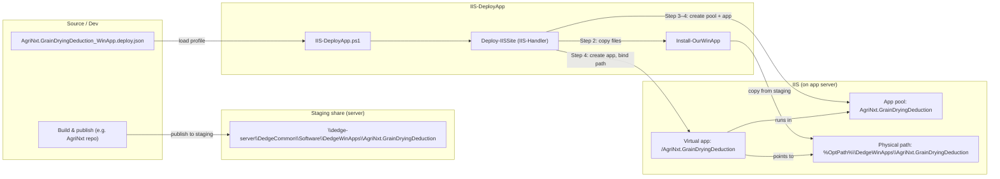
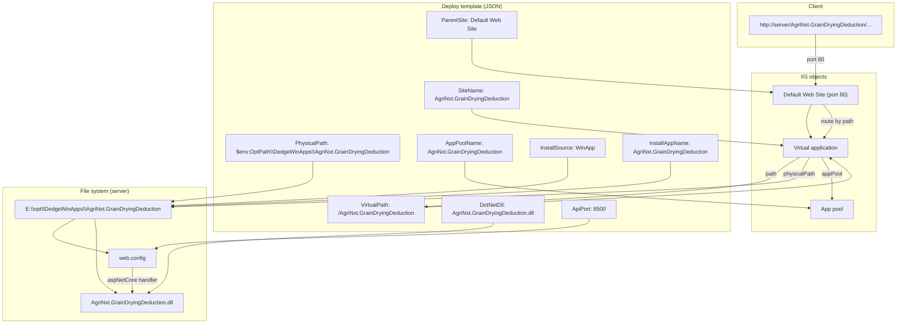
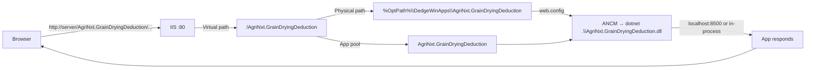

# AgriNxt.GrainDryingDeduction — Connection to IIS and the Browser

This document describes how the **AgriNxt.GrainDryingDeduction** application connects to IIS, from the deploy template through virtual paths, app pool, and physical files, and how a browser request reaches the app.

---

## 1. Deploy template (source of truth)

The deployment is driven by a single JSON profile:

**File:** `templates/AgriNxt.GrainDryingDeduction_WinApp.deploy.json`

| Field | Value | Role |
|-------|--------|------|
| `SiteName` | AgriNxt.GrainDryingDeduction | IIS app name and display name |
| `VirtualPath` | /AgriNxt.GrainDryingDeduction | URL path under the parent site |
| `ParentSite` | Default Web Site | IIS site that hosts the virtual app |
| `PhysicalPath` | $env:OptPath\DedgeWinApps\AgriNxt.GrainDryingDeduction | Folder where app files are installed |
| `AppType` | AspNetCore | .NET Core app; uses ANCM (AspNetCoreModuleV2) |
| `DotNetDll` | AgriNxt.GrainDryingDeduction.dll | Entry point for the app |
| `AppPoolName` | AgriNxt.GrainDryingDeduction | Dedicated app pool (one app per pool for in-process) |
| `InstallSource` | WinApp | Files come from `Install-OurWinApp` (staging share) |
| `InstallAppName` | AgriNxt.GrainDryingDeduction | Folder name on staging and under DedgeWinApps |
| `ApiPort` | 8500 | Kestrel listens here when out-of-process; firewall rules use this |
| `HealthEndpoint` | /health | Used for post-deploy health check |

---

## 2. What is an application pool?

An **application pool** (app pool) is an IIS container that owns one or more **worker processes** (e.g. `w3wp.exe`) that actually run your web application code. It defines the process identity, lifecycle, and resource limits for that set of processes.

### What it is (technically)

- **Name:** A unique identifier (e.g. `AgriNxt.GrainDryingDeduction`) that you use in the deploy template and in IIS.
- **Worker process(es):** The Windows process(es) that IIS starts to handle requests. For ASP.NET Core in-process, your app runs inside this process; for out-of-process, the app pool process hosts ANCM, which starts and talks to a separate `dotnet.exe` (Kestrel).
- **Identity:** The Windows account under which the worker process runs (e.g. `IIS AppPool\AgriNxt.GrainDryingDeduction` or a custom identity). File and registry access, and “run as” for the app, are determined by this account.
- **Configuration:** Pipeline mode (Integrated vs Classic), .NET runtime version (if any), idle timeout, recycling intervals, queue length, and other process and request limits.

So when we say “the app runs in app pool AgriNxt.GrainDryingDeduction,” we mean: IIS routes requests for that app to a virtual application that is assigned to that pool, and the pool’s worker process(es) execute the code (directly or via ANCM/Kestrel).

### What it is for (purpose)

1. **Isolation**  
   Each app pool is a separate process space. A crash, hang, or memory leak in one app does not bring down other apps on the same server. For AgriNxt.GrainDryingDeduction, using its own app pool means DedgeAuth, DocView, and other virtual apps are unaffected if this app fails.

2. **Security and identity**  
   The app pool identity is the “run as” account for the app. Permissions on the physical path (and any other resources) are granted to this identity. You can give different apps different identities and lock down access per app.

3. **Resource and lifecycle control**  
   IIS can recycle the pool (restart the worker process) on a schedule or after a number of requests, limit queue length, and apply CPU and memory limits per pool. That helps contain one app’s impact on the server.

4. **Requirement for ASP.NET Core in-process**  
   The ASP.NET Core Module (ANCM) in **in-process** mode does not support mixing multiple apps in the same app pool. If you put two in-process ASP.NET Core apps in one pool, IIS returns **HTTP 500.34 (ANCM Mixed Hosting Models Not Supported)**. So for AgriNxt.GrainDryingDeduction we use a **dedicated** app pool: only this virtual application is assigned to it.

### How it fits in this setup

- The **deploy template** sets `AppPoolName: AgriNxt.GrainDryingDeduction`.
- **Deploy-IISSite** creates an app pool with that name (no .NET runtime; Integrated pipeline) and then creates the **virtual application** for `/AgriNxt.GrainDryingDeduction`, pointing it at the **physical path** and **assigning it to this app pool**.
- Every request to `http://server/AgriNxt.GrainDryingDeduction/...` is handled by that virtual app and thus by the worker process(es) of the `AgriNxt.GrainDryingDeduction` app pool, which load the app from the physical path and run it (via ANCM and, when used, Kestrel).

In short: the **app pool** is the process boundary and identity boundary that runs your application; the **virtual application** is the URL and path mapping that sends requests into that pool.

---

## 3. What is Kestrel, and how does it connect to IIS?

**Kestrel** is the default, cross-platform HTTP server that ships with ASP.NET Core. It is the component that actually listens for HTTP requests, runs your app’s pipeline (middleware, controllers, etc.), and sends back responses. Your AgriNxt.GrainDryingDeduction app is built to run on top of Kestrel.

### What Kestrel is

- **Built-in web server:** Every ASP.NET Core app hosts a web server. By default that server is Kestrel: it binds to a URL (e.g. `http://localhost:8500`), accepts TCP connections, parses HTTP, and passes requests into the ASP.NET Core pipeline (your `Program.cs`, middleware, and endpoints).
- **Process:** When the app runs, the process (either `w3wp.exe` in in-process mode or `dotnet.exe` in out-of-process mode) loads your DLL and starts Kestrel. Kestrel then listens on the URL(s) you configured (via `ASPNETCORE_URLS` or in code).
- **No IIS dependency by itself:** Kestrel can run standalone (e.g. `dotnet AgriNxt.GrainDryingDeduction.dll` listening on a port). When we run behind IIS, we still use Kestrel; IIS (via ANCM) acts as a reverse proxy and/or in-process host in front of it.

So: **IIS** receives the request from the browser (port 80). **ANCM** (the ASP.NET Core Module inside IIS) then either hands the request into the same process (in-process) or forwards it to a separate process where **Kestrel** is listening (out-of-process). In both cases, **Kestrel** is what ultimately executes your app code.

### Two ways IIS and Kestrel work together

| Mode | Where the app runs | Role of Kestrel | Role of IIS/ANCM |
|------|--------------------|-----------------|-------------------|
| **In-process** | Inside the IIS worker process (`w3wp.exe`) | Kestrel runs inside the same process; it doesn’t listen on a separate port for incoming traffic. IIS passes the request directly into the app. | Hosts the app in-process; no reverse proxy to another port. |
| **Out-of-process** | Separate process (`dotnet.exe`) | Kestrel listens on a port (e.g. `http://localhost:8500`). It receives requests forwarded by ANCM and runs the app. | ANCM starts `dotnet.exe`, forwards each request to `localhost:8500`, and returns the response. |

For **AgriNxt.GrainDryingDeduction** we configure **ApiPort: 8500** in the deploy template. That value is written into `web.config` as `ASPNETCORE_URLS=http://localhost:8500`, so when running **out-of-process**, Kestrel listens on port 8500. IIS (ANCM) then forwards every request for `/AgriNxt.GrainDryingDeduction/...` to `http://localhost:8500`. The browser never talks to port 8500 directly; it only talks to IIS on port 80.

### Connection in our app (IIS ↔ Kestrel)

1. **Browser** → `http://server/AgriNxt.GrainDryingDeduction/...` (port 80).
2. **IIS** (Default Web Site) receives the request and routes it to the virtual application `/AgriNxt.GrainDryingDeduction`.
3. The **app pool** worker process runs **ANCM**. The `web.config` in the app folder says: use the `aspNetCore` handler, run `dotnet .\AgriNxt.GrainDryingDeduction.dll`, and (when out-of-process) the app listens on `http://localhost:8500`.
4. **ANCM** either:
   - **In-process:** Passes the request into the same process where your DLL is already loaded; Kestrel’s pipeline runs inside `w3wp.exe`.
   - **Out-of-process:** Sends the request to `http://localhost:8500`. A separate `dotnet.exe` process is running your DLL; **Kestrel** in that process is listening on 8500 and handles the request.
5. **Kestrel** runs your ASP.NET Core app (middleware, controllers, `/health`, etc.) and returns the response.
6. **ANCM** (and IIS) send that response back to the **browser**.

So the “connection” between IIS and Kestrel is: **IIS receives the request; ANCM delivers it to the app (in-process or via localhost:8500); the app runs on Kestrel.** Kestrel is always the HTTP engine inside your app; IIS is the public front (port 80) and process manager (app pool, recycling, identity).



---

## 4. Deployment flow (template → IIS)

How the template and IIS-DeployApp scripts get the app onto the server and registered in IIS:



**Deploy steps (10-step process):**

1. **Teardown** — Remove existing virtual app and app pool (if any).
2. **Install files** — `Install-OurWinApp -AppName AgriNxt.GrainDryingDeduction` copies from staging share to `$env:OptPath\DedgeWinApps\AgriNxt.GrainDryingDeduction`.
3. **Create app pool** — `appcmd add apppool "AgriNxt.GrainDryingDeduction"` (no .NET runtime; Integrated pipeline).
4. **Create virtual application** — `appcmd add app /site.name:"Default Web Site" /path:/AgriNxt.GrainDryingDeduction /physicalPath:<PhysicalPath>` and assign app pool.
5. **web.config** — Ensure/update `web.config` with `aspNetCore` handler, `processPath="dotnet"`, `arguments=".\AgriNxt.GrainDryingDeduction.dll"`, `ASPNETCORE_URLS=http://localhost:8500`.
6. **Permissions** — Grant app pool identity (e.g. `IIS AppPool\AgriNxt.GrainDryingDeduction`) Read & Execute on the physical path.
7. **Firewall** — Inbound/outbound rules for TCP port 8500 (ApiPort).
8. **Start app pool** — `appcmd start apppool "AgriNxt.GrainDryingDeduction"`.
9. **Verify** — App pool and virtual app exist and are started.
10. **Health check** — HTTP GET to `http://<server>/AgriNxt.GrainDryingDeduction/health`.

---

## 5. Request flow: Browser → IIS → Application

How an HTTP request from the browser reaches the .NET app and returns a response:

```mermaid
sequenceDiagram
    participant Browser
    participant IIS as "IIS (Default Web Site, port 80)"
    participant VPath as "Virtual path /AgriNxt.GrainDryingDeduction"
    participant Pool as "App pool: AgriNxt.GrainDryingDeduction"
    participant ANCM as "ANCM (AspNetCoreModuleV2)"
    participant Kestrel as "Kestrel / dotnet (AgriNxt.GrainDryingDeduction.dll)"
    participant App as "AgriNxt.GrainDryingDeduction app"

    Browser->>IIS: GET http://server/AgriNxt.GrainDryingDeduction/...
    IIS->>IIS: Match URL path to application
    IIS->>VPath: Route to virtual app (path = /AgriNxt.GrainDryingDeduction)
    VPath->>Pool: Request handled by this app pool
    Pool->>ANCM: web.config: handler aspNetCore path="*"
    ANCM->>Kestrel: Forward request (in-process: same process; out-of-process: localhost:8500)
    Kestrel->>App: Run AgriNxt.GrainDryingDeduction.dll
    App->>Kestrel: Response
    Kestrel->>ANCM: Response
    ANCM->>IIS: Response
    IIS->>Browser: HTTP response
```

---

## 6. Component relationship diagram

How the deploy template fields map to IIS objects and the file system:



---

## 7. Virtual path and URL mapping

| Concept | Value | Description |
|--------|--------|-------------|
| **Parent site** | Default Web Site | Binds to port 80 (or 443 if HTTPS). All virtual apps live under this site. |
| **Virtual path** | /AgriNxt.GrainDryingDeduction | URL path segment. Must be unique under the parent site. |
| **Full URL** | http://\<server\>/AgriNxt.GrainDryingDeduction/ | Browser uses this to reach the app. Trailing path (e.g. /health, /api/...) is passed to the app. |
| **Physical path** | %OptPath%\DedgeWinApps\AgriNxt.GrainDryingDeduction | Where IIS reads web.config and where the app’s files (DLL, content) live. |
| **App pool** | AgriNxt.GrainDryingDeduction | Worker process(es) that run this app only (required for ASP.NET Core in-process to avoid 500.34). |

---

## 8. Application tool chain (summary)

| Layer | Tool / component | Role |
|-------|-------------------|------|
| **Deploy** | AgriNxt.GrainDryingDeduction_WinApp.deploy.json | Defines SiteName, VirtualPath, PhysicalPath, AppPoolName, ApiPort, InstallSource, etc. |
| **Deploy** | IIS-DeployApp.ps1 | Loads template, calls Deploy-IISSite. |
| **Deploy** | Deploy-IISSite (IIS-Handler) | Runs 10-step deploy: teardown, Install-OurWinApp, app pool, virtual app, web.config, permissions, firewall, start, verify, health. |
| **Deploy** | Install-OurWinApp | Copies app from staging share to PhysicalPath. |
| **IIS** | Default Web Site | Listens on port 80; hosts virtual applications. |
| **IIS** | Virtual application | Maps /AgriNxt.GrainDryingDeduction to the physical path and app pool. |
| **IIS** | App pool | Runs the worker process for this app. |
| **Runtime** | ANCM (AspNetCoreModuleV2) | IIS module that loads and forwards requests to the ASP.NET Core app (in-process or out-of-process). |
| **Runtime** | Kestrel + AgriNxt.GrainDryingDeduction.dll | The actual .NET app; listens on localhost:8500 when out-of-process. |
| **Client** | Browser | Sends requests to http://\<server\>/AgriNxt.GrainDryingDeduction/... and receives responses. |

---

## 9. Quick reference: one-page flow



**Template → IIS:**  
`AgriNxt.GrainDryingDeduction_WinApp.deploy.json` → IIS-DeployApp.ps1 → Deploy-IISSite → Install-OurWinApp (staging → PhysicalPath) + appcmd (app pool + virtual app) + web.config + firewall → Browser can call `http://server/AgriNxt.GrainDryingDeduction/`.
