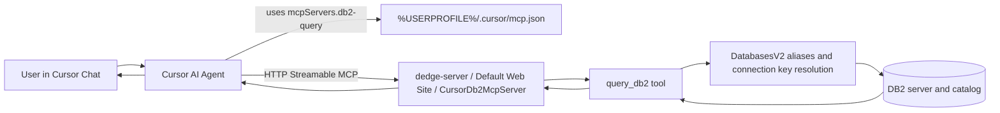

# DB2 Query MCP User Guide

This guide explains how to use the shared DB2 MCP server from Cursor, how it connects end-to-end, and which `DedgePsh` Cursor rules support safe and correct usage.

## What this MCP server is

- Server name in Cursor config: `db2-query`
- Runtime host: `dedge-server` (IIS app)
- Endpoint URL: `http://dedge-server/CursorDb2McpServer/`
- Tool exposed: `query_db2`
- Access model: read-only SQL (SELECT/WITH/VALUES)

## Architecture and data flow



## Quick start (recommended)

1. Register the MCP server entry in your local Cursor config:

```powershell
pwsh.exe -NoProfile -File "C:\opt\src\DedgePsh\DevTools\CodingTools\McpServers\Setup-Db2QueryMcpCursor\Setup-Db2QueryMcpCursor.ps1"
```

2. Restart Cursor.
3. Verify end-to-end connectivity:

```powershell
pwsh.exe -NoProfile -File "C:\opt\src\DedgePsh\DevTools\CodingTools\McpServers\Setup-Db2QueryMcpCursor\Test-Db2QueryMcpCursor.ps1"
```

## How to ask in Cursor

You do not need special `@` syntax for MCP tools. Ask normally, but be explicit about database alias and intent.

Examples:

- `Count rows in DBM.A_ORDREHODE on BASISTST`
- `Show first 10 rows from DBM.A_ORDRELINJE on BASISTST`
- `List columns in DBM.A_ORDREHODE on BASISTST`

## Critical database rule

- Always provide `databaseName` using an alias (for example `BASISTST`).
- If `databaseName` is omitted, default can be `BASISRAP` (production).
- Prefer test aliases unless production is explicitly requested.

## Common aliases

### FKM

`BASISTST`, `FKAVDNT`, `BASISVFT`, `BASISFUT`, `BASISKAT`, `BASISPER`, `BASISMIG`, `BASISVFK`, `BASISRAP`, `BASISPRO`, `BASISREG`, `BASISHST`

### INL / DOC / VIS

`FKKTOTST`, `FKKTODEV`, `FKKONTO`, `COBDOK`, `VISMABUS`

## Query behavior and restrictions

- Allowed:
  - `SELECT ...`
  - `WITH ... SELECT ...`
  - `VALUES (...)`
- Blocked:
  - `INSERT`, `UPDATE`, `DELETE`, `DROP`, `CREATE`, `ALTER`, `TRUNCATE`, `MERGE`, `GRANT`, `REVOKE`
- Recommended:
  - Add `FETCH FIRST n ROWS ONLY` for large tables
  - Use schema-qualified tables (`DBM.TABLE`)
  - Use column aliases (`COUNT(*) AS CNT`)

## Troubleshooting workflow

1. Run local test script:

```powershell
pwsh.exe -NoProfile -File "C:\opt\src\DedgePsh\DevTools\CodingTools\McpServers\Setup-Db2QueryMcpCursor\Test-Db2QueryMcpCursor.ps1"
```

2. If test fails, verify endpoint:

```powershell
pwsh.exe -NoProfile -File "C:\opt\src\CursorDb2McpServer\Test-McpQuery.ps1"
```

3. If DB connection issues persist (SQL1032N/SQL30082N/etc.), use DB2 diagnostics rules and scripts (listed below).

## Rules in `C:\opt\src\DedgePsh\.cursor` that facilitate this MCP usage

### Primary rule for this server

- `C:\opt\src\DedgePsh\.cursor\rules\mcp-db2query-cursor.mdc`
  - Defines correct `db2-query` setup and endpoint
  - Forces explicit `databaseName`
  - Enforces alias-based naming
  - Lists valid aliases and warns about production defaults
  - Documents read-only constraints and best practices

### Supporting rules for reliability and operations

- `C:\opt\src\DedgePsh\.cursor\rules\db2-diagnose-connect.mdc`
  - Diagnostic path when DB2 connectivity is failing
  - Resolves aliases via `DatabasesV2.json`
  - Guides server-side diagnosis flow

- `C:\opt\src\DedgePsh\.cursor\rules\no-remote-execution.mdc`
  - Prevents invalid WinRM/PS remoting patterns
  - Enforces file/orchestrator-based remote operations

- `C:\opt\src\DedgePsh\.cursor\rules\remote-log-reading.mdc`
  - Requires copy-local-first when reading remote logs over UNC
  - Avoids timeout/broken-pipe failures during troubleshooting

- `C:\opt\src\DedgePsh\.cursor\rules\server-logging.mdc`
  - Standardizes where logs are written and how to interpret them
  - Helps validate server health and execution outcomes

- `C:\opt\src\DedgePsh\.cursor\rules\powershell-standards.mdc`
  - Enforces `pwsh.exe` usage and scripting standards
  - Aligns deploy/test scripts with team conventions

### Complementary documentation rule

- `C:\opt\src\DedgePsh\.cursor\rules\use-rag-for-docs.mdc`
  - Not required for querying DB2 data directly
  - Useful when users ask DB2 documentation questions (errors, manuals, reason codes)

## Operational ownership

- Client setup scripts:
  - `C:\opt\src\DedgePsh\DevTools\CodingTools\McpServers\Setup-Db2QueryMcpCursor\Setup-Db2QueryMcpCursor.ps1`
  - `C:\opt\src\DedgePsh\DevTools\CodingTools\McpServers\Setup-Db2QueryMcpCursor\Test-Db2QueryMcpCursor.ps1`
- Server app repo:
  - `C:\opt\src\CursorDb2McpServer`
- Server-side reinstall guide:
  - `C:\opt\src\CursorDb2McpServer\DB2-MCP-Server-Reinstall.md`
