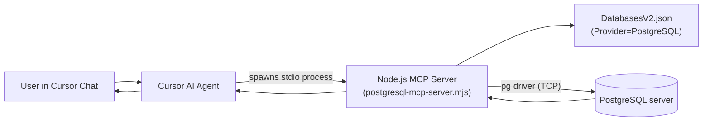

# PostgreSQL Query MCP User Guide

This guide explains how to use the PostgreSQL MCP server from Cursor, how it connects end-to-end, and which Cursor rules support safe and correct usage.

## What this MCP server is

- Server name in Cursor config: `postgresql-query`
- Runtime: Local Node.js stdio process
- Transport: stdio (launched by Cursor as a child process)
- Tools exposed: `query_postgresql`, `list_postgresql_databases`, `list_postgresql_tables`, `describe_postgresql_table`
- Access model: read-only SQL (SELECT, WITH...SELECT, VALUES, EXPLAIN)
- Database discovery: `DatabasesV2.json` (Provider=PostgreSQL)

## Architecture and data flow



## Quick start

1. Run the setup script to install npm dependencies and register in Cursor:

```powershell
pwsh.exe -NoProfile -File "C:\opt\src\DedgePsh\DevTools\CodingTools\McpServers\Setup-PostgreSqlMcpCursor\Setup-PostgreSqlMcpCursor.ps1"
```

2. Restart Cursor.

3. Verify end-to-end connectivity:

```powershell
pwsh.exe -NoProfile -File "C:\opt\src\DedgePsh\DevTools\CodingTools\McpServers\Setup-PostgreSqlMcpCursor\Test-CursorPostgreSqlMcp.ps1"
```

## How to ask in Cursor

Ask normally — the AI agent uses the MCP tools automatically. Be explicit about the database name.

Examples:

- `List all tables in the DedgeAuth PostgreSQL database`
- `Show me the columns in the "Tenants" table on DedgeAuth`
- `Count rows in the "AuditLog" table on GenericLogHandler`
- `SELECT * FROM "Users" LIMIT 10 on DedgeAuth TST`

## Available tools

| Tool | Description |
|------|------------|
| `query_postgresql` | Execute a read-only SQL query |
| `list_postgresql_databases` | List all configured databases |
| `list_postgresql_tables` | List tables in a database (filtered by schema) |
| `describe_postgresql_table` | Show column details for a table |

## Database configuration

PostgreSQL databases are defined in the central `DatabasesV2.json` with `"Provider": "PostgreSQL"`:

```
C:\opt\src\DedgeSrc\DedgeSystemTools\Folders\DedgeCommon\Configfiles\DatabasesV2.json
```

| Database | Application | Environment | Server | Port |
|----------|------------|-------------|--------|------|
| DedgeAuth | DedgeAuth | TST | t-no1fkxtst-db | 8432 |
| DedgeAuth | DedgeAuth | PRD | p-no1fkxprd-db | 8432 |
| GenericLogHandler | GenericLogHandler | TST | t-no1fkxtst-db | 8432 |
| GenericLogHandler | GenericLogHandler | PRD | p-no1fkxprd-db | 8432 |

Config file resolution:
1. `PG_CONFIG` environment variable (override)
2. `C:\opt\src\DedgeSrc\DedgeSystemTools\Folders\DedgeCommon\Configfiles\DatabasesV2.json` (default)

## Critical rules

- **Always provide `databaseName`** — the tool requires it.
- **Prefer TST** unless the user explicitly requests PRD.
- **Servers with `p-` prefix are PRODUCTION** — use with care.
- **Include `LIMIT`** on large tables to avoid huge result sets.

## Query behavior and restrictions

- Allowed: `SELECT`, `WITH...SELECT`, `VALUES`, `EXPLAIN`
- Blocked: `INSERT`, `UPDATE`, `DELETE`, `DROP`, `CREATE`, `ALTER`, `TRUNCATE`, `MERGE`, `GRANT`, `REVOKE`, `VACUUM`, `COPY FROM`
- Recommended:
  - Add `LIMIT n` for large tables
  - Quote identifiers with double quotes for case-sensitive names (PostgreSQL convention)
  - Use `public` schema unless otherwise specified

## PostgreSQL vs DB2 differences

| Aspect | DB2 (db2-query) | PostgreSQL (postgresql-query) |
|--------|-----------------|------------------------------|
| Transport | HTTP (IIS on dedge-server) | stdio (local Node.js process) |
| Row limit syntax | `FETCH FIRST n ROWS ONLY` | `LIMIT n` |
| Schema prefix | `DBM.TABLE_NAME` | `public.table_name` (default) |
| Identifier case | Uppercase by default | Lowercase by default |
| Encoding | Windows-1252 (ANSI) | UTF-8 |
| Config source | DatabasesV2.json (Provider=DB2) | DatabasesV2.json (Provider=PostgreSQL) |

## Cursor config entry

After setup, `~/.cursor/mcp.json` will contain:

```json
{
  "mcpServers": {
    "postgresql-query": {
      "command": "node",
      "args": ["C:\\opt\\src\\DedgePsh\\DevTools\\CodingTools\\McpServers\\Setup-PostgreSqlMcpCursor\\postgresql-mcp-server.mjs"],
      "env": {
        "PG_USER": "postgres",
        "PG_PASSWORD": "postgres",
        "PG_PORT": "8432"
      }
    }
  }
}
```

## Environment variables

| Variable | Default | Description |
|----------|---------|------------|
| `PG_USER` | postgres | PostgreSQL username |
| `PG_PASSWORD` | postgres | PostgreSQL password |
| `PG_PORT` | 8432 | Default PostgreSQL port |
| `PG_CONFIG` | (auto) | Override path to DatabasesV2.json |

## Troubleshooting

1. Run the test script:

```powershell
pwsh.exe -NoProfile -File "C:\opt\src\DedgePsh\DevTools\CodingTools\McpServers\Setup-PostgreSqlMcpCursor\Test-CursorPostgreSqlMcp.ps1"
```

2. If npm dependencies are missing:

```powershell
cd "C:\opt\src\DedgePsh\DevTools\CodingTools\McpServers\Setup-PostgreSqlMcpCursor"
npm install --production
```

3. If PostgreSQL connection fails, use the PowerShell diagnostic:

```powershell
Import-Module PostgreSql-Handler -Force
Test-PostgreSqlSetup -Port 8432 -Host t-no1fkxtst-db
```

4. If Cursor doesn't show the MCP tools, verify `~/.cursor/mcp.json` has the entry and restart Cursor.

## Related Cursor rules

- `mcp-postgresql-query.mdc` — AI agent usage rules for this MCP server
- `mcp-db2-query.mdc` — DB2 equivalent (for reference)

## PowerShell module

The `PostgreSql-Handler` module provides equivalent PowerShell functions:

```powershell
Import-Module PostgreSql-Handler -Force
Invoke-PostgreSqlQuery -Host t-no1fkxtst-db -Port 8432 -User postgres -Password postgres -Database DedgeAuth -Query "SELECT 1"
```

## Operational ownership

- MCP server + setup scripts: `C:\opt\src\DedgePsh\DevTools\CodingTools\McpServers\Setup-PostgreSqlMcpCursor\`
- PowerShell module: `C:\opt\src\DedgePsh\_Modules\PostgreSql-Handler\PostgreSql-Handler.psm1`
- Database config: `C:\opt\src\DedgeSrc\DedgeSystemTools\Folders\DedgeCommon\Configfiles\DatabasesV2.json` (Provider=PostgreSQL)
