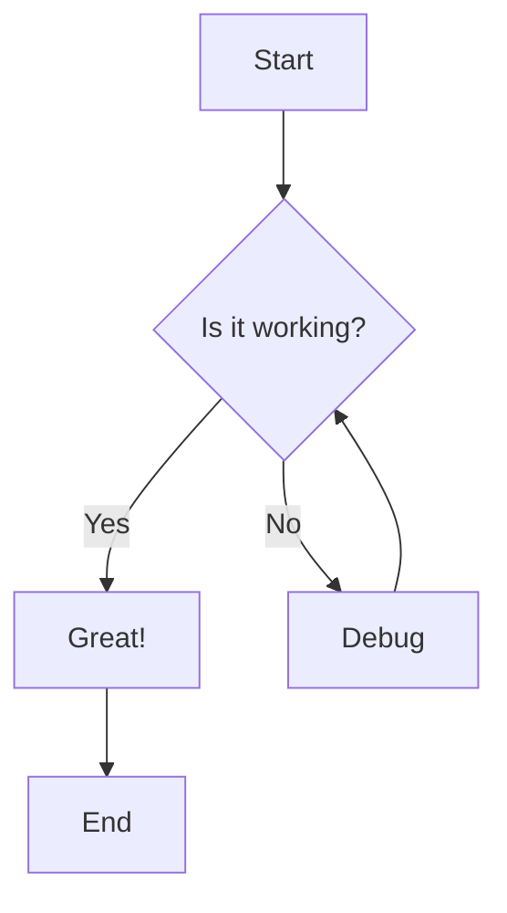
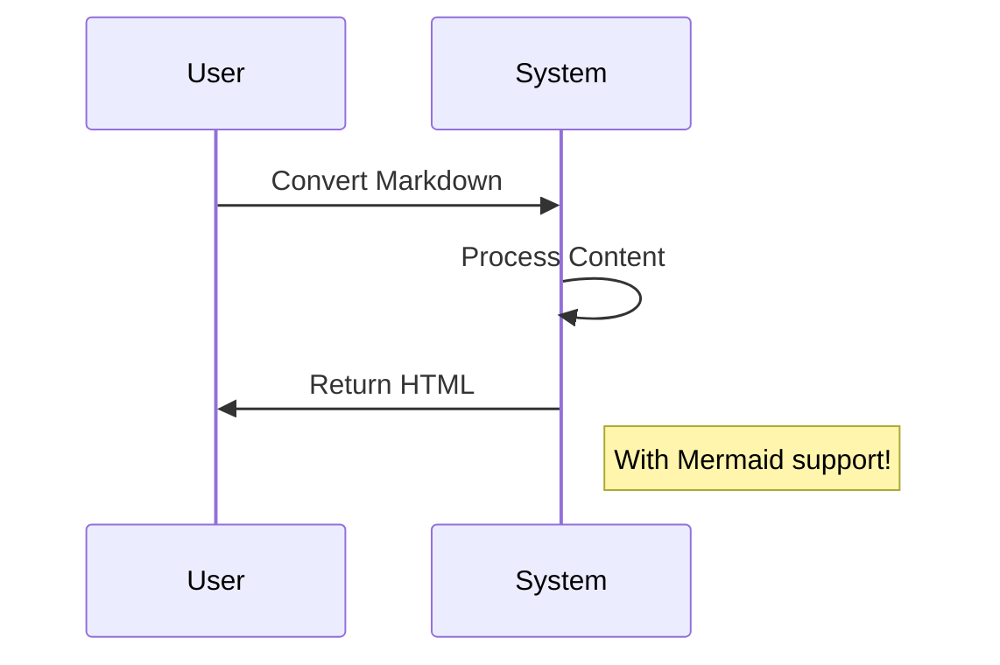

# Test Markdown with Mermaid

This is a test markdown file that includes a Mermaid diagram.

## Sample Flowchart



## Sample Sequence Diagram



## Regular Markdown

You can also use regular markdown features:

- Bullet points
- **Bold text**
- *Italic text*
- [Links](https://example.com)

### Code Block

```powershell
Get-Process | Where-Object { $_.CPU -gt 10 }
``` 