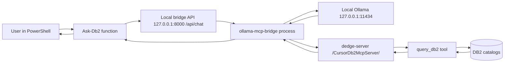

# Ollama + DB2 Query MCP User Guide

This guide explains how to use `Setup-OllamaDb2QueryMcp` to query DB2 through Ollama, which `DedgePsh` rules support this flow, and how everything connects from `dedge-server` to your local Ollama session.

## What this setup does

`Setup-OllamaDb2QueryMcp.ps1` performs a one-time local setup:

- installs `ollama-mcp-bridge` in a local venv (`%USERPROFILE%\.ollama-db2-bridge`)
- writes bridge MCP config with remote DB2 MCP URL:
  - `http://dedge-server/CursorDb2McpServer/`
- adds profile helper functions:
  - `Start-Db2Bridge`
  - `Ask-Db2`

## End-to-end connection diagram



## Setup and first use

1. Run one-time setup:

```powershell
pwsh.exe -NoProfile -File "C:\opt\src\DedgePsh\DevTools\CodingTools\Setup-OllamaDb2QueryMcp\Setup-OllamaDb2QueryMcp.ps1"
```

2. Restart PowerShell.
3. Start bridge:

```powershell
Start-Db2Bridge
```

4. Ask DB2 question:

```powershell
Ask-Db2 "How many rows are in DBM.A_ORDREHODE on BASISTST?"
```

5. Verify health and remote availability:

```powershell
pwsh.exe -NoProfile -File "C:\opt\src\DedgePsh\DevTools\CodingTools\Setup-OllamaDb2QueryMcp\Test-OllamaDb2QueryMcp.ps1" -AutoStartBridge
```

## Reboot behavior (important)

- You **do not** need to rerun `Setup-OllamaDb2QueryMcp.ps1` after each reboot.
- You **do** need the bridge process running after reboot so Ollama can call MCP tools.
- If bridge is not running, start it manually with `Start-Db2Bridge`, or install the scheduled task via `_install.ps1` (added in this folder).

Install auto-start task:

```powershell
pwsh.exe -NoProfile -File "C:\opt\src\DedgePsh\DevTools\CodingTools\Setup-OllamaDb2QueryMcp\_install.ps1"
```

## DB2 usage rules when asking through Ollama

- Always specify DB alias (`BASISTST`, not a vague environment name)
- Prefer test aliases unless production is explicitly requested
- Keep queries read-only (`SELECT`, `WITH ... SELECT`, `VALUES`)
- Use row limits (`FETCH FIRST n ROWS ONLY`) for large tables

## Rules in `C:\opt\src\DedgePsh\.cursor` that facilitate this MCP usage

### Core rule

- `C:\opt\src\DedgePsh\.cursor\rules\mcp-db2-query.mdc`
  - endpoint and server usage conventions
  - alias-first database selection
  - default database safety warning
  - read-only restrictions and best practices

### Reliability and operational support

- `C:\opt\src\DedgePsh\.cursor\rules\db2-diagnose-connect.mdc`
  - DB2 connection diagnostics and alias/server resolution
- `C:\opt\src\DedgePsh\.cursor\rules\no-remote-execution.mdc`
  - prevents unsupported WinRM/SSH approaches
- `C:\opt\src\DedgePsh\.cursor\rules\remote-log-reading.mdc`
  - copy-remote-log-locally requirement before analysis
- `C:\opt\src\DedgePsh\.cursor\rules\server-logging.mdc`
  - expected log locations and patterns
- `C:\opt\src\DedgePsh\.cursor\rules\powershell-standards.mdc`
  - `pwsh.exe` usage and script conventions

### Documentation helper

- `C:\opt\src\DedgePsh\.cursor\rules\use-rag-for-docs.mdc`
  - for DB2 documentation/error explanation workflows (separate from data querying)

## Troubleshooting quick checks

- If `Ask-Db2` fails:
  1. run `Start-Db2Bridge`
  2. run `Test-OllamaDb2QueryMcp.ps1 -AutoStartBridge`
  3. verify remote endpoint: `http://dedge-server/CursorDb2McpServer/`

- If bridge cannot start due to permissions:
  - run PowerShell as your normal user (same user that ran setup)
  - check `%USERPROFILE%\.ollama-db2-bridge\bridge.err.log`
  - reinstall local setup once, then retest
