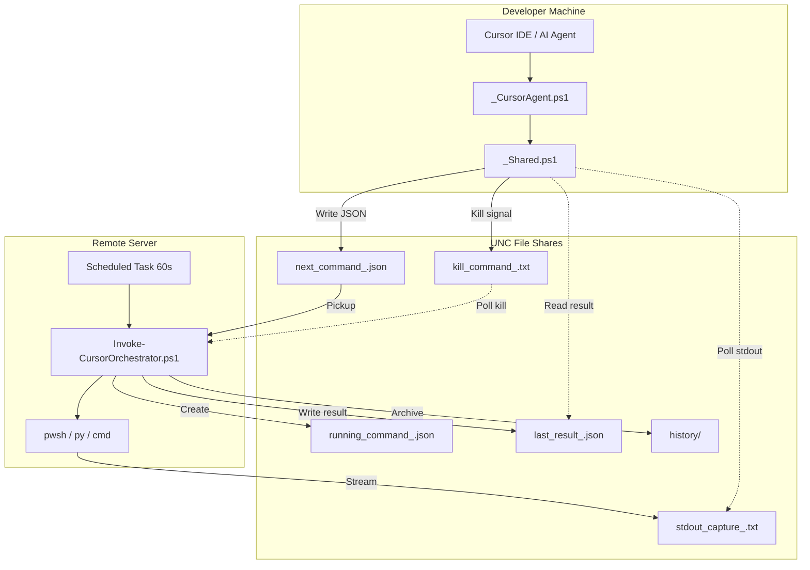
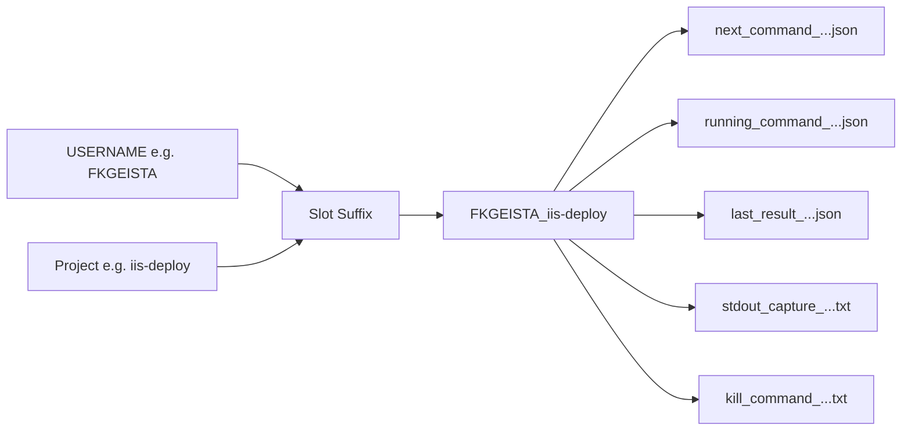
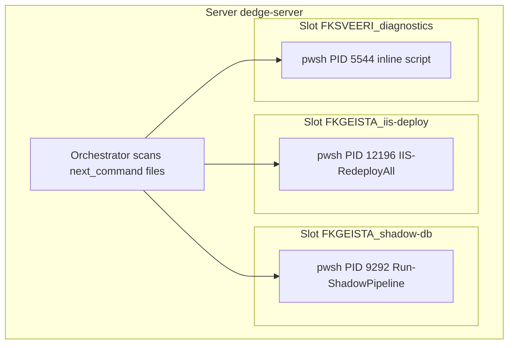
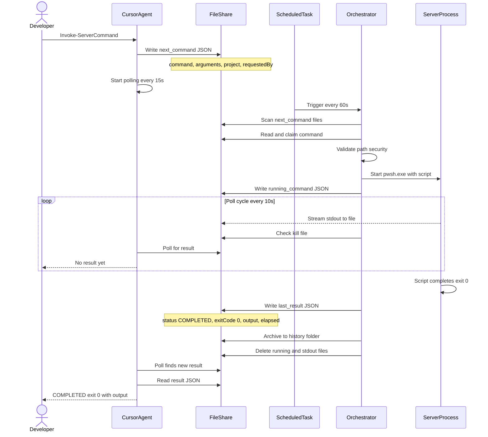
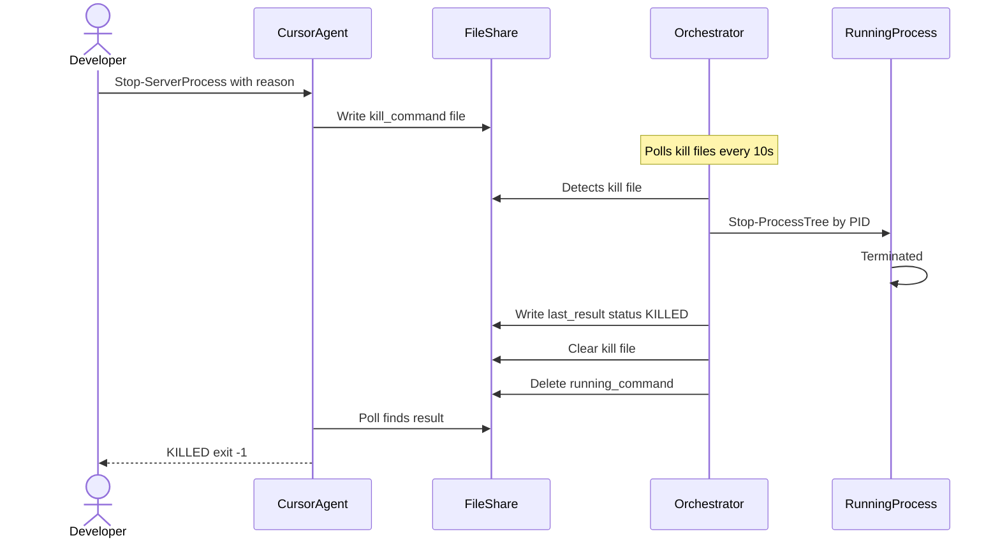
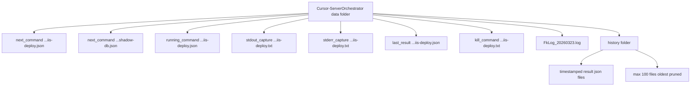

# Cursor Server Orchestrator - User Guide

**Author:** Geir Helge Starholm, www.dEdge.no  
**Created:** 2026-03-23  
**Technology:** PowerShell 7+ / File-Based Remote Execution

---

## Overview

The Cursor-ServerOrchestrator lets the Cursor AI agent run commands on remote servers **without PowerShell remoting (WinRM)**. All communication happens via UNC file shares -- the agent writes a JSON command file, a scheduled task on the server picks it up, executes it, and writes the result back.

Multiple commands can run concurrently on the same server via **multi-project slots** -- each user+project combination gets its own isolated file set.

---

## Architecture

### Component Layout



### File Naming Convention

All orchestrator files use a **slot suffix** derived from `<USERNAME>_<project>`:



Different users or different `-Project` values produce different suffixes, enabling concurrent execution.

### Multi-Slot Concurrency



Each slot runs independently with its own PID, stdout capture, and result file. The orchestrator starts all pending commands in a single task cycle.

---

## Sequence Diagram: Running a Script on a Server



---

## Sequence Diagram: Kill a Running Command



---

## How to Use

### Setup: Dot-Source the Helper

At the start of any orchestrator interaction, the agent dot-sources the helper:

```powershell
. "C:\opt\src\DedgePsh\DevTools\CodingTools\Cursor-ServerOrchestrator\_helpers\_CursorAgent.ps1"
```

This loads all client-side functions. Default server is `dedge-server`.

### Run a Deployed Script

```powershell
Invoke-ServerCommand `
    -Command '%OptPath%\DedgePshApps\IIS-DeployApp\IIS-RedeployAll.ps1' `
    -Project 'iis-deploy' `
    -ServerName 'dedge-server' `
    -Timeout 1800
```

| Parameter | Default | Description |
|-----------|---------|-------------|
| `-Command` | (required) | Script path on the server. Use `%OptPath%` for the opt root. |
| `-Arguments` | `""` | Arguments to pass to the script |
| `-ServerName` | `dedge-server` | Target server hostname |
| `-Project` | `cursor-agent` | Slot name (for concurrency isolation) |
| `-Timeout` | `1800` (30 min) | How long the client waits (server has no timeout) |
| `-PollInterval` | `15` | Seconds between result polls |
| `-CaptureOutput` | `$true` | Capture stdout/stderr to files |
| `-ShowWindow` | (switch) | Show console window on the server |

### Run Inline PowerShell

For quick one-liners without a deployed script:

```powershell
Invoke-ServerScript `
    -Script 'Get-Service W3SVC | Select-Object Status, Name' `
    -Project 'diagnostics'
```

The script is Base64-encoded and executed via `Run-InlineScript.ps1` on the server.

### Monitor a Running Command

```powershell
# Check if a slot is busy or idle
Test-OrchestratorReady -Project 'iis-deploy'

# See all running slots on a server
Get-AllRunningSlots -ServerName 'dedge-server'

# Get details of a specific running slot
Get-RunningProcess -Project 'iis-deploy'

# Tail the live stdout
Get-ServerStdout -Project 'iis-deploy' -TailLines 50
```

### Kill a Running Command

```powershell
Stop-ServerProcess -Project 'iis-deploy' -Reason 'Taking too long'
```

### Read Server Logs

```powershell
# All PowerShell logs
Get-ServerLog -LogName AllPwshLog -TailLines 30

# IIS deploy logs
Get-ServerLog -LogName IISDeployApp -FilterPattern 'ERROR'

# DedgeAuth logs
Get-ServerLog -LogName DedgeAuth -Date '20260322'
```

---

## Server-Side Data Folder

All orchestrator files live in:

```
$env:OptPath\data\Cursor-ServerOrchestrator\
```

UNC path: `\\<server>\opt\data\Cursor-ServerOrchestrator\`



### File Lifecycle

| File | Created by | When | Deleted by |
|------|-----------|------|------------|
| `next_command_*.json` | Client (Write-CommandFile) | User submits command | Orchestrator (claimed = emptied) |
| `running_command_*.json` | Orchestrator | Process starts | Orchestrator (process ends) |
| `stdout_capture_*.txt` | Orchestrator (process redirect) | While process runs | Orchestrator (process ends) |
| `stderr_capture_*.txt` | Orchestrator (process redirect) | While process runs | Orchestrator (process ends) |
| `last_result_*.json` | Orchestrator | Process ends | Overwritten by next run |
| `kill_command_*.txt` | Client (Stop-ServerProcess) | User sends kill | Orchestrator (after killing) |
| `history/*_result.json` | Orchestrator | Process ends | Pruned after 100 entries |

---

## Command JSON Format

### next_command (input)

```json
{
    "command": "%OptPath%\\DedgePshApps\\IIS-DeployApp\\IIS-RedeployAll.ps1",
    "arguments": "",
    "project": "iis-deploy",
    "requestedBy": "FKGEISTA",
    "requestedAt": "2026-03-23T04:30:47",
    "captureOutput": true,
    "showWindow": false
}
```

### last_result (output)

```json
{
    "command": "%OptPath%\\DedgePshApps\\IIS-DeployApp\\IIS-RedeployAll.ps1",
    "arguments": "",
    "project": "iis-deploy",
    "slotSuffix": "FKGEISTA_iis-deploy",
    "exitCode": 0,
    "status": "COMPLETED",
    "startedAt": "2026-03-23T04:31:09",
    "completedAt": "2026-03-23T04:31:25",
    "elapsedSeconds": 16.2,
    "output": "Phase 1: UNINSTALL...\nPhase 2: RESET...\nPhase 3: DEPLOY...",
    "errorOutput": "",
    "executedBy": "FKTSTADM",
    "server": "dedge-server"
}
```

---

## Supported Script Types

The orchestrator auto-detects the executor based on file extension:

| Extension | Executor | Example |
|-----------|----------|---------|
| `.ps1` | `pwsh.exe -NoProfile -File` | PowerShell scripts |
| `.py` | `py -3` | Python scripts |
| `.bat` / `.cmd` | `cmd.exe /c` | Batch files |
| `.exe` | Direct execution | Windows executables |
| `.rex` | `regina` | REXX scripts |

---

## Security

- **Path validation:** All commands must resolve to a file under `$env:OptPath`. Paths outside the opt tree are rejected.
- **ACL:** The data folder grants Modify rights only to `BUILTIN\Administratorer`, `NT-MYNDIGHET\SYSTEM`, and the developer security group.
- **Execution:** The scheduled task runs as a local admin account (`FKTSTADM` on test servers). Scripts inherit this identity.
- **No remoting:** No WinRM, no SSH, no PS sessions. All communication is file-based via UNC shares.

---

## Timing and Expectations

| Event | Timing |
|-------|--------|
| Scheduled task interval | Every 60 seconds |
| Max wait for pickup | ~60 seconds (worst case) |
| Typical pickup | 10-40 seconds |
| Orchestrator poll for kill files | Every 10 seconds |
| Client poll for results | Every 15 seconds (configurable) |
| Default client timeout | 30 minutes (configurable) |
| Server-side timeout | None (runs until completion) |

---

## Troubleshooting

| Symptom | Check |
|---------|-------|
| Command never picked up | Is the scheduled task running? Check `next_command_*.json` still has content |
| Script errors | Read `last_result_*.json` → `errorOutput` field |
| Stuck process | Use `Get-RunningProcess` to see PID, then `Stop-ServerProcess` to kill |
| No stdout | Was `-CaptureOutput $true`? Check `stdout_capture_*.txt` on server |
| Timed out on client | The server job keeps running. Use `Get-ServerStdout` to check progress |
| Permission denied on command file | Run `Set-CommandFolderAcl.ps1` on the server via `_install.ps1` |

---

## Quick Reference

```powershell
# Load the helper
. "C:\opt\src\DedgePsh\DevTools\CodingTools\Cursor-ServerOrchestrator\_helpers\_CursorAgent.ps1"

# Run a deployed script
Invoke-ServerCommand -Command '%OptPath%\DedgePshApps\MyApp\Run.ps1' -Project 'my-app'

# Run inline PowerShell
Invoke-ServerScript -Script 'hostname; whoami' -Project 'quick-check'

# Check status
Test-OrchestratorReady -Project 'my-app'
Get-AllRunningSlots
Get-ServerStdout -Project 'my-app' -TailLines 50

# Kill a stuck command
Stop-ServerProcess -Project 'my-app' -Reason 'Stuck'

# Read logs
Get-ServerLog -LogName AllPwshLog -TailLines 30 -FilterPattern 'ERROR'
```
