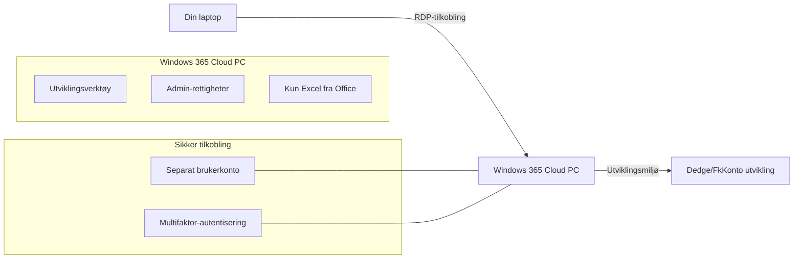
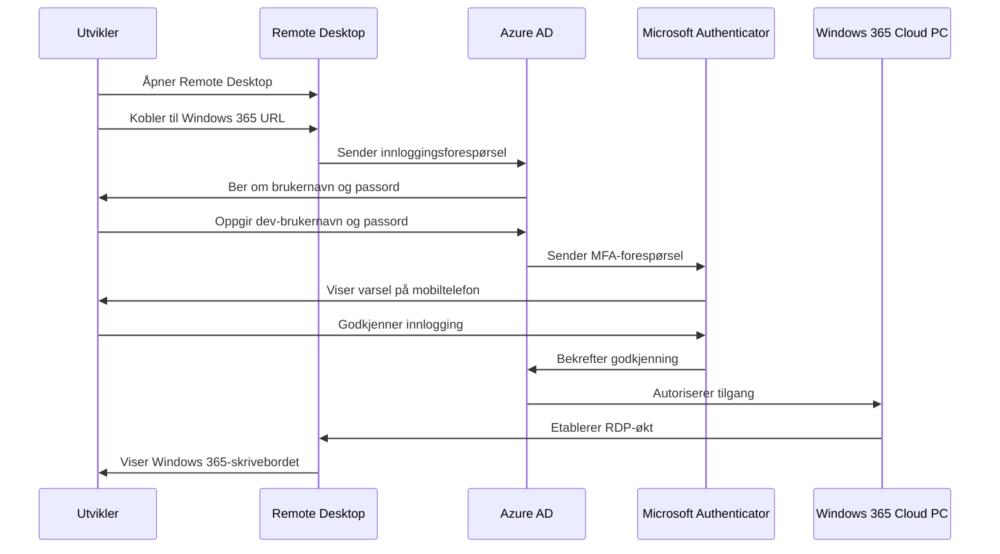

# Brukerveiledning: Windows 365 Cloud PC for utviklere

## Innledning

Dette dokumentet gir deg som utvikler den informasjonen du trenger for å komme i gang med din nye Windows 365 Cloud PC. Denne løsningen erstatter tidligere VDI-løsninger og gir flere fordeler som økt ytelse, fleksibilitet og sikkerhet.

## Oppsummering av løsningen

Din Windows 365 Cloud PC er en dedikert virtuell maskin som kjører i Microsoft Azure. Denne maskinen:
- Gir deg lokal administrator-tilgang
- Har forhåndsinstallerte utviklingsverktøy basert på din rolle
- Tilbyr høy ytelse med dedikerte ressurser
- Er sikret med flere sikkerhetslag
- Gir tilgang til relevante ressurser og applikasjoner

## Førstegangs pålogging

### Forberedelser

Før du logger på for første gang, sørg for at du har:
1. Mottatt din nye utvikler-brukerkonto (format: `dev-fornavn.etternavn@Dedge.no`)
2. Fått tilsendt midlertidig passord
3. Installert Microsoft Authenticator på din mobiltelefon
4. Oppdatert Remote Desktop-klienten på din laptop

### Påloggingsprosess

Slik logger du på for første gang:

1. Gå til [Windows 365 portalen](https://windows365.microsoft.com)
2. Logg på med din nye utvikler-brukerkonto og det midlertidige passordet
3. Du vil bli bedt om å endre passord - velg et sterkt passord som følger organisasjonens retningslinjer
4. Konfigurer Microsoft Authenticator som din MFA-løsning
5. Når du er innlogget i portalen, klikk på din Cloud PC for å koble til
6. Velg "Open in browser" eller "Open in Remote Desktop app" avhengig av dine preferanser

### Førstegangs oppsett

Ved første pålogging bør du:

1. Gjennomgå forhåndsinstallerte programmer og verktøy
2. Personliggjøre skrivebordsmiljøet etter dine preferanser 
3. Konfigurere tilkobling til lokale disker på din laptop hvis nødvendig
4. Teste tilgang til nødvendige systemer og ressurser

## Daglig bruk

### Remote Desktop-tilkobling

For best mulig ytelse ved bruk av Remote Desktop:

1. Bruk den nyeste versjonen av Remote Desktop-klienten
2. Konfigurer riktige skjerminnstillinger:
   - Skjermoppløsning: Tilsvarende din lokale skjerm
   - Flere skjermer: Aktiver støtte for flere skjermer hvis nødvendig
3. Optimaliser nettverkstilkoblingen:
   - Bruk kablet nettverkstilkobling når mulig
   - Lukk programmer som bruker mye båndbredde

### Tilgang til lokale ressurser

Du kan konfigurere din RDP-økt til å få tilgang til lokale ressurser:

1. Åpne Remote Desktop-klienten
2. Klikk på "Show Options" før du kobler til
3. Gå til "Local Resources"-fanen
4. Under "Local devices and resources", klikk på "More..."
5. Velg hvilke lokale disker du ønsker å gi tilgang til
6. Klikk "OK" og koble til Windows 365

### Installering av programvare

Som utvikler har du administrator-rettigheter på din Windows 365 Cloud PC, noe som betyr at du kan:

1. Installere utviklingsverktøy og programvare etter behov
2. Oppdatere eksisterende programvare
3. Konfigurere miljøvariabler og systeminnstillinger
4. Modifisere registeret (registry) ved behov

Best practices for programvareinstallasjon:

- Bruk Chocolatey for enkel programvareinstallasjon
- Hold antall installerte programmer på et rimelig nivå
- Fjern programvare som ikke lenger er i bruk
- Dokumenter spesielle konfigurasjoner for teamdeling

### Tilgang til servere og ressurser

Din Windows 365 Cloud PC har tilgang til:

1. Eksisterende servere for Dedge og FkKonto
2. Nye Azure-baserte tjenester under P-Dedge og T-Dedge abonnementer
3. Nødvendige interne ressurser via ExpressRoute

## Administrasjon og sikkerhet

### Passordadministrasjon

- Ditt passord for Windows 365-kontoen må endres hver 90. dag
- Bruk et unikt passord som ikke deles med andre kontoer
- Minst 16 tegn med en kombinasjon av store/små bokstaver, tall og spesialtegn
- Ikke lagre passordet i nettlesere eller usikrede notatprogrammer

### Multifaktor-autentisering

- MFA er påkrevd for all tilgang til Windows 365
- Microsoft Authenticator er den foretrukne MFA-metoden
- Hvis du bytter telefon, må du rekonfigurere Authenticator-appen
- Ved problemer med MFA, kontakt IT-support umiddelbart

### Sikkerhetshensyn

Selv om du har administrator-rettigheter, er det viktig å:

1. Ikke deaktivere sikkerhetsfunksjoner som antivirusprogramvare eller brannmur
2. Være forsiktig med å installere programvare fra ukjente kilder
3. Ikke dele påloggingsinformasjon eller gi andre tilgang til din Cloud PC
4. Rapportere mistenkelig aktivitet eller sikkerhetsrelaterte bekymringer
5. Holde operativsystemet og all programvare oppdatert

## Feilsøking og support

### Vanlige problemer og løsninger

| Problem | Mulig årsak | Løsning |
|---------|-------------|---------|
| Kan ikke logge på Windows 365 | Feil brukernavn eller passord | Dobbeltsjekk brukernavn og passord, bruk "Glemt passord"-funksjonen ved behov |
| MFA-varsel kommer ikke | Nettverksproblemer eller feil med Authenticator | Sjekk nettverkstilkobling, start Authenticator-appen på nytt |
| Treg ytelse i Remote Desktop | Nettverksbegrensninger eller ressursmangel | Sjekk nettverkshastighet, lukk ubrukte programmer, rapporter vedvarende problemer |
| Kan ikke koble til interne ressurser | Nettverkskonfigurasjonssproblemer | Verifiser at du bruker riktig brukernavn for ressursen, kontakt support hvis problemet vedvarer |
| Programmer krasjer eller fungerer ikke | Programvare- eller konfigurasjonsproblemer | Restart programmet, sjekk for oppdateringer, reinstaller om nødvendig |

### Support-kanaler

Ved problemer med din Windows 365 Cloud PC, kan du få hjelp via:

1. **Nivå 1 support**: IT Service Desk
   - Telefon: XXX-XXXXX
   - E-post: servicedesk@Dedge.no
   - Åpningstid: 08:00-16:00 mandag-fredag

2. **Nivå 2 support**: Windows 365-spesialister
   - Tilgjengelig via Service Desk-eskalering
   - Behandler mer komplekse problemer relatert til Windows 365

3. **Selvhjelpsressurser**:
   - Interne wikisider: [lenke til intern wiki]
   - Ofte stilte spørsmål: [lenke til FAQ]
   - Introduksjonsvideoer: [lenke til videoer]

## Best Practices for utviklere

### Sikkerhetsanbefalinger

1. **Passord og autentisering**
   - Bruk et passordverktøy for å administrere komplekse passord
   - Aktiver varsler for mistenkelige innloggingsforsøk
   - Lås alltid Cloud PC-en når du forlater arbeidsplassen

2. **Sikker utvikling**
   - Unngå å lagre kredentialer eller API-nøkler i kildekode
   - Bruk kryptering for sensitive data
   - Følg organisasjonens retningslinjer for sikker koding

3. **Databehandling**
   - Lagre kode i versjonskontrollsystemer, ikke lokalt
   - Unngå å lagre sensitiv informasjon på lokal disk
   - Ta regelmessige sikkerhetskopier av viktige filer

### Optimalisering av utviklingsmiljø

1. **Ytelse**
   - Hold antall åpne programmer og faner på et minimum
   - Rengjør temporære filer regelmessig
   - Restart Cloud PC-en regelmessig (minst ukentlig)

2. **Miljøoppsett**
   - Dokumenter miljøoppsett og konfigurasjon
   - Bruk konfigurasjonsfiler for å replikere innstillinger
   - Del nyttige verktøy og skript med teamet

3. **Samarbeid**
   - Bruk standardiserte verktøy for teamsamarbeid
   - Dokumenter lokale konfigurasjoner som kan påvirke utviklingen
   - Følg etablerte CI/CD-prosesser

## Vanlige spørsmål

**Spørsmål:** Kan jeg installere hvilken som helst programvare jeg ønsker?  
**Svar:** Ja, du har administrator-rettigheter og kan installere nødvendig programvare. Vær imidlertid oppmerksom på lisensbetingelser og organisasjonens retningslinjer.

**Spørsmål:** Hva skjer hvis jeg mister tilgang til min Authenticator-app?  
**Svar:** Kontakt IT Service Desk umiddelbart for å få hjelp med å gjenopprette MFA-tilgang.

**Spørsmål:** Kan jeg kjøre ressurskrevende programmer som virtuelle maskiner inne i Windows 365?  
**Svar:** Ja, men ytelsen vil avhenge av din Cloud PC-konfigurasjon. Virtuelle maskiner vil ta opp en betydelig del av de tildelte ressursene.

**Spørsmål:** Hvordan kan jeg få tilgang til Windows 365 utenfor kontoret?  
**Svar:** Du kan koble til Windows 365 fra hvor som helst med internett-tilgang, men må fortsatt bruke MFA for sikker pålogging.

**Spørsmål:** Vil mine filer og innstillinger forbli på min Cloud PC eller slettes de?  
**Svar:** Windows 365 Cloud PC beholder dine filer, innstillinger og installerte programmer. Den oppfører seg som en dedikert maskin.

**Spørsmål:** Hva er prosedyren hvis jeg trenger mer ressurser (RAM, CPU, lagring)?  
**Svar:** Send en forespørsel til IT Service Desk med begrunnelse for ressursbehovet. Oppgraderinger godkjennes basert på behovsvurdering.

**Spørsmål:** Kan jeg bruke VPN fra min Windows 365 Cloud PC?  
**Svar:** I de fleste tilfeller er ikke VPN nødvendig, da Cloud PC-en allerede har nødvendig nettverkstilgang. Kontakt IT-avdelingen for spesifikke behov.

## Konklusjon

Din Windows 365 Cloud PC er designet for å gi deg et kraftig, fleksibelt og sikkert utviklingsmiljø. Med lokal administrator-tilgang kan du tilpasse miljøet etter dine behov, samtidig som sikkerheten ivaretas gjennom flere sikkerhetslag.

Ved å følge retningslinjene i denne veiledningen vil du få en smidig opplevelse med din Windows 365 Cloud PC, samtidig som du bidrar til organisasjonens sikkerhetsmål.

---

**Kontaktinformasjon for støtte:**  
IT Service Desk: servicedesk@Dedge.no | Tlf: XXX-XXXXX 